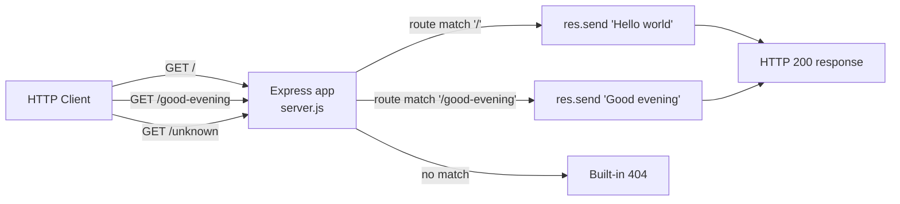

# Technical Specification

# 0. Agent Action Plan

## 0.1 Intent Clarification

The user's request — submitted under the banner "add feature to a existing product" — asks the Blitzy platform to introduce the Express.js web framework into a Node.js tutorial project and to expose a second HTTP endpoint that returns "Good evening" alongside an existing endpoint that returns "Hello world". Because this work re-platforms the project's HTTP and routing layer onto Express.js, it is captured in this Agent Action Plan as a **framework-adoption refactoring** with one additive endpoint.

> **User Request (verbatim):** "add feature to a existing product / this is a tutorial of node js server hosting one endpoint that returns the response 'Hello world'. Could you add expressjs into the project and add another endpoint that return the reponse of 'Good evening'?"

A material precondition shapes this entire plan: **the repository does not currently contain the Node.js server the prompt describes.** The repository root contains only `README.md`, whose entire content is the single heading `# April17Sec_1` [README.md:L1]. There is no `package.json`, no source file in any language, and no `http`-based server — a verifiable absence corroborated by the surrounding specification (§1.2.2 records "zero application subfolders and no source files in any programming language"; §3.3.2 records that a Node.js manifest declaring `express` is "No (no manifest exists)"). The described "Hello world" server is therefore treated as a **notional baseline** — the user's mental starting point — and this plan establishes the project foundation while delivering the requested end state. This is the single most important interpretation in the plan and is reaffirmed under Scope Boundaries (§0.2) and Transformation Mapping (§0.4).

### 0.1.1 Core Refactoring Objective

- **Based on the prompt, the Blitzy platform understands that the refactoring objective is to** adopt the Express.js web framework as the HTTP and routing layer of the `April17Sec_1` Node.js tutorial project, preserve the project's described `Hello world` endpoint, and add a second endpoint that returns the plaintext response `Good evening`.
- **Refactoring type:** Tech stack migration / framework adoption — the raw Node.js built-in `http` server pattern (the user's notional baseline) is replaced by the Express.js application-and-routing pattern. Secondary dimensions are modularity (clean, declarative route definitions) and code-structure standardization (idiomatic project scaffolding).
- **Target repository:** Same repository (`April17Sec_1`) — an in-place transformation, **not** a new-repository migration.
- **Enumerated refactoring goals:**
    - **G1** — Introduce Express.js as a declared runtime dependency.
    - **G2** — Restructure the server onto the Express application API (`app.get`, `app.listen`) instead of `http.createServer` plus manual request dispatch.
    - **G3** — Preserve the existing `Hello world` endpoint behavior (route `GET /` returning the body `Hello world`).
    - **G4** — Add a new endpoint, `GET /good-evening`, returning the body `Good evening`.
- **Surfaced implicit requirements (not stated by the user but necessary):**
    - Maintain behavioral compatibility — the `Hello world` response must remain reachable and unchanged in content; the new endpoint is purely additive, removing no existing behavior.
    - Because no `package.json` exists, one must be created to declare the dependency and a run script (§3.3.2).
    - A dependency lockfile (`package-lock.json`) and a `.gitignore` excluding `node_modules/` are required for a sound standalone Node.js project.
    - The server continues to bind to a single listening port and logs a startup message.
    - Tutorial-grade simplicity is retained — minimal, idiomatic, readable code.

### 0.1.2 Technical Interpretation

This refactoring translates to the following technical transformation strategy: replace the imperative, single-callback request handler of the raw `http` module with Express's declarative routing, and then layer the new endpoint on as one additional route handler. Because the baseline source does not physically exist, the "current" column below describes the conventional raw-`http` tutorial pattern the user references, and the "target" column describes the Express.js end state the plan delivers.

| Concern | Current architecture (notional raw `http`) | Target architecture (Express.js) |
|---------|---------------------------------------------|----------------------------------|
| Server bootstrap | `http.createServer(handler).listen(port)` | `const app = express(); app.listen(port)` |
| Routing | Manual `if/else` on `req.url` and `req.method` | `app.get('/', …)` and `app.get('/good-evening', …)` |
| Response emission | `res.writeHead(200, …); res.end('Hello world')` | `res.send('Hello world')` (status/headers/termination handled) |
| Unmatched routes | Hand-written 404 branch | Built-in Express 404 response |
| Dependencies | None (standard library only) | `express` (from the npm registry) |

- **Transformation rules:**
    - Every distinct response becomes a dedicated `app.get()` route handler keyed by HTTP method and path.
    - String responses are emitted with `res.send()`, which automatically terminates the request-response cycle.
    - The listening port and the startup log are preserved from the notional baseline (default `3000`, the Express tutorial convention, since no port is currently defined in the repository).
    - No behavior is removed; the change set is one structural re-platforming plus one additive route.

## 0.2 Scope Boundaries

Because the repository is effectively empty (only `README.md` exists [README.md:L1]), the in-scope set is small and almost entirely composed of new files. The total footprint is **five files**: one UPDATE (`README.md`) and four CREATE operations, one of which (`package-lock.json`) is generated automatically by the package manager.

### 0.2.1 Exhaustively In Scope

The following table enumerates every file the refactor touches. Trailing-pattern wildcards are not required here because the in-scope set is fully enumerable (see §0.4.3).

| In-Scope File | Operation | Purpose |
|---------------|-----------|---------|
| `server.js` | CREATE | Express application entry point — instantiates the app, defines `GET /` (`Hello world`) and `GET /good-evening` (`Good evening`), and calls `app.listen`. |
| `package.json` | CREATE | Project manifest declaring metadata, the `express` dependency, `main`, and a `start` script. No manifest exists today (§3.3.2). |
| `package-lock.json` | CREATE (generated) | Lockfile produced by `npm install`; pins the resolved `express` dependency tree for reproducible installs. |
| `.gitignore` | CREATE | Excludes `node_modules/` so installed dependencies are not committed. |
| `README.md` | UPDATE | Replace the title-only content [README.md:L1] with prerequisites, install/run instructions, and an endpoint reference table. |

- **Source transformations** — `server.js` (the new Express server; no source file exists, so it is built against the notional raw-`http` baseline).
- **Configuration / manifest updates** — `package.json`, `package-lock.json`, `.gitignore`.
- **Documentation updates** — `README.md`.
- **Import corrections** — limited to the new `server.js`, which `require`s `express`; there are no pre-existing files containing imports to rewrite.
- **Rule-mandated files** — **none.** The user supplied no implementation rules (the rules set is empty), so no migration scripts, fixtures, or configuration files are forced into scope by coding guidelines.

An optional modularity refinement — splitting routes into a `routes/` module via `express.Router()` — is noted as an available scaling path in §0.3.3 but is intentionally **not** adopted, to preserve the tutorial's single-file simplicity.

### 0.2.2 Explicitly Out of Scope

The following are explicitly excluded from this refactor. None were requested by the user, and none exist in the repository today; several are confirmed absent by §1.3.2.

- `node_modules/` — installed dependency artifacts; never hand-edited and git-ignored.
- Automated tests and test frameworks (e.g., Jest, Mocha, Supertest) — not requested; an optional future enhancement.
- Databases, persistence layers, and ORMs — none requested, none present.
- Authentication, authorization, and security middleware — not requested.
- Front-end and UI assets — none; this is a headless HTTP server with plaintext responses (hence no design-system or UI work; see §0.3.3).
- Containerization (`Dockerfile`), CI/CD pipelines (`.github/workflows/*`), and deployment automation — not requested (§1.3.2).
- TypeScript migration and linter/formatter configuration (ESLint, Prettier) — not requested.
- All other Technical Specification sections (§1–§9) — documentation, not code; unaffected by this refactor. Only `README.md` is an in-scope, code-adjacent document.

## 0.3 Target Design

The target is a minimal, idiomatic Express.js application that runs standalone from the `April17Sec_1` repository root. The design favors a single entry file so the tutorial remains easy to read end to end, while still applying the structural patterns that Express encourages.

### 0.3.1 Refactored Structure Planning

The target layout introduces four new files at the repository root and updates the existing `README.md`. All files required for standalone operation (dependency management via `package.json`/`package-lock.json`, source via `server.js`, and version-control hygiene via `.gitignore`) are included explicitly.

```text
April17Sec_1/
├── .gitignore          (CREATE — ignores node_modules/)
├── package.json        (CREATE — name "april17sec_1", "main": "server.js",
│                                 "scripts": { "start": "node server.js" },
│                                 dependencies: { "express": "^5.2.1" })
├── package-lock.json   (CREATE — auto-generated by `npm install`)
├── server.js           (CREATE — Express entry point)
│                          • const express = require('express')
│                          • app.get('/',             → res.send('Hello world'))
│                          • app.get('/good-evening', → res.send('Good evening'))
│                          • app.listen(PORT, …)
└── README.md           (UPDATE — prerequisites, install, run, endpoint table)
```

The runtime request flow for the delivered server is:



### 0.3.2 Web Search Research Conducted

Research confirmed the conventions encoded in this design and validated the dependency version against the authoritative package registry:

- **Express version verification** — The current stable release of Express is **5.2.1** on the npm registry, and Express 5 requires **Node.js 18 or higher**. This is the version the plan pins (see §0.5.1).
- **Minimal application structure** — The canonical Express app follows `require('express')` → `const app = express()` → one `app.get(path, handler)` per route → `app.listen(port, callback)`, as documented in the official Express routing guide and corroborated by multiple tutorials. Additional endpoints are added simply by declaring another `app.get` with a new path — directly analogous to adding `/good-evening`.
- **Response handling** — `res.send(body)` terminates the request-response cycle; if no terminating response method is called, the client request is left hanging. Each handler therefore must call `res.send`.
- **Routing modularity** — `express.Router()` provides modular, mountable "mini-app" route modules for larger applications; for a minimal tutorial a single entry file is the recommended, idiomatic choice.
- **Port convention** — Port `3000` is the de-facto tutorial default, with startup logging performed in the `app.listen` callback.

### 0.3.3 Design Pattern Applications

- **Application object / front controller** — A single `express()` application instance becomes the one entry point for all requests, replacing the raw `http.createServer` dispatch callback.
- **Declarative routing** — One `app.get()` handler is defined per endpoint, keyed on HTTP method and path, replacing imperative `if/else` branching on `req.url`.
- **Response abstraction** — `res.send()` encapsulates status code (`200`), `Content-Type`, and `Content-Length` defaults and terminates the response, replacing manual `res.writeHead`/`res.end`.
- **Single-responsibility entry file** — For tutorial clarity, all wiring lives in `server.js`. The `express.Router()` modular-router pattern is documented here as the available scaling path but is intentionally not adopted for this minimal scope.
- **Externalized configuration (lightweight)** — The listening port is held in a `PORT` constant (optionally `process.env.PORT || 3000`) for twelve-factor friendliness.
- **Unused-but-available middleware pipeline** — Express's `app.use` middleware chain is available for cross-cutting concerns (logging, parsing, auth) but is intentionally left empty for this scope.

#### 0.3.3.1 User Interface Design

**Not applicable.** `April17Sec_1` is a headless HTTP server that returns plaintext responses; it has no front-end, no rendered views, and no component library or design system. Consequently, the Design System Alignment Protocol does not apply, and no "Design System Compliance" sub-section is produced. There are no Figma screens or visual assets associated with this request (see §0.8).

## 0.4 Transformation Mapping

This section provides the exhaustive source-to-target mapping. Because the repository contains no source files (only `README.md` [README.md:L1]), four of the five targets are CREATE operations whose source is `N/A — new file`; `README.md` is the sole UPDATE. The conceptual raw-`http` baseline the user describes is recorded as the notional source for `server.js`.

### 0.4.1 File-by-File Transformation Plan

| Target File | Transformation | Source File | Key Changes |
|-------------|----------------|-------------|-------------|
| `server.js` | CREATE | N/A — new file (notional raw-`http` baseline) | Instantiate Express (`const app = express()`); define `app.get('/', (req, res) => res.send('Hello world'))`; define `app.get('/good-evening', (req, res) => res.send('Good evening'))`; `app.listen(PORT, …)` with a startup log. |
| `package.json` | CREATE | N/A — new file | Declare metadata; set `"main": "server.js"` and `"scripts": { "start": "node server.js" }`; add dependency `"express": "^5.2.1"`; recommend `"engines": { "node": ">=18" }`. |
| `package-lock.json` | CREATE | N/A — auto-generated | Produced by `npm install express@^5.2.1`; pins the resolved dependency tree for reproducible installs. |
| `.gitignore` | CREATE | N/A — new file | Add a single entry `node_modules/`. |
| `README.md` | UPDATE | `README.md` [README.md:L1] | Replace the title-only content with prerequisites (Node.js ≥ 18), install (`npm install`), run (`npm start`), and an endpoint reference table for `GET /` and `GET /good-evening`. |

All in-scope files are listed above; no file is omitted from the transformation. There are no user-provided Figma URLs to reference (see §0.8).

### 0.4.2 Cross-File Dependencies

- **`server.js` → `express`** — `server.js` calls `require('express')`, which resolves to the `express` dependency declared in `package.json` and installed under `node_modules/`.
- **`package.json` → `server.js`** — Both `"main"` and `"scripts.start"` reference `server.js`, forming the project's entry-point contract.
- **`README.md` → `package.json`** — The documented `npm start` command maps to `package.json`'s `scripts.start`; the documented `npm install` step provisions the `express` dependency.
- **`.gitignore` → `node_modules/`** — Excludes the dependency directory created by `npm install` per `package.json`.

The conceptual import migration (notional baseline, since no source file exists):

```text
FROM:  const http = require('http');
       http.createServer((req, res) => { /* manual req.url routing, res.writeHead, res.end */ })
           .listen(3000);

TO:    const express = require('express');
       const app = express();
       app.get('/', (req, res) => res.send('Hello world'));
       app.get('/good-evening', (req, res) => res.send('Good evening'));
       app.listen(3000, () => console.log('Server listening on port 3000'));
```

### 0.4.3 Wildcard Patterns

Wildcard patterns are **not required**: the in-scope set comprises five explicitly named files, so each is mapped by exact path (the preferred approach — be as specific as possible). Should the project later modularize, only **trailing** wildcard patterns would be used (for example, `routes/**.js | UPDATE`), never leading patterns such as `**/routes/*.js`.

### 0.4.4 One-Phase Execution

The entire refactor — all four CREATE operations, the single `README.md` UPDATE, and the `npm install` of `express` — executes in **one Blitzy phase**. The work is not split across multiple phases; every file listed in §0.4.1 is delivered together so the server is runnable upon completion.

## 0.5 Dependency Inventory

This refactor introduces exactly one third-party package — `express` — into a project that currently declares no dependencies (§3.3.2).

### 0.5.1 Key Packages

| Registry | Package | Version | Purpose |
|----------|---------|---------|---------|
| npm | `express` | `^5.2.1` | The web framework — provides the server bootstrap (`express()` / `app.listen`) and the routing layer (`app.get`) for both endpoints. `5.2.1` is the current stable release verified against the npm registry. |
| Node.js | `node` | `>=18` (Express 5 floor) | JavaScript runtime that executes `server.js`. Express 5 requires Node.js 18 or higher. No `.nvmrc` or `engines` pin exists in the repository today (§3.3.2), so this floor is recommended for `package.json`. |
| (bundled) | `npm` | ships with Node.js | Package manager that installs `express` and generates `package-lock.json`. |

The version is pinned to a real, verified release; no placeholder versions (such as `latest` or `1.0.0`) are used.

### 0.5.2 Dependency Updates and Import Refactoring

**Dependency changes:**

- **ADD** — `express@^5.2.1`, the sole new runtime dependency.
- **CREATE** — `package.json` declaring `express` plus a `start` script.
- **CREATE** — `package-lock.json`, generated by `npm install express@^5.2.1`.
- **Recommended** — set `"engines": { "node": ">=18" }` in `package.json` to encode the Express 5 runtime floor.
- **No removals** — the repository has no pre-existing dependencies to remove (§1.2.1).
- **No updates** — there are no pre-existing packages to upgrade.
- **No devDependencies** — no tests or linting were requested; tools such as `nodemon` are optional and out of scope (§0.2.2).

**Import / module-system rules:**

- **Module system** — CommonJS by default: `const express = require('express')`. This is the most common Express tutorial idiom and requires no `"type": "module"` in `package.json`. ESM (`import express from 'express'`) is acceptable only if `"type": "module"` is set; CommonJS is retained for tutorial simplicity.
- **Internal imports** — none. The single-file `server.js` has no project-internal imports. (If the optional `routes/` split were adopted, `server.js` would add `require('./routes')`.)
- **Files requiring import updates** — only the new `server.js`; there are no pre-existing files containing imports to rewrite.

**External reference updates:**

- `package.json` is itself the new dependency/build manifest.
- `README.md` (UPDATE) must reference the `npm install` and `npm start` commands and note the `express` dependency.
- No CI/CD workflows, `*.config.*` files, or `*.yaml` manifests exist or are in scope.

## 0.6 Special Analysis

The central technical risk of this refactor is the translation of the raw Node.js `http` request/response semantics (the user's notional baseline) into Express's higher-level API. This analysis documents that translation so the `Hello world` behavior is preserved exactly and the new `Good evening` endpoint behaves consistently.

- **Routing dispatch** — A raw `http` server branches manually on `req.method` and `req.url` inside a single callback and must hand-write a 404 for unmatched paths. Express replaces this with declarative `app.get('/', …)` and `app.get('/good-evening', …)` handlers; its router matches method-plus-path automatically and emits a built-in 404 (`Cannot GET <path>`) for unmatched routes. Net effect: 404 handling is preserved (in fact improved) with no manual code.
- **Response emission (key behavioral nuance)** — A raw server typically writes `res.writeHead(200, { 'Content-Type': 'text/plain' })` then `res.end('Hello world')`. Express's `res.send('Hello world')` automatically sets HTTP `200`, sets `Content-Length`, terminates the cycle, and defaults `Content-Type` to `text/html; charset=utf-8` for string bodies. The **response text is preserved exactly** in either case. If strict plaintext parity is desired, the handler must call `res.type('text/plain').send(…)`; for a tutorial, plain `res.send(…)` is the idiomatic choice. This default is flagged so the downstream implementation makes an explicit, informed decision.
- **Response termination** — Express requires a terminating method (`res.send`, `res.json`, or `res.end`); if none is called the client request hangs. Every route handler must therefore call `res.send`.
- **Method and path semantics** — `app.get` matches only `GET`; non-`GET` requests to the same path fall through to the default 404 (a refinement over a hand-rolled server). Express routing is case-insensitive and non-strict by default (a trailing slash is optional), which is acceptable for a tutorial.
- **Express 5 specifics** — The literal string paths `'/'` and `'/good-evening'` are unaffected by Express 5's `path-to-regexp` v8 changes (those affect only regular-expression and wildcard parameters). Express 5 requires Node.js ≥ 18, consistent with the runtime floor in §0.5.1.
- **Port preservation** — The server binds to the same port as the notional baseline; `3000` is the default chosen here because no port is defined in the repository today.
- **New-endpoint path decision** — The user specified the response body (`Good evening`) but **not** a path. The plan recommends the kebab-case route `/good-evening` (alternatives: `/goodevening`, `/evening`). This is a platform decision and is flagged in §0.7 for confirmation if a specific path is expected.

## 0.7 Refactoring Rules and Constraints

The user supplied **no explicit implementation rules** (the project rules set is empty). The constraints below are therefore **platform-inferred** from the prompt and from Node.js/Express best practice; they are labeled as such rather than presented as user mandates.

### 0.7.1 Platform-Inferred Constraints

- **Preserve existing behavior** — The `Hello world` endpoint must remain reachable and return its exact body after Express adoption; the new endpoint is purely additive.
- **Preserve exact response strings** — Responses are the literal strings `Hello world` and `Good evening`, reproduced verbatim from the prompt.
- **Maintain tutorial simplicity** — Keep the implementation minimal, idiomatic, and readable (single entry file, no superfluous middleware or abstractions).
- **Standalone runnability** — The repository must be runnable after the change via `npm install` followed by `npm start`, which requires the new `package.json`, lockfile, and `.gitignore`.
- **Pin a verified dependency version** — Use the verified `express@^5.2.1`; never a placeholder version (§0.5.1).
- **Additive, single-phase change** — No existing behavior is removed, and the work is delivered in one phase (§0.4.4).

### 0.7.2 Preserved User Examples

- **User Example (response body 1):** `Hello world`
- **User Example (response body 2):** `Good evening`
- **User Example (framework):** `expressjs` (Express.js)

These strings and the framework name are reproduced exactly as supplied and must not be paraphrased, re-cased, or translated.

### 0.7.3 Ambiguities Flagged for Clarification

- **Missing baseline source** — The prompt describes an existing raw-`http` "Hello world" server, but the repository contains only `README.md` [README.md:L1]. Resolution applied: treat the baseline as notional and create the foundation (§0.1, §0.4). If a pre-existing server is expected to be supplied, the CREATE operations for `server.js`/`package.json` would instead become UPDATEs.
- **New endpoint path** — Unspecified by the user; the plan selects `GET /good-evening` (§0.6). Confirm if a different path is required.
- **Existing-route path and port** — Not defined in the repository; the plan uses `GET /` and port `3000` by convention. Confirm if different values are expected.
- **Response Content-Type** — Express defaults string responses to `text/html`; confirm whether strict `text/plain` parity is required (§0.6).
- **Module system** — CommonJS (`require`) is assumed; confirm if ESM (`import`) is preferred.

## 0.8 Attachments

**No attachments were provided with this request.**

- **File attachments:** None — no PDFs, images, documents, or data files accompany the prompt.
- **Figma screens:** None — no Figma frames or URLs were supplied. Accordingly, no design-to-system mapping or token analysis applies (consistent with the headless, UI-less nature of the server described in §0.3.3.1).

All requirements for this refactor are derived solely from the user's text prompt and the verified state of the repository.

