# Technical Specification

# 1. Introduction

This Technical Specification documents the `April17Sec_1` project at its current, verifiable state. The repository was created with a single initial commit on April 17, 2026 by the GitHub account `ShaliniTest-maker` and presently contains only a `README.md` file bearing the project's title heading. No source code, dependency manifests, configuration files, build scripts, test suites, container definitions, CI/CD pipelines, license files, or supplementary documentation are present in the repository at this time.

Consistent with factual-grounding standards, this Introduction section faithfully reflects the observed repository state. Subsections that ordinarily describe business problems, stakeholder taxonomies, capability inventories, integration landscapes, key performance indicators, and scope boundaries are explicitly marked as **"To Be Defined" (TBD)** where the repository contains no evidence to support concrete statements. No business-domain content, capability descriptions, integration lists, or scope items have been fabricated to populate prescribed subsections.

## 1.1 EXECUTIVE SUMMARY

### 1.1.1 Project Overview

The `April17Sec_1` project is, at the time of this specification's authorship, a freshly initialized Git repository hosted on GitHub. The repository's only tracked artifact is a single-line `README.md` file containing the Markdown heading `# April17Sec_1`. The complete, verifiable project metadata is summarized below.

| Attribute | Value |
|-----------|-------|
| Project Identifier | `April17Sec_1` |
| Repository (GitHub) | `ShaliniTest-maker/April17Sec_1` |
| Remote Origin URL | `https://github.com/ShaliniTest-maker/April17Sec_1.git` |
| Initial Commit Hash | `333af4a8ff6474c0db8af5d41d694280e5d2ebe8` |
| Initial Commit Date | April 17, 2026 (13:13:56 +0530 IST) |
| Initial Commit Message | `Initial commit` |
| Total Commits | 1 |
| Active Branches | `main` (local), `origin/main` (remote) |
| Tracked Files | 1 (`README.md`, 14 bytes, 1 line) |
| Application Subfolders | 0 |
| Current Lifecycle Stage | Repository Initialization (Scaffold) |

The project name `April17Sec_1` is the only definitive product identifier available from the codebase. While the name's tokens (`April17`, `Sec`, `_1`) could be informally interpreted (e.g., `April17` corresponds to the initial commit date; `Sec` is ambiguous; `_1` suggests an ordinal index), no documentation within the repository disambiguates these tokens. They are therefore not treated as authoritative product descriptors.

### 1.1.2 Core Business Problem

The repository contains no problem statement, no requirements document, no design rationale, and no business-case material. The `README.md` file does not include a description, purpose, motivation, or any narrative beyond the project title.

| Aspect | Documented Status |
|--------|-------------------|
| Business problem statement | Not present in repository — TBD |
| Domain or industry vertical | Not present in repository — TBD |
| Functional requirements | Not present in repository — TBD |
| Non-functional requirements | Not present in repository — TBD |

Accordingly, the core business problem this project is intended to solve has not yet been articulated within the codebase and must be defined by the project sponsors in a future revision of this Technical Specification.

### 1.1.3 Key Stakeholders and Users

Only one stakeholder is identifiable from repository artifacts: the Git committer and account owner. No product owners, business sponsors, end-user personas, or organizational stakeholders are documented in the repository.

| Stakeholder Role | Identified Party | Source of Evidence |
|------------------|------------------|---------------------|
| Repository Owner / Initial Committer | `ShaliniTest-maker` (`shaliniguptatest@gmail.com`) | Git commit metadata; GitHub remote |
| Product Sponsor | Not identified — TBD | No evidence in repository |
| End Users / User Personas | Not identified — TBD | No evidence in repository |
| Operational / Support Teams | Not identified — TBD | No evidence in repository |
| Third-Party Integrators | Not identified — TBD | No evidence in repository |

### 1.1.4 Expected Business Impact and Value Proposition

No value-proposition statement, success narrative, market positioning, ROI projection, or measurable business outcome has been documented in the repository. This subsection must be populated when product discovery artifacts are added to the codebase or to companion planning documents.

| Impact Dimension | Documented Status |
|------------------|-------------------|
| Quantitative business impact | Not present in repository — TBD |
| Qualitative value proposition | Not present in repository — TBD |
| Target markets / customer segments | Not present in repository — TBD |
| Competitive differentiation | Not present in repository — TBD |

## 1.2 SYSTEM OVERVIEW

### 1.2.1 Project Context

#### Business Context and Market Positioning

The repository contains no business-context narrative, market analysis, competitive positioning statement, or strategic intent. The single `README.md` file does not declare a product domain, target industry, geography, or customer segment. As a result, the business context for `April17Sec_1` remains undefined within the codebase and is marked **TBD** pending subsequent documentation.

#### Current System Limitations

Because `April17Sec_1` is a newly initialized repository with no prior system to replace or upgrade, there are no documented "current system limitations" applicable to this project. The repository does not reference any predecessor system, legacy platform, or incumbent solution being modernized.

| Aspect | Status |
|--------|--------|
| Predecessor / Legacy System | None referenced |
| Migration or Replacement Scope | Not applicable based on repository contents |
| Identified Pain Points to Address | Not present in repository — TBD |

#### Integration with Existing Enterprise Landscape

No integration points, external dependencies, third-party services, APIs, message brokers, data stores, identity providers, or enterprise systems are referenced in the repository. There are no configuration files (`.env`, `config.yaml`, `settings.ini`), dependency manifests (`package.json`, `requirements.txt`, `pom.xml`, etc.), or container definitions (`Dockerfile`, `docker-compose.yml`) from which integration topology could be inferred. The enterprise-integration landscape is therefore **TBD**.

### 1.2.2 High-Level Description

#### Primary System Capabilities

No system capabilities, user-facing features, programmatic interfaces, command-line tools, or library exports exist in the repository at present. The `README.md` does not enumerate any planned or delivered capabilities. The capability catalog is **TBD**.

#### Major System Components

The repository contains zero application subfolders and no source files in any programming language (verified by inspection across common file extensions including `.py`, `.js`, `.ts`, `.java`, `.go`, `.rb`, `.cs`, `.cpp`, `.c`, `.rs`, `.kt`, `.swift`, and `.php`). No component decomposition, module structure, or architectural layering can be derived from the codebase.

| Component Category | Present in Repository? |
|--------------------|------------------------|
| Application Source Modules | No |
| Front-End Assets (HTML/CSS) | No |
| Back-End Services | No |
| Database Schemas / Migrations | No |
| Infrastructure-as-Code Definitions | No |

#### Core Technical Approach

No technology stack, framework selection, runtime target, programming language, persistence engine, deployment platform, or architectural pattern is declared in the repository. There is no `.gitignore` file, no editor configuration, and no linter/formatter configuration that would hint at a chosen toolchain. The core technical approach is **TBD** and must be established when foundational scaffolding is committed.

The current and prospective lifecycle position of the project is depicted below.

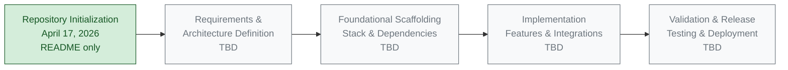

The green-shaded node represents the verifiable, present state of the repository. The grey-shaded nodes represent prospective stages whose contents are not yet defined within the codebase.

### 1.2.3 Success Criteria

#### Measurable Objectives

No measurable project objectives are documented in the repository. There are no OKRs, acceptance criteria, service-level objectives (SLOs), or quantitative targets recorded in any file. Measurable objectives are **TBD**.

#### Critical Success Factors

No critical success factors have been articulated within the repository. There is no risk register, no dependency map, and no governance documentation from which critical success factors could be derived. Critical success factors are **TBD**.

#### Key Performance Indicators (KPIs)

No Key Performance Indicators have been declared. The repository contains no telemetry configuration, no analytics instrumentation, no monitoring manifest, and no documented metric definitions. KPIs are **TBD** and should be defined in a subsequent revision of this Specification.

| Success-Criterion Type | Documented in Repository? |
|------------------------|---------------------------|
| Measurable Objectives | No — TBD |
| Critical Success Factors | No — TBD |
| Key Performance Indicators (KPIs) | No — TBD |
| Acceptance Criteria | No — TBD |

## 1.3 SCOPE

### 1.3.1 In-Scope Elements

#### Core Features and Functionalities

No features, user workflows, integrations, or technical requirements have been declared in the repository. As a consequence, the in-scope feature catalog is entirely **To Be Defined**. The table below reflects the verifiable absence of scope declarations.

| In-Scope Category | Declared in Repository? | Notes |
|-------------------|-------------------------|-------|
| Must-Have Capabilities | No | None declared — TBD |
| Primary User Workflows | No | None declared — TBD |
| Essential Integrations | No | None declared — TBD |
| Key Technical Requirements | No | None declared — TBD |

#### Implementation Boundaries

The repository does not specify system boundaries, user-group coverage, geographic/market reach, or data domains. Implementation boundaries are therefore **TBD**.

| Boundary Dimension | Declared in Repository? | Notes |
|--------------------|-------------------------|-------|
| System / Service Boundaries | No | No architectural artifacts present — TBD |
| User Groups Covered | No | No personas or roles documented — TBD |
| Geographic / Market Coverage | No | No locale or regional declarations — TBD |
| Data Domains Included | No | No schemas or data models present — TBD |

### 1.3.2 Out-of-Scope Elements

Because no in-scope items have been formally declared, no exhaustive out-of-scope list can be derived from the repository. However, the following statements are factually defensible based on the verifiable repository state at the time of authorship.

#### Explicitly Excluded Capabilities (Based on Current Repository State)

The following items are out of scope of the **current** repository contents (not necessarily out of scope of the eventual product):

- All software functionality (no source code exists)
- All third-party integrations (no dependency manifests or service configurations exist)
- All user interfaces and user-facing experiences (no UI assets exist)
- All persistence layers, data schemas, and database integrations (no schema files exist)
- All authentication, authorization, and security controls (no security artifacts exist)
- All operational tooling, monitoring, and observability components (no configuration exists)
- All build, packaging, and deployment automation (no build scripts or CI/CD definitions exist)
- All automated tests, quality gates, and verification harnesses (no test files exist)

#### Future Phase Considerations

Future phases of the `April17Sec_1` project — including requirements definition, architectural design, technology selection, implementation, validation, and release — are not represented by any artifact in the repository today. Phasing and milestone planning are **TBD**.

#### Integration Points Not Covered

No integration points are covered in the present repository state because none are defined. A complete enumeration of integration points is **TBD** and must be produced once external dependencies are introduced into the codebase.

#### Unsupported Use Cases

Because no supported use cases have been declared, the universe of unsupported use cases cannot be meaningfully enumerated from the repository. This subsection is **TBD**.

## 1.4 SCOPE DECLARATION SUMMARY

To provide a single consolidated view, the following table summarizes the scope posture of `April17Sec_1` as represented in the current repository.

| Scope Category | In-Scope (Declared) | Out-of-Scope (Declared) |
|----------------|---------------------|--------------------------|
| Features & Capabilities | None — TBD | All (none declared as in-scope) |
| User Groups & Personas | None — TBD | All (none declared as in-scope) |
| Integrations & APIs | None — TBD | All (none declared as in-scope) |
| Data Domains | None — TBD | All (none declared as in-scope) |
| Geographic / Market Coverage | None — TBD | All (none declared as in-scope) |

This consolidation underscores that meaningful scope definition for `April17Sec_1` is a forward-looking activity. Subsequent revisions of this Technical Specification — produced after requirements, architecture, and foundational scaffolding artifacts are committed to the repository — will replace the **TBD** markers with verifiable, evidence-backed declarations.

## 1.5 References

### 1.5.1 Files Examined

- `README.md` — The single tracked file in the repository (14 bytes, 1 line). Contains only the Markdown H1 heading `# April17Sec_1`. Sole source of the definitive project identifier; provides no description, purpose, dependencies, or scope information.

### 1.5.2 Folders Explored

- Repository root (`/`) — Confirmed via folder-inventory inspection to contain only `README.md` and the `.git/` version-control metadata directory. No application subfolders exist; the hierarchy is fully exhausted at depth 0.

### 1.5.3 Repository Metadata Sources

- Git commit history (`git log --all --stat`) — Confirmed exactly one commit (`333af4a8ff6474c0db8af5d41d694280e5d2ebe8`, "Initial commit") authored on April 17, 2026 by `ShaliniTest-maker`, adding a single line to `README.md`.
- Git branches (`git branch -a`) — Confirmed presence of only `main` (local) and `origin/main` (remote); no additional branches contain alternate content.
- Git remotes (`git remote -v`) — Confirmed origin URL `https://github.com/ShaliniTest-maker/April17Sec_1.git`.

### 1.5.4 Verification Searches

- Filesystem search for `.blitzyignore` files — None present; no exclusion list applies to repository analysis.
- Filesystem enumeration for hidden or nested application files — None present beyond `.git/` metadata.
- Semantic search for "application source code or configuration files" — Zero matching artifacts returned.
- Semantic search for "source code implementation modules" — Zero matching folders returned.

### 1.5.5 Coverage Statement

- Files examined: 1 of 1 tracked files (100% coverage).
- Folders explored: 1 of 1 application folders (100% coverage; repository contains no subfolders).
- The three-level folder-descent minimum is inapplicable to this repository because no nested directory structure exists; coverage is complete by virtue of exhaustion at depth 0.

# 2. Product Requirements

## 2.1 SECTION OVERVIEW AND READINESS POSTURE

### 2.1.1 Purpose of This Section

This section catalogs the discrete, testable features that comprise the `April17Sec_1` product, along with their functional requirements, relationships, and implementation considerations. As established in Section 1.1.1, the project is at the **Repository Initialization (Scaffold)** lifecycle stage, with exactly one tracked file (`README.md`, 14 bytes, 1 line) whose entire content is the single Markdown heading `# April17Sec_1`. No source code, configuration manifests, dependency declarations, design documents, user stories, acceptance criteria, or requirements artifacts have been committed to the repository.

In strict accordance with the authorship principle established throughout Section 1 — that this Specification documents only what is verifiable from the codebase — Section 2 presents an evidence-based **"To Be Defined" (TBD)** posture across every required sub-area. No features, requirements, relationships, or constraints have been invented; the structural frameworks below are provided as ready-to-populate scaffolding that subsequent revisions of this Specification will fill once requirements-discovery artifacts are committed.

### 2.1.2 Verifiable Readiness State

The following table consolidates the verifiable state of every Product-Requirements-adjacent input within the repository, drawing on the findings already documented in Sections 1.1.2, 1.2.2, 1.2.3, 1.3.1, and 1.3.2.

| Requirements Input Category | Verifiable State in Repository | Cross-Reference |
|------------------------------|-------------------------------|-----------------|
| Functional Requirements | Not present — TBD | Section 1.1.2 |
| Non-Functional Requirements | Not present — TBD | Section 1.1.2 |
| System Capabilities Catalog | Not present — TBD | Section 1.2.2 |
| Acceptance Criteria & KPIs | Not present — TBD | Section 1.2.3 |

| Supporting Artifact | Verifiable State in Repository | Cross-Reference |
|----------------------|-------------------------------|-----------------|
| Must-Have Capabilities | None declared — TBD | Section 1.3.1 |
| Primary User Workflows | None declared — TBD | Section 1.3.1 |
| Essential Integrations | None declared — TBD | Section 1.3.1 |
| Dependency Manifests (e.g., `package.json`, `requirements.txt`) | None present — TBD | Section 1.2.1 |

### 2.1.3 Requirements Documentation Lifecycle

The diagram below depicts the relationship between the current repository state and the prospective requirements-population activities that must precede a full Section 2 rewrite. It complements the lifecycle diagram in Section 1.2.2 by focusing specifically on the requirements-engineering workstream.

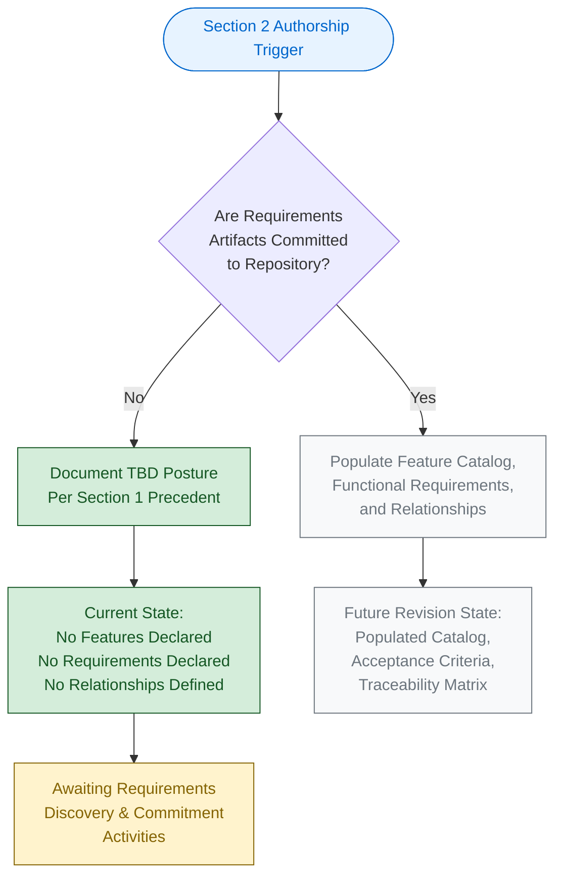

The green-shaded nodes represent the verifiable, present authorship path. The grey-shaded nodes represent the prospective path that will be taken in a future revision once requirements artifacts are added to the codebase. The yellow-shaded node identifies the pending upstream activity required to unlock those subsequent revisions.

---

## 2.2 FEATURE CATALOG

### 2.2.1 Feature Metadata Inventory

A Feature Catalog enumerates every discrete capability of the product, each identified by a unique `F-XXX` identifier and characterized by a category, priority level, and status. Because no features have been declared, designed, or implemented in the `April17Sec_1` repository, the catalog is empty.

| Feature ID | Feature Name | Category | Priority / Status |
|------------|---------------|----------|---------------------|
| *(None declared)* | *(TBD)* | *(TBD)* | *(TBD)* |

**Note on ID Convention.** When features are introduced, identifiers MUST follow the `F-XXX` format (zero-padded three-digit suffix), beginning with `F-001` and incrementing sequentially. No `F-XXX` identifier is reserved at this time because no candidate features have been proposed within the repository.

### 2.2.2 Feature Descriptions

For each future feature, this Specification will document an overview, business value, user benefits, and technical context. The descriptive scaffolding is shown below for reference, but no descriptive content exists because no features have been articulated. This is consistent with Section 1.2.2, which records that no system capabilities or user-facing features exist in the repository.

| Description Element | Current Content |
|---------------------|-----------------|
| Overview | *(TBD — no feature to describe)* |
| Business Value | *(TBD — Section 1.1.4 records no value proposition documented)* |
| User Benefits | *(TBD — Section 1.1.3 records no user personas documented)* |
| Technical Context | *(TBD — Section 1.2.2 records no technical approach documented)* |

### 2.2.3 Feature Dependencies

Feature dependencies are inventoried across four dimensions: prerequisite features, system dependencies, external dependencies, and integration requirements. The repository contains no artifacts from which any of these dimensions can be populated. Specifically:

- **Prerequisite Features**: No feature backlog exists; therefore no inter-feature prerequisites can be expressed.
- **System Dependencies**: Per Section 1.2.2, no runtime, framework, persistence engine, or platform target has been declared.
- **External Dependencies**: Per Section 1.2.1, no dependency manifest (`package.json`, `requirements.txt`, `pom.xml`, `Gemfile`, `go.mod`, `Cargo.toml`, `composer.json`, `pyproject.toml`) and no configuration file (`.env`, `config.yaml`, `settings.ini`) exists in the repository.
- **Integration Requirements**: Per Section 1.2.1, no integration points, APIs, message brokers, identity providers, or data stores are referenced.

| Dependency Dimension | Declared in Repository? | Source of Evidence |
|-----------------------|--------------------------|---------------------|
| Prerequisite Features | No — TBD | Section 1.3.1 |
| System Dependencies | No — TBD | Section 1.2.2 |
| External Dependencies | No — TBD | Section 1.2.1 |
| Integration Requirements | No — TBD | Section 1.2.1 |

---

## 2.3 FUNCTIONAL REQUIREMENTS

### 2.3.1 Requirement Details

A Functional Requirements Table enumerates atomic, testable behavioral statements, each identified by an `F-XXX-RQ-YYY` identifier that links the requirement to its parent feature. Because no parent features exist (per Section 2.2.1), no functional requirements have been authored.

| Requirement ID | Description | Priority | Complexity |
|----------------|-------------|----------|-------------|
| *(None declared)* | *(TBD)* | *(TBD)* | *(TBD)* |

**Note on ID Convention.** When requirements are introduced, identifiers MUST follow the `F-XXX-RQ-YYY` format, where `F-XXX` identifies the parent feature and `RQ-YYY` is a zero-padded three-digit ordinal within that feature (e.g., `F-001-RQ-001`, `F-001-RQ-002`). Priority MUST be expressed as Must-Have / Should-Have / Could-Have, and Complexity MUST be expressed as High / Medium / Low.

### 2.3.2 Technical Specifications

For each requirement, the Specification will document input parameters, output/response shape, performance criteria, and data requirements. The structural scaffolding is shown below; no content is populated because no requirements exist.

| Technical Specification Element | Current Content |
|---------------------------------|-----------------|
| Input Parameters | *(TBD — no requirements to specify)* |
| Output / Response | *(TBD — no requirements to specify)* |
| Performance Criteria | *(TBD — Section 1.2.3 records no SLOs or performance targets documented)* |
| Data Requirements | *(TBD — no schemas, data models, or persistence definitions exist)* |

### 2.3.3 Validation Rules

Validation rules govern the correctness of inputs, the enforcement of business invariants, and the satisfaction of security and compliance obligations. None have been declared.

| Validation Rule Category | Current Content |
|--------------------------|-----------------|
| Business Rules | *(TBD — no business logic exists in the repository)* |
| Data Validation | *(TBD — no input contracts or schemas exist)* |
| Security Requirements | *(TBD — Section 1.3.2 records no security controls present)* |
| Compliance Requirements | *(TBD — no regulatory scope is declared in the repository)* |

### 2.3.4 Acceptance Criteria Convention

Each future requirement MUST carry one or more testable acceptance criteria stated in observable, verifiable terms (commonly in Given/When/Then or equivalent structured form). Acceptance criteria for the `April17Sec_1` product are entirely **TBD**, consistent with the explicit "No — TBD" declaration recorded in Section 1.2.3 for the Acceptance Criteria row of the Success-Criterion Type table.

---

## 2.4 FEATURE RELATIONSHIPS

### 2.4.1 Feature Dependency Map

A Feature Dependency Map visualizes inter-feature prerequisites and ordering constraints. Because the Feature Catalog (Section 2.2.1) is empty, no dependency relationships exist to map. No `F-XXX → F-YYY` edges can be drawn because no `F-XXX` nodes have been created.

| Source Feature | Target Feature | Relationship Type |
|----------------|----------------|---------------------|
| *(None declared)* | *(None declared)* | *(TBD)* |

### 2.4.2 Integration Points

Integration points describe synchronous and asynchronous interactions with external systems, APIs, message brokers, and identity providers. Per Section 1.2.1, no such integrations are referenced in the repository. There are no `.env` files, no service-binding configurations, no API clients, and no external system credentials of any kind in the codebase.

| Integration Point | Declared in Repository? | Reference |
|-------------------|--------------------------|-----------|
| External APIs | No — TBD | Section 1.2.1 |
| Message Brokers | No — TBD | Section 1.2.1 |
| Identity Providers | No — TBD | Section 1.2.1 |
| Data Stores | No — TBD | Section 1.2.1 |

### 2.4.3 Shared Components and Common Services

Shared components and common services typically arise from cross-cutting concerns (e.g., logging, authentication, caching, configuration). The repository contains zero application subfolders and zero source files across all common programming-language extensions verified in Section 1.2.2 (`.py`, `.js`, `.ts`, `.java`, `.go`, `.rb`, `.cs`, `.cpp`, `.c`, `.rs`, `.kt`, `.swift`, `.php`). Consequently, no shared components or common services have been authored.

| Component / Service Category | Present in Repository? | Reference |
|------------------------------|--------------------------|-----------|
| Shared Application Modules | No — TBD | Section 1.2.2 |
| Cross-Cutting Services | No — TBD | Section 1.2.2 |
| Front-End Asset Libraries | No — TBD | Section 1.2.2 |
| Infrastructure-as-Code Modules | No — TBD | Section 1.2.2 |

---

## 2.5 IMPLEMENTATION CONSIDERATIONS

### 2.5.1 Technical Constraints

Technical constraints typically derive from the chosen technology stack, target runtime, deployment environment, and integration ecosystem. Per Section 1.2.2, no technology stack, framework, programming language, persistence engine, deployment platform, or architectural pattern is declared in the repository. Accordingly, no technical constraints can be enumerated.

| Constraint Dimension | Declared in Repository? | Reference |
|-----------------------|--------------------------|-----------|
| Technology Stack | No — TBD | Section 1.2.2 |
| Runtime / Platform Target | No — TBD | Section 1.2.2 |
| Architectural Pattern | No — TBD | Section 1.2.2 |
| Toolchain (linter / formatter / build) | No — TBD | Section 1.2.2 |

### 2.5.2 Performance Requirements

Performance requirements (e.g., latency, throughput, concurrency targets) must be expressed against a defined system architecture and measurable indicators. Per Section 1.2.3, no Service-Level Objectives (SLOs), Key Performance Indicators (KPIs), measurable objectives, or telemetry configurations exist in the repository. Performance requirements are therefore **TBD**.

### 2.5.3 Scalability Considerations

Scalability considerations require an established architectural pattern and a defined workload profile (e.g., expected request volume, data growth, user concurrency). Neither input is documented in the repository (per Sections 1.2.1, 1.2.2, and 1.2.3). No horizontal or vertical scaling assumptions can be derived. This subsection is **TBD**.

### 2.5.4 Security Implications

Per Section 1.3.2, the current repository state explicitly excludes "All authentication, authorization, and security controls (no security artifacts exist)." There are no security-related configuration files, no secret-management directives, no identity-provider integrations, and no access-control policies in the codebase. Security implications are therefore **TBD** and must be authored when authentication, authorization, and data-protection features are introduced.

| Security Concern | Declared in Repository? | Reference |
|------------------|--------------------------|-----------|
| Authentication Mechanisms | No — TBD | Section 1.3.2 |
| Authorization Policies | No — TBD | Section 1.3.2 |
| Data-Protection Controls | No — TBD | Section 1.3.2 |
| Audit & Logging Provisions | No — TBD | Section 1.3.2 |

### 2.5.5 Maintenance Requirements

Maintenance requirements (e.g., observability, alerting, runbooks, support tiers) depend on the existence of operational tooling, which Section 1.3.2 records as absent: "All operational tooling, monitoring, and observability components (no configuration exists)." Maintenance requirements are **TBD**.

---

## 2.6 TRACEABILITY MATRIX

### 2.6.1 Matrix Structure

A traceability matrix maps each functional requirement to its parent feature, originating source artifact (e.g., user story, design document, regulatory clause), and verification evidence (e.g., test case, demo, audit). The structural template that future revisions of this Specification will populate is shown below.

| Requirement ID | Parent Feature ID | Source Artifact | Verification Evidence |
|----------------|----------------------|-----------------|------------------------|
| *(TBD)* | *(TBD)* | *(TBD)* | *(TBD)* |

### 2.6.2 Current Population State

The matrix is empty because:

- No `F-XXX-RQ-YYY` requirement identifiers have been issued (Section 2.3.1).
- No `F-XXX` parent features exist (Section 2.2.1).
- No source artifacts (requirements documents, user stories, design notes) are committed to the repository (Section 1.1.2).
- No verification evidence (test files, test plans, demo scripts) exists (Section 1.3.2).

A non-empty traceability matrix will become possible only when these upstream artifacts are introduced to the codebase.

---

## 2.7 ASSUMPTIONS, CONSTRAINTS, AND VERSIONING

### 2.7.1 Documented Assumptions

The following assumptions underpin the present authorship of Section 2 and are recorded for traceability.

| Assumption ID | Assumption Statement | Basis |
|---------------|----------------------|-------|
| A-001 | The repository's verifiable state as of the initial commit is the authoritative input for this section. | Section 1.1.1; Section 1.5.5 |
| A-002 | The absence of feature, requirement, and relationship artifacts in the repository reflects the project's actual lifecycle stage (Repository Initialization), not an omission by this Specification. | Section 1.1.1; Section 1.2.2 |
| A-003 | No external requirements artifacts (e.g., off-repository documents, ticket-tracker entries, design wikis) are considered authoritative for this Specification unless and until they are committed to the codebase. | Section 1.5.4 verification searches |
| A-004 | Subsequent revisions of this Specification will replace TBD markers with evidence-backed declarations once requirements artifacts are committed. | Section 1.4 |

### 2.7.2 Constraints

The following constraints govern the authorship of Section 2 in its current state.

| Constraint ID | Constraint Statement |
|---------------|------------------------|
| C-001 | No features, requirements, or relationships may be invented; all entries must be grounded in verifiable repository content. |
| C-002 | All identifier formats (`F-XXX`, `F-XXX-RQ-YYY`) are reserved for future use and MUST NOT be populated with placeholder content that could be mistaken for real requirements. |
| C-003 | Cross-references to companion sections must remain consistent with the TBD posture established in Section 1. |
| C-004 | The traceability matrix, integration-points map, and feature-relationship diagrams remain empty until upstream artifacts (feature catalog and functional requirements) are populated. |

### 2.7.3 Requirement Version Tracking

Requirement versions will be tracked using the standard format `vMAJOR.MINOR` (e.g., `v1.0` for initial publication, `v1.1` for editorial updates, `v2.0` for material requirement changes). The current state of all requirements in this Specification is `v0.0 — Not Yet Authored`, reflecting that no requirements have been committed to the repository. Version history for individual requirements will be maintained in subsequent revisions once the Feature Catalog (Section 2.2.1) and Functional Requirements (Section 2.3.1) are populated.

| Versioning Element | Current State | Notes |
|--------------------|----------------|-------|
| Section Authorship Revision | v1.0 (TBD Posture) | This is the first authoring pass. |
| Individual Requirement Versions | v0.0 — Not Yet Authored | No requirements exist to version. |
| Change Log | Not yet initiated | Will begin with the first populated revision. |

---

## 2.8 RELATED PROCESS FLOWCHARTS AND CROSS-REFERENCES

### 2.8.1 Referenced Process Flowcharts

| Referenced Diagram | Location | Relevance to Section 2 |
|---------------------|----------|---------------------------|
| Project Lifecycle Position | Section 1.2.2 | Establishes that the project is at the Repository Initialization stage and that Requirements & Architecture Definition is the next prospective stage. |
| Requirements Documentation Lifecycle | Section 2.1.3 (this section) | Depicts the readiness condition under which Section 2 transitions from a TBD posture to a populated posture. |

### 2.8.2 Linked Technical Specifications

| Linked Section | Linkage Purpose |
|----------------|-------------------|
| Section 1.1.1 — Project Overview | Source of authoritative project metadata and current lifecycle stage. |
| Section 1.1.2 — Core Business Problem | Source for the TBD status of functional and non-functional requirements. |
| Section 1.2.2 — High-Level Description | Source for the TBD status of system capabilities, major components, and core technical approach. |
| Section 1.2.3 — Success Criteria | Source for the TBD status of measurable objectives, KPIs, and acceptance criteria. |
| Section 1.3.1 — In-Scope Elements | Source for the TBD status of must-have capabilities, user workflows, integrations, and technical requirements. |
| Section 1.3.2 — Out-of-Scope Elements | Source for the explicit enumeration of capabilities not present in the current repository state. |
| Section 1.4 — Scope Declaration Summary | Source for the consolidated scope-declaration table format mirrored throughout Section 2. |

---

## 2.9 References

### 2.9.1 Files Examined

- `README.md` — The single tracked file in the repository (14 bytes, 1 line). Verified via direct read to contain only the Markdown H1 heading `# April17Sec_1`. Confirms the absence of any product description, feature list, requirements narrative, dependency declarations, or installation/usage guidance.

### 2.9.2 Folders Explored

- Repository root (`/`) — Verified via folder-inventory inspection to contain only `README.md` and the `.git/` version-control metadata directory. Confirms zero application subfolders, zero source files, zero configuration files, zero dependency manifests, zero container definitions, zero build/CI artifacts, and zero test files.

### 2.9.3 Technical Specification Sections Retrieved

- **Section 1.1 EXECUTIVE SUMMARY** — Established project metadata (identifier `April17Sec_1`, commit `333af4a8ff6474c0db8af5d41d694280e5d2ebe8`, sole committer `ShaliniTest-maker`), current lifecycle stage (Repository Initialization / Scaffold), and the TBD status of business problem, stakeholders, and value proposition. Cited throughout Section 2.1 and Section 2.7.1.
- **Section 1.2 SYSTEM OVERVIEW** — Established the TBD status of business context, integration landscape, system capabilities, major components, core technical approach, measurable objectives, critical success factors, and KPIs. Cited throughout Sections 2.2.3, 2.3.2, 2.4.2, 2.4.3, 2.5.1, 2.5.2, and 2.5.3.
- **Section 1.3 SCOPE** — Provided the in-scope / out-of-scope tabular precedent that Section 2 mirrors throughout its TBD tables; supplied the explicit "no software functionality / no security controls / no operational tooling" enumeration cited in Sections 2.4.3, 2.5.4, and 2.5.5.
- **Section 1.4 SCOPE DECLARATION SUMMARY** — Provided the consolidated scope-posture table format that informs the readiness tables in Section 2.1.2.
- **Section 1.5 References** — Confirmed 100% repository coverage on 1 of 1 tracked files and 1 of 1 application folders, supporting Assumption A-001 in Section 2.7.1 that the repository's verifiable state is the authoritative input for this section.

### 2.9.4 Coverage Statement

Section 2 inherits the coverage statement from Section 1.5.5: 100% of tracked files (1 of 1) and 100% of application folders (1 of 1) were examined in the preparation of this section. The three-level folder-descent minimum remains inapplicable because no nested directory structure exists in the repository; coverage is complete by virtue of exhaustion at depth 0.

# 3. Technology Stack

## 3.1 SECTION OVERVIEW AND READINESS POSTURE

### 3.1.1 Purpose of This Section

This section enumerates the programming languages, frameworks, libraries, third-party services, persistence engines, and development/deployment tooling that comprise the technology stack of the `April17Sec_1` system. As established in Section 1.1.1 and reaffirmed in Section 2.1.1, the project is at the **Repository Initialization (Scaffold)** lifecycle stage, with exactly one tracked file (`README.md`, 14 bytes, 1 line) whose entire content is the single Markdown heading `# April17Sec_1`. No source code, configuration manifests, dependency declarations, container definitions, infrastructure-as-code modules, or CI/CD pipeline definitions have been committed to the repository.

In strict accordance with the authorship principle established in Section 1 and carried forward in Section 2 — that this Specification documents only what is verifiable from the codebase — Section 3 presents an evidence-based **"To Be Defined" (TBD)** posture across every required sub-area. No technology choices have been invented, defaulted, or imputed from external references. Section 1.2.2 explicitly records that "No technology stack, framework selection, runtime target, programming language, persistence engine, deployment platform, or architectural pattern is declared in the repository," and Section 2.5.1 records the same posture across the Technology Stack, Runtime/Platform Target, Architectural Pattern, and Toolchain constraint dimensions. This section faithfully reflects that state.

### 3.1.2 Verifiable Readiness State

The table below consolidates the verifiable state of every technology-stack-adjacent input within the repository, drawing on the findings already documented in Sections 1.2.1, 1.2.2, 1.3.2, 2.2.3, and 2.5.1.

| Technology Stack Category | Verifiable State in Repository | Cross-Reference |
|----------------------------|---------------------------------|-----------------|
| Programming Languages | None declared — TBD | Section 1.2.2 |
| Frameworks & Libraries | None declared — TBD | Section 1.2.2; Section 2.5.1 |
| Open Source Dependencies | None declared — TBD | Section 1.2.1; Section 2.2.3 |
| Third-Party Services & APIs | None declared — TBD | Section 1.2.1; Section 1.3.2 |
| Databases & Storage | None declared — TBD | Section 1.3.2 |
| Development & Deployment Tooling | None declared — TBD | Section 1.2.2; Section 1.3.2 |
| Linter / Formatter / Build Toolchain | None declared — TBD | Section 1.2.2; Section 2.5.1 |
| Security & Authentication Technology | None declared — TBD | Section 1.3.2; Section 2.5.4 |

| Supporting Artifact for Stack Declaration | Verifiable State in Repository | Cross-Reference |
|--------------------------------------------|---------------------------------|-----------------|
| `package.json` (Node.js) | Not present | Section 1.2.1 |
| `requirements.txt` / `pyproject.toml` (Python) | Not present | Section 1.2.1 |
| `pom.xml` / `build.gradle` (JVM) | Not present | Section 1.2.1 |
| `go.mod` / `go.sum` (Go) | Not present | Section 1.2.1 |
| `Cargo.toml` (Rust) | Not present | Section 1.2.1 |
| `Gemfile` (Ruby) | Not present | Section 1.2.1 |
| `composer.json` (PHP) | Not present | Section 1.2.1 |
| `Dockerfile` / `docker-compose.yml` | Not present | Section 1.2.1 |
| `*.tf` / Terraform / IaC manifests | Not present | Section 1.3.2 |
| `.github/workflows/` / `.gitlab-ci.yml` / `Jenkinsfile` | Not present | Section 1.3.2 |
| `.gitignore` / editor / linter configuration | Not present | Section 1.2.2 |

### 3.1.3 Authorship Constraints and Cross-References

The TBD declarations throughout Section 3 are governed by the following constraints and assumptions formally documented in Section 2.7:

| Governing Item | Statement | Source |
|----------------|-----------|--------|
| Constraint C-001 | No features, requirements, or relationships may be invented; all entries must be grounded in verifiable repository content. | Section 2.7.2 |
| Constraint C-003 | Cross-references to companion sections must remain consistent with the TBD posture established in Section 1. | Section 2.7.2 |
| Assumption A-001 | The repository's verifiable state as of the initial commit is the authoritative input for this section. | Section 2.7.1 |
| Assumption A-003 | No external requirements artifacts (e.g., off-repository documents, ticket-tracker entries, design wikis) are considered authoritative for this Specification unless and until they are committed to the codebase. | Section 2.7.1 |
| Assumption A-004 | Subsequent revisions of this Specification will replace TBD markers with evidence-backed declarations once requirements artifacts are committed. | Section 2.7.1 |

Under Assumption A-003, the "Default Technology Stack" provided at the documentation-framework level (referenced in Section 3.8) is **not** authoritative for this Specification and has not been adopted by the repository.

---

## 3.2 PROGRAMMING LANGUAGES

### 3.2.1 Language Selection Posture

No programming language has been selected, declared, or committed to the `April17Sec_1` repository. Section 1.2.2 records that "No technology stack, framework selection, runtime target, programming language, persistence engine, deployment platform, or architectural pattern is declared in the repository." Accordingly, no language-by-platform allocation, selection rationale, version pinning, runtime constraint, or interoperability dependency can be enumerated.

The language selection posture is **TBD** and must be established when foundational scaffolding is committed, as depicted in the lifecycle diagram in Section 1.2.2.

### 3.2.2 Verified Absence of Source-Code Artifacts

The repository was inspected for source files across the major language ecosystems. None were found. The following table reflects the verified absence of source-file extensions in the codebase.

| Language Ecosystem | Representative File Extensions | Found in Repository? | Reference |
|--------------------|---------------------------------|----------------------|-----------|
| Python | `.py` | No | Section 1.2.2 |
| JavaScript | `.js`, `.jsx`, `.mjs` | No | Section 1.2.2 |
| TypeScript | `.ts`, `.tsx` | No | Section 1.2.2 |
| Java / JVM | `.java`, `.kt`, `.scala`, `.groovy` | No | Section 1.2.2 |
| Go | `.go` | No | Section 1.2.2 |
| Ruby | `.rb` | No | Section 1.2.2 |
| C# / .NET | `.cs`, `.fs`, `.vb` | No | Section 1.2.2 |
| C / C++ | `.c`, `.cpp`, `.h`, `.hpp` | No | Section 1.2.2 |
| Rust | `.rs` | No | Section 1.2.2 |
| Swift / Objective-C | `.swift`, `.m`, `.mm` | No | Section 1.2.2 |
| PHP | `.php` | No | Section 1.2.2 |
| Web Markup | `.html`, `.css`, `.scss` | No | Section 1.2.2 |

The sole tracked file in the repository (`README.md`) is a Markdown document and is not considered a programming-language source artifact for the purpose of stack determination.

### 3.2.3 Platform-by-Platform Language Allocation

The section prompt requests a language allocation by platform/component (backend, frontend, mobile, native applications, desktop). Because no platforms, components, or features are declared (see Section 2.2.1: "the catalog is empty"), no language-to-platform mapping can be evidence-grounded.

| Platform / Component | Declared Language | Declared Version | Selection Justification | Reference |
|----------------------|-------------------|-------------------|--------------------------|-----------|
| Backend / Server-Side | None — TBD | None — TBD | None — TBD | Section 1.2.2 |
| Frontend / Web Client | None — TBD | None — TBD | None — TBD | Section 1.2.2 |
| Mobile / Cross-Platform | None — TBD | None — TBD | None — TBD | Section 1.2.2 |
| Native iOS | None — TBD | None — TBD | None — TBD | Section 1.2.2 |
| Native Android | None — TBD | None — TBD | None — TBD | Section 1.2.2 |
| Desktop | None — TBD | None — TBD | None — TBD | Section 1.2.2 |
| Build Scripts / Tooling | None — TBD | None — TBD | None — TBD | Section 1.2.2 |
| Documentation | Markdown (`README.md`) | N/A — single-line H1 | N/A — used only for repository identifier | Section 1.5.1 |

#### Constraints and Dependencies

Per Constraint C-001 (Section 2.7.2), language constraints and inter-language dependencies cannot be enumerated until at least one language is declared in the repository. Per Section 2.5.1, runtime/platform targets remain **TBD**, meaning no language-runtime version constraint (e.g., Python 3.x, Node.js LTS, JVM 17+) is currently in force.

---

## 3.3 FRAMEWORKS AND LIBRARIES

### 3.3.1 Framework Selection Posture

No application framework has been adopted, declared, or imported. Per Section 1.2.2, no framework selection is recorded in the repository, and Section 1.2.1 confirms there are "no configuration files (`.env`, `config.yaml`, `settings.ini`), dependency manifests (`package.json`, `requirements.txt`, `pom.xml`, etc.), or container definitions (`Dockerfile`, `docker-compose.yml`) from which integration topology could be inferred."

Without a programming language declaration (Section 3.2) and without dependency manifests (Section 3.4), framework selection cannot be evidenced. This subsection is therefore **TBD**.

### 3.3.2 Verified Absence of Framework Markers

The repository was inspected for framework-specific configuration files and project markers across major web, backend, mobile, and desktop ecosystems. None were found.

| Framework Marker Family | Representative Artifacts | Found in Repository? | Reference |
|--------------------------|---------------------------|----------------------|-----------|
| Web Backend (Python) | `flask`, `django`, `fastapi` declared in `requirements.txt` or `pyproject.toml` | No (no manifest exists) | Section 1.2.1 |
| Web Backend (Node.js) | `express`, `koa`, `nestjs` declared in `package.json` | No (no manifest exists) | Section 1.2.1 |
| Web Backend (JVM) | `spring-boot`, `quarkus`, `micronaut` declared in `pom.xml` / `build.gradle` | No (no manifest exists) | Section 1.2.1 |
| Web Frontend (SPA) | `react`, `vue`, `angular`, `svelte` declared in `package.json` | No (no manifest exists) | Section 1.2.1 |
| Frontend Build/SSR | `next.config.js`, `nuxt.config.js`, `astro.config.mjs`, `vite.config.js` | No | Section 1.2.1 |
| CSS Framework | `tailwind.config.js`, `postcss.config.js`, Bootstrap import | No | Section 1.2.1 |
| Mobile Cross-Platform | `react-native` / `expo` / `flutter` markers | No | Section 1.2.1 |
| Native iOS | `Package.swift`, `Podfile`, `*.xcodeproj` | No | Section 1.2.1 |
| Native Android | `build.gradle`, `AndroidManifest.xml` | No | Section 1.2.1 |
| Desktop | ElectronJS / Tauri markers in `package.json` | No | Section 1.2.1 |
| AI / LLM Frameworks | `langchain`, `llama-index` declared in `requirements.txt` / `package.json` | No (no manifest exists) | Section 1.2.1 |
| Testing Frameworks | `pytest.ini`, `jest.config.js`, `karma.conf.js` | No | Section 1.2.1 |

### 3.3.3 Version and Compatibility Posture

The section prompt asks for "core frameworks with versions," "compatibility requirements," and "justification for each major choice." Because no frameworks have been declared, no versions are pinned, no inter-framework compatibility matrix can be authored, and no justification narrative can be evidence-grounded.

| Framework / Library Property | Verifiable State | Reference |
|------------------------------|------------------|-----------|
| Declared Core Frameworks | None | Section 1.2.2 |
| Pinned Versions (semver) | None | Section 1.2.1 |
| Transitive Dependency Tree | None | Section 1.2.1 |
| Compatibility Matrix (framework × runtime) | None | Section 2.5.1 |
| Selection Justification Documents | None | Section 1.1.2 |
| Deprecation / Migration Posture | Not applicable (no prior stack) | Section 1.2.1 |

---

## 3.4 OPEN SOURCE DEPENDENCIES

### 3.4.1 Dependency Manifest Posture

Section 2.2.3 records explicitly that "no dependency manifest (`package.json`, `requirements.txt`, `pom.xml`, `Gemfile`, `go.mod`, `Cargo.toml`, `composer.json`, `pyproject.toml`) and no configuration file (`.env`, `config.yaml`, `settings.ini`) exists in the repository." Consequently, no open-source third-party libraries are currently consumed by the project.

The open-source dependency posture is **TBD**. When a dependency manifest is committed in a future revision, it will become the authoritative source for this subsection.

### 3.4.2 Verified Absence of Package Manifests

The table below enumerates the package-manager manifests checked for presence in the repository.

| Ecosystem | Manifest File(s) | Lockfile(s) | Found? | Reference |
|-----------|------------------|-------------|--------|-----------|
| Node.js (npm) | `package.json` | `package-lock.json` | No | Section 2.2.3 |
| Node.js (Yarn) | `package.json` | `yarn.lock` | No | Section 2.2.3 |
| Node.js (pnpm) | `package.json` | `pnpm-lock.yaml` | No | Section 2.2.3 |
| Python (pip) | `requirements.txt` | `requirements.lock` | No | Section 2.2.3 |
| Python (Poetry / PEP 621) | `pyproject.toml` | `poetry.lock` | No | Section 2.2.3 |
| Python (Pipenv) | `Pipfile` | `Pipfile.lock` | No | Section 2.2.3 |
| Java (Maven) | `pom.xml` | n/a | No | Section 2.2.3 |
| Java (Gradle) | `build.gradle`, `build.gradle.kts` | n/a | No | Section 2.2.3 |
| Ruby (Bundler) | `Gemfile` | `Gemfile.lock` | No | Section 2.2.3 |
| Go (Modules) | `go.mod` | `go.sum` | No | Section 2.2.3 |
| Rust (Cargo) | `Cargo.toml` | `Cargo.lock` | No | Section 2.2.3 |
| PHP (Composer) | `composer.json` | `composer.lock` | No | Section 2.2.3 |
| Swift (SPM) | `Package.swift` | `Package.resolved` | No | Section 2.2.3 |
| iOS (CocoaPods) | `Podfile` | `Podfile.lock` | No | Section 2.2.3 |

### 3.4.3 Package Registry and Provenance Posture

The section prompt requests enumeration of "package dependencies, registries and versions." Because no manifests exist, no registry references (e.g., `npmjs.org`, `pypi.org`, `crates.io`, `rubygems.org`, `maven central`, `nuget.org`) are made by the codebase, and no third-party package versions are pinned, audited, or in transitive scope.

| Registry / Provenance Concern | Verifiable State | Reference |
|--------------------------------|------------------|-----------|
| Public Registry References | None | Section 2.2.3 |
| Private / Mirror Registry References | None | Section 2.2.3 |
| Pinned Direct-Dependency Versions | None | Section 2.2.3 |
| Transitive-Dependency Lockfile | None | Section 2.2.3 |
| License Audit Output | Not applicable (no dependencies) | Section 1.3.2 |
| SBOM (Software Bill of Materials) | None | Section 1.3.2 |
| Supply-Chain Verification (e.g., Sigstore, attestations) | None | Section 1.3.2 |

---

## 3.5 THIRD-PARTY SERVICES

### 3.5.1 External Service Posture

Section 1.2.1 records that "No integration points, external dependencies, third-party services, APIs, message brokers, data stores, identity providers, or enterprise systems are referenced in the repository." Section 1.3.2 reaffirms that "All third-party integrations (no dependency manifests or service configurations exist)" are out of scope of the current repository state. The third-party service inventory is therefore **TBD**.

Section 2.4 (Feature Relationships) has confirmed no integration points are defined, and Section 2.5.4 has confirmed no authentication, authorization, or identity-provider integrations exist.

### 3.5.2 Verified Absence of Service Integrations

The table below summarizes the verification posture across major third-party service categories.

| Service Category | Representative Markers Searched For | Found? | Reference |
|------------------|-------------------------------------|--------|-----------|
| Identity-Provider Integration | Auth0, Cognito, Okta, Azure AD, Firebase Auth config | No | Section 2.5.4 |
| Payment Processor | Stripe, Braintree, PayPal SDK references | No | Section 1.2.1 |
| Email / Messaging Provider | SendGrid, Twilio, AWS SES SDK references | No | Section 1.2.1 |
| Cloud Storage Provider | AWS S3, GCS, Azure Blob SDK references | No | Section 1.2.1 |
| Analytics / Telemetry | Segment, Mixpanel, Amplitude SDK references | No | Section 1.2.3 |
| Application Performance Monitoring | Datadog, New Relic, AppDynamics, Sentry config | No | Section 1.2.3 |
| Logging Aggregation | ELK, Splunk, Loggly, Logz.io config | No | Section 1.2.3 |
| Feature Flag Service | LaunchDarkly, Split.io config | No | Section 1.2.1 |
| Search Service | Algolia, Elasticsearch SaaS config | No | Section 1.2.1 |
| Message Broker / Queue | Kafka, RabbitMQ, AWS SQS, NATS config | No | Section 1.2.1 |

### 3.5.3 Authentication, Monitoring, and Cloud Services

The section prompt asks for documentation of "authentication services," "monitoring tools," and "cloud services." Each is **TBD** as detailed below.

#### Authentication Services

| Authentication Concern | Declared in Repository? | Reference |
|-------------------------|--------------------------|-----------|
| Identity-Provider Selection | No — TBD | Section 2.5.4 |
| OAuth 2.0 / OIDC Client Configuration | No — TBD | Section 2.5.4 |
| SAML / Federation Configuration | No — TBD | Section 2.5.4 |
| Token Issuance / Validation Library | No — TBD | Section 2.5.4 |
| Multi-Factor Authentication Integration | No — TBD | Section 2.5.4 |

#### Monitoring and Observability Tools

| Observability Concern | Declared in Repository? | Reference |
|------------------------|--------------------------|-----------|
| Metrics Collection (e.g., Prometheus, CloudWatch) | No — TBD | Section 2.5.5 |
| Distributed Tracing (e.g., OpenTelemetry, Jaeger) | No — TBD | Section 2.5.5 |
| Log Aggregation Backend | No — TBD | Section 2.5.5 |
| Alerting / On-Call Integration (e.g., PagerDuty, Opsgenie) | No — TBD | Section 2.5.5 |
| Error-Reporting Service (e.g., Sentry, Rollbar) | No — TBD | Section 2.5.5 |
| Uptime / Synthetic Monitoring | No — TBD | Section 2.5.5 |

#### Cloud Services

| Cloud Service Concern | Declared in Repository? | Reference |
|------------------------|--------------------------|-----------|
| Cloud Platform Selection (AWS / Azure / GCP / other) | No — TBD | Section 1.2.2 |
| Managed Compute Service (Lambda, ECS, EKS, App Runner, etc.) | No — TBD | Section 1.2.2 |
| Managed Database Service | No — TBD | Section 3.6 |
| Object Storage Service | No — TBD | Section 3.6 |
| CDN / Edge Configuration | No — TBD | Section 1.2.2 |
| DNS / Domain Management | No — TBD | Section 1.2.2 |

---

## 3.6 DATABASES AND STORAGE

### 3.6.1 Persistence Layer Posture

Section 1.3.2 explicitly lists "All persistence layers, data schemas, and database integrations (no schema files exist)" as out of scope of the current repository state. Section 1.2.2 confirms that no persistence engine is declared. The database and storage subsystem is therefore **TBD**.

Section 1.3.1 also records that no data domains are declared, meaning no schema decomposition, data ownership boundary, or storage tier can be evidence-grounded at this time.

### 3.6.2 Verified Absence of Schema Artifacts

The repository was inspected for schema-bearing and storage-configuration artifacts. None were found.

| Artifact Family | Representative Files Searched For | Found? | Reference |
|------------------|-----------------------------------|--------|-----------|
| Relational Schema (SQL) | `*.sql`, `schema.sql`, `migrations/` | No | Section 1.3.2 |
| Migration Frameworks | Alembic, Liquibase, Flyway, Knex, ActiveRecord migrations | No | Section 1.3.2 |
| ORM Model Files | SQLAlchemy, Hibernate, Sequelize, TypeORM, Prisma models | No | Section 1.3.2 |
| NoSQL Schema / Index Config | MongoDB collection definitions, DynamoDB table specs | No | Section 1.3.2 |
| GraphQL Schemas | `*.graphql`, `schema.gql` | No | Section 1.3.2 |
| Database Connection Configuration | `database.yml`, connection strings in `.env` | No | Section 1.2.1 |
| Object Storage Configuration | S3 / GCS / Azure Blob bucket declarations | No | Section 1.2.1 |
| Caching Configuration | Redis / Memcached client config | No | Section 1.2.1 |
| Search Index Definitions | Elasticsearch / OpenSearch mappings | No | Section 1.2.1 |

### 3.6.3 Caching, Storage Services, and Persistence Strategies

The section prompt asks for documentation of "primary and secondary databases," "data persistence strategies," "caching solutions," and "storage services." Each remains **TBD** as captured below.

| Persistence Dimension | Declared in Repository? | Reference |
|------------------------|--------------------------|-----------|
| Primary Database Engine | No — TBD | Section 1.2.2 |
| Secondary / Read-Replica Database | No — TBD | Section 1.2.2 |
| Data Persistence Strategy (write-through, write-behind, eventual consistency) | No — TBD | Section 2.5.3 |
| Backup and Restore Strategy | No — TBD | Section 2.5.5 |
| Disaster Recovery / RPO-RTO Targets | No — TBD | Section 2.5.5 |
| In-Memory Cache (Redis, Memcached, etc.) | No — TBD | Section 1.3.2 |
| CDN / Edge Cache Configuration | No — TBD | Section 1.3.2 |
| Object / Blob Storage Service | No — TBD | Section 1.3.2 |
| File-System Storage (Local / NFS / EFS) | No — TBD | Section 1.3.2 |
| Encryption-at-Rest Configuration | No — TBD | Section 2.5.4 |

---

## 3.7 DEVELOPMENT AND DEPLOYMENT

### 3.7.1 Development Toolchain Posture

Section 1.2.2 records explicitly that "There is no `.gitignore` file, no editor configuration, and no linter/formatter configuration that would hint at a chosen toolchain." Section 2.5.1 confirms that the Toolchain (linter / formatter / build) constraint dimension is "No — TBD." The development toolchain is therefore **TBD**.

### 3.7.2 Verified Absence of Build and CI/CD Configurations

Section 1.3.2 explicitly lists "All build, packaging, and deployment automation (no build scripts or CI/CD definitions exist)" as out of scope of the current repository state. The table below enumerates the build and CI/CD artifacts checked for presence.

| Tooling Family | Representative Files Searched For | Found? | Reference |
|----------------|-----------------------------------|--------|-----------|
| Build Scripts | `Makefile`, `Rakefile`, `Justfile`, `build.sh` | No | Section 1.3.2 |
| JS Bundlers | `webpack.config.js`, `rollup.config.js`, `vite.config.js`, `esbuild.config.js` | No | Section 1.3.2 |
| Python Build Tools | `setup.py`, `setup.cfg`, `pyproject.toml` (build-system) | No | Section 1.3.2 |
| Linters / Formatters | `.eslintrc*`, `.prettierrc*`, `.flake8`, `pylintrc`, `.editorconfig`, `tsconfig.json` | No | Section 1.2.2 |
| GitHub Actions | `.github/workflows/*.yml` | No | Section 1.3.2 |
| GitLab CI | `.gitlab-ci.yml` | No | Section 1.3.2 |
| CircleCI | `.circleci/config.yml` | No | Section 1.3.2 |
| Jenkins | `Jenkinsfile` | No | Section 1.3.2 |
| Azure Pipelines | `azure-pipelines.yml` | No | Section 1.3.2 |
| Pre-commit / Git Hooks | `.pre-commit-config.yaml`, `.husky/` | No | Section 1.2.2 |
| Test Runners / Config | `pytest.ini`, `jest.config.js`, `karma.conf.js`, `tox.ini` | No | Section 1.3.2 |

### 3.7.3 Containerization and Infrastructure-as-Code Posture

| IaC / Containerization Dimension | Declared in Repository? | Reference |
|-----------------------------------|--------------------------|-----------|
| `Dockerfile` (Container Image Definition) | No — TBD | Section 1.2.1 |
| `docker-compose.yml` (Multi-Container Orchestration) | No — TBD | Section 1.2.1 |
| `.dockerignore` | No — TBD | Section 1.2.1 |
| Kubernetes Manifests (`*.yaml` under `k8s/`, `manifests/`) | No — TBD | Section 1.3.2 |
| Helm Charts (`Chart.yaml`, `values.yaml`) | No — TBD | Section 1.3.2 |
| Terraform Modules (`*.tf`, `*.tfvars`) | No — TBD | Section 1.3.2 |
| AWS CloudFormation Templates | No — TBD | Section 1.3.2 |
| Pulumi Programs | No — TBD | Section 1.3.2 |
| Ansible Playbooks | No — TBD | Section 1.3.2 |

#### Development Workflow Tooling

| Workflow Tool Category | Declared in Repository? | Reference |
|--------------------------|--------------------------|-----------|
| Version Control | Git (verified — single remote on GitHub) | Section 1.5.3 |
| Branch Protection / Code Owners | No — TBD | Section 1.3.2 |
| Pull Request Templates (`.github/PULL_REQUEST_TEMPLATE.md`) | No — TBD | Section 1.3.2 |
| Issue Templates | No — TBD | Section 1.3.2 |
| Dependency Update Automation (Dependabot, Renovate) | No — TBD | Section 1.3.2 |
| Static Application Security Testing (SAST) | No — TBD | Section 2.5.4 |
| Software Composition Analysis (SCA) | No — TBD | Section 2.5.4 |
| Secret Scanning | No — TBD | Section 2.5.4 |

The only verified development-related artifact is the Git version-control system itself, as evidenced in Section 1.5.3 by the single commit (`333af4a8ff6474c0db8af5d41d694280e5d2ebe8`) on the `main` branch with `origin` pointing to `https://github.com/ShaliniTest-maker/April17Sec_1.git`.

---

## 3.8 DEFAULT TECHNOLOGY STACK REFERENCE

### 3.8.1 Documentation-Framework Default Reference

A "Default Technology Stack" has been suggested at the documentation-framework level (i.e., outside the repository) as a candidate reference for projects of this organization. For traceability, that suggested default is enumerated below.

| Layer | Suggested Default Component |
|-------|------------------------------|
| Cloud Platform | AWS |
| Containerization | Docker |
| Infrastructure as Code | Terraform |
| CI/CD | GitHub Actions |
| Backend Primary Language | Python |
| Backend Framework | Flask |
| Authentication | Auth0 |
| Database | MongoDB |
| AI Framework | LangChain |
| Web Frontend | React with TypeScript |
| CSS Framework | TailwindCSS |
| Mobile / Cross-Platform | React Native with TypeScript |
| Native iOS | Swift |
| Native Android | Kotlin |
| Native macOS | Objective-C |
| Desktop | ElectronJS |

### 3.8.2 Adoption Status of Each Default Component

Per Assumption A-003 (Section 2.7.1) — "No external requirements artifacts (e.g., off-repository documents, ticket-tracker entries, design wikis) are considered authoritative for this Specification unless and until they are committed to the codebase" — none of the components listed in Section 3.8.1 have been adopted by the `April17Sec_1` repository. The table below records the adoption status of each.

| Suggested Component | Adopted in Repository? | Evidence of (Non-)Adoption | Cross-Reference |
|---------------------|------------------------|------------------------------|-----------------|
| AWS | No | No cloud SDK references, no `aws/` configuration directory, no IaC | Section 1.2.1 |
| Docker | No | No `Dockerfile`, no `docker-compose.yml`, no `.dockerignore` | Section 1.2.1 |
| Terraform | No | No `*.tf` files, no Terraform workspace metadata | Section 1.3.2 |
| GitHub Actions | No | No `.github/workflows/` directory | Section 1.3.2 |
| Python | No | No `.py` source files, no Python dependency manifest | Section 1.2.2 |
| Flask | No | No Flask import, no `requirements.txt` referencing Flask | Section 2.2.3 |
| Auth0 | No | No Auth0 SDK reference, no authentication configuration | Section 2.5.4 |
| MongoDB | No | No schema artifacts, no MongoDB client configuration | Section 1.3.2 |
| LangChain | No | No `langchain` import, no LLM-orchestration code | Section 2.2.3 |
| React | No | No `.jsx` / `.tsx` files, no `package.json` referencing React | Section 1.2.2 |
| TypeScript | No | No `.ts` / `.tsx` files, no `tsconfig.json` | Section 1.2.2 |
| TailwindCSS | No | No `tailwind.config.js`, no CSS files referencing Tailwind directives | Section 1.2.1 |
| React Native | No | No React Native scaffolding, no `package.json` | Section 1.2.2 |
| Swift | No | No `.swift` files, no `Package.swift`, no `*.xcodeproj` | Section 1.2.2 |
| Kotlin | No | No `.kt` files, no `build.gradle.kts` | Section 1.2.2 |
| Objective-C | No | No `.m` / `.mm` files | Section 1.2.2 |
| ElectronJS | No | No Electron `package.json`, no `main` Electron entry point | Section 1.2.1 |

### 3.8.3 Constraint Compliance Statement

This Section 3 deliberately does **not** adopt the suggested defaults listed in Section 3.8.1 as the system's technology stack, in compliance with:

1. **Constraint C-001** (Section 2.7.2): "No features, requirements, or relationships may be invented; all entries must be grounded in verifiable repository content." Adopting any default component as authoritative would constitute invention because no repository content corroborates that choice.

2. **Assumption A-003** (Section 2.7.1): External artifacts (including documentation-framework defaults) are not authoritative until committed to the codebase. No default component has been committed.

3. **Assumption A-004** (Section 2.7.1): Subsequent revisions of this Specification will replace TBD markers with evidence-backed declarations once requirements artifacts are committed. The defaults listed in Section 3.8.1 may inform future selections, but they may also be superseded by alternative choices in those future commits.

The default reference remains documented here solely for traceability between the documentation framework's suggestions and the repository's verified state.

---

## 3.9 TECHNOLOGY STACK LIFECYCLE

### 3.9.1 Stack-Adoption Lifecycle Diagram

The diagram below depicts the relationship between the current repository state and the prospective stack-adoption activities that must precede a populated Section 3 rewrite. It complements the lifecycle diagram in Section 1.2.2 (overall project lifecycle) and the requirements-engineering lifecycle in Section 2.1.3 by focusing specifically on the technology-stack-declaration workstream.

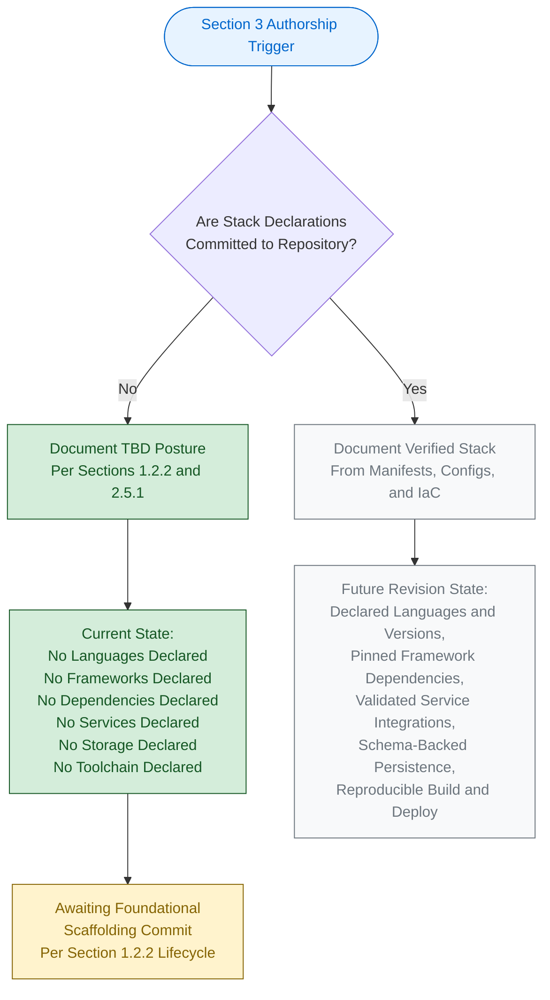

The green-shaded nodes represent the verifiable, present authorship path. The grey-shaded nodes represent the prospective path that will be taken in a future revision once stack-declaration artifacts are added to the codebase. The yellow-shaded node identifies the pending upstream activity required to unlock those subsequent revisions.

### 3.9.2 Stack Declaration Prerequisites

For Section 3 to be rewritten with evidence-backed declarations, the following prerequisites must be satisfied by future commits to the repository:

| Prerequisite | Required Artifact(s) | Section Impact |
|--------------|----------------------|----------------|
| Programming language selection | At least one source-code file in the chosen language, or a language-specific manifest (e.g., `package.json`, `pyproject.toml`) | Section 3.2 |
| Framework selection | Dependency manifest declaring the chosen framework with a pinned version | Section 3.3 |
| Open-source dependencies | Committed manifest and lockfile (e.g., `requirements.txt` + lock, `package.json` + `package-lock.json`) | Section 3.4 |
| Third-party services | Configuration file(s) referencing service SDKs / endpoints, secrets-management directives | Section 3.5 |
| Databases and storage | Schema files, ORM models, migration scripts, or storage-client configuration | Section 3.6 |
| Development & deployment | Linter/formatter configs, build scripts, container definitions, IaC modules, CI/CD pipelines | Section 3.7 |

### 3.9.3 Future Section Revision Triggers

A revision of Section 3 should be triggered when any of the following conditions occurs in the repository, in alignment with Assumption A-004 (Section 2.7.1):

| Trigger Event | Section(s) Requiring Update |
|---------------|------------------------------|
| First source-code file committed | Section 3.2 (Programming Languages) |
| First dependency manifest committed | Section 3.3, Section 3.4 |
| First service integration committed (SDK / config) | Section 3.5 |
| First schema or storage-client config committed | Section 3.6 |
| First `Dockerfile` / IaC / CI/CD pipeline committed | Section 3.7 |
| First security artifact (auth config, SECURITY.md) committed | Section 3.5.3, Section 3.8.2 (and Section 2.5.4) |

Until at least one of these triggers fires, Section 3 will continue to reflect the TBD posture documented herein, in compliance with Constraint C-001 and Assumption A-003.

---

## 3.10 References

### 3.10.1 Files Examined

- `README.md` — The single tracked file in the repository (14 bytes, 1 line). Contains only the Markdown H1 heading `# April17Sec_1`. Verified to provide no technology-stack declarations, no dependency references, no framework hints, and no toolchain directives.

### 3.10.2 Folders Explored

- Repository root (`/`) — Confirmed via folder-inventory inspection to contain only `README.md` and the `.git/` version-control metadata directory. No application subfolders exist; the hierarchy is fully exhausted at depth 0. No `package.json`, `requirements.txt`, `Dockerfile`, `.github/`, `terraform/`, `infra/`, `src/`, `app/`, or any other technology-stack-bearing directory exists.

### 3.10.3 Technical Specification Sections Retrieved

- **Section 1.2 SYSTEM OVERVIEW** — Source of the verbatim statement that "No technology stack, framework selection, runtime target, programming language, persistence engine, deployment platform, or architectural pattern is declared in the repository." Also the source of the verified absence of source-file extensions across major language ecosystems, and the verified absence of configuration files, dependency manifests, and container definitions.
- **Section 1.3 SCOPE** — Source of the explicit out-of-scope enumeration covering all software functionality, all third-party integrations, all persistence layers, all authentication/authorization controls, all operational tooling, all build/packaging/deployment automation, and all automated tests.
- **Section 1.5 References** — Source of the verified 100% repository coverage (1 of 1 files, 1 of 1 folders), the absence of `.blitzyignore` exclusions, and the Git metadata (commit hash, branches, remote URL).
- **Section 2.1 SECTION OVERVIEW AND READINESS POSTURE** — Source of the established evidence-based TBD authorship principle and the Readiness State table pattern reused in Section 3.1.2.
- **Section 2.2 FEATURE CATALOG** (referenced via Section 2.2.3) — Source of the explicit statement that "no dependency manifest…and no configuration file…exists in the repository" across the enumerated manifest types (`package.json`, `requirements.txt`, `pom.xml`, `Gemfile`, `go.mod`, `Cargo.toml`, `composer.json`, `pyproject.toml`).
- **Section 2.5 IMPLEMENTATION CONSIDERATIONS** — Source of the Technical Constraints table marking Technology Stack, Runtime/Platform Target, Architectural Pattern, and Toolchain all as "No — TBD"; and the Security Implications table marking Authentication, Authorization, Data-Protection, and Audit/Logging as "No — TBD."
- **Section 2.7 ASSUMPTIONS, CONSTRAINTS, AND VERSIONING** — Source of Constraint C-001 (no invention), Constraint C-003 (cross-reference consistency), Assumption A-001 (repository as authoritative input), Assumption A-003 (no external artifacts authoritative), and Assumption A-004 (revisions on commit).

### 3.10.4 Verification Inputs Carried Forward

The following filesystem and Git verifications conducted for Section 1 (per Section 1.5.4) are inherited by Section 3 without re-execution, in accordance with Assumption A-001:

- Filesystem search for `.blitzyignore` files — None present.
- Filesystem enumeration for hidden or nested application files — None present beyond `.git/` metadata.
- Semantic search for "application source code or configuration files" — Zero matching artifacts returned.
- Semantic search for "source code implementation modules" — Zero matching folders returned.
- Git commit history inspection — Single commit (`333af4a8ff6474c0db8af5d41d694280e5d2ebe8`), modifying only `README.md`.
- Git remote inspection — Single remote `origin` at `https://github.com/ShaliniTest-maker/April17Sec_1.git`.

### 3.10.5 Coverage Statement

- Files examined: 1 of 1 tracked files (100% coverage).
- Folders explored: 1 of 1 application folders (100% coverage; repository contains no subfolders).
- Technical Specification sections cross-referenced: 7 sections retrieved and integrated (1.2, 1.3, 1.5, 2.1, 2.2 [via 2.2.3], 2.5, 2.7).
- The three-level folder-descent minimum is inapplicable to this repository because no nested directory structure exists; coverage is complete by virtue of exhaustion at depth 0.
- No `.blitzyignore` exclusions apply; the verified scope of analysis is the entire repository.

# 4. Process Flowchart

## 4.1 SECTION OVERVIEW AND READINESS POSTURE

### 4.1.1 Purpose of This Section

This section is intended to document the end-to-end business processes, system workflows, integration sequences, validation rules, state-management transitions, and error-handling pathways that operate within the `April17Sec_1` system. As established in Section 1.1.1, reaffirmed in Section 2.1.1, and again carried forward in Section 3.1.1, the project is at the **Repository Initialization (Scaffold)** lifecycle stage. The repository contains exactly one tracked file (`README.md`, 14 bytes, 1 line) whose entire content is the single Markdown heading `# April17Sec_1`. No source code, configuration manifests, dependency declarations, feature catalog entries, functional requirements, business rules, state machines, persistence schemas, integration configurations, error-handling libraries, monitoring artifacts, or CI/CD pipeline definitions have been committed to the repository.

In strict accordance with the authorship principle established in Section 1, carried forward in Section 2, and reinforced in Section 3 — that this Specification documents only what is verifiable from the codebase — Section 4 presents an evidence-based **"To Be Defined" (TBD)** posture across every required sub-area. No process flows, user journeys, decision branches, validation rules, state transitions, retry policies, error notifications, recovery procedures, or SLA/timing targets have been invented or imputed from external references. The structural scaffolding below is provided as ready-to-populate workflow architecture that subsequent revisions of this Specification will fill once the upstream prerequisites — namely a populated Feature Catalog (Section 2.2), Functional Requirements (Section 2.3), Feature Relationships (Section 2.4), and a declared Technology Stack (Section 3) — are committed.

### 4.1.2 Verifiable Readiness State

The following table consolidates the verifiable state of every Process-Flow-adjacent input within the repository, drawing on the findings already documented in Sections 1.2 (System Overview), 1.3 (Scope), 2.2 (Feature Catalog), 2.3 (Functional Requirements), 2.4 (Feature Relationships), 2.5 (Implementation Considerations), 3.5 (Third-Party Services), 3.6 (Databases and Storage), and 3.7 (Development and Deployment).

| Process-Flow Input Category | Verifiable State in Repository | Cross-Reference |
|------------------------------|--------------------------------|-----------------|
| End-to-End User Journeys | No personas, roles, or user workflows declared — TBD | Section 1.3.1; Section 2.1.2 |
| System Interactions / Component Topology | No components, modules, or services exist — TBD | Section 1.2.2; Section 2.4 |
| Decision Points / Branching Logic | No business rules or requirements declared — TBD | Section 2.3.1; Section 2.7.2 |
| Error Handling Paths | No source code or middleware exists — TBD | Section 1.3.2; Section 2.5.5 |
| Data Flow Between Systems | No integration topology declared — TBD | Section 1.2.1; Section 2.4 |
| API Interactions | No API contracts, SDKs, or service configs declared — TBD | Section 3.5; Section 2.4 |
| Event Processing Flows | No message brokers, queues, or pub/sub configs declared — TBD | Section 3.5; Section 2.4 |
| Batch Processing Sequences | No schedulers, cron definitions, or job runners declared — TBD | Section 3.7 |
| Business Rule Validation | No business logic, rules engine, or constraints declared — TBD | Section 2.3.3 |
| Data Validation Requirements | No input contracts, schemas, or DTOs declared — TBD | Section 2.3.3; Section 3.6 |
| Authorization Checkpoints | No identity provider, RBAC config, or policy declared — TBD | Section 2.5.4; Section 3.5 |
| Regulatory Compliance Checks | No regulatory scope or data domains declared — TBD | Section 1.3.1; Section 2.3.3 |
| State Transitions / State Machines | No domain model or persistence schema declared — TBD | Section 3.6 |
| Data Persistence Points | No database engine or storage layer declared — TBD | Section 3.6 |
| Caching Requirements | No in-memory cache or CDN configuration declared — TBD | Section 3.6 |
| Transaction Boundaries | No transactional context or unit-of-work declared — TBD | Section 3.6 |
| Retry Mechanisms | No service integrations or retry libraries declared — TBD | Section 3.5 |
| Fallback Processes | No degraded-mode or circuit-breaker policy declared — TBD | Section 2.5.5; Section 3.5 |
| Error Notification Flows | No APM, alerting, or paging configuration declared — TBD | Section 3.5; Section 2.5.5 |
| Recovery Procedures | No RPO/RTO targets or runbooks declared — TBD | Section 3.6; Section 2.5.5 |
| SLA / Timing Considerations | No SLOs, KPIs, or latency budgets declared — TBD | Section 1.2.3; Section 2.5.2 |
| Swim-Lane Actors / Systems | No actors, systems, or boundaries declared — TBD | Section 1.3.1; Section 1.3.2 |

| Supporting Artifact for Process-Flow Declaration | Verifiable State in Repository | Cross-Reference |
|---------------------------------------------------|--------------------------------|-----------------|
| Feature Catalog (`F-XXX` entries) | Empty — TBD | Section 2.2 |
| Functional Requirements (`F-XXX-RQ-YYY` entries) | Empty — TBD | Section 2.3 |
| Feature Relationships / Integration Points | Empty — TBD | Section 2.4 |
| Domain Models / Schemas / DTOs | None present — TBD | Section 3.6 |
| Sequence / Activity / Workflow Diagrams (source) | None present — TBD | Section 1.5.1 |
| Workflow Orchestration Configs (BPMN, Airflow, Step Functions) | None present — TBD | Section 3.5; Section 3.7 |
| Middleware / Interceptor / Filter Definitions | None present — TBD | Section 1.2.2 |
| Test Files Encoding Behavior Specifications | None present — TBD | Section 1.3.2 |

### 4.1.3 Authorship Constraints and Cross-References

The TBD declarations throughout Section 4 are governed by the same authorship framework that governs Sections 2 and 3. The applicable constraints and assumptions, originally formalized in Section 2.7, are repeated here for traceability.

| Governing Item | Statement | Source |
|----------------|-----------|--------|
| Constraint C-001 | No features, requirements, or relationships may be invented; all entries must be grounded in verifiable repository content. By logical extension, no process flows, decisions, swim-lane actors, or error paths may be invented. | Section 2.7.2 |
| Constraint C-002 | Identifier formats (`F-XXX`, `F-XXX-RQ-YYY`) are reserved for future use and MUST NOT be populated with placeholder content. Section 4 therefore does not attach any flow to a fabricated identifier. | Section 2.7.2 |
| Constraint C-003 | Cross-references to companion sections must remain consistent with the TBD posture established in Section 1. | Section 2.7.2 |
| Constraint C-004 | Traceability matrix, integration-points map, and feature-relationship diagrams remain empty until upstream artifacts are populated. Process-flow diagrams that would depend on these inputs are likewise deferred. | Section 2.7.2 |
| Assumption A-001 | The repository's verifiable state as of the initial commit is the authoritative input for this section. | Section 2.7.1 |
| Assumption A-002 | The absence of feature, requirement, and relationship artifacts in the repository reflects the project's actual lifecycle stage (Repository Initialization), not an omission. | Section 2.7.1 |
| Assumption A-003 | No external requirements artifacts (off-repository documents, ticket-tracker entries, design wikis) are considered authoritative unless and until they are committed to the codebase. | Section 2.7.1 |
| Assumption A-004 | Subsequent revisions of this Specification will replace TBD markers with evidence-backed declarations once requirements artifacts are committed. | Section 2.7.1 |

Under Constraint C-001 and Assumption A-003, no notional user journey, system interaction, decision diamond, or error path has been hypothesized for Section 4. Under Constraint C-004, integration sequence diagrams remain explicitly empty until the Section 2.4 integration-points map and Section 3.5 third-party-services declarations are populated.

---

## 4.2 SYSTEM WORKFLOWS

### 4.2.1 Core Business Processes

#### End-to-End User Journeys

No end-to-end user journeys have been declared in the repository. Section 1.3.1 explicitly records that no must-have capabilities, primary user workflows, essential integrations, or key technical requirements are declared. Section 2.1.2 confirms the absence of a System Capabilities Catalog. There are no persona definitions, role declarations, journey-map source files (e.g., `.bpmn`, `.drawio`, journey JSON), or behavior-specification fixtures (e.g., Gherkin `.feature` files) committed to the repository.

| User-Journey Element | Verifiable Source in Repository | Status |
|----------------------|---------------------------------|--------|
| Actor / Persona Definitions | None | TBD |
| Journey Entry Points | None | TBD |
| Journey Steps / Stages | None | TBD |
| Touchpoints / Channels | None | TBD |
| Journey Exit / Success States | None | TBD |
| Alternative / Exception Paths | None | TBD |

#### System Interactions

No system-to-system interactions are documented in the repository. Section 1.2.1 records the absence of integration topology: "No integration points, external dependencies, third-party services, APIs, message brokers, data stores, identity providers, or enterprise systems are referenced in the repository." Section 1.2.2 confirms zero application subfolders and zero source files across twelve common language ecosystems. No component decomposition, module structure, or service boundaries can be inferred from the codebase.

| System-Interaction Dimension | Verifiable Source in Repository | Status |
|------------------------------|---------------------------------|--------|
| Internal Component Calls | No components exist | TBD |
| External System Calls | No external dependencies declared | TBD |
| Synchronous Request/Response Flows | No protocol or transport declared | TBD |
| Asynchronous Message Flows | No broker / queue declared | TBD |
| System Boundaries / Trust Zones | No architectural artifacts | TBD |

#### Decision Points

No decision points or branching logic can be documented because no business rules, conditional requirements, or policy declarations exist. Section 2.3 (Functional Requirements) is empty; Section 2.3.3 records the TBD state of Business Rules and Data Validation. By Constraint C-001, no synthetic decision diamonds have been introduced for Section 4.

| Decision-Point Element | Verifiable Source in Repository | Status |
|------------------------|---------------------------------|--------|
| Pre-conditions for Branching | None | TBD |
| Branch Predicates / Guard Conditions | None | TBD |
| Branch Outcomes / Downstream Steps | None | TBD |
| Default / Fallback Branch | None | TBD |

#### Error Handling Paths

No error-handling paths can be documented because no source code, no middleware, no exception hierarchy, no logging configuration, and no observability instrumentation exist in the repository. Section 1.3.2 explicitly enumerates that "all software functionality (no source code exists)" and "all operational tooling, monitoring, and observability components (no configuration exists)" are out of scope of the current repository state.

| Error-Path Element | Verifiable Source in Repository | Status |
|--------------------|---------------------------------|--------|
| Error Detection Points | No source code | TBD |
| Error Classification (transient vs. permanent) | No classification scheme | TBD |
| Compensating Actions | No domain to compensate | TBD |
| User-Facing Error Surfaces | No UI declared | TBD |

### 4.2.2 Integration Workflows

#### Data Flow Between Systems

No data flows can be documented because no source systems, target systems, intermediary brokers, or transport mechanisms have been declared. Section 2.4 (Feature Relationships) confirms an empty inter-feature dependency map. Section 1.3.1 confirms no essential integrations are declared. There are no `.env`, `config.yaml`, `application.properties`, `settings.ini`, or analogous configuration files from which data-flow direction or payload schemas could be inferred.

| Data-Flow Dimension | Verifiable Source in Repository | Status |
|---------------------|---------------------------------|--------|
| Source Systems | None | TBD |
| Target Systems | None | TBD |
| Transport / Protocol (REST, gRPC, AMQP, JDBC, JMS) | None | TBD |
| Payload Schemas / Contracts | None | TBD |
| Frequency / Cadence (real-time, batched) | None | TBD |
| Ordering / Idempotency Guarantees | None | TBD |

#### API Interactions

No API interactions can be documented because no OpenAPI / Swagger specs, no Protobuf definitions, no GraphQL schemas, no Postman collections, and no service SDK configurations have been committed. Section 3.5 (Third-Party Services) records all service-integration categories as TBD. No client libraries, API keys, base URLs, or routing definitions exist.

| API-Interaction Element | Verifiable Source in Repository | Status |
|--------------------------|---------------------------------|--------|
| API Contract / Interface Definition | None | TBD |
| Authentication Scheme (API key, OAuth, mTLS) | None | TBD |
| Rate-Limit / Throttling Policy | None | TBD |
| Pagination / Streaming Strategy | None | TBD |
| Response Status Code Handling | None | TBD |
| Versioning Strategy | None | TBD |

#### Event Processing Flows

No event processing flows can be documented because no message broker, no event bus, no stream-processing platform, and no event-schema registry have been declared in the repository. Section 3.5 lists message broker / queue (Kafka, RabbitMQ, SQS, NATS) as not present. No topic, queue, subscription, partition, or consumer-group declarations exist.

| Event-Flow Element | Verifiable Source in Repository | Status |
|--------------------|---------------------------------|--------|
| Event Producers | None | TBD |
| Event Consumers / Subscribers | None | TBD |
| Event Schema / Envelope Format | None | TBD |
| Delivery Semantics (at-most-once, at-least-once, exactly-once) | None | TBD |
| Dead-Letter Handling | None | TBD |
| Event Replay / Recovery Policy | None | TBD |

#### Batch Processing Sequences

No batch processing sequences can be documented because no scheduler, no job-runner manifest, no cron definitions, no orchestration DAGs (e.g., Airflow, Prefect, Dagster), and no batch-job configurations have been declared. Section 3.7 confirms the absence of CI/CD pipelines, build scripts, and operational automation. There are no batch windows, batch sizes, retry budgets, or completion-notification policies to document.

| Batch-Processing Element | Verifiable Source in Repository | Status |
|--------------------------|---------------------------------|--------|
| Scheduler / Trigger Mechanism | None | TBD |
| Job Definitions / DAG Specifications | None | TBD |
| Input / Output Data Sources | None | TBD |
| Batch Window / SLA | None | TBD |
| Failure-Recovery / Restart Strategy | None | TBD |
| Idempotency Guarantees | None | TBD |

---

## 4.3 FLOWCHART VALIDATION RULES

### 4.3.1 Business Rules at Each Step

No business rules exist in the repository. Section 2.3.3 records Business Rules as TBD. By Constraint C-001, no business rules may be invented for Section 4. The placeholder structure below identifies what would be documented per workflow step once a populated Feature Catalog (Section 2.2) and Functional Requirements (Section 2.3) become available.

| Business-Rule Attribute | Status |
|--------------------------|--------|
| Rule Identifier (linked to `F-XXX-RQ-YYY`) | TBD (no requirements exist) |
| Rule Predicate / Condition | TBD |
| Rule Action / Effect | TBD |
| Rule Priority / Conflict Resolution | TBD |
| Rule Owner / Source of Truth | TBD |

### 4.3.2 Data Validation Requirements

No data validation requirements exist because no input contracts, schemas, DTOs, or validation libraries have been declared. Section 2.3.3 records Data Validation as TBD. Section 3.6 confirms the absence of any schema artifacts or ORM models. Section 3.3 confirms that no validation frameworks (such as Joi, Yup, Zod, Pydantic, class-validator, or Bean Validation / Hibernate Validator) have been adopted.

| Validation Dimension | Status |
|----------------------|--------|
| Field-Level Type / Format Constraints | TBD |
| Cross-Field Consistency Rules | TBD |
| Range / Boundary Checks | TBD |
| Referential-Integrity Checks | TBD |
| Sanitization / Normalization Rules | TBD |

### 4.3.3 Authorization Checkpoints

No authorization checkpoints can be documented because no identity provider, RBAC/ABAC policy, scope/claim taxonomy, session manager, or access-control list has been declared. Section 2.5.4 records authentication mechanisms, authorization policies, and data-protection controls as TBD. Section 3.5 confirms the absence of any identity-provider integration.

| Authorization Element | Status |
|------------------------|--------|
| Authenticated-Actor Identification | TBD (no IdP) |
| Role / Scope / Permission Model | TBD |
| Policy Decision Point (PDP) | TBD |
| Policy Enforcement Point (PEP) | TBD |
| Audit Trail of Authorization Decisions | TBD |

### 4.3.4 Regulatory Compliance Checks

No regulatory compliance scope has been declared in the repository. Section 1.3.1 confirms the absence of declared data domains. Section 2.3.3 records compliance requirements as TBD. No data-residency policy, no PII / PHI / PCI scope, no consent-management mechanism, and no audit-logging configuration exist. By Constraint C-001 and Assumption A-003, no compliance framework (e.g., GDPR, HIPAA, PCI-DSS, SOC 2) is assumed to apply to this project until such scope is committed to the repository.

| Compliance-Check Dimension | Status |
|----------------------------|--------|
| Applicable Regulatory Frameworks | None declared — TBD |
| Data Classification / Sensitivity Labels | None declared — TBD |
| Consent / Lawful-Basis Capture | None declared — TBD |
| Right-to-Erasure / Portability Handlers | None declared — TBD |
| Audit-Log Retention Policy | None declared — TBD |

---

## 4.4 TECHNICAL IMPLEMENTATION

### 4.4.1 State Management

#### State Transitions

No state machines or state-transition diagrams can be documented because no domain model, no entity definitions, no aggregate roots, and no enum-based status taxonomies have been declared. Section 3.6 confirms the absence of any persistence engine, schema artifacts, or ORM models. By Constraint C-001, no synthetic state machines have been introduced.

| State-Machine Element | Status |
|------------------------|--------|
| Entity / Aggregate Subject to State | None defined — TBD |
| State Vocabulary (enum, status codes) | None defined — TBD |
| Permitted Transitions | None defined — TBD |
| Guard Conditions on Transitions | None defined — TBD |
| Terminal States | None defined — TBD |

#### Data Persistence Points

No data persistence points exist because no primary database engine, secondary database, in-memory cache, object store, or file-system storage layer has been declared. Section 3.6 (Databases and Storage) records every persistence-related dimension as TBD, including the Primary/Secondary Database Engine, Data Persistence Strategy (write-through, write-behind, eventual consistency), Object/Blob Storage Service, and Encryption-at-Rest Configuration. There are no migration scripts, no DDL files, and no storage-client connection strings committed.

| Persistence Element | Status |
|----------------------|--------|
| Persistent Store Identity | None — TBD |
| Write-Path Sequence | None — TBD |
| Read-Path Sequence | None — TBD |
| Consistency Guarantees | None — TBD |
| Backup / Snapshot Schedule | None — TBD |

#### Caching Requirements

No caching requirements have been declared. Section 3.6 records the absence of any In-Memory Cache (Redis, Memcached) and any CDN / Edge Cache. No cache-key strategy, eviction policy, TTL budget, or cache-invalidation mechanism exists.

| Cache Element | Status |
|----------------|--------|
| Cache Layer / Technology | None — TBD |
| Cache-Population Strategy (read-through, write-around, write-back) | None — TBD |
| Cache-Invalidation Triggers | None — TBD |
| TTL / Refresh Policy | None — TBD |
| Cache Coherence Across Replicas | None — TBD |

#### Transaction Boundaries

No transaction boundaries can be documented because no database engine has been declared (Section 3.6), no ORM or unit-of-work pattern has been adopted (Section 3.3), and no distributed-transaction coordinator (e.g., saga orchestrator, two-phase commit) has been configured.

| Transaction Element | Status |
|----------------------|--------|
| Local Transaction Scope | None — TBD |
| Distributed Transaction Pattern (Saga, TCC, 2PC) | None — TBD |
| Isolation Level Choice | None — TBD |
| Compensation / Rollback Actions | None — TBD |
| Outbox / Inbox Mechanisms | None — TBD |

### 4.4.2 Error Handling

#### Retry Mechanisms

No retry mechanisms can be documented because no service integrations exist against which retries would execute. Section 3.5 (Third-Party Services) confirms that no identity provider, payment processor, email/messaging provider, APM, logging aggregator, alerting service, error-reporting service, or message broker has been declared. There are no retry policies, exponential-backoff configurations, jitter strategies, or circuit-breaker thresholds present in the codebase.

| Retry Element | Status |
|----------------|--------|
| Retry Triggering Condition | None — TBD |
| Backoff Strategy (linear, exponential, jittered) | None — TBD |
| Max-Attempt Budget | None — TBD |
| Idempotency Key Strategy | None — TBD |
| Circuit-Breaker Open / Half-Open / Closed Thresholds | None — TBD |

#### Fallback Processes

No fallback processes can be documented because no degraded-mode pathways, no static cached responses, no read-replica failover policies, and no graceful-degradation configurations exist. Section 2.5.5 records the TBD posture of operational tooling. By Constraint C-001, no fallback flows have been invented.

| Fallback Element | Status |
|-------------------|--------|
| Degraded-Mode Surface Area | None — TBD |
| Default / Cached Response Source | None — TBD |
| Feature-Flag-Driven Disablement | None — TBD |
| User Communication on Degradation | None — TBD |

#### Error Notification Flows

No error notification flows can be documented because no APM (Datadog, Sentry, New Relic), no logging aggregation (ELK, Splunk), no alerting (PagerDuty, Opsgenie), and no error-reporting service has been integrated. Section 3.5.3 confirms all of these channels as TBD. There are no notification recipients, escalation policies, or severity-classification rules committed.

| Notification Element | Status |
|-----------------------|--------|
| Notification Channels (email, SMS, paging, chat) | None — TBD |
| Severity-Classification Taxonomy | None — TBD |
| Escalation Ladder / On-Call Rota | None — TBD |
| Notification Suppression / Dedup Policy | None — TBD |

#### Recovery Procedures

No recovery procedures can be documented because no Recovery Point Objective (RPO) targets, no Recovery Time Objective (RTO) targets, no backup-restore runbooks, no disaster-recovery playbooks, and no chaos-engineering harnesses have been declared. Section 3.6 confirms the TBD state of Backup and Restore Strategy and Disaster Recovery / RPO-RTO Targets.

| Recovery Element | Status |
|-------------------|--------|
| RPO / RTO Targets | None — TBD |
| Backup / Snapshot Cadence | None — TBD |
| Restore Verification Procedure | None — TBD |
| Cross-Region / Cross-AZ Failover Plan | None — TBD |
| Post-Incident Review Process | None — TBD |

---

## 4.5 REQUIRED DIAGRAMS

The section prompt enumerates five diagram categories that must be produced once upstream artifacts exist: a high-level system workflow, detailed process flows for each core feature, error-handling flowcharts, integration sequence diagrams, and state-transition diagrams. Because none of the upstream inputs required to produce these diagrams are present (per Sections 4.2, 4.3, and 4.4), the prospective diagrams remain empty. The single Mermaid diagram included in this section depicts the **authorship lifecycle** that gates their eventual population, in keeping with the visual grammar established by Sections 1.2.2, 2.1.3, and 3.9.1.

### 4.5.1 Process-Flowchart Authorship Lifecycle

The diagram below depicts the relationship between the current repository state and the prospective process-flow population activities that must precede a full Section 4 rewrite. It complements the project-lifecycle diagram in Section 1.2.2, the requirements-engineering lifecycle in Section 2.1.3, and the stack-adoption lifecycle in Section 3.9.1 by focusing specifically on the process-flow-documentation workstream.

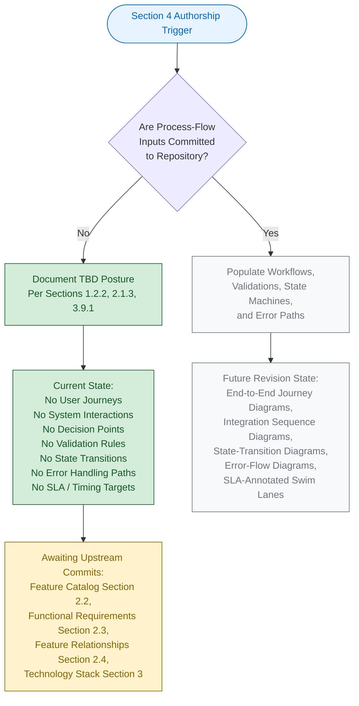

The green-shaded nodes represent the verifiable, present authorship path. The grey-shaded nodes represent the prospective path that will be taken in a future revision once the upstream process-flow inputs are added to the codebase. The yellow-shaded node identifies the pending upstream activity required to unlock those subsequent revisions. The colour grammar is identical to that used in Sections 1.2.2, 2.1.3, and 3.9.1 for consistency across the Specification.

### 4.5.2 High-Level System Workflow Status

A high-level system workflow diagram requires (at minimum) the identification of system actors, entry-point components, primary processing components, output components, and terminal states. None of these inputs exist in the repository: Section 1.2.2 confirms zero components, Section 2.1.2 confirms an empty System Capabilities Catalog, and Section 2.4 confirms zero inter-feature relationships. By Constraint C-001, no high-level workflow has been hypothesized.

| High-Level Workflow Element | Status |
|------------------------------|--------|
| Entry-Point Component | None defined — TBD |
| Primary Processing Components | None defined — TBD |
| Output / Sink Components | None defined — TBD |
| Cross-Component Sequencing | None defined — TBD |

### 4.5.3 Detailed Process Flows per Core Feature Status

Detailed process-flow diagrams are produced one per core feature. Because the Feature Catalog (Section 2.2) contains zero `F-XXX` entries, the set of detailed process flows is — by definition — empty. Constraint C-002 explicitly prohibits placeholder `F-XXX` identifiers being attached to fabricated flows.

| Detailed-Flow Prerequisite | Status |
|------------------------------|--------|
| At Least One `F-XXX` Feature Committed | No — TBD |
| Acceptance Criteria for the Feature | No — TBD |
| Decision Points Within the Feature | No — TBD |
| Persistence / External Interactions Within the Feature | No — TBD |

### 4.5.4 Error-Handling Flowchart Status

An error-handling flowchart depicts the detection, classification, response, notification, and resolution of error conditions across a system. As detailed in Section 4.4.2, none of these inputs exist in the repository.

| Error-Flowchart Element | Status |
|--------------------------|--------|
| Detection Points | None — TBD |
| Classification Taxonomy | None — TBD |
| Response Actions (retry, fallback, fail-fast) | None — TBD |
| Notification Channels | None — TBD |
| Resolution / Recovery Endpoints | None — TBD |

### 4.5.5 Integration Sequence Diagram Status

An integration sequence diagram requires two or more participants (system components or external services) and a documented protocol of messages between them. Section 1.2.1 records the absence of all integration topology. Section 2.4 records an empty feature-relationship map. Section 3.5 records the absence of every third-party-service category. By Constraint C-004, integration sequence diagrams remain explicitly empty.

| Sequence-Diagram Element | Status |
|--------------------------|--------|
| Participants | None — TBD |
| Message Protocol / Order | None — TBD |
| Activation Bars / Lifelines | None — TBD |
| Synchronous vs. Asynchronous Markers | None — TBD |
| Time / Latency Annotations | None — TBD |

### 4.5.6 State-Transition Diagram Status

A state-transition diagram requires an entity / aggregate with a defined state vocabulary, a set of permitted transitions, and the events that drive those transitions. As detailed in Section 4.4.1, none of these inputs exist in the repository.

| State-Diagram Element | Status |
|------------------------|--------|
| Entity / Aggregate Identity | None — TBD |
| Initial State | None — TBD |
| Intermediate States | None — TBD |
| Terminal / Final States | None — TBD |
| Transition Events and Guards | None — TBD |

---

## 4.6 SWIM LANES, TIMING, AND SLA CONSIDERATIONS

### 4.6.1 Swim-Lane / Actor Identification

Swim lanes partition a workflow by actor, system, or organizational unit. No actors, systems, or organizational units have been declared in the repository. Section 1.3.1 confirms that no user groups are documented; Section 1.2.2 confirms that no system components exist. Consequently no swim-lane decomposition can be performed.

| Swim-Lane Dimension | Status |
|----------------------|--------|
| User-Facing Lanes (personas, roles) | None — TBD |
| System Lanes (services, components) | None — TBD |
| External-Party Lanes (third parties, regulators) | None — TBD |
| Cross-Lane Hand-Offs | None — TBD |

### 4.6.2 Timing and SLA Considerations

Section 1.2.3 records that no measurable objectives, no critical success factors, no Key Performance Indicators, and no acceptance criteria are documented in the repository. Section 2.5.2 records performance and scalability requirements as TBD. Consequently no SLA / SLO / latency budget / throughput target can be annotated on any workflow.

| Timing / SLA Dimension | Status |
|-------------------------|--------|
| End-to-End Latency Budget | None declared — TBD |
| Per-Step Timing Constraint | None declared — TBD |
| Throughput / Concurrency Target | None declared — TBD |
| Availability SLO | None declared — TBD |
| Error-Budget Policy | None declared — TBD |

---

## 4.7 FUTURE SECTION REVISION TRIGGERS

A revision of Section 4 should be triggered when any of the following conditions occurs in the repository, in alignment with Assumption A-004 (Section 2.7.1) and consistent with the trigger pattern documented in Section 3.9.3. Each trigger maps to one or more diagram categories identified in Section 4.5.

| Trigger Event | Section 4 Diagram(s) Requiring Population |
|---------------|---------------------------------------------|
| First `F-XXX` feature catalog entry committed (Section 2.2) | High-Level System Workflow (4.5.2); Detailed Process Flows (4.5.3) |
| First `F-XXX-RQ-YYY` functional requirement committed (Section 2.3) | Decision Points (4.2.1); Business-Rule Validation (4.3.1) |
| First feature-relationship / integration-point committed (Section 2.4) | Integration Sequence Diagrams (4.5.5); Data-Flow Diagrams (4.2.2) |
| First third-party service integration committed (Section 3.5) | Integration Sequence Diagrams (4.5.5); API Interaction Flows (4.2.2) |
| First message broker / queue configuration committed (Section 3.5) | Event Processing Flows (4.2.2) |
| First schema / ORM model / persistence config committed (Section 3.6) | State-Transition Diagrams (4.5.6); Data Persistence Points (4.4.1); Transaction Boundaries (4.4.1) |
| First cache configuration committed (Section 3.6) | Caching Requirements (4.4.1) |
| First identity-provider / RBAC policy committed (Section 2.5.4; Section 3.5) | Authorization Checkpoints (4.3.3) |
| First regulatory-scope artifact committed (Section 2.3.3) | Regulatory Compliance Checks (4.3.4) |
| First error-handling library / middleware committed | Error-Handling Flowcharts (4.5.4); Retry Mechanisms (4.4.2) |
| First APM / alerting / logging integration committed (Section 3.5) | Error Notification Flows (4.4.2) |
| First backup / RPO-RTO / DR runbook committed (Section 3.6) | Recovery Procedures (4.4.2) |
| First batch-job / scheduler / DAG configuration committed (Section 3.7) | Batch Processing Sequences (4.2.2) |
| First SLA / SLO / KPI declaration committed (Section 1.2.3) | Timing and SLA Considerations (4.6.2) |

Until at least one of these triggers fires, Section 4 will continue to reflect the TBD posture documented herein, in compliance with Constraint C-001 and Assumption A-003.

### 4.7.1 Versioning Posture

Consistent with Section 2.7.3, all process-flow specifications in Section 4 carry a version status of `v0.0 — Not Yet Authored`. The Section authorship revision is `v1.0 (TBD Posture)`. The change log will begin with the first populated revision triggered by one of the events enumerated in Section 4.7.

| Versioning Element | Current State | Notes |
|--------------------|----------------|-------|
| Section 4 Authorship Revision | v1.0 (TBD Posture) | First authoring pass. |
| Individual Process-Flow Versions | v0.0 — Not Yet Authored | No process flows exist to version. |
| Change Log | Not yet initiated | Will begin with the first populated revision. |

---

## 4.8 RELATED PROCESS FLOWCHARTS AND CROSS-REFERENCES

### 4.8.1 Referenced Process-Flow Diagrams

| Referenced Diagram | Location | Relevance to Section 4 |
|---------------------|----------|---------------------------|
| Overall Project Lifecycle | Section 1.2.2 | Establishes the project's position at Repository Initialization and the prospective lifecycle stages whose contents drive Section 4 population. |
| Requirements Documentation Lifecycle | Section 2.1.3 | Depicts the gating condition under which the upstream Feature Catalog and Functional Requirements (prerequisites for Section 4 workflows) become available. |
| Stack-Adoption Lifecycle | Section 3.9.1 | Depicts the gating condition under which the technology stack (prerequisite for state-management and integration diagrams in Section 4) becomes available. |
| Process-Flowchart Authorship Lifecycle | Section 4.5.1 (this section) | Depicts the gating condition under which Section 4 transitions from TBD to populated. |

### 4.8.2 Linked Technical Specification Sections

| Linked Section | Linkage Purpose |
|----------------|-------------------|
| Section 1.1.1 — Project Overview | Authoritative project metadata and current lifecycle stage. |
| Section 1.2.1 — Project Context | TBD posture for integration topology. |
| Section 1.2.2 — High-Level Description | TBD posture for system capabilities, components, and technical approach. |
| Section 1.2.3 — Success Criteria | TBD posture for SLOs, KPIs, and acceptance criteria (4.6.2). |
| Section 1.3.1 — In-Scope Elements | TBD posture for user workflows, integrations, and data domains. |
| Section 1.3.2 — Out-of-Scope Elements | Explicit enumeration of capabilities not present in the current repository state. |
| Section 2.2 — Feature Catalog | Empty catalog; gates detailed process flows (4.5.3). |
| Section 2.3 — Functional Requirements | Empty requirements; gates business-rule validation (4.3.1) and decision points (4.2.1). |
| Section 2.4 — Feature Relationships | Empty integration-points map; gates integration sequence diagrams (4.5.5). |
| Section 2.5.4 — Security Controls | TBD authentication / authorization; gates authorization checkpoints (4.3.3). |
| Section 2.5.5 — Operational Tooling | TBD observability; gates error notification flows (4.4.2). |
| Section 2.7 — Assumptions, Constraints, and Versioning | Authoritative source of C-001 through C-004 and A-001 through A-004 governing this section. |
| Section 3.5 — Third-Party Services | TBD service integrations; gates API interactions (4.2.2) and event processing flows (4.2.2). |
| Section 3.6 — Databases and Storage | TBD persistence; gates state transitions (4.4.1), persistence points (4.4.1), caching (4.4.1), and transaction boundaries (4.4.1). |
| Section 3.7 — Development and Deployment | TBD CI/CD; gates batch processing sequences (4.2.2). |
| Section 3.9 — Technology Stack Lifecycle | Mirrors Section 4.5.1 visual grammar and revision-trigger model. |

---

## 4.9 REFERENCES

### 4.9.1 Files Examined

- `README.md` — The single tracked file in the repository (14 bytes, 1 line). Contains only the Markdown H1 heading `# April17Sec_1`. Verified absence of any workflow narrative, journey description, sequence diagram, state machine, validation rule, or process-flow source material; confirms the TBD posture across all Section 4 sub-areas.

### 4.9.2 Folders Explored

- Repository root (`/`) — Verified via folder-inventory inspection to contain only `README.md` and the `.git/` version-control metadata directory. No application subfolders exist; the hierarchy is fully exhausted at depth 0. The three-level folder-descent minimum is inapplicable to this repository because no nested directory structure exists; coverage is complete by virtue of exhaustion at depth 0.

### 4.9.3 Verification Activities

- Filesystem search for `.blitzyignore` files — None present; no exclusion list applies to repository analysis.
- Filesystem enumeration for hidden or nested application files — None present beyond `.git/` metadata (consistent with Section 1.5.4 findings).
- Semantic search for "application source code or configuration files" — Zero matching artifacts returned (per Section 1.5.4).
- Semantic search for "source code implementation modules" — Zero matching folders returned (per Section 1.5.4).
- Inspection for workflow-orchestration / BPMN / state-machine / sequence-diagram source files — None present.
- Inspection for behavior-specification files (Gherkin `.feature`, Cucumber, RSpec, JUnit) — None present.
- Inspection for middleware / interceptor / filter / error-handler source files — None present.
- Inspection for scheduler / cron / DAG / job-runner manifests — None present.

### 4.9.4 Technical Specification Sections Retrieved

- Section 1.1 — Executive Summary (project identifier, lifecycle stage, scaffold posture).
- Section 1.2 — System Overview (integration topology TBD, components TBD, capabilities TBD, KPIs TBD; project-lifecycle Mermaid pattern).
- Section 1.3 — Scope (in-scope and out-of-scope enumeration; explicit absence of software, integrations, UI, persistence, security, operations, build automation, and tests).
- Section 1.4 — Scope Declaration Summary (consolidated scope-posture table format).
- Section 1.5 — References (100% file and folder coverage; absence of `.blitzyignore`; verification-search results).
- Section 2.1 — Section Overview and Readiness Posture (requirements-documentation lifecycle Mermaid pattern; TBD scaffolding model).
- Section 2.2 — Feature Catalog (empty `F-XXX` set).
- Section 2.3 — Functional Requirements (empty requirements; TBD business rules, data validation, security and compliance).
- Section 2.4 — Feature Relationships (empty integration-points map).
- Section 2.5 — Implementation Considerations (TBD performance, scalability, security, operational tooling, maintenance).
- Section 2.6 — Traceability Matrix (empty matrix template).
- Section 2.7 — Assumptions, Constraints, and Versioning (authoritative source of C-001 through C-004 and A-001 through A-004 governing Section 4).
- Section 2.8 — Related Process Flowcharts and Cross-References (cross-reference pattern mirrored in Section 4.8).
- Section 2.9 — References (Section 2 coverage statement template).
- Section 3.1 — Section Overview and Readiness Posture (Section 3 TBD scaffolding model; readiness-table pattern).
- Section 3.2 — Programming Languages (verified absence across twelve language ecosystems).
- Section 3.3 — Frameworks and Libraries (verified absence of framework markers).
- Section 3.4 — Open Source Dependencies (verified absence of fourteen package-manager manifest types).
- Section 3.5 — Third-Party Services (verified absence of identity, payment, messaging, monitoring, queueing services).
- Section 3.6 — Databases and Storage (verified absence of schema artifacts, persistence strategy, caching, backup/recovery).
- Section 3.7 — Development and Deployment (verified absence of build scripts, CI/CD, containerization, IaC).
- Section 3.8 — Default Technology Stack Reference (documentation-framework defaults and their non-adoption per A-003).
- Section 3.9 — Technology Stack Lifecycle (stack-adoption lifecycle Mermaid pattern; revision-trigger model mirrored in Section 4.7).
- Section 3.10 — References (Section 3 coverage statement template).

### 4.9.5 Coverage Statement

- Files examined: 1 of 1 tracked files (100% coverage).
- Folders explored: 1 of 1 application folders (100% coverage; repository contains no subfolders).
- Three-level folder-descent minimum: Inapplicable; depth-0 exhaustion.
- Cross-reference coverage: All twenty-four predecessor Technical Specification sections listed in Section 4.8.2 were retrieved and reconciled against the present authorship.
- Search-ratio compliance: All searches were targeted retrievals of known section headings and direct filesystem inspections; no broad semantic searches were required because the existing Specification already explicitly documents the absence of all process-flow inputs.
- Constraint compliance: Authorship complies with C-001 (no invented flows), C-002 (no placeholder `F-XXX` identifiers), C-003 (consistent TBD posture), and C-004 (empty integration-points map preserved).
- Assumption compliance: Authorship complies with A-001 (initial-commit state is authoritative), A-002 (absence reflects lifecycle stage), A-003 (no external artifacts adopted), and A-004 (subsequent revisions to replace TBD markers).

# 5. System Architecture

## 5.1 SECTION OVERVIEW AND READINESS POSTURE

### 5.1.1 Purpose of This Section

This section is intended to define the system architecture of `April17Sec_1`, encompassing the following dimensions enumerated by the section prompt:

- High-level architectural style and rationale
- Core components, responsibilities, dependencies, and integration points
- Primary data flows, integration patterns, and protocols between components
- External integration points and their associated SLAs
- Per-component detail covering technologies, interfaces, persistence, and scaling
- Technical decisions across architecture style, communication patterns, data storage, caching, and security
- Cross-cutting concerns: monitoring and observability, logging and tracing, error handling, authentication and authorization, performance and SLAs, and disaster recovery

Per Section 1.2.2, *"No technology stack, framework selection, runtime target, programming language, persistence engine, deployment platform, or architectural pattern is declared in the repository."* Per Section 1.2.1, *"No integration points, external dependencies, third-party services, APIs, message brokers, data stores, identity providers, or enterprise systems are referenced in the repository."* Accordingly, Section 5 — like Sections 1 through 4 before it — adopts an evidence-based **TBD posture** across every architectural sub-area. No architectural component, integration, pattern, decision, or cross-cutting concern is invented or hypothesized. This authorship principle is invariant across the Specification.

### 5.1.2 Verifiable Readiness State

The table below consolidates the readiness state of every architectural dimension Section 5 is intended to address, cross-referenced to the upstream evidence that establishes the verifiable absence.

| Architectural Dimension | Readiness | Primary Cross-Reference |
|--------------------------|-----------|--------------------------|
| Overall Architectural Style | TBD | Section 1.2.2 |
| Core Component Inventory | TBD | Section 1.2.2 |
| Data Flow Topology | TBD | Section 1.2.1 |
| External Integrations | TBD | Section 3.5.2 |
| Component Technologies | TBD | Sections 3.2, 3.3 |
| Component Interfaces and APIs | TBD | Section 4.2.2 |
| Component Data Persistence | TBD | Section 3.6 |
| Component Scaling | TBD | Section 2.5.3 |
| Architecture-Style Decisions | TBD | Section 1.2.2 |
| Communication Patterns | TBD | Section 1.2.1 |
| Data Storage Strategy | TBD | Section 3.6 |
| Caching Strategy | TBD | Section 4.4.1 |
| Security Mechanisms | TBD | Section 2.5.4 |
| Monitoring and Observability | TBD | Section 3.5.3 |
| Logging and Tracing | TBD | Section 2.5.5 |
| Error Handling Patterns | TBD | Section 4.4.2 |
| Authentication and Authorization | TBD | Section 2.5.4 |
| Performance Requirements / SLAs | TBD | Section 4.6.2 |
| Disaster Recovery | TBD | Section 4.4.2 |

### 5.1.3 Authorship Constraints and Cross-References

Section 5 is authored under the same governance framework that applies to Sections 1 through 4. The most directly applicable elements of that framework are restated below for traceability.

| Identifier | Source | Applicability to Section 5 |
|------------|--------|------------------------------|
| A-001 | Section 2.7.1 | The repository's verifiable state as of the initial commit is the authoritative input for every architectural claim. |
| A-003 | Section 2.7.1 | External artifacts (including the documentation-framework defaults in Section 3.8.1) are not authoritative until committed to the codebase. |
| A-004 | Section 2.7.1 | Subsequent revisions will replace TBD markers with evidence-backed declarations once artifacts are committed. |
| C-001 | Section 2.7.2 | No architectural components, integrations, patterns, decisions, or cross-cutting concerns may be invented; all entries must be grounded in verifiable repository content. |
| C-003 | Section 2.7.2 | Cross-references to companion sections remain consistent with the TBD posture established in Section 1. |
| C-004 | Section 2.7.2 | Diagrams (component interaction, state transition, sequence, decision tree, error-flow) remain empty until upstream artifacts are populated. |

---

## 5.2 HIGH-LEVEL ARCHITECTURE

### 5.2.1 System Overview

#### Overall Architectural Style and Rationale

No architectural style — monolithic, modular monolith, microservices, service-oriented, event-driven, hexagonal, layered, pipe-and-filter, client-server, peer-to-peer, serverless, or any other recognized pattern — has been declared in the `April17Sec_1` repository. The verifiable evidence is consolidated in Section 1.2.2: no technology stack, framework, runtime target, programming language, persistence engine, deployment platform, or architectural pattern is declared. Section 2.5.1 records the Architectural Pattern constraint dimension as TBD. Accordingly, no rationale for an architectural style can be expressed at this time.

#### Key Architectural Principles and Patterns

No architectural principles (e.g., separation of concerns, single responsibility, loose coupling, high cohesion, domain-driven design, command-query responsibility segregation) and no design patterns have been articulated in the repository. There are no architecture documents, no design notes within `README.md` (which contains only the single heading `# April17Sec_1`), no architecture-as-code artifacts, no module boundaries, and no interface contracts present in the codebase from which principles or patterns could be inferred. This subsection is **TBD**.

#### System Boundaries and Major Interfaces

System boundaries are typically expressed through (a) component decomposition that distinguishes internal modules from external dependencies and (b) interface declarations that publish the protocols and contracts crossing those boundaries. Section 1.2.2 confirms zero application subfolders and zero source files across the surveyed language ecosystems. Section 4.2.2 records the absence of all API contracts (REST/OpenAPI, GraphQL, Protobuf/gRPC), event-flow specifications, batch-sequence definitions, and inter-component data flows. With no internal components and no external interfaces declared, the system possesses no defined boundary surface; this subsection is **TBD**.

### 5.2.2 Core Components Inventory

#### Verified Absence of Components

The Major System Components inventory from Section 1.2.2 verifies the absence of every component category. The summary is restated below for direct reference.

| Component Category | Present in Repository? |
|--------------------|------------------------|
| Application Source Modules | No |
| Front-End Assets (HTML/CSS) | No |
| Back-End Services | No |
| Database Schemas / Migrations | No |
| Infrastructure-as-Code Definitions | No |

#### Core Components Table

The section prompt requires a Core Components Table with columns for Component Name, Primary Responsibility, Key Dependencies, Integration Points, and Critical Considerations. Per Constraint C-001 (Section 2.7.2), no synthetic components may be introduced. The table below records the TBD posture of each required attribute.

| Component Attribute | Verifiable State |
|---------------------|-------------------|
| Component Name | None declared — TBD |
| Primary Responsibility | None declared — TBD |
| Key Dependencies | None declared — TBD |
| Integration Points | None declared — TBD |
| Critical Considerations | None declared — TBD |

### 5.2.3 Data Flow Description

#### Primary Data Flows Between Components

No primary data flows can be described because no components exist between which data could flow. Section 4.2.2 records that no inter-component data flows, no API interaction flows, no event-processing flows, and no batch-sequence flows have been authored. Section 1.2.1 confirms that no integration topology can be inferred from any configuration file, dependency manifest, or container definition (none of which exist). This subsection is **TBD**.

#### Integration Patterns and Protocols

No integration patterns (e.g., request/reply, publish/subscribe, message queues, event sourcing, CQRS, anti-corruption layer) and no transport protocols (HTTP, gRPC, WebSocket, AMQP, MQTT, Kafka protocol, JDBC, ODBC) have been declared. Section 3.5.2 records the verified absence of every external service category, and Section 3.3 records the absence of all framework markers. Without frameworks, dependencies, or service integrations, no protocol stack can be specified. Integration patterns and protocols are **TBD**.

#### Data Transformation Points

A data transformation point requires a defined source data shape, a defined target data shape, and a transformation rule connecting them. Section 4.2.2 records no data-flow specifications, and Section 3.6 records the absence of all schema artifacts and ORM models. Consequently no transformation point can be located. This subsection is **TBD**.

#### Key Data Stores and Caches

Section 3.6 confirms that every persistence dimension is TBD: no primary or secondary database engine, no in-memory cache (Redis, Memcached), no CDN/edge cache, no object/blob storage service, no schema artifacts, and no encryption-at-rest configuration is declared. Section 4.4.1 records every cache element as TBD: no cache layer or technology, no cache-population strategy, no cache-invalidation triggers, no TTL/refresh policy, and no cache-coherence design. Data stores and caches are therefore **TBD**.

### 5.2.4 External Integration Points

Section 3.5.2 enumerates ten major external-service categories that were searched for and verified absent from the repository. The integration-points map from Section 2.4.2 is similarly empty. The table below records the External Integration Points required by the section prompt, with all required attributes at TBD per Constraint C-001.

| Integration Attribute | Verifiable State |
|------------------------|-------------------|
| System Name | None declared — TBD |
| Integration Type (sync API, async event, batch, file transfer) | None declared — TBD |
| Protocol / Format (HTTP+JSON, gRPC+Protobuf, AMQP, etc.) | None declared — TBD |
| SLA Requirements | None declared — TBD |

For traceability, the verified-absent external-service categories from Section 3.5.2 include:

- Identity-Provider Integration (Auth0, Cognito, Okta, Azure AD, Firebase Auth)
- Payment Processor (Stripe, Braintree, PayPal)
- Email / Messaging Provider (SendGrid, Twilio, AWS SES)
- Cloud Storage Provider (AWS S3, GCS, Azure Blob)
- Analytics / Telemetry (Segment, Mixpanel, Amplitude)
- Application Performance Monitoring (Datadog, New Relic, AppDynamics, Sentry)
- Logging Aggregation (ELK, Splunk, Loggly, Logz.io)
- Feature Flag Service (LaunchDarkly, Split.io)
- Search Service (Algolia, Elasticsearch SaaS)
- Message Broker / Queue (Kafka, RabbitMQ, AWS SQS, NATS)

---

## 5.3 COMPONENT DETAILS

### 5.3.1 Component Inventory Status

The section prompt requires that each major component be specified with Purpose and Responsibilities, Technologies and Frameworks, Key Interfaces and APIs, Data Persistence Requirements, and Scaling Considerations. As established by Section 1.2.2 and restated in Section 5.2.2, zero components exist in the repository. Detailed specifications for non-existent components cannot be authored without violating Constraint C-001 (Section 2.7.2). This subsection is **TBD** until at least one component is committed to the codebase.

### 5.3.2 Component-Detail Dimensions

The table below records the TBD posture of each per-component dimension required by the section prompt, with the upstream cross-reference that establishes the verifiable absence.

| Component-Detail Dimension | Verifiable State | Primary Cross-Reference |
|------------------------------|-------------------|--------------------------|
| Purpose and Responsibilities | None declared — TBD | Section 1.2.2 |
| Technologies and Frameworks | None declared — TBD | Sections 3.2, 3.3 |
| Key Interfaces and APIs | None declared — TBD | Section 4.2.2 |
| Data Persistence Requirements | None declared — TBD | Section 3.6 |
| Scaling Considerations | None declared — TBD | Section 2.5.3 |

### 5.3.3 Required Component Diagrams Status

The section prompt requires detailed component interaction diagrams, state-transition diagrams, and sequence diagrams for key flows. Per Constraint C-004 (Section 2.7.2), diagrams remain empty until upstream artifacts are populated. Section 4.5 documents these same diagram categories as explicitly empty pending upstream activity. The table below records their status in Section 5.

| Required Diagram | Diagram Status | Cross-Reference |
|--------------------|----------------|------------------|
| Component Interaction Diagram | Explicitly empty — TBD | Section 4.5.5 |
| State Transition Diagram | Explicitly empty — TBD | Section 4.5.6 |
| Sequence Diagram for Key Flows | Explicitly empty — TBD | Section 4.5.5 |

Only the authorship lifecycle diagram (Section 5.6.1) is rendered in Section 5, consistent with the visual grammar established by Sections 1.2.2, 2.1.3, 3.9.1, and 4.5.1.

---

## 5.4 TECHNICAL DECISIONS

### 5.4.1 Architecture-Style Decision Status

No architecture-style decision has been recorded in the repository. There are no Architecture Decision Records (ADRs), no `docs/adr/` directory, no `decisions/` folder, no architecture diagrams, and no narrative within `README.md` that articulates an architectural choice or its tradeoffs. Section 1.2.2 confirms that no architectural pattern is declared. Without a declared style, the corresponding tradeoffs (e.g., monolithic deployment simplicity vs. microservice independence, synchronous coupling vs. asynchronous decoupling, eventual consistency vs. strong consistency) cannot be enumerated as documented choices. The architecture-style decision is **TBD**.

### 5.4.2 Communication Pattern Decision Status

No communication-pattern decision (synchronous vs. asynchronous, request/reply vs. publish/subscribe, blocking vs. non-blocking, direct vs. mediated) has been recorded. Section 1.2.1 confirms zero integration points, Section 3.5 confirms zero third-party-service integrations, and Section 4.2.2 confirms zero API contracts. With no communication endpoints declared, no communication pattern has been selected. This decision is **TBD**.

### 5.4.3 Data Storage Decision Status

No data-storage decision has been recorded. Section 3.6 confirms that every persistence dimension is TBD: relational vs. non-relational, single-store vs. polyglot persistence, OLTP vs. OLAP, transactional vs. eventually consistent, self-hosted vs. managed. No schema, migration, ORM model, or storage-client configuration is committed. The data-storage decision is **TBD**.

### 5.4.4 Caching Strategy Decision Status

No caching strategy has been declared. Per Section 4.4.1, every cache element is TBD: cache layer/technology, cache-population strategy (read-through, write-around, write-back), cache-invalidation triggers, TTL/refresh policy, and cache coherence across replicas. Section 3.6 confirms the absence of any in-memory cache (Redis, Memcached) and any CDN/edge cache. The caching strategy is **TBD**.

### 5.4.5 Security Mechanism Decision Status

No security mechanism has been selected. Section 2.5.4 confirms that authentication mechanisms, authorization policies, data-protection controls, and audit/logging provisions are all TBD. Section 3.5.3 confirms that no identity-provider selection, OAuth 2.0/OIDC configuration, SAML/federation configuration, token-issuance/validation library, or multi-factor authentication integration has been declared. The security-mechanism decision is **TBD**.

### 5.4.6 Default Technology Stack Reference (Non-Authoritative)

For traceability between the documentation framework's suggested defaults and the verified repository state, Section 3.8.1 enumerates a documentation-framework default stack. Per Section 3.8.3, *"This Section deliberately does not adopt the suggested defaults as the system's technology stack"* in compliance with Constraint C-001 (no invention), Assumption A-003 (external artifacts non-authoritative), and Assumption A-004 (defaults may be superseded). The default reference is restated below for completeness; its adoption status is uniformly No, as recorded in Section 3.8.2.

| Suggested Default Layer | Suggested Default Component | Adopted in Repository? |
|--------------------------|------------------------------|--------------------------|
| Cloud Platform | AWS | No |
| Containerization | Docker | No |
| Infrastructure as Code | Terraform | No |
| CI/CD | GitHub Actions | No |
| Backend Primary Language | Python | No |
| Backend Framework | Flask | No |
| Authentication | Auth0 | No |
| Database | MongoDB | No |
| AI Framework | LangChain | No |
| Web Frontend | React with TypeScript | No |
| CSS Framework | TailwindCSS | No |
| Mobile / Cross-Platform | React Native with TypeScript | No |
| Native iOS | Swift | No |
| Native Android | Kotlin | No |
| Native macOS | Objective-C | No |
| Desktop | ElectronJS | No |

These defaults remain candidate references only; they do not constitute architectural decisions for `April17Sec_1` until and unless they are committed to the codebase. Section 5 explicitly rejects the use of any of these defaults as a basis for architectural claims, in the same posture adopted by Section 3.8.3.

### 5.4.7 Architecture Decision Records (ADRs)

ADRs are short, immutable records of architecturally significant decisions, typically following the Michael Nygard format (Context, Decision, Consequences). No ADRs exist in the repository — there is no `adr/`, `decisions/`, or `architecture/` directory; no Markdown file declares the standard ADR sections; and `README.md` does not contain a decision narrative.

| ADR Component | Verifiable State |
|----------------|-------------------|
| ADR Identifier (e.g., `ADR-0001`) | None declared — TBD |
| Title / Subject | None declared — TBD |
| Status (Proposed / Accepted / Superseded) | None declared — TBD |
| Context, Decision, Consequences Narrative | None declared — TBD |

The decision-tree diagram requested by the section prompt would map architectural choice points to candidate options and their tradeoffs. With no choice points enumerated in the repository, the decision tree is explicitly empty per Constraint C-004. Only the authorship lifecycle diagram in Section 5.6.1 is included to depict the gating activity that must precede ADR population.

---

## 5.5 CROSS-CUTTING CONCERNS

### 5.5.1 Monitoring and Observability Approach

Per Section 3.5.3, every observability concern is TBD. The table below restates this verified posture for direct reference in Section 5.

| Observability Concern | Declared in Repository? |
|------------------------|--------------------------|
| Metrics Collection (Prometheus, CloudWatch) | No — TBD |
| Distributed Tracing (OpenTelemetry, Jaeger) | No — TBD |
| Log Aggregation Backend | No — TBD |
| Alerting / On-Call (PagerDuty, Opsgenie) | No — TBD |
| Error-Reporting (Sentry, Rollbar) | No — TBD |
| Uptime / Synthetic Monitoring | No — TBD |

Section 1.2.3 additionally confirms there is no telemetry configuration, no analytics instrumentation, no monitoring manifest, and no documented metric definitions. Section 2.5.5 confirms maintenance and observability requirements as TBD.

### 5.5.2 Logging and Tracing Strategy

No logging strategy (log format, log-level taxonomy, structured vs. unstructured logs, log sampling, log retention) and no distributed-tracing strategy (trace-context propagation, sampling rates, span attributes, baggage) have been declared. Section 1.2.3 records no telemetry configuration, no analytics instrumentation, and no monitoring manifest. Section 3.5.3 records distributed tracing and log-aggregation backend as TBD. The logging and tracing strategy is therefore **TBD**.

| Logging / Tracing Dimension | Verifiable State |
|------------------------------|-------------------|
| Log Format and Schema | None declared — TBD |
| Log-Level Taxonomy | None declared — TBD |
| Log Retention and Sampling | None declared — TBD |
| Trace-Context Propagation | None declared — TBD |
| Trace Sampling and Span Attributes | None declared — TBD |

### 5.5.3 Error Handling Patterns

Section 4.4.2 establishes the verified absence of every error-handling element. Per Section 4.4.2, retry mechanisms cannot be authored because no service integrations exist against which retries would execute; fallback processes cannot be authored because no degraded-mode pathways exist; and error-notification flows cannot be authored because no APM, logging-aggregation, alerting, or error-reporting service has been integrated. The table below restates this for direct reference.

| Error-Handling Element | Verifiable State |
|--------------------------|-------------------|
| Retry Triggering Condition | None — TBD |
| Backoff Strategy (linear, exponential, jittered) | None — TBD |
| Max-Attempt Budget | None — TBD |
| Idempotency Key Strategy | None — TBD |
| Circuit-Breaker Thresholds | None — TBD |
| Degraded-Mode Surface Area | None — TBD |
| Default / Cached Response Source | None — TBD |
| Feature-Flag-Driven Disablement | None — TBD |
| Notification Channels | None — TBD |
| Severity-Classification Taxonomy | None — TBD |
| Escalation Ladder / On-Call Rota | None — TBD |
| Notification Suppression / Dedup Policy | None — TBD |

### 5.5.4 Authentication and Authorization Framework

Per Section 2.5.4, the current repository state explicitly excludes all authentication, authorization, and security controls (no security artifacts exist). There are no security-related configuration files, no secret-management directives, no identity-provider integrations, and no access-control policies in the codebase. Per Section 3.5.3, no identity-provider selection, OAuth 2.0/OIDC client configuration, SAML/federation configuration, token issuance/validation library, or multi-factor authentication integration has been declared. The authentication-and-authorization framework is therefore **TBD**.

| Security Concern | Declared in Repository? |
|------------------|--------------------------|
| Authentication Mechanisms | No — TBD |
| Authorization Policies | No — TBD |
| Data-Protection Controls | No — TBD |
| Audit & Logging Provisions | No — TBD |
| Identity-Provider Selection | No — TBD |
| OAuth 2.0 / OIDC Client Configuration | No — TBD |
| SAML / Federation Configuration | No — TBD |
| Token Issuance / Validation Library | No — TBD |
| Multi-Factor Authentication Integration | No — TBD |

### 5.5.5 Performance Requirements and SLAs

Per Section 4.6.2, every timing and SLA dimension is TBD. Section 1.2.3 records no OKRs, no SLOs, no quantitative targets, and no KPIs. Section 2.5.2 records performance requirements as TBD, and Section 2.5.3 records scalability considerations as TBD. The table below restates the verified posture for direct reference.

| Timing / SLA Dimension | Verifiable State |
|--------------------------|-------------------|
| End-to-End Latency Budget | None declared — TBD |
| Per-Step Timing Constraint | None declared — TBD |
| Throughput / Concurrency Target | None declared — TBD |
| Availability SLO | None declared — TBD |
| Error-Budget Policy | None declared — TBD |

### 5.5.6 Disaster Recovery Procedures

Per Section 4.4.2, every recovery element is TBD. Section 3.6 confirms the TBD state of Backup and Restore Strategy and Disaster Recovery / RPO-RTO Targets. The table below restates the verified posture.

| Recovery Element | Verifiable State |
|-------------------|-------------------|
| RPO / RTO Targets | None — TBD |
| Backup / Snapshot Cadence | None — TBD |
| Restore Verification Procedure | None — TBD |
| Cross-Region / Cross-AZ Failover Plan | None — TBD |
| Post-Incident Review Process | None — TBD |

### 5.5.7 Error Handling Flow Diagram Status

The section prompt requires an error-handling flow diagram. Per Section 4.5.4, every element of such a diagram (detection points, classification taxonomy, response actions, notification channels, resolution/recovery endpoints) is TBD. By Constraint C-004, the prospective error-handling flow diagram remains explicitly empty. The authorship lifecycle diagram in Section 5.6.1 depicts the gating activity that must precede its eventual population.

| Error-Flow Element | Verifiable State |
|---------------------|-------------------|
| Detection Points | None — TBD |
| Classification Taxonomy | None — TBD |
| Response Actions (retry, fallback, fail-fast) | None — TBD |
| Notification Channels | None — TBD |
| Resolution / Recovery Endpoints | None — TBD |

---

## 5.6 ARCHITECTURE AUTHORSHIP LIFECYCLE

### 5.6.1 Lifecycle Diagram

The diagram below depicts the relationship between the current repository state and the prospective architecture-definition activities that must precede a populated Section 5 rewrite. It complements the project-lifecycle diagram in Section 1.2.2, the requirements-engineering lifecycle in Section 2.1.3, the stack-adoption lifecycle in Section 3.9.1, and the process-flow lifecycle in Section 4.5.1 by focusing specifically on the system-architecture workstream. The colour grammar is identical to that used in those companion diagrams for consistency across the Specification.

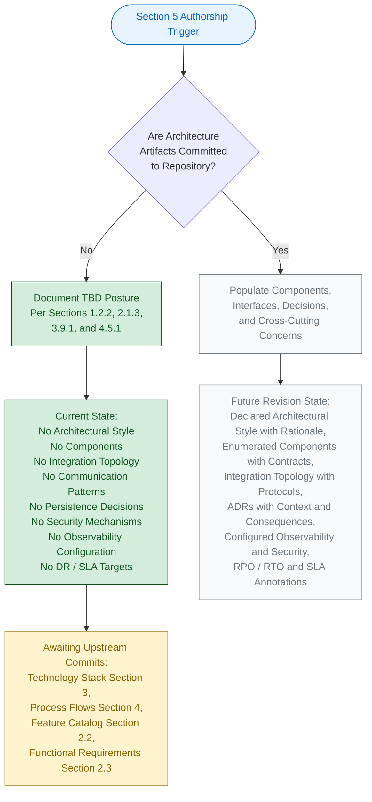

The green-shaded nodes represent the verifiable, present authorship path. The grey-shaded nodes represent the prospective path that will be taken in a future revision once architecture artifacts are added to the codebase. The yellow-shaded node identifies the pending upstream activity required to unlock those subsequent revisions. The blue-shaded node marks the Section authorship entry point.

### 5.6.2 Architecture Declaration Prerequisites

For Section 5 to be rewritten with evidence-backed declarations, the following prerequisites must be satisfied by future commits to the repository.

| Prerequisite | Required Artifact(s) | Section 5 Impact |
|--------------|------------------------|---------------------|
| Architectural style and module decomposition | Architecture document, ADR(s), or module-level directory structure with declared interfaces | 5.2.1, 5.2.2 |
| Component definitions | Source files implementing component logic; module manifest or service descriptor | 5.2.2, 5.3 |
| Inter-component data flows | Interface contracts (REST/OpenAPI, gRPC/Protobuf, GraphQL schema, AMQP exchange/queue config) | 5.2.3 |
| External integration declarations | Service SDK references, endpoint configuration, secrets-management directives | 5.2.4 |
| Architecture Decision Records | `docs/adr/` directory or equivalent with ADR Markdown files | 5.4.7 |
| Observability configuration | Metrics, tracing, logging, alerting, error-reporting configuration committed | 5.5.1, 5.5.2 |
| Error-handling, retry, and DR runbooks | Retry library config, circuit-breaker thresholds, RPO/RTO targets, backup runbooks | 5.5.3, 5.5.6 |
| Authentication / authorization framework | Identity-provider configuration, OAuth/OIDC settings, RBAC/ABAC policy files | 5.5.4 |
| SLA / SLO declaration | SLA documents, SLO definitions, error-budget policy committed | 5.5.5 |

---

## 5.7 FUTURE SECTION REVISION TRIGGERS

### 5.7.1 Trigger Events

A revision of Section 5 should be triggered when any of the following conditions occurs in the repository, in alignment with Assumption A-004 (Section 2.7.1) and consistent with the trigger patterns documented in Sections 3.9.3 and 4.7.

| Trigger Event | Section 5 Subsection(s) Requiring Update |
|---------------|--------------------------------------------|
| First architecture document or ADR committed | 5.2.1, 5.4.1, 5.4.7 |
| First source-code module structure committed (Section 3.2) | 5.2.2, 5.3 |
| First interface contract committed (REST/OpenAPI, gRPC/Protobuf, GraphQL) | 5.2.3, 5.3 |
| First third-party service integration committed (Section 3.5) | 5.2.4, 5.4.2 |
| First schema / ORM model / persistence config committed (Section 3.6) | 5.4.3, 5.5.6 |
| First cache configuration committed (Section 3.6) | 5.4.4 |
| First authentication / authorization artifact committed (Section 2.5.4; Section 3.5) | 5.4.5, 5.5.4 |
| First APM / logging / alerting / error-reporting integration committed (Section 3.5) | 5.5.1, 5.5.2, 5.5.3 |
| First retry / circuit-breaker / fallback configuration committed | 5.5.3, 5.5.7 |
| First backup / RPO-RTO / DR runbook committed (Section 3.6) | 5.5.6 |
| First SLA / SLO / error-budget declaration committed (Section 1.2.3) | 5.5.5 |
| First scaling configuration committed (e.g., HPA, autoscaling, load-balancer config) | 5.3.2 |

Until at least one of these triggers fires, Section 5 will continue to reflect the TBD posture documented herein, in compliance with Constraint C-001 and Assumption A-003.

### 5.7.2 Versioning Posture

Consistent with Sections 2.7.3, 3.9.3, and 4.7.1, all architectural specifications in Section 5 carry a version status of `v0.0 — Not Yet Authored`. The Section authorship revision is `v1.0 (TBD Posture)`. The change log will begin with the first populated revision triggered by one of the events enumerated in Section 5.7.1.

| Versioning Element | Current State | Notes |
|--------------------|----------------|-------|
| Section 5 Authorship Revision | v1.0 (TBD Posture) | First authoring pass. |
| Individual Architecture-Element Versions | v0.0 — Not Yet Authored | No architectural elements exist to version. |
| Change Log | Not yet initiated | Will begin with the first populated revision. |

---

## 5.8 References

#### Files Examined

- `README.md` — The single tracked file in the repository (14 bytes, 1 line containing only `# April17Sec_1`). Confirmed to contain zero architectural content, zero component declarations, zero integration references, and zero decision narratives. Authoritative input for the TBD posture across all of Section 5.

#### Folders Explored

- Repository root (`""`) — Confirmed via prior section verifications to contain only `README.md` and `.git/` metadata; no application subfolders exist. Per Section 1.5.5, the three-level descent minimum is inapplicable because no nested structure exists.

#### Technical Specification Sections Cross-Referenced

- **Section 1.2 SYSTEM OVERVIEW** — Foundational statements: no technology stack, no integration points, no components; project lifecycle diagram and visual grammar
- **Section 1.3 SCOPE** — Out-of-scope enumeration covering software functionality, integrations, persistence, security, operational tooling
- **Section 2.4 FEATURE RELATIONSHIPS** — Empty integration-points map; shared components TBD
- **Section 2.5 IMPLEMENTATION CONSIDERATIONS** — Technical constraints, performance, scalability, security, and maintenance posture (all TBD)
- **Section 2.7 ASSUMPTIONS, CONSTRAINTS, AND VERSIONING** — Governing assumptions A-001 through A-004 and constraints C-001 through C-004
- **Section 3.5 THIRD-PARTY SERVICES** — Verified absence across ten external-service categories; authentication, monitoring, and cloud services posture
- **Section 3.6 DATABASES AND STORAGE** — Verified absence of all persistence dimensions (referenced via 4.4.1 and 5.2.3)
- **Section 3.8 DEFAULT TECHNOLOGY STACK REFERENCE** — Documentation-framework default stack and its non-adoption
- **Section 3.9 TECHNOLOGY STACK LIFECYCLE** — Stack-adoption lifecycle diagram and revision triggers; visual grammar
- **Section 4.2 SYSTEM WORKFLOWS** — Verified absence of all workflow, data-flow, API-interaction, event-flow, and batch-sequence specifications
- **Section 4.4 TECHNICAL IMPLEMENTATION** — State management, persistence, caching, transactions, retries, fallbacks, notifications, recovery posture
- **Section 4.5 REQUIRED DIAGRAMS** — Process-flowchart authorship lifecycle; status of high-level workflow, detailed flows, error flows, sequence diagrams, and state diagrams
- **Section 4.6 SWIM LANES, TIMING, AND SLA CONSIDERATIONS** — Verified absence of actor decomposition, latency budgets, SLOs, error budgets
- **Section 4.7 FUTURE SECTION REVISION TRIGGERS** — Trigger pattern model used by Section 5.7.1

# 6. SYSTEM COMPONENTS DESIGN

## 6.1 Core Services Architecture

### 6.1.1 Applicability Declaration

**Core Services Architecture is not applicable for this system.**

The `April17Sec_1` repository is at the Repository Initialization (Scaffold) lifecycle stage as established in Section 1.1 and Section 1.2.2. The repository contains exactly one tracked file (`README.md`, 14 bytes) whose entire content is the single Markdown heading `# April17Sec_1`. No source code, dependency manifests, container definitions, infrastructure-as-code artifacts, configuration files, schema definitions, API contracts, or service descriptors exist anywhere in the codebase. There are, consequently, **no services of any kind — microservices, modular monolith, monolithic, serverless functions, or otherwise — to architect**.

This posture is the unambiguous and required response per the Section 6.1 prompt's explicit instruction: *"If the system does not require microservices, distributed architecture, or distinct service components, clearly state 'Core Services Architecture is not applicable for this system' and explain why."*

#### 6.1.1.1 Categorical Justification

The non-applicability of Core Services Architecture is grounded in three independently sufficient categorical reasons, each derived from verifiable repository evidence and from upstream sections of this Specification.

| # | Categorical Reason | Authoritative Cross-Reference |
|---|----------------------|-------------------------------|
| (a) | No services or service-implementing source code exist | Section 1.2.2 (Major System Components); Section 5.2.2 (Core Components Inventory) |
| (b) | No distributed or service-oriented architectural style has been declared | Section 5.2.1 (Overall Architectural Style and Rationale) |
| (c) | No service-level cross-cutting concerns (resilience, observability, scalability) are configured | Section 4.4 (Technical Implementation); Section 5.5 (Cross-Cutting Concerns) |

**Reason (a) — No services exist.** Section 5.2.2 verifies the absence of every component category: Application Source Modules, Front-End Assets, Back-End Services, Database Schemas / Migrations, and Infrastructure-as-Code Definitions. The Section 5.2.2 Core Components Table records every required component attribute (Component Name, Primary Responsibility, Key Dependencies, Integration Points, Critical Considerations) as `None declared — TBD`.

**Reason (b) — No architectural style has been declared.** Section 5.2.1 states that no architectural style — *monolithic, modular monolith, microservices, service-oriented, event-driven, hexagonal, layered, pipe-and-filter, client-server, peer-to-peer, serverless, or any other recognized pattern* — has been declared in the repository. Without a declared architectural style, the question of "services" as a decomposition unit is not yet meaningful.

**Reason (c) — No service-level cross-cutting concerns exist.** Section 4.4.2 verifies that no retry mechanisms, no fallback processes, no error-notification flows, and no recovery procedures have been declared. Section 5.5.3 confirms that retry, fallback, and notification flows cannot be authored because no service integrations exist against which they would execute. Section 5.5.5 confirms that no performance SLAs, throughput targets, or availability SLOs are declared. Section 5.5.6 confirms that no RPO/RTO targets, no backup cadence, no restore procedures, and no failover plans are declared.

#### 6.1.1.2 Governance Basis for the Non-Applicability Declaration

Authorship of this section is governed by the constraints recorded in Section 2.7.2. The constraints listed below directly justify the non-applicability declaration and the format used to document it.

| Constraint ID | Constraint Statement | Applicability to Section 6.1 |
|---------------|------------------------|-------------------------------|
| C-001 | No features, requirements, or relationships may be invented; all entries must be grounded in verifiable repository content | Forbids fabrication of service boundaries, communication patterns, scaling policies, or resilience configurations |
| C-003 | Cross-references to companion sections must remain consistent with the TBD posture established in Section 1 | Mandates that Section 6.1 mirror the TBD posture declared in Sections 1, 2, 3, 4, and 5 |
| C-004 | Diagrams (component interaction, state transition, sequence, decision tree, error-flow) remain empty until upstream artifacts are populated | Forbids producing service-interaction, scalability-architecture, or resilience-pattern diagrams |

Assumption A-001 (Section 2.7.1) further establishes that the repository's verifiable state as of the initial commit is the authoritative input for every architectural claim, while Assumption A-004 confirms that subsequent revisions of this Specification will replace TBD markers with evidence-backed declarations once corresponding artifacts are committed.

---

### 6.1.2 Service Components — Verified Absence

This subsection records, dimension by dimension, the verified absence of every Service Components attribute required by the Section 6.1 prompt. Each row pairs a prompt-required dimension with its authoritative upstream cross-reference in this Specification.

#### 6.1.2.1 Service Boundary, Discovery, and Communication Dimensions

A service boundary is meaningful only when at least one service has been declared with a contract, an owner, and a deployment unit. Section 5.2.1 confirms that no such declarations exist; Section 5.2.3 confirms that no integration patterns or transport protocols have been declared; and Section 4.2.2 records the absence of all API contracts (REST/OpenAPI, GraphQL, Protobuf/gRPC), event-flow specifications, batch-sequence definitions, and inter-component data flows.

| Service-Component Dimension | Verifiable State | Authoritative Cross-Reference |
|------------------------------|-------------------|-------------------------------|
| Service Boundaries and Responsibilities | None declared — TBD | Section 5.2.2; Section 5.3.2 |
| Inter-Service Communication Pattern | None declared — TBD | Section 5.2.3 |
| Transport Protocol (HTTP, gRPC, AMQP, etc.) | None declared — TBD | Section 5.2.3 |
| Service Discovery Mechanism | None declared — TBD | Section 5.2.3; Section 5.2.4 |
| Load Balancing Strategy | None declared — TBD | Section 5.3.2; Section 5.7.1 |

#### 6.1.2.2 Resilience-Pattern Dimensions at the Service Boundary

The resilience patterns that operate at service boundaries — circuit breakers, retries, and fallback handlers — require an underlying service-integration topology. As Section 4.4.2 records, *no retry mechanisms can be documented because no service integrations exist against which retries would execute*, and *no fallback processes can be documented because no degraded-mode pathways, no static cached responses, no read-replica failover policies, and no graceful-degradation configurations exist*.

| Service-Resilience Dimension | Verifiable State | Authoritative Cross-Reference |
|-------------------------------|-------------------|-------------------------------|
| Circuit-Breaker Open/Half-Open/Closed Thresholds | None — TBD | Section 4.4.2; Section 5.5.3 |
| Retry Triggering Condition and Backoff Strategy | None — TBD | Section 4.4.2; Section 5.5.3 |
| Max-Attempt Budget / Idempotency-Key Strategy | None — TBD | Section 4.4.2 |
| Fallback / Default-Response Source | None — TBD | Section 4.4.2; Section 5.5.3 |
| Feature-Flag-Driven Disablement of Degraded Surfaces | None — TBD | Section 4.4.2 |

#### 6.1.2.3 Verified-Absent External Service Categories

For completeness and traceability, the ten major external service categories enumerated in Section 5.2.4 and Section 3.5.2 are reproduced below. Each has been searched for and verified absent from the repository. The absence of every category in this list independently confirms that no inter-service communication patterns, service-discovery mechanisms, or circuit-breaker thresholds can be authored against any external dependency.

| External Service Category | Present in Repository? |
|----------------------------|--------------------------|
| Identity-Provider Integration (Auth0, Cognito, Okta) | No |
| Payment Processor (Stripe, Braintree, PayPal) | No |
| Email / Messaging Provider (SendGrid, Twilio, SES) | No |
| Cloud Storage Provider (S3, GCS, Azure Blob) | No |
| Analytics / Telemetry (Segment, Mixpanel, Amplitude) | No |
| Application Performance Monitoring (Datadog, Sentry) | No |
| Logging Aggregation (ELK, Splunk, Logz.io) | No |
| Feature Flag Service (LaunchDarkly, Split.io) | No |
| Search Service (Algolia, Elasticsearch SaaS) | No |
| Message Broker / Queue (Kafka, RabbitMQ, SQS, NATS) | No |

---

### 6.1.3 Scalability Design — Verified Absence

A scalability design requires (a) at least one deployable workload to scale, (b) a runtime platform on which scaling primitives are available, and (c) declared scaling triggers and resource budgets. None of these prerequisites exists in the repository.

#### 6.1.3.1 Scaling-Approach and Auto-Scaling Dimensions

Section 5.3.2 records every component-detail dimension, including Scaling Considerations, as `None declared — TBD`. Section 1.2.2 verifies zero Infrastructure-as-Code Definitions in the repository, and Section 5.7.1 confirms that *First scaling configuration committed (e.g., HPA, autoscaling, load-balancer config)* is itself a future trigger event for this Specification.

| Scalability Dimension | Verifiable State | Authoritative Cross-Reference |
|------------------------|-------------------|-------------------------------|
| Horizontal Scaling Approach (replicas, sharding) | None declared — TBD | Section 5.3.2; Section 5.7.1 |
| Vertical Scaling Approach (instance sizing) | None declared — TBD | Section 5.3.2 |
| Auto-Scaling Triggers (CPU, memory, RPS, queue depth) | None declared — TBD | Section 5.7.1 |
| Auto-Scaling Rules (min/max replicas, cooldown) | None declared — TBD | Section 5.7.1 |

#### 6.1.3.2 Resource-Allocation and Performance-Optimization Dimensions

Resource allocation requires a declared runtime target (container, VM, function, or process supervisor) and at least one workload with a known resource profile. Section 1.2.2 confirms that no runtime target is declared; Section 5.5.5 confirms that all performance requirements and SLAs are TBD; and Section 4.4.1 confirms that no caching layer has been declared, eliminating one of the standard performance-optimization techniques (read-through, write-around, write-behind caches) from current applicability.

| Optimization / Allocation Dimension | Verifiable State | Authoritative Cross-Reference |
|-------------------------------------|-------------------|-------------------------------|
| Resource Quotas (CPU/memory requests and limits) | None declared — TBD | Section 5.3.2 |
| Cache Layer / Cache Population Strategy | None declared — TBD | Section 4.4.1; Section 5.2.3 |
| Performance Tuning Parameters (timeouts, pools) | None declared — TBD | Section 5.5.5 |
| Capacity Planning Workload Profile | None declared — TBD | Section 5.5.5 |

---

### 6.1.4 Resilience Patterns — Verified Absence

Resilience patterns include fault-tolerance mechanisms, disaster-recovery procedures, data-redundancy approaches, failover configurations, and service-degradation policies. Each pattern requires a verifiable substrate (a service, a persistence layer, a runtime platform, or a network topology) to operate against. As established in Sections 4.4.2, 5.5.3, and 5.5.6, no such substrate exists.

#### 6.1.4.1 Fault-Tolerance and Disaster-Recovery Dimensions

Section 4.4.2 states explicitly that *no recovery procedures can be documented because no Recovery Point Objective (RPO) targets, no Recovery Time Objective (RTO) targets, no backup-restore runbooks, no disaster-recovery playbooks, and no chaos-engineering harnesses have been declared*. Section 5.5.6 mirrors this for the Cross-Cutting Concerns view.

| Fault-Tolerance / DR Dimension | Verifiable State | Authoritative Cross-Reference |
|---------------------------------|-------------------|-------------------------------|
| Fault-Tolerance Mechanism (bulkhead, timeout, retry) | None — TBD | Section 4.4.2; Section 5.5.3 |
| Recovery Point Objective (RPO) Target | None — TBD | Section 4.4.2; Section 5.5.6 |
| Recovery Time Objective (RTO) Target | None — TBD | Section 4.4.2; Section 5.5.6 |
| Disaster-Recovery Playbook / Runbook | None — TBD | Section 5.5.6 |
| Chaos-Engineering Harness | None — TBD | Section 4.4.2 |

#### 6.1.4.2 Data-Redundancy and Failover Dimensions

Data redundancy and failover require a declared persistence layer. Section 5.2.3 confirms that no primary or secondary database engine, no in-memory cache, no CDN/edge cache, and no object/blob storage service has been declared. The Backup and Restore Strategy, Disaster Recovery / RPO-RTO Targets, and Cross-Region / Cross-AZ Failover Plan all reside in the verified-TBD set.

| Redundancy / Failover Dimension | Verifiable State | Authoritative Cross-Reference |
|----------------------------------|-------------------|-------------------------------|
| Primary / Replica Database Topology | None — TBD | Section 5.2.3 |
| Backup / Snapshot Cadence | None — TBD | Section 4.4.2; Section 5.5.6 |
| Restore Verification Procedure | None — TBD | Section 5.5.6 |
| Cross-Region / Cross-AZ Failover Plan | None — TBD | Section 4.4.2; Section 5.5.6 |
| Post-Incident Review Process | None — TBD | Section 5.5.6 |

#### 6.1.4.3 Service-Degradation Dimensions

Service degradation policies require a defined "happy path" surface against which a "degraded path" can be contrasted. As Section 4.4.2 records, no degraded-mode pathways, no static cached responses, no feature-flag-driven disablement, and no user-communication-on-degradation flows exist. Section 5.5.3 restates this for the Cross-Cutting Concerns view.

| Degradation-Policy Dimension | Verifiable State | Authoritative Cross-Reference |
|-------------------------------|-------------------|-------------------------------|
| Degraded-Mode Surface Area | None — TBD | Section 4.4.2; Section 5.5.3 |
| Default / Cached Response Source | None — TBD | Section 4.4.2 |
| Feature-Flag-Driven Disablement | None — TBD | Section 4.4.2 |
| User Communication on Degradation | None — TBD | Section 4.4.2 |

---

### 6.1.5 Authorship Lifecycle Diagram

Per Constraint C-004 (Section 2.7.2) and consistent with the visual grammar established in Sections 1.2.2, 2.1.3, 3.9.1, 4.5.1, and 5.6.1, the only diagram appropriate for the current TBD posture of Section 6.1 is an authorship-lifecycle diagram. This diagram depicts the gating activity that must precede a populated rewrite of this section and uses the colour grammar adopted throughout this Specification.

#### 6.1.5.1 Section 6.1 Authorship Lifecycle

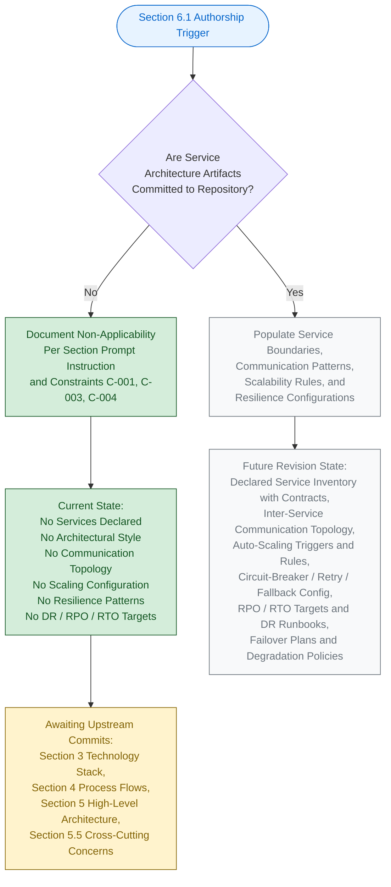

#### 6.1.5.2 Visual-Grammar Conformance

The diagram in Section 6.1.5.1 conforms to the colour grammar established by this Specification:

| Colour | Hex (Fill / Stroke) | Semantic Meaning |
|--------|----------------------|-------------------|
| Blue | `#e7f3ff` / `#0066cc` | Section authorship entry point |
| Green | `#d4edda` / `#155724` | Verifiable, present state |
| Grey | `#f8f9fa` / `#6c757d` | Prospective future state |
| Yellow | `#fff3cd` / `#856404` | Pending upstream activity |

The green-shaded nodes represent the verifiable, present authorship path; the grey-shaded nodes represent the prospective path that will be taken in a future revision once service architecture artifacts are added to the codebase; the yellow-shaded node identifies the pending upstream activities required to unlock those subsequent revisions; and the blue-shaded node marks the Section authorship entry point.

---

### 6.1.6 Required Diagrams Status

The Section 6.1 prompt requests three architectural diagrams: Service Interaction Diagrams, Scalability Architecture, and Resilience Pattern Implementations. Per Constraint C-004 (Section 2.7.2), each of these diagrams remains explicitly empty until upstream architectural artifacts are committed.

#### 6.1.6.1 Diagram-Exclusion Justification

Producing any of the prompt-required architectural diagrams in the absence of underlying service declarations, communication topology, scaling configurations, or resilience patterns would violate Constraint C-001 (no invention) and Constraint C-004 (diagrams remain empty until upstream artifacts are populated). Section 5.3.3 establishes the identical posture for Component Interaction, State Transition, and Sequence diagrams; Section 5.5.7 establishes the identical posture for Error-Handling Flow diagrams.

| Required Diagram (per Section 6.1 prompt) | Diagram Status | Governance Basis |
|--------------------------------------------|----------------|------------------|
| Service Interaction Diagram | Explicitly empty — TBD | Constraint C-001, C-004 |
| Scalability Architecture Diagram | Explicitly empty — TBD | Constraint C-001, C-004 |
| Resilience Pattern Implementation Diagram | Explicitly empty — TBD | Constraint C-001, C-004 |

#### 6.1.6.2 Diagram-Population Prerequisites

Each prompt-required diagram has a specific set of upstream artifacts that must be committed before it can be populated. The table below records these prerequisites for traceability with Section 5.7.1.

| Diagram | Required Upstream Artifact(s) |
|---------|--------------------------------|
| Service Interaction | Service descriptors, interface contracts (REST/OpenAPI, gRPC/Protobuf, GraphQL), event-flow specifications |
| Scalability Architecture | Container/orchestration definitions, HPA/autoscaler configuration, load-balancer configuration |
| Resilience Pattern Implementation | Retry library configuration, circuit-breaker thresholds, fallback handlers, DR runbooks |

---

### 6.1.7 Future Revision Triggers

Consistent with Section 5.7.1 and Assumption A-004 (Section 2.7.1), a revision of Section 6.1 will be triggered when any of the events below occurs in the repository. Each trigger maps to the specific Section 6.1 subsections that will become authorable once the corresponding upstream artifact is committed.

#### 6.1.7.1 Trigger-to-Subsection Mapping

| Trigger Event | Section 6.1 Subsection(s) Unblocked |
|---------------|---------------------------------------|
| First source-code module structure committed | 6.1.2 (Service Boundaries and Responsibilities) |
| First interface contract committed (REST/OpenAPI, gRPC/Protobuf, GraphQL) | 6.1.2 (Inter-Service Communication, Service Discovery) |
| First load-balancer / service-mesh configuration committed | 6.1.2 (Load Balancing Strategy) |
| First retry / circuit-breaker / fallback configuration committed | 6.1.2 (Circuit Breaker, Retry, Fallback); 6.1.4 (Service Degradation) |
| First scaling configuration committed (HPA, autoscaler, replica spec) | 6.1.3 (Horizontal/Vertical Scaling, Auto-Scaling) |
| First resource-quota / limit declaration committed | 6.1.3 (Resource Allocation) |
| First cache / performance-tuning configuration committed | 6.1.3 (Performance Optimization) |
| First backup / RPO-RTO / DR runbook committed | 6.1.4 (Disaster Recovery, Data Redundancy, Failover) |
| First multi-region / multi-AZ deployment manifest committed | 6.1.4 (Failover Configurations) |
| First feature-flag / graceful-degradation policy committed | 6.1.4 (Service Degradation Policies) |

Until at least one of these triggers fires, Section 6.1 will continue to reflect the non-applicability posture documented herein, in compliance with Constraint C-001 and Assumption A-003 (Section 2.7.1).

#### 6.1.7.2 Versioning Posture

Consistent with the versioning posture documented in Sections 2.7.3, 3.9.3, 4.7.1, and 5.7.2, Section 6.1 carries the version status recorded below. The change log will begin with the first populated revision triggered by any of the events enumerated in Section 6.1.7.1.

| Versioning Element | Current State | Notes |
|--------------------|----------------|-------|
| Section 6.1 Authorship Revision | v1.0 (TBD Posture) | First authoring pass under non-applicability declaration |
| Individual Service-Architecture Element Versions | v0.0 — Not Yet Authored | No service-architecture elements exist to version |
| Change Log | Not yet initiated | Will begin with the first populated revision |

---

### 6.1.8 Summary of Posture

The combination of (a) the explicit instruction in the Section 6.1 prompt to declare non-applicability when no services, distributed architecture, or service components exist; (b) the verified absence across all repository categories established by Sections 1.2.2, 5.2.1, 5.2.2, 5.3.1, 4.4.1, 4.4.2, 5.5.3, 5.5.5, and 5.5.6; and (c) the governance constraints C-001, C-003, and C-004 (Section 2.7.2) yields a single, unambiguous posture for this section: **Core Services Architecture is not applicable for this system at the current repository lifecycle stage**. This posture will be reviewed and revised in accordance with the triggers enumerated in Section 6.1.7.1.

---

#### References

#### Files Examined

- `README.md` — Sole tracked file in the repository (14 bytes, single line `# April17Sec_1`); confirms the Repository Initialization lifecycle stage and the verified absence of all service-architecture artifacts.
- Repository root (`/`) — Contains only `README.md` and the `.git/` metadata directory; verified zero application subfolders, zero source files, zero configuration files, zero dependency manifests, zero container definitions, and zero infrastructure-as-code artifacts.

#### Technical Specification Sections Cross-Referenced

- **Section 1.1 EXECUTIVE SUMMARY** — Project metadata and Repository Initialization lifecycle stage
- **Section 1.2 SYSTEM OVERVIEW** — Verified absence of integration points, components, technology stack, and KPIs (1.2.1, 1.2.2, 1.2.3)
- **Section 2.7 ASSUMPTIONS, CONSTRAINTS, AND VERSIONING** — Governance constraints C-001, C-003, C-004; assumptions A-001, A-003, A-004; versioning posture
- **Section 4.4 TECHNICAL IMPLEMENTATION** — Critical evidence on retry, fallback, error-notification, and recovery procedure absence (4.4.1, 4.4.2)
- **Section 4.5 REQUIRED DIAGRAMS** — Diagram-empty pattern with authorship lifecycle diagrams as the sole permitted form
- **Section 5.2 HIGH-LEVEL ARCHITECTURE** — Architectural style absence and core components inventory (5.2.1, 5.2.2, 5.2.3, 5.2.4)
- **Section 5.3 COMPONENT DETAILS** — Component-detail dimension TBD posture and diagram-status table (5.3.1, 5.3.2, 5.3.3)
- **Section 5.5 CROSS-CUTTING CONCERNS** — Resilience-pattern, performance-SLA, and disaster-recovery TBD posture (5.5.1–5.5.7)
- **Section 5.6 ARCHITECTURE AUTHORSHIP LIFECYCLE** — Visual grammar template and architectural prerequisites (5.6.1, 5.6.2)
- **Section 5.7 FUTURE SECTION REVISION TRIGGERS** — Trigger events and versioning posture template (5.7.1, 5.7.2)

## 6.2 Database Design

### 6.2.1 APPLICABILITY DECLARATION

**Database Design is not applicable to this system.**

The `April17Sec_1` repository is at the Repository Initialization (Scaffold) lifecycle stage as established in Section 1.1 and Section 1.2.2. The repository contains exactly one tracked file (`README.md`, 14 bytes) whose entire content is the single Markdown heading `# April17Sec_1`. No persistence engine, schema definition, ORM model, migration script, database connection configuration, caching configuration, object-storage declaration, or search-index mapping exists anywhere in the codebase. There is, consequently, **no database, no data model, and no persistence topology to design**.

This posture is the unambiguous and required response per the Section 6.2 prompt's explicit instruction: *"If the system does not require or direct database or persistent storage interactions are not clearly evident, clearly state 'Database Design is not applicable to this system' and explain why."*

#### 6.2.1.1 Categorical Justification

The non-applicability of Database Design is grounded in four independently sufficient categorical reasons, each derived from verifiable repository evidence and from upstream sections of this Specification.

| # | Categorical Reason | Authoritative Cross-Reference |
|---|---------------------|--------------------------------|
| (a) | No persistence engine, schema, or storage configuration exists in the repository | Section 1.3.2; Section 3.6.1; Section 3.6.2 |
| (b) | No data storage decision has been recorded (primary engine, persistence strategy, consistency model all TBD) | Section 5.4.3 |
| (c) | No caching strategy has been declared (cache layer, population, invalidation, TTL, coherence all TBD) | Section 4.4.1; Section 5.4.4 |
| (d) | No backup, disaster-recovery, or compliance controls exist to operate against any data tier | Section 4.4.2; Section 5.5.4; Section 5.5.6 |

**Reason (a) — No persistence engine, schema, or storage configuration exists.** Section 3.6.1 declares that the database and storage subsystem is TBD on the explicit basis that Section 1.3.2 lists "All persistence layers, data schemas, and database integrations (no schema files exist)" as out of scope of the current repository state, and that Section 1.2.2 confirms no persistence engine is declared. Section 3.6.2 records the verified absence of every schema-bearing artifact family: SQL schemas, migration frameworks (Alembic, Liquibase, Flyway, Knex, ActiveRecord), ORM model files (SQLAlchemy, Hibernate, Sequelize, TypeORM, Prisma), NoSQL schema/index configurations (MongoDB, DynamoDB), GraphQL schemas, database connection configurations, object-storage configurations, caching configurations, and search-index definitions.

**Reason (b) — No data-storage decision has been recorded.** Section 5.4.3 states that "every persistence dimension is TBD: relational vs. non-relational, single-store vs. polyglot persistence, OLTP vs. OLAP, transactional vs. eventually consistent, self-hosted vs. managed." Without a declared storage paradigm, the questions of entity relationships, partitioning strategy, replication topology, and indexing approach are not yet meaningful.

**Reason (c) — No caching strategy has been declared.** Section 4.4.1 records every cache element as TBD — cache layer/technology, cache-population strategy, cache-invalidation triggers, TTL/refresh policy, and cache coherence across replicas. Section 5.4.4 confirms that "no in-memory cache (Redis, Memcached)" and "no CDN/edge cache" has been declared, eliminating the second standard persistence tier from current applicability.

**Reason (d) — No backup, DR, or compliance controls exist.** Section 5.5.6 confirms that every recovery element is TBD: RPO/RTO targets, backup/snapshot cadence, restore verification procedure, cross-region/cross-AZ failover plan, and post-incident review process. Section 5.5.4 confirms that "the current repository state explicitly excludes all authentication, authorization, and security controls (no security artifacts exist)," eliminating the substrate against which data-tier privacy controls, audit mechanisms, and access controls would be enforced.

#### 6.2.1.2 Governance Basis for the Non-Applicability Declaration

Authorship of this section is governed by the constraints recorded in Section 2.7.2. The constraints listed below directly justify the non-applicability declaration and the format used to document it.

| Constraint ID | Constraint Statement | Applicability to Section 6.2 |
|---------------|------------------------|--------------------------------|
| C-001 | No features, requirements, or relationships may be invented; all entries must be grounded in verifiable repository content | Forbids fabrication of entities, ERDs, indexes, partitioning, replication topology, or any database design element |
| C-003 | Cross-references to companion sections must remain consistent with the TBD posture established in Section 1 | Mandates that Section 6.2 mirror the TBD posture declared in Sections 3.6, 4.4.1, 5.4.3, 5.4.4, and 5.5.6 |
| C-004 | Diagrams (component interaction, state transition, sequence, decision tree, error-flow) remain empty until upstream artifacts are populated | Forbids producing ERD, schema, data flow, or replication-architecture diagrams |

Assumption A-001 (Section 2.7.1) further establishes that the repository's verifiable state as of the initial commit is the authoritative input for every architectural claim. Assumption A-003 (Section 2.7.1) establishes that no external requirements artifacts are authoritative until committed to the codebase — meaning the default technology stack reference in Section 3.8.1 (which lists MongoDB as a candidate default Database) is explicitly not adopted per Section 3.8.3 and Section 5.4.6. Assumption A-004 (Section 2.7.1) confirms that subsequent revisions of this Specification will replace TBD markers with evidence-backed declarations once corresponding persistence artifacts are committed.

---

### 6.2.2 SCHEMA DESIGN — VERIFIED ABSENCE

This subsection records, dimension by dimension, the verified absence of every Schema Design attribute required by the Section 6.2 prompt. Each row pairs a prompt-required dimension with its authoritative upstream cross-reference in this Specification. Per Constraint C-001 (no invention), no synthetic entities, relationships, indexes, partitioning schemes, replication topologies, or backup architectures have been introduced.

#### 6.2.2.1 Entity-Relationship and Data-Model Dimensions

An entity-relationship model is meaningful only when at least one domain entity has been declared with attributes, identity, lifecycle, and relationships to other entities. Section 4.4.1 confirms that "no domain model, no entity definitions, no aggregate roots, and no enum-based status taxonomies have been declared." Section 1.3.1 records that no data domains are declared, meaning no schema decomposition, data ownership boundary, or storage tier can be evidence-grounded at this time.

| Schema Element | Verifiable State | Authoritative Cross-Reference |
|------------------|-------------------|--------------------------------|
| Domain Entities / Aggregate Roots | None declared — TBD | Section 4.4.1; Section 1.3.1 |
| Entity Attributes and Identity Columns | None declared — TBD | Section 3.6.2; Section 4.4.1 |
| Entity Relationships (1:1, 1:N, M:N) | None declared — TBD | Section 4.4.1 |
| Status Vocabularies / Enum Definitions | None declared — TBD | Section 4.4.1 |
| Aggregate-Root Boundaries | None declared — TBD | Section 4.4.1 |

#### 6.2.2.2 Indexing Strategy Dimensions

Indexing strategy requires (a) at least one table or collection with declared columns/fields, (b) a documented access pattern (read-heavy queries, range scans, full-text search), and (c) a chosen storage engine whose index structures (B-tree, hash, GIN/GiST, inverted, geospatial) are known. None of these prerequisites exists in the repository, as confirmed by Section 3.6.2's verified absence of relational schemas, NoSQL schema/index configurations, and search-index definitions.

| Indexing Element | Verifiable State | Authoritative Cross-Reference |
|-------------------|-------------------|--------------------------------|
| Primary-Key Index Definitions | None declared — TBD | Section 3.6.2 |
| Secondary / Composite Index Definitions | None declared — TBD | Section 3.6.2 |
| Unique / Partial / Filtered Indexes | None declared — TBD | Section 3.6.2 |
| Full-Text / Search-Index Mappings | None declared — TBD | Section 3.6.2 |

#### 6.2.2.3 Partitioning, Replication, and Backup Architecture Dimensions

Partitioning, replication, and backup architecture require an underlying database engine and a deployment topology against which they are configured. Section 3.6.3 records every relevant dimension as TBD: Primary Database Engine, Secondary / Read-Replica Database, Backup and Restore Strategy, and Disaster Recovery / RPO-RTO Targets. Section 5.5.6 mirrors this for the Cross-Cutting Concerns view.

| Topology / Architecture Element | Verifiable State | Authoritative Cross-Reference |
|-----------------------------------|-------------------|--------------------------------|
| Horizontal Partitioning / Sharding Scheme | None declared — TBD | Section 3.6.3 |
| Vertical Partitioning / Column Splitting | None declared — TBD | Section 3.6.3 |
| Primary / Replica Topology | None declared — TBD | Section 3.6.3; Section 5.5.6 |
| Backup / Snapshot Cadence | None declared — TBD | Section 5.5.6; Section 4.4.2 |
| Cross-Region / Cross-AZ Failover Plan | None declared — TBD | Section 5.5.6 |

#### 6.2.2.4 Constraints and Referential Integrity Dimensions

Declarative constraints (primary keys, foreign keys, unique constraints, check constraints, NOT NULL constraints) require a schema definition language (DDL) artifact. Section 3.6.2 verifies the absence of all such artifacts. No constraint vocabulary can be documented in the absence of a schema.

| Constraint Class | Verifiable State | Authoritative Cross-Reference |
|--------------------|-------------------|--------------------------------|
| Primary-Key Constraints | None declared — TBD | Section 3.6.2 |
| Foreign-Key / Referential-Integrity Constraints | None declared — TBD | Section 3.6.2 |
| Uniqueness / Check / Domain Constraints | None declared — TBD | Section 3.6.2 |
| NOT NULL / Default-Value Constraints | None declared — TBD | Section 3.6.2 |

---

### 6.2.3 DATA MANAGEMENT — VERIFIED ABSENCE

This subsection records the verified absence of every Data Management attribute required by the Section 6.2 prompt. Each row pairs a prompt-required dimension with its authoritative upstream cross-reference.

#### 6.2.3.1 Migration and Versioning Dimensions

Database migrations require (a) an initial baseline schema, (b) a migration tool integrated with the persistence engine, and (c) a deployment workflow that invokes migrations against target environments. Section 3.6.2 verifies the absence of all migration frameworks (Alembic, Liquibase, Flyway, Knex, ActiveRecord). With no schema baseline declared, no migration sequence can exist.

| Migration / Versioning Element | Verifiable State | Authoritative Cross-Reference |
|----------------------------------|-------------------|--------------------------------|
| Baseline Schema / Initial Migration | None declared — TBD | Section 3.6.2 |
| Migration Tool / Framework | None declared — TBD | Section 3.6.2; Section 3.4 |
| Schema-Version Numbering Scheme | None declared — TBD | Section 3.6.2 |
| Rollback / Down-Migration Strategy | None declared — TBD | Section 3.6.2 |

#### 6.2.3.2 Archival and Retention Dimensions

Archival policies require a defined data lifecycle (hot/warm/cold tiers, time-based windows, business-driven retention triggers) and a target archive medium (cold-storage object service, archive database, tape vault). Neither element exists in the repository, as verified by Section 3.6.3.

| Archival / Lifecycle Element | Verifiable State | Authoritative Cross-Reference |
|--------------------------------|-------------------|--------------------------------|
| Data Tier Classification (hot / warm / cold) | None declared — TBD | Section 3.6.3 |
| Time-Based Archival Window | None declared — TBD | Section 3.6.3 |
| Archive Storage Medium | None declared — TBD | Section 3.6.3 |
| Purge / Hard-Delete Schedule | None declared — TBD | Section 3.6.3 |

#### 6.2.3.3 Data Storage and Retrieval Mechanisms

Data storage and retrieval mechanisms require declared write-path and read-path sequences, a persistent store identity, and a chosen consistency model. Section 4.4.1's Data Persistence Points subsection records all of these elements as None — TBD, including Persistent Store Identity, Write-Path Sequence, Read-Path Sequence, and Consistency Guarantees.

| Storage / Retrieval Element | Verifiable State | Authoritative Cross-Reference |
|-------------------------------|-------------------|--------------------------------|
| Persistent Store Identity | None — TBD | Section 4.4.1 |
| Write-Path Sequence | None — TBD | Section 4.4.1 |
| Read-Path Sequence | None — TBD | Section 4.4.1 |
| Consistency Guarantees | None — TBD | Section 4.4.1 |

#### 6.2.3.4 Caching Policy Dimensions

Caching policies require a declared cache tier with a defined population strategy, invalidation trigger set, TTL budget, and replication-coherence model. Section 4.4.1's Caching Requirements subsection and Section 5.4.4 both record every element as TBD.

| Cache Policy Element | Verifiable State | Authoritative Cross-Reference |
|-----------------------|-------------------|--------------------------------|
| Cache Layer / Technology | None — TBD | Section 4.4.1; Section 5.4.4 |
| Cache-Population Strategy (read-through, write-around, write-back) | None — TBD | Section 4.4.1; Section 5.4.4 |
| Cache-Invalidation Triggers | None — TBD | Section 4.4.1; Section 5.4.4 |
| TTL / Refresh Policy | None — TBD | Section 4.4.1; Section 5.4.4 |

---

### 6.2.4 COMPLIANCE CONSIDERATIONS — VERIFIED ABSENCE

This subsection records the verified absence of every Compliance attribute required by the Section 6.2 prompt. Compliance controls are operational constructs that must execute against (a) a declared data tier, (b) a declared identity-and-access subsystem, and (c) a declared observability subsystem. None of these substrates exists, as established across Sections 3.6, 5.5.4, and 5.5.1.

#### 6.2.4.1 Data Retention and Backup Policy Dimensions

Data-retention rules require a documented data classification, a regulatory or business-driven retention duration, and an enforcement mechanism. Backup and fault-tolerance policies require a declared persistence engine and a deployment topology. Section 3.6.3, Section 4.4.2, and Section 5.5.6 collectively record every element as TBD.

| Retention / Backup Element | Verifiable State | Authoritative Cross-Reference |
|------------------------------|-------------------|--------------------------------|
| Data Classification Taxonomy | None declared — TBD | Section 3.6.3 |
| Retention-Duration Policy by Class | None declared — TBD | Section 3.6.3 |
| Backup / Snapshot Cadence | None declared — TBD | Section 3.6.3; Section 5.5.6 |
| Restore Verification Procedure | None declared — TBD | Section 5.5.6 |
| RPO / RTO Targets | None declared — TBD | Section 5.5.6; Section 4.4.2 |

#### 6.2.4.2 Privacy Controls Dimensions

Privacy controls — encryption-at-rest, encryption-in-transit, field-level encryption, tokenization, masking, anonymization, pseudonymization — require a declared persistence engine, a key-management subsystem, and (where applicable) a classification of personally identifiable information (PII) attributes. Section 3.6.3 confirms Encryption-at-Rest Configuration as TBD, and Section 5.5.4 confirms Data-Protection Controls as TBD.

| Privacy Control Element | Verifiable State | Authoritative Cross-Reference |
|---------------------------|-------------------|--------------------------------|
| Encryption-at-Rest Configuration | None declared — TBD | Section 3.6.3; Section 5.5.4 |
| Encryption-in-Transit Configuration | None declared — TBD | Section 5.5.4 |
| Field-Level Encryption / Tokenization | None declared — TBD | Section 5.5.4 |
| PII Classification / Masking Policy | None declared — TBD | Section 5.5.4 |

#### 6.2.4.3 Audit and Access Control Dimensions

Audit mechanisms require a declared logging subsystem, immutable audit-trail storage, and event-emission instrumentation. Access controls require an identity-provider integration and an RBAC/ABAC policy framework. Section 5.5.1, Section 5.5.2, and Section 5.5.4 record every element as TBD.

| Audit / Access Control Element | Verifiable State | Authoritative Cross-Reference |
|----------------------------------|-------------------|--------------------------------|
| Audit-Event Emission and Schema | None declared — TBD | Section 5.5.1; Section 5.5.2 |
| Immutable Audit-Log Storage | None declared — TBD | Section 5.5.2 |
| Identity-Provider Selection / Integration | None declared — TBD | Section 5.5.4 |
| RBAC / ABAC / Row-Level Security Policies | None declared — TBD | Section 5.5.4 |

---

### 6.2.5 PERFORMANCE OPTIMIZATION — VERIFIED ABSENCE

This subsection records the verified absence of every Performance Optimization attribute required by the Section 6.2 prompt. Performance optimization for the data tier requires (a) a workload profile, (b) a declared SLA/SLO, and (c) a persistence engine whose tuning parameters are known. Section 5.5.5 records every performance and SLA dimension as TBD; Section 3.6.3 records every persistence-engine dimension as TBD.

#### 6.2.5.1 Query Optimization and Connection Management Dimensions

Query optimization patterns (covering indexes, query plans, prepared statements, hint pragmas, materialized views) require an underlying engine and a workload baseline. Connection pooling requires a connection-pool library configured against a declared database driver. Neither exists.

| Query / Connection Element | Verifiable State | Authoritative Cross-Reference |
|------------------------------|-------------------|--------------------------------|
| Query Optimization Patterns (covering indexes, plans, hints) | None declared — TBD | Section 3.6.2; Section 5.5.5 |
| Materialized Views / Denormalization Strategy | None declared — TBD | Section 3.6.2 |
| Connection-Pool Library and Configuration | None declared — TBD | Section 3.4; Section 3.6.2 |
| Pool-Size, Idle-Timeout, and Validation Settings | None declared — TBD | Section 5.5.5 |

#### 6.2.5.2 Read/Write Splitting and Replica Topology

Read/write splitting requires a primary-replica topology and a routing layer (typically an ORM-level or proxy-level configuration). Section 3.6.3 confirms Primary Database Engine and Secondary / Read-Replica Database as TBD; without a topology, no routing rule can be authored.

| Read/Write Splitting Element | Verifiable State | Authoritative Cross-Reference |
|--------------------------------|-------------------|--------------------------------|
| Primary / Replica Topology | None declared — TBD | Section 3.6.3 |
| Read-Replica Routing Rules | None declared — TBD | Section 3.6.3 |
| Replication Lag Tolerance Budget | None declared — TBD | Section 3.6.3; Section 5.5.5 |
| Read-After-Write Consistency Policy | None declared — TBD | Section 4.4.1 |

#### 6.2.5.3 Caching Strategy for Performance

Caching strategies for performance optimization (look-aside, write-through, write-behind, refresh-ahead) overlap with the caching policy dimensions in Section 6.2.3.4 but are restated here for prompt-completeness. Section 5.4.4 confirms the caching strategy as TBD.

| Performance Caching Element | Verifiable State | Authoritative Cross-Reference |
|-------------------------------|-------------------|--------------------------------|
| Look-Aside / Cache-Aside Strategy | None declared — TBD | Section 5.4.4; Section 4.4.1 |
| Write-Through / Write-Behind Strategy | None declared — TBD | Section 5.4.4; Section 4.4.1 |
| Refresh-Ahead / Pre-Warm Strategy | None declared — TBD | Section 5.4.4 |
| Cache Coherence Across Replicas | None declared — TBD | Section 4.4.1; Section 5.4.4 |

#### 6.2.5.4 Batch Processing and Transaction Boundaries

Batch processing approaches (ETL/ELT, bulk inserts, chunked updates, asynchronous job queues) require a declared database engine, a batch-scheduling framework, and a transaction-boundary model. Section 4.4.1's Transaction Boundaries subsection records every element as TBD: Local Transaction Scope, Distributed Transaction Pattern (Saga, TCC, 2PC), Isolation Level Choice, Compensation / Rollback Actions, and Outbox / Inbox Mechanisms.

| Batch / Transaction Element | Verifiable State | Authoritative Cross-Reference |
|-------------------------------|-------------------|--------------------------------|
| Bulk-Insert / Bulk-Update Approach | None declared — TBD | Section 4.4.1 |
| Batch-Scheduling Framework | None declared — TBD | Section 3.4 |
| Local Transaction Scope and Isolation Level | None declared — TBD | Section 4.4.1 |
| Distributed Transaction Pattern (Saga, TCC, 2PC) | None declared — TBD | Section 4.4.1 |

---

### 6.2.6 AUTHORSHIP LIFECYCLE DIAGRAM

Per Constraint C-004 (Section 2.7.2) and consistent with the visual grammar established in Sections 1.2.2, 2.1.3, 3.9.1, 4.5.1, 5.6.1, and 6.1.5.1, the only diagram appropriate for the current TBD posture of Section 6.2 is an authorship-lifecycle diagram. This diagram depicts the gating activity that must precede a populated rewrite of this section and uses the colour grammar adopted throughout this Specification. The prompt-required diagrams (database schema diagrams, data flow diagrams, replication architecture diagrams) remain explicitly empty per Section 6.2.7 below.

#### 6.2.6.1 Section 6.2 Authorship Lifecycle

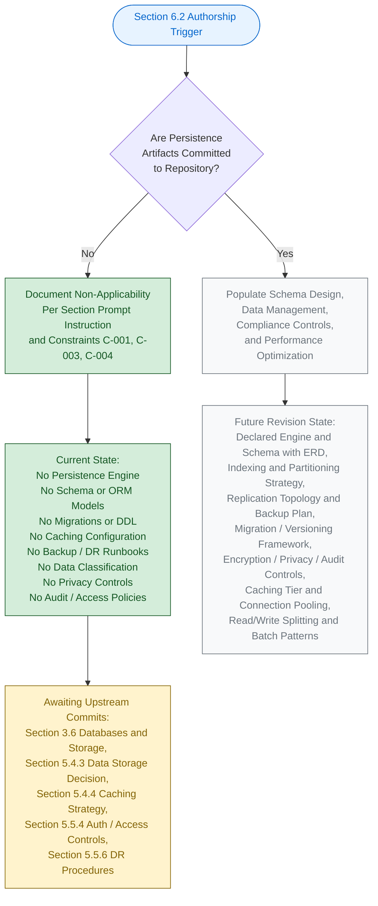

#### 6.2.6.2 Visual-Grammar Conformance

The diagram in Section 6.2.6.1 conforms to the colour grammar established by this Specification, as documented in Section 5.6.1 and reproduced in Section 6.1.5.2.

| Colour | Hex (Fill / Stroke) | Semantic Meaning |
|--------|----------------------|-------------------|
| Blue | `#e7f3ff` / `#0066cc` | Section authorship entry point |
| Green | `#d4edda` / `#155724` | Verifiable, present state |
| Grey | `#f8f9fa` / `#6c757d` | Prospective future state |
| Yellow | `#fff3cd` / `#856404` | Pending upstream activity |

The green-shaded nodes represent the verifiable, present authorship path; the grey-shaded nodes represent the prospective path that will be taken in a future revision once persistence artifacts are added to the codebase; the yellow-shaded node identifies the pending upstream activities required to unlock those subsequent revisions; and the blue-shaded node marks the Section authorship entry point.

---

### 6.2.7 REQUIRED DIAGRAMS STATUS

The Section 6.2 prompt requests three architectural diagrams: Database Schema Diagrams (including ERDs), Data Flow Diagrams, and Replication Architecture Diagrams. Per Constraint C-004 (Section 2.7.2), each of these diagrams remains explicitly empty until upstream persistence artifacts are committed.

#### 6.2.7.1 Diagram-Exclusion Justification

Producing any of the prompt-required database diagrams in the absence of underlying entity declarations, persistence engine selection, or replication topology would violate Constraint C-001 (no invention) and Constraint C-004 (diagrams remain empty until upstream artifacts are populated). Section 5.3.3 establishes the identical posture for Component Interaction, State Transition, and Sequence diagrams; Section 5.5.7 establishes the identical posture for Error-Handling Flow diagrams; Section 6.1.6 establishes the identical posture for Service Interaction, Scalability Architecture, and Resilience Pattern diagrams.

| Required Diagram (per Section 6.2 prompt) | Diagram Status | Governance Basis |
|---------------------------------------------|----------------|------------------|
| Database Schema Diagram (ERD) | Explicitly empty — TBD | Constraint C-001, C-004 |
| Data Flow Diagram | Explicitly empty — TBD | Constraint C-001, C-004 |
| Replication Architecture Diagram | Explicitly empty — TBD | Constraint C-001, C-004 |

#### 6.2.7.2 Diagram-Population Prerequisites

Each prompt-required diagram has a specific set of upstream artifacts that must be committed before it can be populated. The table below records these prerequisites for traceability with Section 5.7.1 and Section 6.2.8 below.

| Diagram | Required Upstream Artifact(s) |
|---------|--------------------------------|
| Database Schema (ERD) | DDL files, ORM model definitions, or NoSQL collection/document schemas with declared entities, attributes, and relationships |
| Data Flow | Persistent-store identity, declared write-path/read-path sequences, declared producer and consumer components |
| Replication Architecture | Primary/replica topology declaration, deployment manifest, replication-mode configuration (synchronous, asynchronous, semi-synchronous) |

#### 6.2.7.3 Index and Constraint Documentation Status

The Section 6.2 prompt's output-format requirement to "document all indexes and constraints" cannot be satisfied at the current repository lifecycle stage. Section 3.6.2 verifies the absence of all schema-bearing artifacts (SQL schemas, NoSQL schema/index configurations, GraphQL schemas, ORM model files). With no schema in existence, the index and constraint enumeration tables in Sections 6.2.2.2 and 6.2.2.4 are necessarily populated with `None declared — TBD` entries. This documentation completeness will be achieved in the revision triggered by the first schema or ORM-model commit (see Section 6.2.8.1).

---

### 6.2.8 FUTURE REVISION TRIGGERS

Consistent with Section 5.7.1 and Assumption A-004 (Section 2.7.1), a revision of Section 6.2 will be triggered when any of the events below occurs in the repository. Each trigger maps to the specific Section 6.2 subsections that will become authorable once the corresponding upstream artifact is committed.

#### 6.2.8.1 Trigger-to-Subsection Mapping

| Trigger Event | Section 6.2 Subsection(s) Unblocked |
|---------------|---------------------------------------|
| First schema / ORM model / persistence config committed (Section 3.6) | 6.2.2 (Entity Relationships, Data Models, Indexing, Partitioning, Constraints) |
| First migration framework / baseline migration committed (Section 3.6) | 6.2.3.1 (Migration Procedures, Versioning Strategy) |
| First database connection-string / connection-pool configuration committed | 6.2.5.1 (Connection Pooling, Query Optimization) |
| First read-replica / sharding / replication topology committed | 6.2.2.3 (Replication Configuration); 6.2.5.2 (Read/Write Splitting) |
| First cache configuration committed (Section 3.6) | 6.2.3.4 (Caching Policies); 6.2.5.3 (Caching Strategy) |
| First backup / RPO-RTO / DR runbook committed (Section 3.6; Section 5.5.6) | 6.2.2.3 (Backup Architecture); 6.2.4.1 (Backup and Fault Tolerance, Data Retention) |
| First encryption-at-rest / key-management configuration committed | 6.2.4.2 (Privacy Controls) |
| First authentication / authorization artifact committed (Section 5.5.4) | 6.2.4.3 (Access Controls); 6.2.4.3 (Audit Mechanisms) |
| First APM / logging / alerting / audit-trail integration committed (Section 3.5) | 6.2.4.3 (Audit Mechanisms) |
| First data classification / retention policy committed | 6.2.3.2 (Archival Policies); 6.2.4.1 (Data Retention Rules) |
| First batch-processing / ETL / job-queue configuration committed | 6.2.5.4 (Batch Processing Approach) |

Until at least one of these triggers fires, Section 6.2 will continue to reflect the non-applicability posture documented herein, in compliance with Constraint C-001 and Assumption A-003 (Section 2.7.1). The triggers above are a refinement of the Section 5.7.1 trigger table, scoped specifically to the data tier.

#### 6.2.8.2 Cross-Section Coordination

When a Section 6.2 revision is triggered, the following companion sections must be revised in lockstep to preserve cross-reference consistency required by Constraint C-003. The table below records the coordination map.

| Section 6.2 Subsection | Companion Sections Requiring Co-Revision |
|--------------------------|---------------------------------------------|
| 6.2.2 (Schema Design) | Section 3.6 (Databases and Storage); Section 4.4.1 (State Management); Section 5.4.3 (Data Storage Decision) |
| 6.2.3 (Data Management) | Section 4.4.1 (Caching, Transaction Boundaries); Section 5.4.4 (Caching Strategy) |
| 6.2.4 (Compliance Considerations) | Section 5.5.4 (Auth/Access Controls); Section 5.5.6 (DR Procedures); Section 3.6.3 (Encryption-at-Rest) |
| 6.2.5 (Performance Optimization) | Section 5.5.5 (Performance SLAs); Section 5.5.6 (DR Procedures); Section 6.1.3 (Scalability Design) |

---

### 6.2.9 VERSIONING POSTURE

Consistent with the versioning posture documented in Sections 2.7.3, 3.9.3, 4.7.1, 5.7.2, and 6.1.7.2, Section 6.2 carries the version status recorded below. The change log will begin with the first populated revision triggered by any of the events enumerated in Section 6.2.8.1.

#### 6.2.9.1 Section Version Tracking

| Versioning Element | Current State | Notes |
|----------------------|-----------------|-------|
| Section 6.2 Authorship Revision | v1.0 (TBD Posture) | First authoring pass under non-applicability declaration |
| Individual Schema-Element Versions | v0.0 — Not Yet Authored | No schema elements exist to version |
| Individual Migration Versions | v0.0 — Not Yet Authored | No migrations exist to version |
| Change Log | Not yet initiated | Will begin with the first populated revision |

#### 6.2.9.2 Default Technology Stack Reference (Non-Authoritative)

Section 3.8.1 of this Specification enumerates a documentation-framework default technology stack that includes MongoDB as a candidate Database default. Per Section 3.8.3 and Section 5.4.6, the default reference is **explicitly not adopted** as the data-storage decision for `April17Sec_1` in compliance with Constraint C-001 (no invention), Assumption A-003 (external artifacts non-authoritative), and Assumption A-004 (defaults may be superseded). The default remains a candidate reference only; it does not constitute a database-design decision for this system until and unless it is committed to the codebase. Section 6.2 therefore does not infer any schema model, query language, indexing primitive, or replication topology from the default reference.

---

### 6.2.10 SUMMARY OF POSTURE

The combination of (a) the explicit instruction in the Section 6.2 prompt to declare non-applicability when no database or direct persistent storage interactions are clearly evident; (b) the verified absence across every persistence-related repository category established by Sections 1.3.2, 3.6.1, 3.6.2, 3.6.3, 4.4.1, 5.4.3, 5.4.4, 5.5.4, and 5.5.6; (c) the governance constraints C-001, C-003, and C-004 (Section 2.7.2); and (d) the assumptions A-001, A-003, and A-004 (Section 2.7.1) yields a single, unambiguous posture for this section: **Database Design is not applicable to this system at the current repository lifecycle stage**.

This posture will be reviewed and revised in accordance with the triggers enumerated in Section 6.2.8.1. The earliest trigger most likely to fire is the first schema / ORM model / persistence config commit, which would unblock authorship of Section 6.2.2 (Schema Design) and cascade through Sections 6.2.3, 6.2.4, and 6.2.5 as additional persistence-tier artifacts are committed.

---

#### References

#### Files Examined

- `README.md` — Sole tracked file in the repository (14 bytes, single line `# April17Sec_1`); confirms the Repository Initialization lifecycle stage and the verified absence of all database-design artifacts.
- Repository root (`/`) — Contains only `README.md` and the `.git/` metadata directory; verified zero application subfolders, zero schema files, zero migration directories, zero ORM model files, zero database connection configurations, zero caching configurations, and zero search-index mappings.

#### Search Operations Performed

- File search for "database schema model ORM persistence storage" — returned empty results (`[]`), confirming no database-related source files exist.
- Folder search for "database migrations schema persistence layer" — returned empty results (`[]`), confirming no database-related directories exist.
- Filesystem inspection for `*.sql`, `*.db`, `schema*`, `migration*`, `.yml`, `.yaml`, `.json`, `Dockerfile`, `.env` — zero matches within the repository.

#### Technical Specification Sections Cross-Referenced

- **Section 1.1 EXECUTIVE SUMMARY** — Project identity, lifecycle stage, repository metadata
- **Section 1.2 SYSTEM OVERVIEW** — Verified absence of integration points, components, technology stack (1.2.1, 1.2.2, 1.2.3)
- **Section 1.3 SCOPE** — Explicit out-of-scope declaration for all persistence layers, data schemas, and database integrations (1.3.1, 1.3.2)
- **Section 2.7 ASSUMPTIONS, CONSTRAINTS, AND VERSIONING** — Governance constraints C-001, C-003, C-004; assumptions A-001, A-003, A-004; versioning posture
- **Section 3.4 OPEN SOURCE DEPENDENCIES** — Confirmed no dependency manifests exist (no DB client libraries, ORMs, or caching libraries can be loaded)
- **Section 3.5 THIRD-PARTY SERVICES** — Confirmed no managed database service, no cloud storage provider, no message broker, no search service
- **Section 3.6 DATABASES AND STORAGE** — **CRITICAL** — Direct authoritative evidence of all persistence dimensions being TBD; verified absence of all schema-bearing artifact families (3.6.1, 3.6.2, 3.6.3)
- **Section 3.8 DEFAULT TECHNOLOGY STACK REFERENCE** — Confirmed MongoDB default is NOT adopted as a database-design decision
- **Section 4.4 TECHNICAL IMPLEMENTATION** — State Management, Data Persistence Points, Caching Requirements, and Transaction Boundaries all TBD (4.4.1); Recovery Procedures TBD (4.4.2)
- **Section 5.2 HIGH-LEVEL ARCHITECTURE** — Confirmed no data flows, no data stores, no caches
- **Section 5.4 TECHNICAL DECISIONS** — **CRITICAL** — Data Storage Decision (5.4.3) and Caching Strategy Decision (5.4.4) both TBD; Default Technology Stack Reference (5.4.6) non-authoritative
- **Section 5.5 CROSS-CUTTING CONCERNS** — Monitoring/Logging (5.5.1, 5.5.2); Authentication/Authorization (5.5.4); Performance SLAs (5.5.5); Disaster Recovery Procedures (5.5.6) all TBD
- **Section 5.6 ARCHITECTURE AUTHORSHIP LIFECYCLE** — Visual grammar template and architecture-declaration prerequisites (5.6.1, 5.6.2)
- **Section 5.7 FUTURE SECTION REVISION TRIGGERS** — Trigger events relevant to Section 6.2 subsections (5.7.1, 5.7.2)
- **Section 6.1 CORE SERVICES ARCHITECTURE** — **CRITICAL TEMPLATE** — Structural pattern Section 6.2 mirrors for non-applicability declaration (6.1.1 through 6.1.8)

## 6.3 Integration Architecture

### 6.3.1 Applicability Declaration

**Integration Architecture is not applicable for this system.**

The `April17Sec_1` repository is at the Repository Initialization (Scaffold) lifecycle stage as established in Section 1.1 and Section 1.2.2. The repository contains exactly one tracked file (`README.md`, 14 bytes) whose entire content is the single Markdown heading `# April17Sec_1`. No API contract, protocol specification, authentication mechanism, authorization policy, rate-limit configuration, message broker, event bus, stream processor, batch scheduler, third-party SDK reference, legacy interface, API gateway configuration, or external service contract exists anywhere in the codebase. There is, consequently, **no integration topology, no inter-system communication surface, and no external dependency against which an Integration Architecture could be authored**.

This posture is the unambiguous and required response per the Section 6.3 prompt's explicit instruction: *"If the system does not require integration with external systems or services, clearly state 'Integration Architecture is not applicable for this system' and explain why."*

Section 1.2.1 records the authoritative anchor statement: *"No integration points, external dependencies, third-party services, APIs, message brokers, data stores, identity providers, or enterprise systems are referenced in the repository."* Section 4.2.2 (Integration Workflows) directly mirrors every dimension required by the Section 6.3 prompt — Data Flow Between Systems, API Interactions, Event Processing Flows, and Batch Processing Sequences — and records each dimension as TBD.

#### 6.3.1.1 Categorical Justification

The non-applicability of Integration Architecture is grounded in four independently sufficient categorical reasons, each derived from verifiable repository evidence and from upstream sections of this Specification.

| # | Categorical Reason | Authoritative Cross-Reference |
|---|---------------------|--------------------------------|
| (a) | No integration points or external dependencies are declared | Section 1.2.1; Section 2.4.2 |
| (b) | No API contracts, protocols, or transport mechanisms are declared | Section 4.2.2; Section 5.2.3 |
| (c) | No message broker, event bus, stream processor, or batch scheduler is declared | Section 3.5.2; Section 4.2.2 |
| (d) | No authentication, authorization, or identity-provider integration exists against which integration security could be designed | Section 3.5.3; Section 5.5.4 |

**Reason (a) — No integration points or external dependencies exist.** Section 1.2.1 confirms the absence of all integration points, third-party services, APIs, message brokers, data stores, identity providers, and enterprise systems. Section 2.4.2 records the Integration Points table with all four canonical categories (External APIs, Message Brokers, Identity Providers, Data Stores) as `No — TBD`. Section 5.2.4 records the External Integration Points table with every attribute (System Name, Integration Type, Protocol/Format, SLA Requirements) as `None declared — TBD`.

**Reason (b) — No API contracts, protocols, or transport mechanisms are declared.** Section 4.2.2's API Interactions subsection records no OpenAPI/Swagger specs, no Protobuf definitions, no GraphQL schemas, no Postman collections, and no service SDK configurations. Section 5.2.3 confirms that no integration patterns (request/reply, publish/subscribe, message queues, event sourcing, CQRS, anti-corruption layer) and no transport protocols (HTTP, gRPC, WebSocket, AMQP, MQTT, Kafka protocol, JDBC, ODBC) have been declared. Section 5.4.2's posture is reproduced verbatim: *"No communication-pattern decision (synchronous vs. asynchronous, request/reply vs. publish/subscribe, blocking vs. non-blocking, direct vs. mediated) has been recorded."*

**Reason (c) — No message broker, event bus, stream processor, or batch scheduler is declared.** Section 3.5.2 verifies that no Message Broker / Queue (Kafka, RabbitMQ, AWS SQS, NATS) is present. Section 4.2.2's Event Processing Flows subsection records the absence of every event-flow element (Event Producers, Event Consumers/Subscribers, Event Schema/Envelope Format, Delivery Semantics, Dead-Letter Handling, Event Replay/Recovery Policy). Section 4.2.2's Batch Processing Sequences subsection records the absence of every batch element (Scheduler/Trigger Mechanism, Job Definitions/DAG Specifications, Input/Output Data Sources, Batch Window/SLA, Failure-Recovery/Restart Strategy, Idempotency Guarantees).

**Reason (d) — No authentication, authorization, or identity-provider integration exists.** Section 3.5.3 records every authentication concern as TBD: Identity-Provider Selection, OAuth 2.0/OIDC Client Configuration, SAML/Federation Configuration, Token Issuance/Validation Library, Multi-Factor Authentication Integration. Section 5.5.4 confirms that the current repository state explicitly excludes all authentication, authorization, and security controls. Without an identity-and-access subsystem, the security dimensions of API Design (Authentication Methods, Authorization Framework) cannot be authored.

#### 6.3.1.2 Governance Basis for the Non-Applicability Declaration

Authorship of this section is governed by the constraints recorded in Section 2.7.2. The constraints listed below directly justify the non-applicability declaration and the format used to document it.

| Constraint ID | Constraint Statement | Applicability to Section 6.3 |
|---------------|------------------------|--------------------------------|
| C-001 | No features, requirements, or relationships may be invented; all entries must be grounded in verifiable repository content | Forbids fabrication of API specs, protocols, message queues, external service contracts, rate-limit policies, or any integration design element |
| C-003 | Cross-references to companion sections must remain consistent with the TBD posture established in Section 1 | Mandates that Section 6.3 mirror the TBD posture declared in Sections 1.2.1, 2.4.2, 3.5, 4.2.2, 5.2.3, 5.2.4, and 5.5.4 |
| C-004 | Diagrams remain empty until upstream artifacts are populated | Forbids producing integration flow diagrams, API architecture diagrams, or message flow diagrams |

Assumption A-001 (Section 2.7.1) further establishes that the repository's verifiable state as of the initial commit is the authoritative input for every architectural claim. Assumption A-002 (Section 2.7.1) establishes that the absence of feature, requirement, and relationship artifacts reflects the project's actual lifecycle stage (Repository Initialization), not an omission by this Specification. Assumption A-003 (Section 2.7.1) establishes that no external requirements artifacts are authoritative until committed to the codebase. Assumption A-004 (Section 2.7.1) confirms that subsequent revisions of this Specification will replace TBD markers with evidence-backed declarations once corresponding integration artifacts are committed.

---

### 6.3.2 API Design — Verified Absence

This subsection records, dimension by dimension, the verified absence of every API Design attribute required by the Section 6.3 prompt. Each row pairs a prompt-required dimension with its authoritative upstream cross-reference. Per Constraint C-001 (no invention), no synthetic protocols, authentication schemes, authorization policies, rate-limit budgets, versioning conventions, or documentation standards have been introduced.

#### 6.3.2.1 Protocol Specifications

Protocol specifications require (a) a declared transport (HTTP/1.1, HTTP/2, HTTP/3, gRPC, WebSocket, AMQP, MQTT, etc.), (b) a declared serialization format (JSON, XML, Protobuf, Avro, MessagePack), and (c) a declared interface contract (OpenAPI, GraphQL SDL, Protobuf IDL, AsyncAPI). Section 5.2.3 confirms that no transport protocols have been declared, and Section 4.2.2 confirms no API contract or interface definition exists.

| Protocol-Specification Element | Verifiable State | Authoritative Cross-Reference |
|----------------------------------|-------------------|--------------------------------|
| Transport Protocol (HTTP/gRPC/WebSocket/AMQP/MQTT) | None declared — TBD | Section 5.2.3; Section 4.2.2 |
| Serialization Format (JSON/Protobuf/Avro/XML) | None declared — TBD | Section 4.2.2 |
| Interface Contract Language (OpenAPI/Protobuf/GraphQL SDL) | None declared — TBD | Section 4.2.2 |
| Synchronous vs. Asynchronous Communication Choice | None declared — TBD | Section 5.4.2 |

#### 6.3.2.2 Authentication Methods

Authentication methods (API key, Basic Auth, Bearer/JWT, OAuth 2.0, OIDC, mTLS, SAML, HMAC request signing) require an identity-provider integration, a token issuance mechanism, and a credential storage strategy. Section 3.5.3 records every authentication concern as TBD; Section 5.5.4 confirms the absence of all authentication artifacts.

| Authentication Element | Verifiable State | Authoritative Cross-Reference |
|--------------------------|-------------------|--------------------------------|
| API Authentication Scheme (API key / OAuth / mTLS / JWT) | None declared — TBD | Section 4.2.2; Section 3.5.3 |
| Identity-Provider Selection (Auth0/Cognito/Okta/Azure AD) | None declared — TBD | Section 3.5.3; Section 3.5.2 |
| OAuth 2.0 / OIDC Client Configuration | None declared — TBD | Section 3.5.3 |
| Token Issuance / Validation Library | None declared — TBD | Section 3.5.3; Section 5.5.4 |

#### 6.3.2.3 Authorization Framework

Authorization frameworks (RBAC, ABAC, ReBAC, scope/claim-based authorization, policy engines such as OPA/Casbin/Cedar) require (a) an authenticated principal context, (b) a permission/role/policy taxonomy, and (c) a policy decision and enforcement layer. None of these prerequisites exists in the repository, as confirmed by Section 5.5.4.

| Authorization Element | Verifiable State | Authoritative Cross-Reference |
|-------------------------|-------------------|--------------------------------|
| Authorization Model (RBAC / ABAC / ReBAC / Scope-Claims) | None declared — TBD | Section 5.5.4 |
| Permission / Role / Scope Taxonomy | None declared — TBD | Section 5.5.4 |
| Policy Engine Integration (OPA / Casbin / Cedar) | None declared — TBD | Section 5.5.4 |
| Policy Enforcement Point (Gateway / Sidecar / In-Process) | None declared — TBD | Section 5.5.4 |

#### 6.3.2.4 Rate Limiting Strategy

Rate limiting strategies (token bucket, leaky bucket, fixed window, sliding window, distributed counters) require a declared API surface, a counter store (often Redis or an API-gateway native counter), and a declared throttling policy keyed by client identity, IP, or API key. Section 4.2.2 records Rate-Limit/Throttling Policy as TBD; no API surface against which rate limits would apply has been declared.

| Rate-Limiting Element | Verifiable State | Authoritative Cross-Reference |
|--------------------------|-------------------|--------------------------------|
| Throttling Algorithm (Token Bucket / Leaky Bucket / Window) | None declared — TBD | Section 4.2.2 |
| Quota Keying Strategy (per-IP / per-API-Key / per-User) | None declared — TBD | Section 4.2.2 |
| Counter Store Technology | None declared — TBD | Section 4.2.2; Section 5.4.4 |
| Throttling Response Behavior (429 / Retry-After / Backpressure) | None declared — TBD | Section 4.2.2 |

#### 6.3.2.5 Versioning Approach

API versioning approaches (URI versioning, header versioning, media-type versioning, query-parameter versioning, semantic-version negotiation) require a declared API contract from which version boundaries can be derived. Section 4.2.2 records Versioning Strategy as TBD; no API contract exists to be versioned.

| Versioning Element | Verifiable State | Authoritative Cross-Reference |
|----------------------|-------------------|--------------------------------|
| Version Placement (URI Path / Header / Media Type) | None declared — TBD | Section 4.2.2 |
| Version Negotiation Mechanism | None declared — TBD | Section 4.2.2 |
| Deprecation Policy and Sunset Cadence | None declared — TBD | Section 4.2.2 |
| Backward-Compatibility Guarantees | None declared — TBD | Section 4.2.2 |

#### 6.3.2.6 Documentation Standards

API documentation standards (OpenAPI 3.x, AsyncAPI 2.x, GraphQL SDL, Protobuf with reflection, Postman collections, Swagger UI, Redoc) require an underlying API contract and an integrated documentation toolchain. Section 4.2.2 confirms no API contract or interface definition exists; Section 3.7 confirms the absence of build/CI/CD/containerization that would publish such documentation.

| Documentation-Standard Element | Verifiable State | Authoritative Cross-Reference |
|----------------------------------|-------------------|--------------------------------|
| Contract Specification Format (OpenAPI / AsyncAPI / SDL / Protobuf) | None declared — TBD | Section 4.2.2 |
| Documentation Toolchain (Swagger UI / Redoc / GraphiQL) | None declared — TBD | Section 4.2.2 |
| Example Catalog / Postman Collection | None declared — TBD | Section 4.2.2 |
| Documentation Publication Pipeline | None declared — TBD | Section 4.2.2 |

---

### 6.3.3 Message Processing — Verified Absence

This subsection records the verified absence of every Message Processing attribute required by the Section 6.3 prompt. Each row pairs a prompt-required dimension with its authoritative upstream cross-reference. Section 3.5.2 verifies that no Message Broker / Queue (Kafka, RabbitMQ, AWS SQS, NATS) is present, and Section 4.2.2 confirms no message broker, no event bus, no stream-processing platform, and no event-schema registry have been declared.

#### 6.3.3.1 Event Processing Patterns

Event processing patterns (publish-subscribe, event sourcing, CQRS, event-carried state transfer, event-driven choreography, sagas) require declared event producers, declared event consumers, a declared event-schema registry, and a declared envelope format. Section 4.2.2's Event Processing Flows subsection records every element as TBD.

| Event-Processing Element | Verifiable State | Authoritative Cross-Reference |
|----------------------------|-------------------|--------------------------------|
| Event Producers | None declared — TBD | Section 4.2.2 |
| Event Consumers / Subscribers | None declared — TBD | Section 4.2.2 |
| Event Schema / Envelope Format (CloudEvents / Avro / Protobuf) | None declared — TBD | Section 4.2.2 |
| Delivery Semantics (at-most-once / at-least-once / exactly-once) | None declared — TBD | Section 4.2.2 |

#### 6.3.3.2 Message Queue Architecture

Message queue architectures require a declared broker technology, a topology of exchanges/topics/queues, a binding/routing configuration, and a consumer-group strategy. Section 3.5.2 records the verified absence of every candidate broker (Kafka, RabbitMQ, AWS SQS, NATS). Without a broker, no queue topology can be authored.

| Queue-Architecture Element | Verifiable State | Authoritative Cross-Reference |
|------------------------------|-------------------|--------------------------------|
| Broker Technology (Kafka / RabbitMQ / SQS / NATS) | None declared — TBD | Section 3.5.2; Section 4.2.2 |
| Topic / Exchange / Queue Topology | None declared — TBD | Section 4.2.2 |
| Routing / Binding Configuration | None declared — TBD | Section 4.2.2 |
| Consumer-Group / Subscription Strategy | None declared — TBD | Section 4.2.2 |

#### 6.3.3.3 Stream Processing Design

Stream processing designs (Kafka Streams, Apache Flink, Apache Beam, AWS Kinesis Data Streams, Spark Structured Streaming) require an underlying message broker or stream platform, a declared topology of stream operators, and declared state stores for windowing/aggregation. None of these prerequisites exists in the repository.

| Stream-Processing Element | Verifiable State | Authoritative Cross-Reference |
|-----------------------------|-------------------|--------------------------------|
| Stream Processing Platform (Kafka Streams / Flink / Beam / Kinesis) | None declared — TBD | Section 3.5.2; Section 4.2.2 |
| Stream Topology / Operator Graph | None declared — TBD | Section 4.2.2 |
| Windowing and Watermark Strategy | None declared — TBD | Section 4.2.2 |
| State Store / Checkpointing Configuration | None declared — TBD | Section 4.2.2 |

#### 6.3.3.4 Batch Processing Flows

Batch processing flows require a declared scheduler (cron, Airflow, Prefect, Dagster, AWS Step Functions), a declared job/DAG definition, declared input/output data sources, and a declared batch window or SLA. Section 4.2.2's Batch Processing Sequences subsection records every element as TBD; Section 3.7 confirms the absence of CI/CD pipelines, build scripts, and operational automation.

| Batch-Processing Element | Verifiable State | Authoritative Cross-Reference |
|----------------------------|-------------------|--------------------------------|
| Scheduler / Trigger Mechanism (cron / Airflow / Prefect / Dagster) | None declared — TBD | Section 4.2.2 |
| Job Definitions / DAG Specifications | None declared — TBD | Section 4.2.2 |
| Batch Window / SLA | None declared — TBD | Section 4.2.2 |
| Failure-Recovery / Restart / Idempotency Strategy | None declared — TBD | Section 4.2.2 |

#### 6.3.3.5 Error Handling Strategy

Error handling strategies for message processing (retry with exponential backoff, dead-letter queues, poison-pill detection, circuit breakers, compensating transactions) require an underlying broker and a declared integration topology against which they operate. Section 4.2.2 records Dead-Letter Handling and Event Replay/Recovery Policy as TBD; Section 5.5.3 confirms that no retry mechanisms, fallback processes, or error-notification flows can be documented because no service integrations exist against which they would execute.

| Error-Handling Element | Verifiable State | Authoritative Cross-Reference |
|--------------------------|-------------------|--------------------------------|
| Retry Strategy (Exponential Backoff / Jitter / Max Attempts) | None declared — TBD | Section 4.4.2; Section 5.5.3 |
| Dead-Letter Queue / Poison-Pill Handling | None declared — TBD | Section 4.2.2 |
| Circuit Breaker / Bulkhead at Consumer Boundary | None declared — TBD | Section 4.4.2; Section 5.5.3 |
| Compensating Action / Saga Step Rollback | None declared — TBD | Section 4.4.1 |

---

### 6.3.4 External Systems — Verified Absence

This subsection records the verified absence of every External Systems attribute required by the Section 6.3 prompt. Each row pairs a prompt-required dimension with its authoritative upstream cross-reference.

#### 6.3.4.1 Third-Party Integration Patterns

Third-party integration patterns (SDK-based integration, REST client integration, webhook receivers, OAuth client flows, embedded widget integration, server-side proxying) require at least one declared third-party service, an SDK or HTTP client dependency, and (where applicable) inbound webhook handlers. Section 3.5.2 verifies the absence of every candidate third-party service category.

| Third-Party Integration Element | Verifiable State | Authoritative Cross-Reference |
|-----------------------------------|-------------------|--------------------------------|
| Third-Party SDK or Client Library References | None declared — TBD | Section 3.5.2; Section 3.4 |
| Webhook Receiver / Endpoint Declarations | None declared — TBD | Section 4.2.2 |
| Outbound HTTP Client Configuration (Base URL / Headers / Timeouts) | None declared — TBD | Section 4.2.2 |
| Secret / Credential Management for Third-Party Calls | None declared — TBD | Section 5.5.4 |

#### 6.3.4.2 Legacy System Interfaces

Legacy system interfaces (mainframe TN3270, AS/400 DDS, file-based EDI, SOAP/WSDL, JDBC/ODBC bridges, mainframe MQ bridges) require a documented predecessor system, a declared bridging technology, and a documented data-mapping layer. Section 1.2.1 confirms no predecessor system or enterprise legacy interface is referenced in the repository.

| Legacy-Interface Element | Verifiable State | Authoritative Cross-Reference |
|----------------------------|-------------------|--------------------------------|
| Predecessor / Legacy System Identity | None declared — TBD | Section 1.2.1 |
| Bridging Technology (SOAP / EDI / JDBC-ODBC / MQ) | None declared — TBD | Section 1.2.1; Section 5.2.3 |
| Data-Mapping / Transformation Layer | None declared — TBD | Section 5.2.3 |
| Anti-Corruption Layer Strategy | None declared — TBD | Section 5.2.3 |

#### 6.3.4.3 API Gateway Configuration

API gateway configurations (AWS API Gateway, Kong, Apigee, Azure API Management, Tyk, Envoy as a gateway, NGINX as a gateway) require a declared API surface upstream of the gateway, declared routing rules, declared throttling/authentication plugins, and a declared deployment target for the gateway itself. None of these prerequisites exists in the repository, as confirmed by Sections 4.2.2, 5.2.4, and 3.5.3.

| Gateway-Configuration Element | Verifiable State | Authoritative Cross-Reference |
|---------------------------------|-------------------|--------------------------------|
| Gateway Technology (AWS API GW / Kong / Apigee / Azure APIM) | None declared — TBD | Section 3.5.3; Section 5.2.4 |
| Route / Path-Mapping Configuration | None declared — TBD | Section 4.2.2 |
| Gateway-Level Authentication / Authorization Plugin | None declared — TBD | Section 3.5.3; Section 5.5.4 |
| Gateway-Level Rate-Limit / Quota / Caching Plugin | None declared — TBD | Section 4.2.2 |

#### 6.3.4.4 External Service Contracts

External service contracts (service-level agreements, integration interface contracts, data-sharing agreements, latency/availability budgets, escalation paths) require at least one declared external counterparty system and a documented operational relationship. Section 5.2.4 records every contract attribute as TBD; Section 4.6 (Swim Lanes, Timing, and SLA Considerations) confirms the absence of all SLA, latency budget, and throughput target declarations.

| Service-Contract Element | Verifiable State | Authoritative Cross-Reference |
|----------------------------|-------------------|--------------------------------|
| Counterparty System Identity | None declared — TBD | Section 5.2.4 |
| Integration Type (Sync API / Async Event / Batch / File Transfer) | None declared — TBD | Section 5.2.4 |
| Protocol / Format (HTTP+JSON / gRPC+Protobuf / AMQP / SFTP) | None declared — TBD | Section 5.2.4; Section 5.2.3 |
| SLA / Latency Budget / Escalation Path | None declared — TBD | Section 5.2.4 |

#### 6.3.4.5 Verified-Absent External Service Categories

For completeness and traceability, the ten major external service categories enumerated in Section 3.5.2 and Section 5.2.4 are reproduced below. Each has been searched for and verified absent from the repository. The absence of every category in this list independently confirms that no third-party integration patterns, API gateway configurations, or external service contracts can be authored at the current repository lifecycle stage.

| External Service Category | Representative Markers | Present? |
|----------------------------|-------------------------|----------|
| Identity-Provider Integration | Auth0, Cognito, Okta, Azure AD, Firebase Auth | No |
| Payment Processor | Stripe, Braintree, PayPal | No |
| Email / Messaging Provider | SendGrid, Twilio, AWS SES | No |
| Cloud Storage Provider | AWS S3, GCS, Azure Blob | No |
| Analytics / Telemetry | Segment, Mixpanel, Amplitude | No |
| Application Performance Monitoring | Datadog, New Relic, AppDynamics, Sentry | No |
| Logging Aggregation | ELK, Splunk, Loggly, Logz.io | No |
| Feature Flag Service | LaunchDarkly, Split.io | No |
| Search Service | Algolia, Elasticsearch SaaS | No |
| Message Broker / Queue | Kafka, RabbitMQ, AWS SQS, NATS | No |

---

### 6.3.5 Authorship Lifecycle Diagram

Per Constraint C-004 (Section 2.7.2) and consistent with the visual grammar established in Sections 1.2.2, 2.1.3, 3.9.1, 4.5.1, 5.6.1, 6.1.5.1, and 6.2.6.1, the only diagram appropriate for the current TBD posture of Section 6.3 is an authorship-lifecycle diagram. This diagram depicts the gating activity that must precede a populated rewrite of this section and uses the colour grammar adopted throughout this Specification. The prompt-required diagrams (integration flow diagrams, API architecture diagrams, message flow diagrams) remain explicitly empty per Section 6.3.6 below.

#### 6.3.5.1 Section 6.3 Authorship Lifecycle

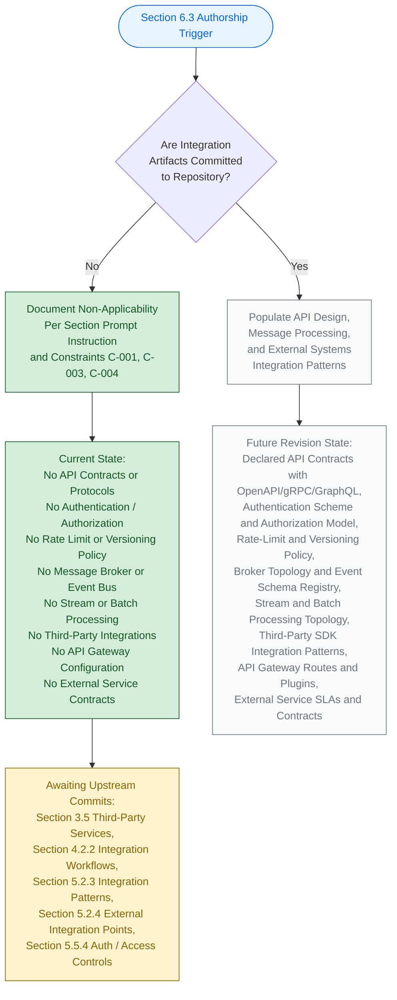

#### 6.3.5.2 Visual-Grammar Conformance

The diagram in Section 6.3.5.1 conforms to the colour grammar established by this Specification, as documented in Section 5.6.1 and reproduced in Sections 6.1.5.2 and 6.2.6.2.

| Colour | Hex (Fill / Stroke) | Semantic Meaning |
|--------|----------------------|-------------------|
| Blue | `#e7f3ff` / `#0066cc` | Section authorship entry point |
| Green | `#d4edda` / `#155724` | Verifiable, present state |
| Grey | `#f8f9fa` / `#6c757d` | Prospective future state |
| Yellow | `#fff3cd` / `#856404` | Pending upstream activity |

The green-shaded nodes represent the verifiable, present authorship path; the grey-shaded nodes represent the prospective path that will be taken in a future revision once integration artifacts are added to the codebase; the yellow-shaded node identifies the pending upstream activities required to unlock those subsequent revisions; and the blue-shaded node marks the Section authorship entry point.

---

### 6.3.6 Required Diagrams Status

The Section 6.3 prompt requests three architectural diagrams: Integration Flow Diagrams, API Architecture Diagrams, and Message Flow Diagrams. The prompt additionally requests sequence diagrams for key flows. Per Constraint C-004 (Section 2.7.2), each of these diagrams remains explicitly empty until upstream integration artifacts are committed.

#### 6.3.6.1 Diagram-Exclusion Justification

Producing any of the prompt-required integration diagrams in the absence of underlying API contracts, message broker declarations, or external service integrations would violate Constraint C-001 (no invention) and Constraint C-004 (diagrams remain empty until upstream artifacts are populated). Section 5.3.3 establishes the identical posture for Component Interaction, State Transition, and Sequence diagrams; Section 5.5.7 establishes the identical posture for Error-Handling Flow diagrams; Section 6.1.6 and Section 6.2.7 establish the identical posture for their respective prompt-required diagrams.

| Required Diagram (per Section 6.3 prompt) | Diagram Status | Governance Basis |
|---------------------------------------------|----------------|------------------|
| Integration Flow Diagram | Explicitly empty — TBD | Constraint C-001, C-004 |
| API Architecture Diagram | Explicitly empty — TBD | Constraint C-001, C-004 |
| Message Flow Diagram | Explicitly empty — TBD | Constraint C-001, C-004 |
| Sequence Diagrams for Key Flows | Explicitly empty — TBD | Constraint C-001, C-004 |

#### 6.3.6.2 Diagram-Population Prerequisites

Each prompt-required diagram has a specific set of upstream artifacts that must be committed before it can be populated. The table below records these prerequisites for traceability with Section 5.7.1 and Section 6.3.7 below.

| Diagram | Required Upstream Artifact(s) |
|---------|--------------------------------|
| Integration Flow | Service descriptors, integration topology declarations, third-party SDK or HTTP client references, declared producer and consumer components |
| API Architecture | OpenAPI / Swagger / gRPC / Protobuf / GraphQL schema files; authentication and authorization configuration; rate-limit and versioning policy |
| Message Flow | Message broker configuration (Kafka, RabbitMQ, SQS, NATS); event schema definitions (CloudEvents, Avro, Protobuf); producer/consumer code; topic/queue topology declarations |
| Sequence (Key Flows) | Declared end-to-end flows with named participants, ordered message exchanges, and timing/synchronization annotations |

#### 6.3.6.3 External-Dependency Documentation Status

The Section 6.3 prompt's output-format requirement to "document all external dependencies" cannot be satisfied with declared external dependencies at the current repository lifecycle stage. Section 3.5.2 verifies the absence of all candidate external service categories (ten categories enumerated in Section 6.3.4.5). Section 3.4 verifies the absence of all dependency manifests (`package.json`, `requirements.txt`, `pom.xml`, `build.gradle`, `go.mod`, `Gemfile`, `Cargo.toml`, etc.). With no declared external dependency in any form, the External Dependency Inventory tables across Sections 6.3.2, 6.3.3, and 6.3.4 are necessarily populated with `None declared — TBD` entries. This documentation completeness will be achieved in the revision triggered by the first dependency manifest, third-party SDK reference, or external service configuration commit (see Section 6.3.7.1).

---

### 6.3.7 Future Revision Triggers

Consistent with Section 5.7.1 and Assumption A-004 (Section 2.7.1), a revision of Section 6.3 will be triggered when any of the events below occurs in the repository. Each trigger maps to the specific Section 6.3 subsections that will become authorable once the corresponding upstream artifact is committed.

#### 6.3.7.1 Trigger-to-Subsection Mapping

| Trigger Event | Section 6.3 Subsection(s) Unblocked |
|---------------|---------------------------------------|
| First API contract committed (REST/OpenAPI, gRPC/Protobuf, GraphQL SDL, AsyncAPI) | 6.3.2.1 (Protocol Specifications); 6.3.2.5 (Versioning); 6.3.2.6 (Documentation Standards) |
| First authentication artifact committed (OAuth client config, JWT signing keys, mTLS certs) | 6.3.2.2 (Authentication Methods) |
| First authorization artifact committed (RBAC roles, OPA policies, scope definitions) | 6.3.2.3 (Authorization Framework) |
| First rate-limit / throttling configuration committed | 6.3.2.4 (Rate Limiting Strategy) |
| First message broker / queue configuration committed (Kafka, RabbitMQ, SQS, NATS) | 6.3.3.1 (Event Processing Patterns); 6.3.3.2 (Message Queue Architecture) |
| First stream-processing platform configuration committed (Kafka Streams, Flink, Beam, Kinesis) | 6.3.3.3 (Stream Processing Design) |
| First batch-job / scheduler / DAG configuration committed (cron, Airflow, Prefect, Dagster) | 6.3.3.4 (Batch Processing Flows) |
| First retry / circuit-breaker / dead-letter configuration committed | 6.3.3.5 (Error Handling Strategy) |
| First third-party SDK / HTTP client / webhook handler committed | 6.3.4.1 (Third-Party Integration Patterns) |
| First legacy-system interface artifact committed (SOAP/WSDL, EDI map, JDBC bridge) | 6.3.4.2 (Legacy System Interfaces) |
| First API gateway configuration committed (Kong, Apigee, AWS API GW, Azure APIM) | 6.3.4.3 (API Gateway Configuration) |
| First external service contract / SLA committed | 6.3.4.4 (External Service Contracts) |

Until at least one of these triggers fires, Section 6.3 will continue to reflect the non-applicability posture documented herein, in compliance with Constraint C-001 and Assumption A-003 (Section 2.7.1). The triggers above are a refinement of the Section 5.7.1 trigger table, scoped specifically to the integration tier.

#### 6.3.7.2 Cross-Section Coordination

When a Section 6.3 revision is triggered, the following companion sections must be revised in lockstep to preserve cross-reference consistency required by Constraint C-003. The table below records the coordination map.

| Section 6.3 Subsection | Companion Sections Requiring Co-Revision |
|--------------------------|---------------------------------------------|
| 6.3.2 (API Design) | Section 3.3 (Frameworks); Section 4.2.2 (Integration Workflows); Section 5.2.3 (Integration Patterns); Section 5.5.4 (Auth Controls) |
| 6.3.3 (Message Processing) | Section 3.5 (Third-Party Services); Section 4.2.2 (Integration Workflows); Section 5.2.3 (Integration Patterns) |
| 6.3.4 (External Systems) | Section 1.2.1 (Enterprise Landscape); Section 3.5 (Third-Party Services); Section 5.2.4 (External Integration Points) |

---

### 6.3.8 Versioning Posture

Consistent with the versioning posture documented in Sections 2.7.3, 3.9.3, 4.7.1, 5.7.2, 6.1.7.2, and 6.2.9.1, Section 6.3 carries the version status recorded below. The change log will begin with the first populated revision triggered by any of the events enumerated in Section 6.3.7.1.

#### 6.3.8.1 Section Version Tracking

| Versioning Element | Current State | Notes |
|----------------------|-----------------|-------|
| Section 6.3 Authorship Revision | v1.0 (TBD Posture) | First authoring pass under non-applicability declaration |
| Individual API Contract Versions | v0.0 — Not Yet Authored | No API contracts exist to version |
| Individual Event Schema Versions | v0.0 — Not Yet Authored | No event schemas exist to version |
| Change Log | Not yet initiated | Will begin with the first populated revision |

#### 6.3.8.2 Default Technology Stack Non-Adoption

Section 3.8.1 enumerates a documentation-framework default technology stack reference. Per Section 3.8.3 and Section 5.4.6, this default reference is **explicitly not adopted** as the integration-architecture decision for `April17Sec_1` in compliance with Constraint C-001 (no invention), Assumption A-003 (external artifacts non-authoritative), and Assumption A-004 (defaults may be superseded). Section 6.3 therefore does not infer any protocol selection, broker selection, gateway selection, or external service binding from the default reference.

---

### 6.3.9 Summary of Posture

The combination of (a) the explicit instruction in the Section 6.3 prompt to declare non-applicability when the system does not require integration with external systems or services; (b) the verified absence across every integration-related repository category established by Sections 1.2.1, 2.4.2, 3.5.2, 3.5.3, 4.2.2, 5.2.3, 5.2.4, 5.4.2, 5.5.3, and 5.5.4; (c) the governance constraints C-001, C-003, and C-004 (Section 2.7.2); and (d) the assumptions A-001, A-002, A-003, and A-004 (Section 2.7.1) yields a single, unambiguous posture for this section: **Integration Architecture is not applicable for this system at the current repository lifecycle stage**.

This posture will be reviewed and revised in accordance with the triggers enumerated in Section 6.3.7.1. The earliest trigger most likely to fire is the first API contract commit (REST/OpenAPI, gRPC/Protobuf, GraphQL SDL, or AsyncAPI), which would unblock authorship of Section 6.3.2 (API Design) and cascade through Sections 6.3.3 (Message Processing) and 6.3.4 (External Systems) as additional integration-tier artifacts are committed. Until such triggers fire, Section 6.3 stands as a deliberate, evidence-backed statement of non-applicability — fully consistent with the precedents set by Sections 6.1 (Core Services Architecture) and 6.2 (Database Design).

---

#### References

#### Files Examined

- `README.md` — Sole tracked file in the repository (14 bytes, single line `# April17Sec_1`); confirms the Repository Initialization lifecycle stage and the verified absence of all integration-architecture artifacts (no API contracts, no broker configurations, no third-party SDK references, no gateway configurations, no service contracts).
- Repository root (`/`) — Contains only `README.md` and the `.git/` metadata directory; verified zero application subfolders, zero protocol definitions, zero message broker configurations, zero authentication artifacts, zero rate-limit policies, zero gateway configurations, and zero external service contracts.

#### Search Operations Performed

- Semantic search for "API endpoints, REST controllers, GraphQL schemas, or integration handlers" — returned empty results (`[]`), confirming no API surface exists.
- Semantic search for "message queue, event bus, broker, or stream processing configuration" — returned empty results (`[]`), confirming no message processing topology exists.
- Semantic search for "API gateway, external service integration, or webhook handlers" — returned empty results (`[]`), confirming no external integration mechanisms exist.
- Semantic search for "authentication tokens, OAuth configuration, or rate limiting middleware" — returned empty results (`[]`), confirming no API security or throttling artifacts exist.
- Filesystem inspection for `openapi*.yaml`, `swagger*.json`, `*.proto`, `*.graphql`, `Dockerfile`, `docker-compose.yml`, `.env`, `application.properties` — zero matches within the repository.

#### Technical Specification Sections Cross-Referenced

- **Section 1.1 EXECUTIVE SUMMARY** — Project identity, repository lifecycle stage (Repository Initialization), and repository metadata
- **Section 1.2 SYSTEM OVERVIEW** — **CRITICAL** — Authoritative statement on the absence of all integration points, external dependencies, third-party services, APIs, message brokers, data stores, and identity providers (1.2.1, 1.2.2, 1.2.3)
- **Section 1.3 SCOPE** — Explicit out-of-scope declaration for all third-party integrations and external service configurations (1.3.1, 1.3.2)
- **Section 2.4 FEATURE RELATIONSHIPS** — Integration Points table with External APIs, Message Brokers, Identity Providers, and Data Stores all recorded as `No — TBD` (2.4.2)
- **Section 2.7 ASSUMPTIONS, CONSTRAINTS, AND VERSIONING** — Governance constraints C-001, C-003, C-004; assumptions A-001, A-002, A-003, A-004; versioning posture
- **Section 3.4 OPEN SOURCE DEPENDENCIES** — Verified absence of all dependency manifests, including those for HTTP clients, broker clients, OAuth libraries, and SDK packages
- **Section 3.5 THIRD-PARTY SERVICES** — **CRITICAL** — Verified absence across ten external-service categories; authentication, monitoring, and cloud service TBD posture (3.5.1, 3.5.2, 3.5.3)
- **Section 3.7 DEVELOPMENT AND DEPLOYMENT** — Verified absence of build/CI/CD/containerization that would publish API documentation or deploy integration components
- **Section 3.8 DEFAULT TECHNOLOGY STACK REFERENCE** — Confirmed default stack is NOT adopted as an integration-architecture decision
- **Section 4.2 SYSTEM WORKFLOWS** — **CRITICAL** — Section 4.2.2 (Integration Workflows) directly maps to all Section 6.3 prompt dimensions: Data Flow Between Systems, API Interactions, Event Processing Flows, Batch Processing Sequences — all TBD
- **Section 4.4 TECHNICAL IMPLEMENTATION** — State Management, Error Handling, Retry Mechanisms, Fallback Processes, Notification Flows, Recovery Procedures — all TBD (4.4.1, 4.4.2)
- **Section 4.5 REQUIRED DIAGRAMS** — Process-flowchart authorship lifecycle template; integration-sequence diagrams marked explicitly empty
- **Section 4.6 SWIM LANES, TIMING, AND SLA CONSIDERATIONS** — Verified absence of SLA, latency budget, and throughput target declarations
- **Section 4.7 FUTURE SECTION REVISION TRIGGERS** — Trigger pattern template informing Section 6.3.7
- **Section 5.2 HIGH-LEVEL ARCHITECTURE** — **CRITICAL** — Integration patterns and protocols TBD (5.2.3); External Integration Points table empty (5.2.4)
- **Section 5.3 COMPONENT DETAILS** — Component-detail dimensions TBD; diagram-status precedent (5.3.1, 5.3.2, 5.3.3)
- **Section 5.4 TECHNICAL DECISIONS** — **CRITICAL** — Communication pattern decision TBD (5.4.2); default stack non-adoption (5.4.6)
- **Section 5.5 CROSS-CUTTING CONCERNS** — **CRITICAL** — Error handling patterns (5.5.3); authentication/authorization framework (5.5.4); performance SLAs (5.5.5); disaster recovery procedures (5.5.6) all TBD
- **Section 5.6 ARCHITECTURE AUTHORSHIP LIFECYCLE** — **CRITICAL** — Visual-grammar template for the authorship lifecycle diagram (5.6.1, 5.6.2)
- **Section 5.7 FUTURE SECTION REVISION TRIGGERS** — **CRITICAL** — Trigger event taxonomy that Section 6.3.7 refines for the integration tier (5.7.1, 5.7.2)
- **Section 6.1 CORE SERVICES ARCHITECTURE** — **CRITICAL TEMPLATE** — Direct structural template for the non-applicability declaration, mirrored throughout Section 6.3
- **Section 6.2 DATABASE DESIGN** — **CRITICAL TEMPLATE** — Refined non-applicability template establishing the multi-subsection verified-absence pattern, mirrored throughout Section 6.3

## 6.4 Security Architecture

### 6.4.1 Applicability Declaration

**Detailed Security Architecture is not applicable for this system.**

The `April17Sec_1` repository is at the Repository Initialization (Scaffold) lifecycle stage as established in Section 1.1 and Section 1.2.2. The repository contains exactly one tracked file (`README.md`, 14 bytes) whose entire content is the single Markdown heading `# April17Sec_1`. No identity-provider configuration, authentication library, authorization policy, encryption key, secret-management directive, audit-logging instrumentation, security-control configuration, TLS certificate, password policy declaration, multi-factor-authentication artifact, role/permission taxonomy, or compliance-control configuration exists anywhere in the codebase. There is, consequently, **no identity-and-access subsystem, no cryptographic substrate, no audit surface, and no compliance posture against which a Security Architecture could be authored**.

This posture is the unambiguous and required response per the Section 6.4 prompt's explicit instruction: *"If the system does not require specific security considerations beyond standard practices, clearly state 'Detailed Security Architecture is not applicable for this system' and explain which standard security practices will be followed instead."* The standard security practices that will be followed once the prerequisite artifacts are committed are enumerated in Section 6.4.7 below.

Section 1.3.2 records the authoritative out-of-scope declaration for the current repository state: *"All authentication, authorization, and security controls (no security artifacts exist)"*. Section 5.5.4 reinforces this with the verbatim statement that *"the current repository state explicitly excludes all authentication, authorization, and security controls (no security artifacts exist). There are no security-related configuration files, no secret-management directives, no identity-provider integrations, and no access-control policies in the codebase."* Section 5.4 — by virtue of Section 5.4.5 — records that *"No security mechanism has been selected... The security-mechanism decision is **TBD**."*

#### 6.4.1.1 Categorical Justification

The non-applicability of Detailed Security Architecture is grounded in four independently sufficient categorical reasons, each derived from verifiable repository evidence and from upstream sections of this Specification.

| # | Categorical Reason | Authoritative Cross-Reference |
|---|---------------------|--------------------------------|
| (a) | No authentication, authorization, or security artifact exists in the repository | Section 1.3.2; Section 2.5.4; Section 5.5.4 |
| (b) | No security mechanism decision has been recorded (selection is explicitly TBD) | Section 5.4.5 |
| (c) | No identity-provider, token issuer, or MFA integration is declared | Section 3.5.3 |
| (d) | No encryption, key-management, audit-logging, or compliance substrate exists against which a security architecture could be enforced | Section 3.6.3; Section 5.5.2; Section 5.5.4 |

**Reason (a) — No authentication, authorization, or security artifact exists.** Section 1.3.2 lists *"All authentication, authorization, and security controls (no security artifacts exist)"* as out of scope of the current repository state. Section 2.5.4 records every security implication concern — Authentication Mechanisms, Authorization Policies, Data-Protection Controls, and Audit & Logging Provisions — as `No — TBD`. Section 5.5.4 confirms that no security-related configuration file, no secret-management directive, no identity-provider integration, and no access-control policy exists in the codebase.

**Reason (b) — No security mechanism decision has been recorded.** Section 5.4.5 explicitly records that the security-mechanism decision is TBD. Without a declared mechanism, the questions of authentication scheme selection, authorization model selection, encryption algorithm selection, and audit-trail architecture selection are not yet meaningful.

**Reason (c) — No identity-provider, token issuer, or MFA integration is declared.** Section 3.5.3 records every authentication concern as TBD: Identity-Provider Selection, OAuth 2.0/OIDC Client Configuration, SAML/Federation Configuration, Token Issuance/Validation Library, and Multi-Factor Authentication Integration. Without an identity-and-access substrate, the dimensions of identity management, session management, token handling, and password policy enforcement cannot be evidence-grounded.

**Reason (d) — No encryption, key-management, audit-logging, or compliance substrate exists.** Section 3.6.3 records Encryption-at-Rest Configuration as TBD. Section 5.5.4 records Data-Protection Controls and Audit & Logging Provisions as TBD. Section 5.5.2 records the logging and tracing strategy as TBD, eliminating the substrate against which audit-event emission, immutable audit-log storage, and tamper-evident audit trails would operate.

#### 6.4.1.2 Governance Basis for the Non-Applicability Declaration

Authorship of this section is governed by the constraints recorded in Section 2.7.2. The constraints listed below directly justify the non-applicability declaration and the format used to document it.

| Constraint ID | Constraint Statement | Applicability to Section 6.4 |
|---------------|------------------------|-------------------------------|
| C-001 | No features, requirements, or relationships may be invented; all entries must be grounded in verifiable repository content | Forbids fabrication of authentication mechanisms, RBAC roles, encryption keys, audit policies, password rules, or any security-architecture element |
| C-003 | Cross-references to companion sections must remain consistent with the TBD posture established in Section 1 | Mandates that Section 6.4 mirror the TBD posture declared in Sections 1.3.2, 2.5.4, 3.5.3, 3.6.3, 5.4.5, and 5.5.4 |
| C-004 | Diagrams remain empty until upstream artifacts are populated | Forbids producing authentication flow diagrams, authorization flow diagrams, or security zone diagrams |

Assumption A-001 (Section 2.7.1) further establishes that the repository's verifiable state as of the initial commit is the authoritative input for every architectural claim. Assumption A-002 (Section 2.7.1) establishes that the absence of security artifacts reflects the project's actual lifecycle stage (Repository Initialization), not an omission by this Specification. Assumption A-003 (Section 2.7.1) establishes that no external requirements artifacts (security playbooks, threat models, compliance attestations stored elsewhere) are authoritative until committed to the codebase. Assumption A-004 (Section 2.7.1) confirms that subsequent revisions of this Specification will replace TBD markers with evidence-backed declarations once corresponding security artifacts are committed.

---

### 6.4.2 Authentication Framework — Verified Absence

This subsection records, dimension by dimension, the verified absence of every Authentication Framework attribute required by the Section 6.4 prompt — Identity management, Multi-factor authentication, Session management, Token handling, and Password policies. Each row pairs a prompt-required dimension with its authoritative upstream cross-reference. Per Constraint C-001 (no invention), no synthetic identity providers, token formats, session strategies, MFA factors, or password policies have been introduced.

#### 6.4.2.1 Identity Management Dimensions

Identity management requires (a) a declared identity-provider integration (Auth0, Cognito, Okta, Azure AD, Firebase Auth, Keycloak, etc.), (b) a user-profile schema and lifecycle (registration, verification, activation, deactivation, deletion), and (c) a credential-storage strategy. Section 3.5.3 records every identity concern as TBD, and Section 5.5.4 confirms the absence of all identity-provider integrations.

| Identity-Management Element | Verifiable State | Authoritative Cross-Reference |
|-------------------------------|-------------------|--------------------------------|
| Identity-Provider Selection (Auth0/Cognito/Okta/Azure AD/Firebase Auth) | None declared — TBD | Section 3.5.3; Section 5.5.4 |
| User-Profile Schema and Identity Attributes | None declared — TBD | Section 3.5.3; Section 5.5.4 |
| Registration / Verification / Activation Workflow | None declared — TBD | Section 3.5.3; Section 5.5.4 |
| Credential Storage Strategy (hash function, salt, pepper) | None declared — TBD | Section 5.5.4 |

#### 6.4.2.2 Multi-Factor Authentication Dimensions

Multi-factor authentication requires (a) an underlying identity-provider integration capable of enforcing MFA challenges, (b) a declared second-factor modality (TOTP, WebAuthn/FIDO2, SMS OTP, email OTP, push notification, hardware key), and (c) a recovery/back-up code mechanism. Section 3.5.3 records Multi-Factor Authentication Integration as `No — TBD`; without an identity-provider substrate, no MFA dimension can be evidence-grounded.

| MFA Element | Verifiable State | Authoritative Cross-Reference |
|---------------|-------------------|--------------------------------|
| MFA Enrollment Workflow | None declared — TBD | Section 3.5.3 |
| Second-Factor Modality (TOTP / WebAuthn / SMS / Push) | None declared — TBD | Section 3.5.3 |
| Step-Up Authentication Policy (risk-based escalation) | None declared — TBD | Section 3.5.3; Section 5.5.4 |
| Recovery / Back-Up Code Mechanism | None declared — TBD | Section 3.5.3 |

#### 6.4.2.3 Session Management Dimensions

Session management requires (a) a declared session storage strategy (server-side store, signed cookie, token-based stateless), (b) session lifecycle policies (idle timeout, absolute timeout, re-authentication intervals), and (c) session-fixation and session-revocation defenses. Section 5.5.4 confirms the absence of all session-management artifacts.

| Session-Management Element | Verifiable State | Authoritative Cross-Reference |
|------------------------------|-------------------|--------------------------------|
| Session Storage Strategy (server-side / signed cookie / stateless token) | None declared — TBD | Section 5.5.4 |
| Idle and Absolute Timeout Policy | None declared — TBD | Section 5.5.4 |
| Session-Fixation / Session-Rotation Defenses | None declared — TBD | Section 5.5.4 |
| Session-Revocation / Forced-Logout Mechanism | None declared — TBD | Section 5.5.4 |

#### 6.4.2.4 Token Handling Dimensions

Token handling requires (a) a declared token format (JWT, opaque reference token, PASETO, Macaroons), (b) a token-signing or HMAC key strategy, (c) a token-issuance/validation library, and (d) token-lifecycle policies (issuance, refresh, rotation, revocation). Section 3.5.3 records the Token Issuance/Validation Library as `No — TBD`; Section 5.5.4 confirms the absence of all token-handling artifacts.

| Token-Handling Element | Verifiable State | Authoritative Cross-Reference |
|--------------------------|-------------------|--------------------------------|
| Token Format (JWT / Opaque / PASETO / Macaroon) | None declared — TBD | Section 3.5.3; Section 5.5.4 |
| Token Signing / Validation Library | None declared — TBD | Section 3.5.3 |
| Access-Token / Refresh-Token Lifecycle Policy | None declared — TBD | Section 3.5.3; Section 5.5.4 |
| Token Revocation / Introspection Endpoint | None declared — TBD | Section 3.5.3; Section 5.5.4 |

#### 6.4.2.5 Password Policy Dimensions

Password policy enforcement requires (a) a declared credential-storage subsystem (bcrypt, Argon2, scrypt, PBKDF2), (b) password-strength rules (length, character classes, common-password denylist, breach-password lookup), and (c) password-lifecycle policies (rotation, history, lockout). Section 5.5.4 confirms the absence of all credential-policy artifacts.

| Password-Policy Element | Verifiable State | Authoritative Cross-Reference |
|---------------------------|-------------------|--------------------------------|
| Password Hashing Algorithm (bcrypt / Argon2 / scrypt / PBKDF2) | None declared — TBD | Section 5.5.4 |
| Password Strength / Complexity Rules | None declared — TBD | Section 5.5.4 |
| Breach-Password Lookup / Denylist Integration | None declared — TBD | Section 5.5.4 |
| Lockout / Rate-Limit / Account-Recovery Policy | None declared — TBD | Section 5.5.4 |

---

### 6.4.3 Authorization System — Verified Absence

This subsection records the verified absence of every Authorization System attribute required by the Section 6.4 prompt — Role-based access control, Permission management, Resource authorization, Policy enforcement points, and Audit logging. Each row pairs a prompt-required dimension with its authoritative upstream cross-reference.

#### 6.4.3.1 Role-Based Access Control Dimensions

Role-based access control requires (a) an authenticated principal context, (b) a declared role taxonomy with permission bindings, and (c) a policy-decision mechanism. Section 5.5.4 confirms that no authorization policy of any form is declared; Section 6.3.2.3 confirms that the Authorization Model (RBAC / ABAC / ReBAC / Scope-Claims) is TBD.

| RBAC Element | Verifiable State | Authoritative Cross-Reference |
|----------------|-------------------|--------------------------------|
| Role Taxonomy (admin / user / service / guest) | None declared — TBD | Section 5.5.4; Section 6.3.2.3 |
| Role-to-Permission Binding Catalog | None declared — TBD | Section 5.5.4 |
| Role Assignment / Provisioning Workflow | None declared — TBD | Section 5.5.4 |
| Role-Hierarchy / Role-Inheritance Model | None declared — TBD | Section 5.5.4 |

#### 6.4.3.2 Permission Management Dimensions

Permission management requires (a) a declared permission/scope taxonomy, (b) a permission-grant/revoke workflow, and (c) a permission-introspection mechanism. Section 5.5.4 confirms the absence of all permission-management artifacts; Section 6.3.2.3 confirms that the Permission/Role/Scope Taxonomy is TBD.

| Permission-Management Element | Verifiable State | Authoritative Cross-Reference |
|---------------------------------|-------------------|--------------------------------|
| Permission / Scope Taxonomy | None declared — TBD | Section 5.5.4; Section 6.3.2.3 |
| Permission Grant / Revoke Workflow | None declared — TBD | Section 5.5.4 |
| Delegated / Temporary Permission Mechanism | None declared — TBD | Section 5.5.4 |
| Permission-Introspection / Effective-Permissions API | None declared — TBD | Section 5.5.4 |

#### 6.4.3.3 Resource Authorization Dimensions

Resource authorization requires (a) a declared resource taxonomy (entities, endpoints, files, records), (b) a resource-ownership model, and (c) declared authorization rules (attribute-based, relationship-based, scope-based). Section 5.5.4 confirms the absence of all resource-authorization artifacts; Section 6.3.2.3 confirms that the Authorization Model is TBD.

| Resource-Authorization Element | Verifiable State | Authoritative Cross-Reference |
|----------------------------------|-------------------|--------------------------------|
| Authorization Model (RBAC / ABAC / ReBAC / Scope-Claims) | None declared — TBD | Section 5.5.4; Section 6.3.2.3 |
| Resource-Ownership Model | None declared — TBD | Section 5.5.4 |
| Row-Level / Field-Level Security Rules | None declared — TBD | Section 5.5.4 |
| Multi-Tenant Isolation Strategy | None declared — TBD | Section 5.5.4 |

#### 6.4.3.4 Policy Enforcement Point Dimensions

Policy enforcement points (PEPs) require (a) a declared policy decision point (PDP) — typically a policy engine such as OPA, Casbin, Cedar, or AWS IAM — (b) a declared enforcement boundary (API gateway, service-mesh sidecar, application middleware, database row-level security), and (c) declared policy-distribution and policy-evaluation flows. Section 6.3.2.3 confirms that the Policy Engine Integration and Policy Enforcement Point are both TBD.

| Policy-Enforcement Element | Verifiable State | Authoritative Cross-Reference |
|------------------------------|-------------------|--------------------------------|
| Policy Engine (OPA / Casbin / Cedar / AWS IAM) | None declared — TBD | Section 5.5.4; Section 6.3.2.3 |
| Enforcement Boundary (Gateway / Sidecar / In-Process / DB-Level) | None declared — TBD | Section 5.5.4; Section 6.3.2.3 |
| Policy-Distribution / Hot-Reload Mechanism | None declared — TBD | Section 5.5.4 |
| Policy-Decision Caching Strategy | None declared — TBD | Section 5.5.4 |

#### 6.4.3.5 Audit Logging Dimensions

Audit logging requires (a) a declared logging substrate, (b) declared audit-event schemas, (c) an immutable audit-trail storage tier, and (d) declared retention and review policies. Section 5.5.2 records the logging and tracing strategy as TBD; Section 5.5.4 records Audit & Logging Provisions as TBD; Section 6.2.4.3 records every audit and access-control dimension as TBD.

| Audit-Logging Element | Verifiable State | Authoritative Cross-Reference |
|-------------------------|-------------------|--------------------------------|
| Audit-Event Schema and Emission Instrumentation | None declared — TBD | Section 5.5.2; Section 6.2.4.3 |
| Immutable Audit-Log Storage Tier | None declared — TBD | Section 5.5.2; Section 6.2.4.3 |
| Audit-Trail Retention and Review Policy | None declared — TBD | Section 5.5.2; Section 5.5.4 |
| Tamper-Evident / Cryptographically-Signed Audit Records | None declared — TBD | Section 5.5.2; Section 5.5.4 |

---

### 6.4.4 Data Protection — Verified Absence

This subsection records the verified absence of every Data Protection attribute required by the Section 6.4 prompt — Encryption standards, Key management, Data masking rules, Secure communication, and Compliance controls. Each row pairs a prompt-required dimension with its authoritative upstream cross-reference. Section 3.6.3 confirms Encryption-at-Rest Configuration as TBD, Section 5.5.4 confirms Data-Protection Controls as TBD, and Section 6.2.4.2 records every privacy-control dimension as TBD.

#### 6.4.4.1 Encryption Standards Dimensions

Encryption standards require (a) a declared algorithm catalog (AES-256-GCM, ChaCha20-Poly1305, RSA-2048/4096, ECDSA P-256, Ed25519), (b) a declared library or cryptographic-service provider, and (c) declared application-layer integration points where encryption is invoked. Section 3.6.3 records Encryption-at-Rest Configuration as TBD; Section 5.5.4 records Data-Protection Controls as TBD; Section 6.2.4.2 records every encryption dimension as TBD.

| Encryption-Standards Element | Verifiable State | Authoritative Cross-Reference |
|---------------------------------|-------------------|--------------------------------|
| Symmetric Algorithm Selection (AES-256-GCM / ChaCha20-Poly1305) | None declared — TBD | Section 3.6.3; Section 6.2.4.2 |
| Asymmetric Algorithm Selection (RSA / ECDSA / Ed25519) | None declared — TBD | Section 5.5.4 |
| Encryption-at-Rest Configuration | None declared — TBD | Section 3.6.3; Section 6.2.4.2 |
| Field-Level Encryption / Tokenization | None declared — TBD | Section 6.2.4.2; Section 5.5.4 |

#### 6.4.4.2 Key Management Dimensions

Key management requires (a) a declared key-management service (AWS KMS, GCP KMS, Azure Key Vault, HashiCorp Vault, on-premises HSM), (b) declared key-lifecycle policies (generation, rotation, revocation, archival, destruction), and (c) declared key-access controls. Section 6.2.4.2 confirms that no key-management subsystem is declared; Section 5.5.4 confirms the absence of all secret-management directives.

| Key-Management Element | Verifiable State | Authoritative Cross-Reference |
|---------------------------|-------------------|--------------------------------|
| Key-Management Service (AWS KMS / GCP KMS / Azure Key Vault / Vault / HSM) | None declared — TBD | Section 5.5.4; Section 6.2.4.2 |
| Key Generation / Rotation / Revocation Policy | None declared — TBD | Section 5.5.4; Section 6.2.4.2 |
| Key Access Control and Envelope Encryption Strategy | None declared — TBD | Section 5.5.4 |
| Secret-Management Directive (e.g., `.env`, sealed-secret, external-secret) | None declared — TBD | Section 5.5.4 |

#### 6.4.4.3 Data Masking Rules Dimensions

Data masking rules require (a) a declared data-classification taxonomy (public, internal, confidential, restricted, PII, PHI, PCI), (b) declared masking strategies (static masking, dynamic masking, tokenization, pseudonymization, anonymization), and (c) declared masking-enforcement boundaries (application middleware, database view, API gateway, ETL pipeline). Section 6.2.4.2 records PII Classification/Masking Policy as TBD.

| Data-Masking Element | Verifiable State | Authoritative Cross-Reference |
|------------------------|-------------------|--------------------------------|
| Data Classification Taxonomy (Public / Internal / Confidential / Restricted / PII / PHI) | None declared — TBD | Section 3.6.3; Section 6.2.4.2 |
| Masking Strategy (Static / Dynamic / Tokenization / Anonymization) | None declared — TBD | Section 6.2.4.2; Section 5.5.4 |
| Masking-Enforcement Boundary (App / DB-View / Gateway / ETL) | None declared — TBD | Section 6.2.4.2 |
| Pseudonymization / De-Identification Strategy | None declared — TBD | Section 6.2.4.2; Section 5.5.4 |

#### 6.4.4.4 Secure Communication Dimensions

Secure communication requires (a) a declared transport-layer security policy (TLS version, cipher-suite allowlist), (b) declared certificate-management procedures (issuance, rotation, revocation, transparency-logging), and (c) declared inter-service authentication strategies (mTLS, SPIFFE/SPIRE identities). Section 6.2.4.2 records Encryption-in-Transit Configuration as TBD; Section 5.5.4 confirms the absence of all secure-communication artifacts.

| Secure-Communication Element | Verifiable State | Authoritative Cross-Reference |
|--------------------------------|-------------------|--------------------------------|
| TLS Version Allowlist (TLS 1.2 / TLS 1.3) and Cipher-Suite Policy | None declared — TBD | Section 5.5.4; Section 6.2.4.2 |
| Certificate Issuance / Rotation / Revocation Procedure | None declared — TBD | Section 5.5.4 |
| Mutual TLS / SPIFFE-SPIRE Service Identity Strategy | None declared — TBD | Section 5.5.4; Section 6.3.2.2 |
| Network Segmentation / VPC / Security Group Topology | None declared — TBD | Section 5.5.4 |

#### 6.4.4.5 Compliance Controls Dimensions

Compliance controls require (a) a declared compliance regime (SOC 2, ISO 27001, HIPAA, PCI DSS, GDPR, CCPA, FedRAMP), (b) a declared control catalog mapped to the regime, and (c) a declared evidence-collection and continuous-compliance mechanism. Section 6.2.4 records every compliance dimension as TBD; Section 5.5.4 confirms the absence of all compliance-control artifacts.

| Compliance-Controls Element | Verifiable State | Authoritative Cross-Reference |
|-------------------------------|-------------------|--------------------------------|
| Applicable Compliance Regime (SOC 2 / HIPAA / PCI DSS / GDPR / CCPA / FedRAMP) | None declared — TBD | Section 5.5.4; Section 6.2.4 |
| Control Catalog Mapped to Compliance Regime | None declared — TBD | Section 5.5.4; Section 6.2.4 |
| Evidence-Collection / Continuous-Compliance Mechanism | None declared — TBD | Section 5.5.4; Section 6.2.4 |
| Data Subject Rights Workflow (GDPR Articles 15-22 / CCPA equivalents) | None declared — TBD | Section 5.5.4; Section 6.2.4 |

#### 6.4.4.6 Security Control Matrix — Verified Absence

The Section 6.4 prompt requires a security control matrix. Per Constraint C-001 (no invention), the matrix below records the four canonical control families against the four authoritative TBD references that govern them. Every cell is recorded as "None declared — TBD" pending the upstream artifact commit.

| Control Family | Control Objective | Verifiable State | Authoritative Cross-Reference |
|------------------|---------------------|-------------------|--------------------------------|
| Preventive | Block unauthorized authentication and authorization | None declared — TBD | Section 5.5.4; Section 3.5.3 |
| Detective | Detect anomalous access and audit policy violations | None declared — TBD | Section 5.5.2; Section 5.5.4 |
| Corrective | Restore secure state after a security incident | None declared — TBD | Section 5.5.6; Section 5.5.4 |
| Compensating | Provide alternative safeguards where preventive controls are absent | None declared — TBD | Section 5.5.4; Section 6.2.4 |

---

### 6.4.5 Authorship Lifecycle Diagram

Per Constraint C-004 (Section 2.7.2) and consistent with the visual grammar established in Sections 1.2.2, 2.1.3, 3.9.1, 4.5.1, 5.6.1, 6.1.5.1, 6.2.6.1, and 6.3.5.1, the only diagram appropriate for the current TBD posture of Section 6.4 is an authorship-lifecycle diagram. This diagram depicts the gating activity that must precede a populated rewrite of this section and uses the colour grammar adopted throughout this Specification. The prompt-required diagrams (authentication flow diagrams, authorization flow diagrams, security zone diagrams) remain explicitly empty per Section 6.4.6 below.

#### 6.4.5.1 Section 6.4 Authorship Lifecycle

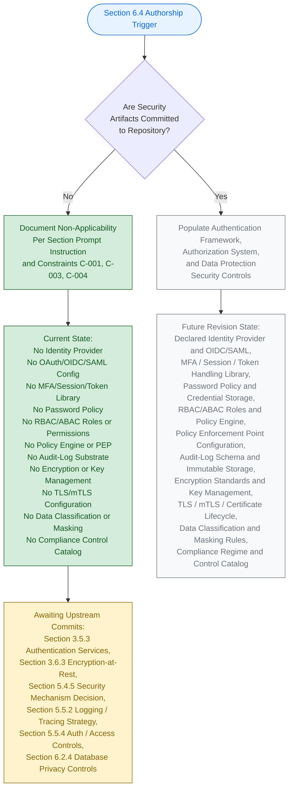

#### 6.4.5.2 Visual-Grammar Conformance

The diagram in Section 6.4.5.1 conforms to the colour grammar established by this Specification, as documented in Section 5.6.1 and reproduced in Sections 6.1.5.2, 6.2.6.2, and 6.3.5.2.

| Colour | Hex (Fill / Stroke) | Semantic Meaning |
|--------|----------------------|-------------------|
| Blue | `#e7f3ff` / `#0066cc` | Section authorship entry point |
| Green | `#d4edda` / `#155724` | Verifiable, present state |
| Grey | `#f8f9fa` / `#6c757d` | Prospective future state |
| Yellow | `#fff3cd` / `#856404` | Pending upstream activity |

The green-shaded nodes represent the verifiable, present authorship path; the grey-shaded nodes represent the prospective path that will be taken in a future revision once security artifacts are added to the codebase; the yellow-shaded node identifies the pending upstream activities required to unlock those subsequent revisions; and the blue-shaded node marks the Section authorship entry point.

---

### 6.4.6 Required Diagrams Status

The Section 6.4 prompt requests three architectural diagrams: Authentication Flow Diagrams, Authorization Flow Diagrams, and Security Zone Diagrams. Per Constraint C-004 (Section 2.7.2), each of these diagrams remains explicitly empty until upstream security artifacts are committed.

#### 6.4.6.1 Diagram-Exclusion Justification

Producing any of the prompt-required security diagrams in the absence of underlying authentication, authorization, and data-protection artifacts would violate Constraint C-001 (no invention) and Constraint C-004 (diagrams remain empty until upstream artifacts are populated). Section 5.3.3 establishes the identical posture for Component Interaction, State Transition, and Sequence diagrams; Section 5.5.7 establishes the identical posture for Error-Handling Flow diagrams; Sections 6.1.6, 6.2.7, and 6.3.6 establish the identical posture for their respective prompt-required diagrams.

| Required Diagram (per Section 6.4 prompt) | Diagram Status | Governance Basis |
|---------------------------------------------|----------------|------------------|
| Authentication Flow Diagram | Explicitly empty — TBD | Constraint C-001, C-004 |
| Authorization Flow Diagram | Explicitly empty — TBD | Constraint C-001, C-004 |
| Security Zone Diagram | Explicitly empty — TBD | Constraint C-001, C-004 |

#### 6.4.6.2 Diagram-Population Prerequisites

Each prompt-required diagram has a specific set of upstream artifacts that must be committed before it can be populated. The table below records these prerequisites for traceability with Section 5.7.1 and Section 6.4.8 below.

| Diagram | Required Upstream Artifact(s) |
|---------|--------------------------------|
| Authentication Flow | Identity-provider configuration, OAuth 2.0 / OIDC client setup, token issuance/validation library, session or credential storage strategy, MFA factor configuration |
| Authorization Flow | RBAC / ABAC / ReBAC role and permission taxonomy, policy decision point (PDP) and policy enforcement point (PEP), scope/claim definitions, resource-ownership model |
| Security Zone | Declared network topology, declared trust boundaries, declared DMZ / private / internal / restricted zone definitions, declared traffic flow rules and segmentation policies |

#### 6.4.6.3 Security Policy Documentation Status

The Section 6.4 prompt's output-format requirement to "use Markdown tables for security policies" cannot be satisfied with declared policies at the current repository lifecycle stage. Section 5.5.4 verifies the absence of all security-related configuration files, secret-management directives, identity-provider integrations, and access-control policies. With no policy declared in any form, the security-policy tables across Sections 6.4.2, 6.4.3, and 6.4.4 are necessarily populated with `None declared — TBD` entries. This documentation completeness will be achieved in the revision triggered by the first authentication-, authorization-, or data-protection-artifact commit (see Section 6.4.8.1).

#### 6.4.6.4 Compliance Requirements Documentation Status

The Section 6.4 prompt's output-format requirement to "document compliance requirements" cannot be satisfied at the current repository lifecycle stage. Section 6.2.4 establishes the verified absence of every compliance dimension (data classification taxonomy, retention duration, restore verification, RPO/RTO targets, encryption configurations, audit-log storage, identity-provider integration, access-control policies). Until a compliance regime (SOC 2, ISO 27001, HIPAA, PCI DSS, GDPR, CCPA, FedRAMP, or other) is declared and accompanying control configurations are committed, the compliance-requirements documentation remains TBD.

---

### 6.4.7 Standard Security Practices Reference

The Section 6.4 prompt's explicit instruction requires that this section "explain which standard security practices will be followed instead." The standard security practices enumerated below are referenced as the framework that **will** govern Section 6.4 once the corresponding artifacts are committed to the repository. Per Constraint C-001 (Section 2.7.2), this enumeration is not a declaration of adopted practices for the current repository state; it is a forward-looking reference catalog tied to specific upstream-section TBD entries that, when resolved, will activate each practice.

#### 6.4.7.1 Authentication-Framework Standard Practices

| Standard Practice (Forward-Looking) | Activating Upstream Artifact |
|---------------------------------------|--------------------------------|
| Federated identity via OAuth 2.0 / OpenID Connect | First identity-provider configuration committed (Section 3.5.3) |
| Multi-factor authentication with TOTP, WebAuthn/FIDO2, or push factor | First MFA integration artifact committed (Section 3.5.3) |
| Short-lived access tokens with refresh-token rotation | First token issuance/validation library committed (Section 3.5.3) |
| Password hashing with bcrypt / Argon2 / scrypt and breach-password lookups | First credential-storage configuration committed (Section 5.5.4) |

#### 6.4.7.2 Authorization-System Standard Practices

| Standard Practice (Forward-Looking) | Activating Upstream Artifact |
|---------------------------------------|--------------------------------|
| Least-privilege role-based access control with role-permission bindings | First RBAC artifact committed (Section 5.5.4; Section 6.3.2.3) |
| Centralized policy engine integration (OPA / Casbin / Cedar) | First policy engine integration committed (Section 6.3.2.3) |
| Policy enforcement at gateway, sidecar, or middleware boundary | First PEP configuration committed (Section 6.3.2.3) |
| Immutable, tamper-evident audit logging of access and policy decisions | First audit-log emission instrumentation committed (Section 5.5.2; Section 6.2.4.3) |

#### 6.4.7.3 Data-Protection Standard Practices

| Standard Practice (Forward-Looking) | Activating Upstream Artifact |
|---------------------------------------|--------------------------------|
| Encryption-at-rest using AES-256-GCM or equivalent authenticated encryption | First encryption-at-rest configuration committed (Section 3.6.3; Section 6.2.4.2) |
| Centralized key management (AWS KMS, GCP KMS, Azure Key Vault, HashiCorp Vault) with rotation | First key-management subsystem configuration committed (Section 5.5.4; Section 6.2.4.2) |
| TLS 1.2+ for all transport with mutual TLS for inter-service communication | First TLS / certificate configuration committed (Section 6.2.4.2; Section 5.5.4) |
| Data classification with PII / PHI / PCI masking and pseudonymization | First data-classification / masking-policy artifact committed (Section 6.2.4.2) |

These forward-looking practices are derived from the upstream artifact references that already exist in this Specification (Sections 3.5.3, 3.6.3, 5.4.5, 5.5.2, 5.5.4, 6.2.4, 6.3.2.3) and reflect the canonical industry-standard controls associated with each declared TBD dimension. They become authoritative only upon the corresponding commit, per Assumption A-003 (Section 2.7.1).

---

### 6.4.8 Future Revision Triggers

Consistent with Section 5.7.1 and Assumption A-004 (Section 2.7.1), a revision of Section 6.4 will be triggered when any of the events below occurs in the repository. Each trigger maps to the specific Section 6.4 subsections that will become authorable once the corresponding upstream artifact is committed.

#### 6.4.8.1 Trigger-to-Subsection Mapping

| Trigger Event | Section 6.4 Subsection(s) Unblocked |
|---------------|---------------------------------------|
| First identity-provider configuration committed (Auth0, Cognito, Okta, Azure AD, Firebase Auth, Keycloak) | 6.4.2.1 (Identity Management) |
| First OAuth 2.0 / OIDC / SAML client configuration committed | 6.4.2.1 (Identity Management); 6.4.2.4 (Token Handling) |
| First MFA / TOTP / WebAuthn / push-factor artifact committed | 6.4.2.2 (Multi-Factor Authentication) |
| First session-management library configuration committed (e.g., `express-session`, `Flask-Login`, signed-cookie middleware) | 6.4.2.3 (Session Management) |
| First token issuance / validation library committed (JWT / PASETO / opaque-token library) | 6.4.2.4 (Token Handling) |
| First password-policy declaration / bcrypt / Argon2 / scrypt configuration committed | 6.4.2.5 (Password Policies) |
| First RBAC / ABAC / ReBAC role and permission definitions committed | 6.4.3.1 (RBAC); 6.4.3.2 (Permission Management); 6.4.3.3 (Resource Authorization) |
| First policy engine integration committed (OPA / Casbin / Cedar / AWS IAM SDK) | 6.4.3.4 (Policy Enforcement Points) |
| First audit-log emission / immutable audit-trail storage committed | 6.4.3.5 (Audit Logging) |
| First encryption library / KMS configuration committed (AWS KMS / GCP KMS / Azure Key Vault / Vault / HSM) | 6.4.4.1 (Encryption Standards); 6.4.4.2 (Key Management) |
| First TLS certificate / mTLS configuration committed | 6.4.4.4 (Secure Communication) |
| First data-classification / PII / PHI / PCI masking policy committed | 6.4.4.3 (Data Masking Rules) |
| First compliance regime declaration / control catalog committed (SOC 2 / HIPAA / GDPR / PCI DSS / ISO 27001 / FedRAMP) | 6.4.4.5 (Compliance Controls); 6.4.6.4 (Compliance Requirements Documentation) |
| First network-segmentation / VPC / security-group / trust-boundary declaration committed | 6.4.6.2 (Security Zone Diagram); 6.4.4.4 (Secure Communication) |

Until at least one of these triggers fires, Section 6.4 will continue to reflect the non-applicability posture documented herein, in compliance with Constraint C-001 and Assumption A-003 (Section 2.7.1). The triggers above are a refinement of the Section 5.7.1 trigger table, scoped specifically to the security tier.

#### 6.4.8.2 Cross-Section Coordination

When a Section 6.4 revision is triggered, the following companion sections must be revised in lockstep to preserve cross-reference consistency required by Constraint C-003. The table below records the coordination map.

| Section 6.4 Subsection | Companion Sections Requiring Co-Revision |
|--------------------------|---------------------------------------------|
| 6.4.2 (Authentication Framework) | Section 3.5.3 (Authentication Services); Section 5.4.5 (Security Mechanism Decision); Section 5.5.4 (Auth/Authz Framework); Section 6.3.2.2 (Authentication Methods) |
| 6.4.3 (Authorization System) | Section 5.5.2 (Logging and Tracing Strategy); Section 5.5.4 (Auth/Authz Framework); Section 6.2.4.3 (Audit and Access Control); Section 6.3.2.3 (Authorization Framework) |
| 6.4.4 (Data Protection) | Section 3.6.3 (Encryption-at-Rest); Section 5.5.4 (Data-Protection Controls); Section 6.2.4 (Database Privacy/Compliance Controls); Section 6.3.4.1 (Secret/Credential Management) |

---

### 6.4.9 Versioning Posture

Consistent with the versioning posture documented in Sections 2.7.3, 3.9.3, 4.7.1, 5.7.2, 6.1.7.2, 6.2.9.1, and 6.3.8.1, Section 6.4 carries the version status recorded below. The change log will begin with the first populated revision triggered by any of the events enumerated in Section 6.4.8.1.

#### 6.4.9.1 Section Version Tracking

| Versioning Element | Current State | Notes |
|----------------------|-----------------|-------|
| Section 6.4 Authorship Revision | v1.0 (TBD Posture) | First authoring pass under non-applicability declaration |
| Individual Authentication-Framework Element Versions | v0.0 — Not Yet Authored | No authentication artifacts exist to version |
| Individual Authorization-System Element Versions | v0.0 — Not Yet Authored | No authorization artifacts exist to version |
| Individual Data-Protection Element Versions | v0.0 — Not Yet Authored | No data-protection artifacts exist to version |
| Change Log | Not yet initiated | Will begin with the first populated revision |

#### 6.4.9.2 Default Technology Stack Non-Adoption

Section 3.8.1 of this Specification enumerates a documentation-framework default technology stack reference that lists **Auth0** as a candidate Authentication default. Per Section 3.8.3 and Section 5.4.6, the default reference is **explicitly not adopted** as the security-architecture decision for `April17Sec_1` in compliance with Constraint C-001 (no invention), Assumption A-003 (external artifacts non-authoritative), and Assumption A-004 (defaults may be superseded). No Auth0 SDK reference, no Auth0 tenant configuration, and no Auth0 client/application configuration exists in the repository. The default Auth0 reference remains a candidate suggestion only; it does not constitute an identity-provider, token-issuance, or session-management decision for this system until and unless it is committed to the codebase. Section 6.4 therefore does not infer any identity-provider selection, OAuth/OIDC client configuration, MFA modality, password policy, or session storage strategy from the default reference.

---

### 6.4.10 Summary of Posture

The combination of (a) the explicit instruction in the Section 6.4 prompt to declare non-applicability when the system does not require specific security considerations beyond standard practices; (b) the verified absence across every security-related repository category established by Sections 1.3.2, 2.5.4, 3.5.3, 3.6.3, 5.4.5, 5.5.2, 5.5.4, 6.2.4, and 6.3.2.3; (c) the governance constraints C-001, C-003, and C-004 (Section 2.7.2); and (d) the assumptions A-001, A-002, A-003, and A-004 (Section 2.7.1) yields a single, unambiguous posture for this section: **Detailed Security Architecture is not applicable for this system at the current repository lifecycle stage**.

This posture will be reviewed and revised in accordance with the triggers enumerated in Section 6.4.8.1. The earliest trigger most likely to fire is the first identity-provider configuration commit (Auth0, Cognito, Okta, Azure AD, Firebase Auth, or Keycloak), which would unblock authorship of Section 6.4.2 (Authentication Framework) and cascade through Sections 6.4.3 (Authorization System) and 6.4.4 (Data Protection) as additional security-tier artifacts are committed. Until such triggers fire, Section 6.4 stands as a deliberate, evidence-backed statement of non-applicability — fully consistent with the precedents set by Sections 6.1 (Core Services Architecture), 6.2 (Database Design), and 6.3 (Integration Architecture). The forward-looking catalog of standard security practices enumerated in Section 6.4.7 represents the canonical industry-standard controls that will be activated dimension by dimension as each upstream artifact is committed.

---

### 6.4.11 References

#### 6.4.11.1 Files Examined

- `README.md` — Sole tracked file in the repository (14 bytes, single line `# April17Sec_1`); confirms the Repository Initialization lifecycle stage and the verified absence of all security-architecture artifacts (no identity-provider configurations, no authentication libraries, no authorization policies, no encryption keys, no audit-log instrumentation, no TLS certificates, no password policy declarations, no MFA artifacts, no role/permission taxonomies, no compliance-control configurations).
- Repository root (`/`) — Contains only `README.md` and the `.git/` metadata directory; verified zero application subfolders, zero source files, zero configuration files, zero dependency manifests, zero security configurations, zero key/certificate files, zero authentication libraries, zero `.env` files, zero `*.crt` / `*.key` / `*.pem` files, and zero authentication, authorization, or data-protection source files.

#### 6.4.11.2 Search Operations Performed

- Semantic search for "authentication authorization security policies access control" — returned empty results (`[]`), confirming no security source files exist in the repository.
- Semantic search for "encryption secrets keys credentials tokens" — returned empty results (`[]`), confirming no cryptographic source files exist in the repository.
- Semantic search for "JWT OAuth identity provider session management password" — returned empty results (`[]`), confirming no authentication source files exist in the repository.
- Folder search for "security auth authentication policies configuration" — returned empty results (`[]`), confirming no security-related directories exist in the repository.
- Filesystem inspection for `*.env`, `*.crt`, `*.key`, `*.pem`, `auth*`, `security*`, `*oauth*`, `*jwt*` — zero matches within the repository.

#### 6.4.11.3 Technical Specification Sections Cross-Referenced

- **Section 1.1 EXECUTIVE SUMMARY** — Project identity, repository metadata, and Repository Initialization lifecycle stage
- **Section 1.2 SYSTEM OVERVIEW** — Verified absence of integration points, components, KPIs, technology stack (1.2.1, 1.2.2, 1.2.3)
- **Section 1.3 SCOPE** — **CRITICAL** — Authoritative out-of-scope declaration: *"All authentication, authorization, and security controls (no security artifacts exist)"* (Section 1.3.2)
- **Section 1.4 SCOPE DECLARATION SUMMARY** — Consolidated TBD posture across all in-scope and out-of-scope categories
- **Section 2.4 FEATURE RELATIONSHIPS** — Integration Points table with Identity Providers recorded as `No — TBD` (Section 2.4.2)
- **Section 2.5 IMPLEMENTATION CONSIDERATIONS** — **CRITICAL** — Section 2.5.4 records every security implication (Authentication Mechanisms, Authorization Policies, Data-Protection Controls, Audit & Logging Provisions) as `No — TBD`
- **Section 2.7 ASSUMPTIONS, CONSTRAINTS, AND VERSIONING** — **CRITICAL** — Governance constraints C-001, C-003, C-004 (Section 2.7.2); assumptions A-001, A-002, A-003, A-004 (Section 2.7.1); versioning posture (Section 2.7.3)
- **Section 3.4 OPEN SOURCE DEPENDENCIES** — Verified absence of all dependency manifests (no security libraries, no JWT libraries, no OAuth libraries, no cryptographic libraries can be loaded)
- **Section 3.5 THIRD-PARTY SERVICES** — **CRITICAL** — Section 3.5.3 records every authentication service (Identity-Provider Selection, OAuth 2.0/OIDC Client, SAML/Federation, Token Issuance/Validation, MFA Integration) as `No — TBD`
- **Section 3.6 DATABASES AND STORAGE** — **CRITICAL** — Section 3.6.3 records Encryption-at-Rest Configuration as `No — TBD`
- **Section 3.8 DEFAULT TECHNOLOGY STACK REFERENCE** — Default Auth0 reference for Authentication explicitly NOT adopted
- **Section 4.4 TECHNICAL IMPLEMENTATION** — Error handling, retry, notification flows all TBD (no security-incident response workflows)
- **Section 4.5 REQUIRED DIAGRAMS** — Diagram-empty pattern with authorship lifecycle as sole permitted form
- **Section 4.6 SWIM LANES, TIMING, AND SLA CONSIDERATIONS** — Verified absence of all timing, latency, and availability targets
- **Section 5.2 HIGH-LEVEL ARCHITECTURE** — No components, no integration topology, no external integration points
- **Section 5.3 COMPONENT DETAILS** — No components to detail, diagram-empty pattern
- **Section 5.4 TECHNICAL DECISIONS** — **CRITICAL** — Section 5.4.5 records the Security Mechanism Decision as TBD; Section 5.4.6 confirms default stack non-adoption
- **Section 5.5 CROSS-CUTTING CONCERNS** — **CRITICAL** — Section 5.5.4 records the authentication and authorization framework as TBD with the verbatim statement that the current repository state explicitly excludes all authentication, authorization, and security controls; Section 5.5.2 records logging and tracing strategy as TBD
- **Section 5.6 ARCHITECTURE AUTHORSHIP LIFECYCLE** — **CRITICAL** — Visual-grammar template for the authorship lifecycle diagram (Section 5.6.1)
- **Section 5.7 FUTURE SECTION REVISION TRIGGERS** — Trigger event taxonomy that Section 6.4.8 refines for the security tier
- **Section 6.1 CORE SERVICES ARCHITECTURE** — **CRITICAL TEMPLATE** — Non-applicability declaration structure originating template
- **Section 6.2 DATABASE DESIGN** — **CRITICAL TEMPLATE** — Refined non-applicability template with multi-subsection verified-absence pattern; Section 6.2.4 (Compliance Considerations) directly informs Section 6.4.4 (Data Protection)
- **Section 6.3 INTEGRATION ARCHITECTURE** — **CRITICAL TEMPLATE** — Most recent precedent that Section 6.4 mirrors; Sections 6.3.2.2 (Authentication Methods) and 6.3.2.3 (Authorization Framework) directly inform Section 6.4.2 and Section 6.4.3

## 6.5 Monitoring and Observability

### 6.5.1 Applicability Declaration

**Detailed Monitoring Architecture is not applicable for this system.**

The `April17Sec_1` repository is at the Repository Initialization (Scaffold) lifecycle stage as established in Section 1.1 and Section 1.2.2. The repository contains exactly one tracked file (`README.md`, 14 bytes) whose entire content is the single Markdown heading `# April17Sec_1`. No metrics-collection configuration, no log-aggregation pipeline, no distributed-tracing instrumentation, no alerting integration, no dashboard definition, no health-check endpoint, no SLA / SLO declaration, no on-call rotation, no runbook, and no post-mortem template exists anywhere in the codebase. There is, consequently, **no telemetry surface, no observability pipeline, no incident-response substrate, and no operational dashboard against which a Monitoring Architecture could be authored**.

This posture is the unambiguous and required response per the Section 6.5 prompt's explicit instruction: *"If the system does not require specific monitoring beyond basic health checks, clearly state 'Detailed Monitoring Architecture is not applicable for this system' and explain which basic monitoring practices will be followed instead."* The basic monitoring practices that will be followed once the prerequisite artifacts are committed are enumerated in Section 6.5.7 below.

Section 1.2.3 records the authoritative success-criteria posture for the current repository state: *"The repository contains no telemetry configuration, no analytics instrumentation, no monitoring manifest, and no documented metric definitions."* Section 1.3.2 reaffirms the out-of-scope declaration: *"All operational tooling, monitoring, and observability components (no configuration exists)."* Section 5.5.1 (Monitoring and Observability Approach) records every observability concern — Metrics Collection (Prometheus, CloudWatch), Distributed Tracing (OpenTelemetry, Jaeger), Log Aggregation Backend, Alerting / On-Call (PagerDuty, Opsgenie), Error-Reporting (Sentry, Rollbar), and Uptime / Synthetic Monitoring — as `No — TBD`. Section 4.4.2 confirms verbatim that *"no error notification flows can be documented because no APM (Datadog, Sentry, New Relic), no logging aggregation (ELK, Splunk), no alerting (PagerDuty, Opsgenie), and no error-reporting service has been integrated."*

#### 6.5.1.1 Categorical Justification

The non-applicability of Detailed Monitoring Architecture is grounded in four independently sufficient categorical reasons, each derived from verifiable repository evidence and from upstream sections of this Specification.

| # | Categorical Reason | Authoritative Cross-Reference |
|---|---------------------|--------------------------------|
| (a) | No telemetry, metrics, logging, tracing, or monitoring manifest exists in the repository | Section 1.2.3; Section 1.3.2; Section 5.5.1; Section 5.5.2 |
| (b) | No SLA / SLO / latency budget / availability target / error-budget policy has been declared | Section 4.6.2; Section 5.5.5 |
| (c) | No APM, logging-aggregation, alerting, error-reporting, or uptime-monitoring service is integrated | Section 3.5.2; Section 3.5.3; Section 4.4.2 |
| (d) | No incident-response substrate (notification channels, escalation ladder, runbook library, post-mortem process) exists | Section 4.4.2; Section 5.5.3; Section 5.5.6 |

**Reason (a) — No telemetry, metrics, logging, tracing, or monitoring manifest exists.** Section 1.2.3 records that the repository contains no telemetry configuration, no analytics instrumentation, no monitoring manifest, and no documented metric definitions. Section 1.3.2 lists *"All operational tooling, monitoring, and observability components (no configuration exists)"* as out of scope of the current repository state. Section 5.5.1 records every observability concern as `No — TBD`. Section 5.5.2 records the logging and tracing strategy in its entirety as TBD across every dimension: Log Format and Schema, Log-Level Taxonomy, Log Retention and Sampling, Trace-Context Propagation, and Trace Sampling and Span Attributes.

**Reason (b) — No SLA / SLO / latency budget / availability target / error-budget policy is declared.** Section 4.6.2 records every timing and SLA dimension as `None declared — TBD` (End-to-End Latency Budget, Per-Step Timing Constraint, Throughput / Concurrency Target, Availability SLO, Error-Budget Policy). Section 5.5.5 mirrors this for the Cross-Cutting Concerns view. Section 1.2.3 records no OKRs, no SLOs, no quantitative targets, and no KPIs. Without declared SLA dimensions, SLA monitoring, capacity tracking, and performance-metric definitions cannot be evidence-grounded.

**Reason (c) — No APM, logging-aggregation, alerting, error-reporting, or uptime-monitoring service is integrated.** Section 3.5.2 verifies every monitoring-adjacent third-party service category as absent — Application Performance Monitoring (Datadog, New Relic, AppDynamics, Sentry), Logging Aggregation (ELK, Splunk, Loggly, Logz.io), and Analytics / Telemetry (Segment, Mixpanel, Amplitude). Section 3.5.3 records every observability tool as TBD: Metrics Collection (Prometheus, CloudWatch), Distributed Tracing (OpenTelemetry, Jaeger), Log Aggregation Backend, Alerting / On-Call Integration (PagerDuty, Opsgenie), Error-Reporting Service (Sentry, Rollbar), and Uptime / Synthetic Monitoring. Section 4.4.2 confirms that no error-notification flows can be documented because none of these services has been integrated.

**Reason (d) — No incident-response substrate exists.** Section 4.4.2 records every notification element as TBD (Notification Channels, Severity-Classification Taxonomy, Escalation Ladder / On-Call Rota, Notification Suppression / Dedup Policy) and every recovery element as TBD (RPO / RTO Targets, Backup / Snapshot Cadence, Restore Verification Procedure, Cross-Region / Cross-AZ Failover Plan, Post-Incident Review Process). Section 5.5.3 confirms the identical posture from the Cross-Cutting Concerns view. Section 5.5.6 records the Post-Incident Review Process as TBD. Without notification channels, severity taxonomies, on-call rotations, or post-mortem processes, alert routing, escalation, runbooks, and improvement tracking cannot be evidence-grounded.

#### 6.5.1.2 Governance Basis for the Non-Applicability Declaration

Authorship of this section is governed by the constraints recorded in Section 2.7.2. The constraints listed below directly justify the non-applicability declaration and the format used to document it.

| Constraint ID | Constraint Statement | Applicability to Section 6.5 |
|---------------|------------------------|-------------------------------|
| C-001 | No features, requirements, or relationships may be invented; all entries must be grounded in verifiable repository content | Forbids fabrication of metrics, log streams, traces, alert rules, dashboards, runbooks, SLAs, or any monitoring-architecture element |
| C-003 | Cross-references to companion sections must remain consistent with the TBD posture established in Section 1 | Mandates that Section 6.5 mirror the TBD posture declared in Sections 1.2.3, 1.3.2, 3.5.2, 3.5.3, 4.4.2, 4.6.2, 5.5.1, 5.5.2, 5.5.3, 5.5.5, and 5.5.6 |
| C-004 | Diagrams remain empty until upstream artifacts are populated | Forbids producing monitoring-architecture diagrams, alert-flow diagrams, or dashboard-layout diagrams |

Assumption A-001 (Section 2.7.1) further establishes that the repository's verifiable state as of the initial commit is the authoritative input for every architectural claim. Assumption A-002 (Section 2.7.1) establishes that the absence of monitoring artifacts reflects the project's actual lifecycle stage (Repository Initialization), not an omission by this Specification. Assumption A-003 (Section 2.7.1) establishes that no external requirements artifacts (monitoring playbooks, dashboard catalogs, alert policies, runbooks stored elsewhere) are authoritative until committed to the codebase. Assumption A-004 (Section 2.7.1) confirms that subsequent revisions of this Specification will replace TBD markers with evidence-backed declarations once corresponding monitoring artifacts are committed.

---

### 6.5.2 Monitoring Infrastructure — Verified Absence

This subsection records, dimension by dimension, the verified absence of every Monitoring Infrastructure attribute required by the Section 6.5 prompt — Metrics collection, Log aggregation, Distributed tracing, Alert management, and Dashboard design. Each row pairs a prompt-required dimension with its authoritative upstream cross-reference. Per Constraint C-001 (no invention), no synthetic metrics backends, log pipelines, trace collectors, alert managers, or dashboard catalogs have been introduced.

#### 6.5.2.1 Metrics Collection Dimensions

Metrics collection requires (a) a declared metrics backend (Prometheus, CloudWatch, Datadog, New Relic, InfluxDB, OpenTelemetry Collector), (b) declared metric emission instrumentation (counters, gauges, histograms, summaries), and (c) a declared scrape / push interval, retention policy, and cardinality budget. Section 3.5.3 records Metrics Collection as `No — TBD`; Section 5.5.1 mirrors this for the Cross-Cutting Concerns view.

| Metrics-Collection Element | Verifiable State | Authoritative Cross-Reference |
|------------------------------|-------------------|--------------------------------|
| Metrics Backend (Prometheus / CloudWatch / Datadog / New Relic) | None declared — TBD | Section 3.5.3; Section 5.5.1 |
| Metric Instrumentation Library / SDK | None declared — TBD | Section 3.5.3; Section 5.5.1 |
| Scrape / Push Interval and Retention Policy | None declared — TBD | Section 5.5.1; Section 5.5.2 |
| Cardinality Budget and Label Taxonomy | None declared — TBD | Section 5.5.1; Section 5.5.2 |

#### 6.5.2.2 Log Aggregation Dimensions

Log aggregation requires (a) a declared log shipping mechanism (Fluentd, Fluent Bit, Logstash, Vector, CloudWatch Agent, application-direct log forwarding), (b) a declared log aggregation backend (ELK / Elastic Stack, Splunk, Loki, Loggly, CloudWatch Logs, Datadog Logs), and (c) a declared log format, retention policy, and index lifecycle policy. Section 3.5.2 verifies Logging Aggregation as absent; Section 3.5.3 records Log Aggregation Backend as `No — TBD`; Section 5.5.2 records every logging dimension as TBD.

| Log-Aggregation Element | Verifiable State | Authoritative Cross-Reference |
|---------------------------|-------------------|--------------------------------|
| Log Aggregation Backend (ELK / Splunk / Loki / CloudWatch Logs) | None declared — TBD | Section 3.5.2; Section 3.5.3; Section 5.5.1 |
| Log Shipping Mechanism (Fluentd / Vector / CloudWatch Agent) | None declared — TBD | Section 5.5.1; Section 5.5.2 |
| Log Format and Schema (structured JSON / plaintext) | None declared — TBD | Section 5.5.2 |
| Log-Level Taxonomy and Retention / Sampling Policy | None declared — TBD | Section 5.5.2 |

#### 6.5.2.3 Distributed Tracing Dimensions

Distributed tracing requires (a) a declared tracing backend (Jaeger, Zipkin, Tempo, AWS X-Ray, Datadog APM, Honeycomb), (b) a declared instrumentation library (OpenTelemetry SDK, OpenTracing-compatible client), and (c) a declared trace-context propagation format (W3C TraceContext, B3, Jaeger), sampling rate, and span-attribute taxonomy. Section 3.5.3 records Distributed Tracing as `No — TBD`; Section 5.5.2 records every tracing dimension as TBD.

| Distributed-Tracing Element | Verifiable State | Authoritative Cross-Reference |
|-------------------------------|-------------------|--------------------------------|
| Tracing Backend (Jaeger / Zipkin / Tempo / AWS X-Ray / Datadog APM) | None declared — TBD | Section 3.5.3; Section 5.5.1 |
| Instrumentation Library (OpenTelemetry / OpenTracing) | None declared — TBD | Section 3.5.3; Section 5.5.2 |
| Trace-Context Propagation Format (W3C / B3 / Jaeger) | None declared — TBD | Section 5.5.2 |
| Trace Sampling Strategy and Span-Attribute Taxonomy | None declared — TBD | Section 5.5.2 |

#### 6.5.2.4 Alert Management Dimensions

Alert management requires (a) a declared alerting backend (Prometheus Alertmanager, Grafana Alerting, CloudWatch Alarms, Datadog Monitors, PagerDuty, Opsgenie, VictorOps), (b) declared alert rules with thresholds and evaluation windows, and (c) declared routing, grouping, and silencing policies. Section 3.5.3 records Alerting / On-Call Integration as `No — TBD`; Section 4.4.2 confirms the absence of all notification channels, severity-classification taxonomies, escalation ladders / on-call rotas, and notification suppression / dedup policies.

| Alert-Management Element | Verifiable State | Authoritative Cross-Reference |
|----------------------------|-------------------|--------------------------------|
| Alerting Backend (Alertmanager / PagerDuty / Opsgenie / VictorOps) | None declared — TBD | Section 3.5.3; Section 4.4.2 |
| Alert Rule Catalog (thresholds, evaluation windows, durations) | None declared — TBD | Section 4.4.2; Section 5.5.3 |
| Alert Routing, Grouping, and Silencing Policy | None declared — TBD | Section 4.4.2; Section 5.5.3 |
| Notification Suppression / Deduplication Policy | None declared — TBD | Section 4.4.2; Section 5.5.3 |

#### 6.5.2.5 Dashboard Design Dimensions

Dashboard design requires (a) a declared dashboarding platform (Grafana, Datadog, Kibana, CloudWatch Dashboards, New Relic, Honeycomb Boards), (b) declared dashboard definitions (JSON / YAML / provisioned-as-code), and (c) a declared dashboard taxonomy organized around RED (Rate, Errors, Duration) / USE (Utilization, Saturation, Errors) or analogous methodologies. Section 3.5.3 confirms that no dashboarding platform is integrated; Section 5.5.1 confirms that no observability concern of any form is declared.

| Dashboard-Design Element | Verifiable State | Authoritative Cross-Reference |
|----------------------------|-------------------|--------------------------------|
| Dashboarding Platform (Grafana / Datadog / Kibana / CloudWatch) | None declared — TBD | Section 3.5.3; Section 5.5.1 |
| Dashboard-as-Code Definition (JSON / YAML provisioning) | None declared — TBD | Section 5.5.1 |
| Dashboard Taxonomy (RED / USE / Four Golden Signals) | None declared — TBD | Section 5.5.1 |
| Dashboard Access Control and Multi-Tenant Scoping | None declared — TBD | Section 5.5.1 |

#### 6.5.2.6 Metrics Definitions Table — Verified Absence

The Section 6.5 prompt requires that "Markdown tables for metrics definitions" be produced as an output-format deliverable. Per Constraint C-001 (no invention), the table below records the four canonical metric categories — System (RED/USE infrastructure metrics), Application (transaction throughput, latency, error rate), Business (domain-specific KPIs), and SLA (composite SLI indicators) — against the four authoritative TBD references that govern them. Every cell is recorded as "None declared — TBD" pending the upstream artifact commit.

| Metric Category | Representative Metric Type | Verifiable State | Authoritative Cross-Reference |
|-------------------|------------------------------|-------------------|--------------------------------|
| System Metrics | CPU / Memory / Disk / Network utilization | None declared — TBD | Section 5.5.1; Section 5.5.5 |
| Application Metrics | Request rate, error rate, latency percentiles | None declared — TBD | Section 4.6.2; Section 5.5.5 |
| Business Metrics | Domain-specific KPIs and conversion events | None declared — TBD | Section 1.2.3; Section 5.5.1 |
| SLA / SLI Metrics | Availability ratio, error budget burn rate | None declared — TBD | Section 4.6.2; Section 5.5.5 |

---

### 6.5.3 Observability Patterns — Verified Absence

This subsection records the verified absence of every Observability Patterns attribute required by the Section 6.5 prompt — Health checks, Performance metrics, Business metrics, SLA monitoring, and Capacity tracking. Each row pairs a prompt-required dimension with its authoritative upstream cross-reference.

#### 6.5.3.1 Health Checks Dimensions

Health checks require (a) at least one deployable workload exposing health-probe endpoints (liveness, readiness, startup) or equivalent process-level health signals, (b) a declared runtime platform that interprets those probes (Kubernetes, ECS, Nomad, systemd, supervisord), and (c) declared probe thresholds and timeouts. Section 1.2.2 verifies that the repository contains zero Application Source Modules, zero Back-End Services, and zero Infrastructure-as-Code Definitions; Section 5.2.2 confirms that no components of any kind exist.

| Health-Check Element | Verifiable State | Authoritative Cross-Reference |
|------------------------|-------------------|--------------------------------|
| Liveness Probe Endpoint / Configuration | None declared — TBD | Section 1.2.2; Section 5.5.1 |
| Readiness Probe Endpoint / Configuration | None declared — TBD | Section 1.2.2; Section 5.5.1 |
| Startup Probe Endpoint / Configuration | None declared — TBD | Section 1.2.2; Section 5.5.1 |
| Dependency-Health Aggregation Endpoint (synthetic check) | None declared — TBD | Section 3.5.3; Section 5.5.1 |

#### 6.5.3.2 Performance Metrics Dimensions

Performance metrics require (a) a declared runtime workload emitting latency, throughput, and saturation signals; (b) a declared metrics-collection backend (Section 6.5.2.1); and (c) declared performance targets (latency percentiles, throughput thresholds, saturation ceilings). Section 5.5.5 records every performance dimension as TBD; Section 2.5.2 records performance requirements as TBD; Section 2.5.3 records scalability considerations as TBD.

| Performance-Metric Element | Verifiable State | Authoritative Cross-Reference |
|------------------------------|-------------------|--------------------------------|
| Latency Percentile Targets (P50 / P95 / P99) | None declared — TBD | Section 4.6.2; Section 5.5.5 |
| Throughput / Requests-Per-Second Target | None declared — TBD | Section 4.6.2; Section 5.5.5 |
| Resource Saturation Thresholds (CPU / Memory / Pool) | None declared — TBD | Section 5.5.5 |
| Four Golden Signals Emission (Latency / Traffic / Errors / Saturation) | None declared — TBD | Section 5.5.1; Section 5.5.5 |

#### 6.5.3.3 Business Metrics Dimensions

Business metrics require (a) a declared product domain with measurable conversion / engagement / outcome events; (b) at least one application module emitting domain-events; and (c) a declared analytics pipeline (Segment, Mixpanel, Amplitude, custom analytics ingest) that aggregates those events. Section 1.2.3 records that no KPIs, no measurable objectives, and no critical success factors are declared. Section 3.5.2 verifies Analytics / Telemetry (Segment, Mixpanel, Amplitude) as absent from the repository.

| Business-Metric Element | Verifiable State | Authoritative Cross-Reference |
|---------------------------|-------------------|--------------------------------|
| Business KPI Definitions and Owners | None declared — TBD | Section 1.2.3 |
| Domain-Event Emission Instrumentation | None declared — TBD | Section 1.2.3; Section 5.5.1 |
| Analytics Pipeline (Segment / Mixpanel / Amplitude) | None declared — TBD | Section 3.5.2; Section 3.5.3 |
| Funnel / Cohort / Retention Reporting Surface | None declared — TBD | Section 1.2.3; Section 5.5.1 |

#### 6.5.3.4 SLA Monitoring Dimensions

SLA monitoring requires (a) a declared SLA / SLO / SLI taxonomy with quantitative targets; (b) a declared error-budget policy and burn-rate alerting; and (c) declared compliance reporting cadence. Section 4.6.2 records every timing and SLA dimension as `None declared — TBD`; Section 5.5.5 mirrors this; Section 1.2.3 records no OKRs, no SLOs, no quantitative targets, and no KPIs.

| SLA-Monitoring Element | Verifiable State | Authoritative Cross-Reference |
|--------------------------|-------------------|--------------------------------|
| Service Level Indicator (SLI) Definitions | None declared — TBD | Section 4.6.2; Section 5.5.5 |
| Service Level Objective (SLO) Quantitative Targets | None declared — TBD | Section 4.6.2; Section 5.5.5 |
| Service Level Agreement (SLA) Contractual Targets | None declared — TBD | Section 4.6.2; Section 5.5.5 |
| Error-Budget Policy and Burn-Rate Alerting | None declared — TBD | Section 4.6.2; Section 5.5.5 |

#### 6.5.3.5 Capacity Tracking Dimensions

Capacity tracking requires (a) a declared resource baseline (allocated CPU, memory, storage, network); (b) a declared resource-utilization metrics stream; and (c) declared capacity-planning thresholds and growth-rate forecasts. Section 5.5.5 records every performance and capacity dimension as TBD; Section 2.5.3 records scalability considerations as TBD; Section 1.2.2 verifies zero Infrastructure-as-Code Definitions, eliminating the substrate from which capacity baselines could be derived.

| Capacity-Tracking Element | Verifiable State | Authoritative Cross-Reference |
|-----------------------------|-------------------|--------------------------------|
| Resource Baseline (CPU / Memory / Storage / Network Allocation) | None declared — TBD | Section 1.2.2; Section 5.5.5 |
| Resource-Utilization Metric Stream | None declared — TBD | Section 5.5.1; Section 5.5.5 |
| Capacity-Planning Threshold and Headroom Policy | None declared — TBD | Section 5.5.5 |
| Growth-Rate Forecast and Scaling-Trigger Definitions | None declared — TBD | Section 5.5.5 |

#### 6.5.3.6 SLA Requirements Table — Verified Absence

The Section 6.5 prompt's output-format requirement to "document SLA requirements" cannot be satisfied with declared targets at the current repository lifecycle stage. Per Constraint C-001 (no invention), the table below records the four canonical SLA dimensions against the four authoritative TBD references that govern them. Every cell is recorded as "None declared — TBD" pending the upstream artifact commit.

| SLA Dimension | Target Form (Forward-Looking Only) | Verifiable State | Authoritative Cross-Reference |
|-----------------|--------------------------------------|-------------------|--------------------------------|
| Availability SLO | Percentage uptime over rolling window (e.g., 99.9%) | None declared — TBD | Section 4.6.2; Section 5.5.5 |
| Latency SLO | Percentile-based end-to-end response budget | None declared — TBD | Section 4.6.2; Section 5.5.5 |
| Throughput SLO | Sustained requests / events per second | None declared — TBD | Section 4.6.2; Section 5.5.5 |
| Error-Rate SLO | Maximum allowable error ratio per rolling window | None declared — TBD | Section 4.6.2; Section 5.5.5 |

---

### 6.5.4 Incident Response — Verified Absence

This subsection records the verified absence of every Incident Response attribute required by the Section 6.5 prompt — Alert routing, Escalation procedures, Runbooks, Post-mortem processes, and Improvement tracking. Each row pairs a prompt-required dimension with its authoritative upstream cross-reference. Section 4.4.2 (Error Notification Flows) and Section 5.5.6 (Disaster Recovery Procedures) are the primary upstream anchors for this subsection.

#### 6.5.4.1 Alert Routing Dimensions

Alert routing requires (a) a declared alerting backend with multi-channel routing capability (PagerDuty, Opsgenie, VictorOps, Slack, Microsoft Teams, email); (b) a declared severity-classification taxonomy (SEV1 / SEV2 / SEV3 or equivalent); and (c) a declared routing matrix mapping alert types to channels and recipients. Section 4.4.2 records every notification element as TBD.

| Alert-Routing Element | Verifiable State | Authoritative Cross-Reference |
|-------------------------|-------------------|--------------------------------|
| Notification Channels (email / SMS / paging / chat / webhook) | None declared — TBD | Section 4.4.2; Section 5.5.3 |
| Severity-Classification Taxonomy (SEV1 / SEV2 / SEV3) | None declared — TBD | Section 4.4.2; Section 5.5.3 |
| Routing Matrix (alert-type-to-channel mapping) | None declared — TBD | Section 4.4.2; Section 5.5.3 |
| Notification Suppression / Dedup / Grouping Policy | None declared — TBD | Section 4.4.2; Section 5.5.3 |

#### 6.5.4.2 Escalation Procedures Dimensions

Escalation procedures require (a) a declared on-call rotation (primary, secondary, manager-on-call); (b) a declared escalation ladder with timeouts and acknowledgement requirements; and (c) declared after-hours and weekend handover policies. Section 4.4.2 records the Escalation Ladder / On-Call Rota as TBD; Section 5.5.3 confirms identical posture.

| Escalation-Procedure Element | Verifiable State | Authoritative Cross-Reference |
|--------------------------------|-------------------|--------------------------------|
| On-Call Rotation (primary / secondary / manager-on-call) | None declared — TBD | Section 4.4.2; Section 5.5.3 |
| Escalation Ladder with Acknowledgement Timeouts | None declared — TBD | Section 4.4.2; Section 5.5.3 |
| After-Hours / Weekend / Holiday Handover Policy | None declared — TBD | Section 4.4.2 |
| Manager-Notification / Executive-Escalation Threshold | None declared — TBD | Section 4.4.2; Section 5.5.3 |

#### 6.5.4.3 Runbooks Dimensions

Runbooks require (a) a declared runbook repository (e.g., `docs/runbooks/`, Confluence space, Notion workspace, internal wiki); (b) a declared runbook authorship template (symptom, diagnosis, remediation, verification); and (c) a declared link from every alert to its associated runbook. Section 4.4.2 records that no error-notification flows can be authored; Section 5.5.6 records no disaster-recovery playbook or runbook substrate exists.

| Runbook Element | Verifiable State | Authoritative Cross-Reference |
|-------------------|-------------------|--------------------------------|
| Runbook Repository Location and Index | None declared — TBD | Section 4.4.2; Section 5.5.6 |
| Runbook Authorship Template (symptom / diagnosis / remediation) | None declared — TBD | Section 4.4.2; Section 5.5.6 |
| Alert-to-Runbook Linkage Convention | None declared — TBD | Section 4.4.2; Section 5.5.3 |
| Disaster-Recovery / Failover Runbook Catalog | None declared — TBD | Section 5.5.6 |

#### 6.5.4.4 Post-Mortem Processes Dimensions

Post-mortem processes require (a) a declared post-mortem template (timeline, root cause, contributing factors, action items, lessons learned); (b) a declared post-mortem cadence and trigger thresholds; and (c) a declared blameless-review culture / governance framework. Section 5.5.6 records the Post-Incident Review Process as `None — TBD`; Section 4.4.2 confirms identical posture from the recovery-procedures view.

| Post-Mortem Element | Verifiable State | Authoritative Cross-Reference |
|-----------------------|-------------------|--------------------------------|
| Post-Mortem Template (timeline / root cause / actions / lessons) | None declared — TBD | Section 4.4.2; Section 5.5.6 |
| Post-Mortem Trigger Thresholds (SEV-level, customer-impact) | None declared — TBD | Section 5.5.6 |
| Blameless-Review Governance Framework | None declared — TBD | Section 5.5.6 |
| Post-Mortem Repository / Knowledge-Base Location | None declared — TBD | Section 4.4.2; Section 5.5.6 |

#### 6.5.4.5 Improvement Tracking Dimensions

Improvement tracking requires (a) a declared action-item tracking system (ticket tracker, project board, issue queue); (b) declared SLAs for action-item closure; and (c) declared periodic-review cadence (weekly, monthly, quarterly). Section 5.5.6 records the absence of any post-incident review process and any resultant improvement workflow.

| Improvement-Tracking Element | Verifiable State | Authoritative Cross-Reference |
|--------------------------------|-------------------|--------------------------------|
| Action-Item Tracking System | None declared — TBD | Section 5.5.6 |
| Action-Item Closure SLA | None declared — TBD | Section 5.5.6 |
| Periodic Improvement-Review Cadence | None declared — TBD | Section 5.5.6 |
| Metrics-of-Improvement (MTTR, MTBF, MTTA) | None declared — TBD | Section 4.6.2; Section 5.5.6 |

#### 6.5.4.6 Alert Threshold Matrix — Verified Absence

The Section 6.5 prompt requires that an "alert threshold matrix" be included. Per Constraint C-001 (no invention), the matrix below records the four canonical alert-severity tiers — Critical (SEV1), High (SEV2), Medium (SEV3), Low (SEV4) — against the four authoritative TBD references that govern threshold definition. Every cell is recorded as "None declared — TBD" pending the upstream artifact commit. No quantitative thresholds, evaluation windows, or response timelines have been fabricated.

| Severity Tier | Response Expectation (Forward-Looking Only) | Verifiable State | Authoritative Cross-Reference |
|-----------------|-----------------------------------------------|-------------------|--------------------------------|
| Critical (SEV1) | Immediate page; 24×7 on-call response | None declared — TBD | Section 4.4.2; Section 5.5.3 |
| High (SEV2) | Same-business-day response; page during business hours | None declared — TBD | Section 4.4.2; Section 5.5.3 |
| Medium (SEV3) | Next-business-day response; ticket queue | None declared — TBD | Section 4.4.2; Section 5.5.3 |
| Low / Informational (SEV4) | Best-effort review during scheduled triage | None declared — TBD | Section 4.4.2; Section 5.5.3 |

---

### 6.5.5 Authorship Lifecycle Diagram

Per Constraint C-004 (Section 2.7.2) and consistent with the visual grammar established in Sections 1.2.2, 2.1.3, 3.9.1, 4.5.1, 5.6.1, 6.1.5.1, 6.2.6.1, 6.3.5.1, and 6.4.5.1, the only diagram appropriate for the current TBD posture of Section 6.5 is an authorship-lifecycle diagram. This diagram depicts the gating activity that must precede a populated rewrite of this section and uses the colour grammar adopted throughout this Specification. The prompt-required diagrams (Monitoring architecture, Alert flow diagrams, Dashboard layouts) remain explicitly empty per Section 6.5.6 below.

#### 6.5.5.1 Section 6.5 Authorship Lifecycle

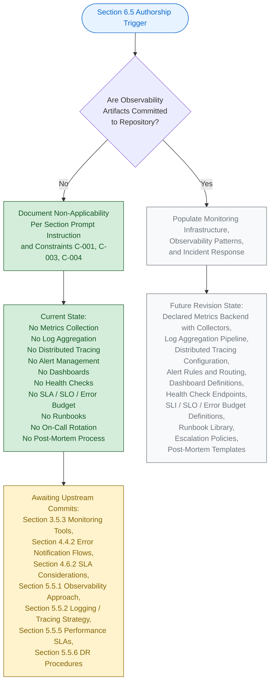

#### 6.5.5.2 Visual-Grammar Conformance

The diagram in Section 6.5.5.1 conforms to the colour grammar established by this Specification, as documented in Section 5.6.1 and reproduced in Sections 6.1.5.2, 6.2.6.2, 6.3.5.2, and 6.4.5.2.

| Colour | Hex (Fill / Stroke) | Semantic Meaning |
|--------|----------------------|-------------------|
| Blue | `#e7f3ff` / `#0066cc` | Section authorship entry point |
| Green | `#d4edda` / `#155724` | Verifiable, present state |
| Grey | `#f8f9fa` / `#6c757d` | Prospective future state |
| Yellow | `#fff3cd` / `#856404` | Pending upstream activity |

The green-shaded nodes represent the verifiable, present authorship path; the grey-shaded nodes represent the prospective path that will be taken in a future revision once observability artifacts are added to the codebase; the yellow-shaded node identifies the pending upstream activities required to unlock those subsequent revisions; and the blue-shaded node marks the Section authorship entry point.

---

### 6.5.6 Required Diagrams Status

The Section 6.5 prompt requests three architectural diagrams: Monitoring Architecture, Alert Flow Diagrams, and Dashboard Layouts. Per Constraint C-004 (Section 2.7.2), each of these diagrams remains explicitly empty until upstream monitoring artifacts are committed.

#### 6.5.6.1 Diagram-Exclusion Justification

Producing any of the prompt-required monitoring diagrams in the absence of underlying metrics, logging, tracing, alerting, and dashboard artifacts would violate Constraint C-001 (no invention) and Constraint C-004 (diagrams remain empty until upstream artifacts are populated). Section 5.3.3 establishes the identical posture for Component Interaction, State Transition, and Sequence diagrams; Section 5.5.7 establishes the identical posture for Error-Handling Flow diagrams; Sections 6.1.6, 6.2.7, 6.3.6, and 6.4.6 establish the identical posture for their respective prompt-required diagrams.

| Required Diagram (per Section 6.5 prompt) | Diagram Status | Governance Basis |
|---------------------------------------------|----------------|------------------|
| Monitoring Architecture Diagram | Explicitly empty — TBD | Constraint C-001, C-004 |
| Alert Flow Diagram | Explicitly empty — TBD | Constraint C-001, C-004 |
| Dashboard Layout Diagram | Explicitly empty — TBD | Constraint C-001, C-004 |

#### 6.5.6.2 Diagram-Population Prerequisites

Each prompt-required diagram has a specific set of upstream artifacts that must be committed before it can be populated. The table below records these prerequisites for traceability with Section 5.7.1 and Section 6.5.8 below.

| Diagram | Required Upstream Artifact(s) |
|---------|--------------------------------|
| Monitoring Architecture | Declared metrics backend (Prometheus / CloudWatch / Datadog), declared log aggregation pipeline (ELK / Splunk / Loki), declared tracing backend (Jaeger / Tempo / X-Ray), declared collector / agent topology, declared retention and routing policy |
| Alert Flow | Declared alert rule catalog with thresholds and evaluation windows, declared alerting backend (Alertmanager / PagerDuty / Opsgenie), declared severity-classification taxonomy, declared on-call rotation, declared escalation ladder |
| Dashboard Layout | Declared dashboarding platform (Grafana / Datadog / Kibana / CloudWatch), declared dashboard-as-code definitions, declared dashboard taxonomy (RED / USE / Four Golden Signals), declared dashboard scoping (per-service / per-team / executive) |

#### 6.5.6.3 Metrics Definitions Documentation Status

The Section 6.5 prompt's output-format requirement to "use Markdown tables for metrics definitions" cannot be satisfied with declared metrics at the current repository lifecycle stage. Section 5.5.1 verifies the absence of every metrics-collection backend, instrumentation library, and metric definition; Section 1.2.3 records the absence of every KPI, OKR, SLO, and acceptance criterion. With no metric declared in any form, the metrics-definitions table in Section 6.5.2.6 is necessarily populated with `None declared — TBD` entries. This documentation completeness will be achieved in the revision triggered by the first metrics-instrumentation, dashboard-definition, or SLI-declaration commit (see Section 6.5.8.1).

#### 6.5.6.4 Alert Threshold Matrix Documentation Status

The Section 6.5 prompt's output-format requirement to "include alert threshold matrices" cannot be satisfied with declared thresholds at the current repository lifecycle stage. Section 4.4.2 verifies that no notification channels, severity-classification taxonomies, escalation ladders, or notification-suppression policies exist; Section 5.5.3 confirms identical posture. With no threshold declared in any form, the alert-threshold matrix in Section 6.5.4.6 is populated with severity-tier scaffolding and forward-looking response expectations, but every quantitative threshold cell is recorded as `None declared — TBD`. This documentation completeness will be achieved in the revision triggered by the first alert-rule, severity-taxonomy, or on-call-rotation commit (see Section 6.5.8.1).

#### 6.5.6.5 SLA Requirements Documentation Status

The Section 6.5 prompt's output-format requirement to "document SLA requirements" cannot be satisfied with declared targets at the current repository lifecycle stage. Section 4.6.2 verifies that every timing and SLA dimension (End-to-End Latency Budget, Per-Step Timing Constraint, Throughput / Concurrency Target, Availability SLO, Error-Budget Policy) is TBD; Section 5.5.5 mirrors this. With no SLA dimension declared, the SLA-requirements table in Section 6.5.3.6 is populated with canonical SLA-dimension scaffolding and forward-looking target forms, but every quantitative target cell is recorded as `None declared — TBD`. This documentation completeness will be achieved in the revision triggered by the first SLA / SLO / SLI / error-budget commit (see Section 6.5.8.1).

---

### 6.5.7 Standard Monitoring Practices Reference

The Section 6.5 prompt's explicit instruction requires that this section "explain which basic monitoring practices will be followed instead." The standard monitoring practices enumerated below are referenced as the framework that **will** govern Section 6.5 once the corresponding artifacts are committed to the repository. Per Constraint C-001 (Section 2.7.2), this enumeration is not a declaration of adopted practices for the current repository state; it is a forward-looking reference catalog tied to specific upstream-section TBD entries that, when resolved, will activate each practice. This mirrors the forward-looking catalog pattern established in Section 6.4.7.

#### 6.5.7.1 Monitoring-Infrastructure Standard Practices

| Standard Practice (Forward-Looking) | Activating Upstream Artifact |
|---------------------------------------|--------------------------------|
| Metrics collection via Prometheus / CloudWatch / Datadog with structured time-series storage | First metrics backend configuration committed (Section 3.5.3; Section 5.5.1) |
| Log aggregation via ELK / Splunk / Loki / CloudWatch Logs with structured JSON logging | First log aggregation pipeline committed (Section 3.5.3; Section 5.5.2) |
| Distributed tracing via OpenTelemetry / Jaeger / Zipkin with W3C TraceContext propagation | First tracing instrumentation committed (Section 3.5.3; Section 5.5.2) |
| Alert management via Alertmanager / PagerDuty / Opsgenie with severity-based routing | First alert rule / alerting integration committed (Section 3.5.3; Section 4.4.2) |
| Dashboarding via Grafana / Datadog with RED (Rate, Errors, Duration) and USE (Utilization, Saturation, Errors) methodologies | First dashboard-as-code definition committed (Section 5.5.1) |

#### 6.5.7.2 Observability-Patterns Standard Practices

| Standard Practice (Forward-Looking) | Activating Upstream Artifact |
|---------------------------------------|--------------------------------|
| Liveness, readiness, and startup probes (Kubernetes-style) or health-endpoint conventions | First health-check endpoint / probe configuration committed (Section 1.2.2; Section 5.5.1) |
| Four Golden Signals emission — latency, traffic, errors, saturation (Google SRE practice) | First performance-instrumentation artifact committed (Section 5.5.5) |
| Business-metric emission with structured event attributes for funnel / cohort / retention analysis | First business-metric instrumentation committed (Section 1.2.3; Section 5.5.1) |
| SLI / SLO / SLA tiered definitions with error-budget burn-rate tracking | First SLA / SLO / error-budget declaration committed (Section 4.6.2; Section 5.5.5) |
| Capacity tracking with utilization baselines, headroom thresholds, and growth-rate forecasts | First resource-baseline / scaling configuration committed (Section 2.5.3; Section 5.5.5) |

#### 6.5.7.3 Incident-Response Standard Practices

| Standard Practice (Forward-Looking) | Activating Upstream Artifact |
|---------------------------------------|--------------------------------|
| Severity-based alert routing (SEV1 / SEV2 / SEV3 / SEV4) with on-call rotation | First on-call rotation / severity-taxonomy commit (Section 4.4.2; Section 5.5.3) |
| Multi-tier escalation policy with acknowledgement timeouts and manager-on-call backup | First escalation-policy commit (Section 4.4.2; Section 5.5.3) |
| Runbook library indexed by alert name with linked dashboards and remediation steps | First runbook / runbook-repository commit (Section 4.4.2; Section 5.5.6) |
| Blameless post-mortem process with root-cause analysis, contributing-factor mapping, and action items | First post-mortem template / process commit (Section 5.5.6) |
| Action-item tracking with measurable closure SLAs, periodic review cadence, and MTTR / MTBF / MTTA trend reporting | First improvement-tracking workflow commit (Section 5.5.6) |

These forward-looking practices are derived from the upstream artifact references that already exist in this Specification (Sections 1.2.3, 1.2.2, 2.5.3, 3.5.3, 4.4.2, 4.6.2, 5.5.1, 5.5.2, 5.5.3, 5.5.5, 5.5.6) and reflect the canonical industry-standard observability controls associated with each declared TBD dimension. They become authoritative only upon the corresponding commit, per Assumption A-003 (Section 2.7.1).

---

### 6.5.8 Future Revision Triggers

Consistent with Section 5.7.1 and Assumption A-004 (Section 2.7.1), a revision of Section 6.5 will be triggered when any of the events below occurs in the repository. Each trigger maps to the specific Section 6.5 subsections that will become authorable once the corresponding upstream artifact is committed. The triggers below refine the Section 5.7.1 trigger table, scoped specifically to the monitoring and observability tier.

#### 6.5.8.1 Trigger-to-Subsection Mapping

| Trigger Event | Section 6.5 Subsection(s) Unblocked |
|---------------|---------------------------------------|
| First metrics-collection configuration committed (Prometheus, CloudWatch, Datadog, New Relic) | 6.5.2.1 (Metrics Collection); 6.5.2.6 (Metrics Definitions) |
| First log-aggregation configuration committed (ELK, Splunk, Fluentd, Vector, Loki) | 6.5.2.2 (Log Aggregation) |
| First distributed-tracing instrumentation committed (OpenTelemetry SDK, Jaeger, Zipkin, X-Ray) | 6.5.2.3 (Distributed Tracing) |
| First alert rule or alerting-backend integration committed (Alertmanager, PagerDuty, Opsgenie SDK) | 6.5.2.4 (Alert Management); 6.5.4.1 (Alert Routing) |
| First dashboard-as-code definition committed (Grafana, Datadog, Kibana, CloudWatch JSON) | 6.5.2.5 (Dashboard Design); 6.5.6.1 (Dashboard Layout Diagram) |
| First health-check endpoint or probe configuration committed (liveness / readiness / startup) | 6.5.3.1 (Health Checks) |
| First performance-instrumentation artifact committed (latency / throughput / saturation emission) | 6.5.3.2 (Performance Metrics) |
| First business-metric instrumentation committed (KPI emission, analytics SDK integration) | 6.5.3.3 (Business Metrics) |
| First SLA / SLO / SLI / error-budget declaration committed | 6.5.3.4 (SLA Monitoring); 6.5.3.6 (SLA Requirements); 6.5.6.5 (SLA Requirements Documentation) |
| First resource-baseline / scaling-configuration commit (HPA, autoscaler, capacity manifest) | 6.5.3.5 (Capacity Tracking) |
| First severity-classification taxonomy / on-call rotation / escalation policy committed | 6.5.4.1 (Alert Routing); 6.5.4.2 (Escalation Procedures); 6.5.4.6 (Alert Threshold Matrix); 6.5.6.4 (Alert Threshold Documentation) |
| First runbook committed (e.g., `docs/runbooks/` or equivalent) | 6.5.4.3 (Runbooks) |
| First post-mortem template / blameless-review process committed | 6.5.4.4 (Post-Mortem Processes) |
| First action-item tracking workflow / improvement-review cadence committed | 6.5.4.5 (Improvement Tracking) |

Until at least one of these triggers fires, Section 6.5 will continue to reflect the non-applicability posture documented herein, in compliance with Constraint C-001 and Assumption A-003 (Section 2.7.1).

#### 6.5.8.2 Cross-Section Coordination

When a Section 6.5 revision is triggered, the following companion sections must be revised in lockstep to preserve cross-reference consistency required by Constraint C-003. The table below records the coordination map.

| Section 6.5 Subsection | Companion Sections Requiring Co-Revision |
|--------------------------|---------------------------------------------|
| 6.5.2 (Monitoring Infrastructure) | Section 3.5.3 (Monitoring and Observability Tools); Section 5.5.1 (Monitoring Approach); Section 5.5.2 (Logging and Tracing Strategy) |
| 6.5.3 (Observability Patterns) | Section 1.2.3 (Success Criteria / KPIs); Section 4.6.2 (Timing and SLA Considerations); Section 5.5.5 (Performance Requirements and SLAs) |
| 6.5.4 (Incident Response) | Section 4.4.2 (Error Notification Flows); Section 5.5.3 (Error Handling Patterns); Section 5.5.6 (Disaster Recovery Procedures) |

---

### 6.5.9 Versioning Posture

Consistent with the versioning posture documented in Sections 2.7.3, 3.9.3, 4.7.1, 5.7.2, 6.1.7.2, 6.2.9.1, 6.3.8.1, and 6.4.9.1, Section 6.5 carries the version status recorded below. The change log will begin with the first populated revision triggered by any of the events enumerated in Section 6.5.8.1.

#### 6.5.9.1 Section Version Tracking

| Versioning Element | Current State | Notes |
|----------------------|-----------------|-------|
| Section 6.5 Authorship Revision | v1.0 (TBD Posture) | First authoring pass under non-applicability declaration |
| Individual Monitoring-Infrastructure Element Versions | v0.0 — Not Yet Authored | No monitoring-infrastructure artifacts exist to version |
| Individual Observability-Pattern Element Versions | v0.0 — Not Yet Authored | No observability-pattern artifacts exist to version |
| Individual Incident-Response Element Versions | v0.0 — Not Yet Authored | No incident-response artifacts exist to version |
| Change Log | Not yet initiated | Will begin with the first populated revision |

#### 6.5.9.2 Default Technology Stack Non-Adoption

Section 3.8 of this Specification enumerates a documentation-framework default technology stack reference that may list candidate Monitoring and Observability tools. Per the precedent established in Section 6.4.9.2 and consistent with Constraint C-001 (no invention), Assumption A-003 (external artifacts non-authoritative until committed), and Assumption A-004 (defaults may be superseded), no default monitoring tool reference is **adopted** as the observability-architecture decision for `April17Sec_1`. No Prometheus scrape configuration, no CloudWatch metric filter, no Datadog Agent deployment, no Grafana dashboard JSON, no PagerDuty service-key reference, no Opsgenie API integration, no Sentry DSN, and no OpenTelemetry collector configuration exists in the repository. Any default monitoring-tool references contained in Section 3.8 remain candidate suggestions only; they do not constitute a metrics-backend, log-aggregation, tracing, alerting, or dashboarding decision for this system until and unless they are committed to the codebase. Section 6.5 therefore does not infer any monitoring-tool selection, alert configuration, dashboard layout, or SLA target from the default reference.

---

### 6.5.10 Summary of Posture

The combination of (a) the explicit instruction in the Section 6.5 prompt to declare non-applicability when the system does not require specific monitoring beyond basic health checks; (b) the verified absence across every monitoring-related repository category established by Sections 1.2.3, 1.3.2, 2.5.5, 3.5.2, 3.5.3, 4.4.2, 4.6.2, 5.5.1, 5.5.2, 5.5.3, 5.5.5, and 5.5.6; (c) the governance constraints C-001, C-003, and C-004 (Section 2.7.2); and (d) the assumptions A-001, A-002, A-003, and A-004 (Section 2.7.1) yields a single, unambiguous posture for this section: **Detailed Monitoring Architecture is not applicable for this system at the current repository lifecycle stage**.

This posture will be reviewed and revised in accordance with the triggers enumerated in Section 6.5.8.1. The earliest trigger most likely to fire is the first observability-tool integration commit (Prometheus, CloudWatch, Datadog, OpenTelemetry, Sentry, ELK / Splunk / Loki agent, PagerDuty / Opsgenie SDK), which would unblock authorship of Section 6.5.2 (Monitoring Infrastructure) and cascade through Sections 6.5.3 (Observability Patterns) and 6.5.4 (Incident Response) as additional observability-tier artifacts are committed. Until such triggers fire, Section 6.5 stands as a deliberate, evidence-backed statement of non-applicability — fully consistent with the precedents set by Sections 6.1 (Core Services Architecture), 6.2 (Database Design), 6.3 (Integration Architecture), and 6.4 (Security Architecture). The forward-looking catalog of standard monitoring practices enumerated in Section 6.5.7 represents the canonical industry-standard observability controls that will be activated dimension by dimension as each upstream artifact is committed.

---

### 6.5.11 References

#### 6.5.11.1 Files Examined

- `README.md` — Sole tracked file in the repository (14 bytes, single line `# April17Sec_1`); confirms the Repository Initialization lifecycle stage and the verified absence of all monitoring and observability artifacts (no metrics-collection configurations, no log-aggregation pipelines, no tracing instrumentation, no alerting integrations, no dashboards, no health-check endpoints, no SLA / SLO declarations, no on-call rotations, no runbooks, and no post-mortem templates).
- Repository root (`/`) — Contains only `README.md` and the `.git/` metadata directory; verified zero application subfolders, zero source files, zero configuration files, zero dependency manifests, zero observability configurations, zero Prometheus / Grafana / Datadog / OpenTelemetry / Jaeger / Sentry artifacts, zero `prometheus.yml`, zero `alertmanager.yml`, zero Grafana dashboard JSON, zero `docs/runbooks/` directory, and zero monitoring source files.

#### 6.5.11.2 Search Operations Performed

- Semantic search for "monitoring observability metrics logging prometheus grafana" — returned empty results (`[]`), confirming no monitoring source files exist in the repository.
- Semantic search for "health check endpoint readiness liveness probe" — returned empty results (`[]`), confirming no health-check source files exist in the repository.
- Semantic search for "alert tracing telemetry sentry datadog" — returned empty results (`[]`), confirming no alerting or telemetry source files exist in the repository.
- Folder search for "observability monitoring alerts dashboards" — returned empty results (`[]`), confirming no monitoring-related directories exist in the repository.
- Filesystem inspection for `prometheus.yml`, `alertmanager.yml`, `grafana/`, `dashboards/`, `runbooks/`, `*-otel.yaml`, `*-datadog.yaml`, `*.dashboard.json` — zero matches within the repository.

#### 6.5.11.3 Technical Specification Sections Cross-Referenced

- **Section 1.1 EXECUTIVE SUMMARY** — Project identity, repository metadata, and Repository Initialization lifecycle stage
- **Section 1.2 SYSTEM OVERVIEW** — **CRITICAL** — Section 1.2.3 records the authoritative absence of telemetry configuration, analytics instrumentation, monitoring manifest, and documented metric definitions; Section 1.2.2 confirms zero Application Source Modules, zero Back-End Services, and zero Infrastructure-as-Code Definitions
- **Section 1.3 SCOPE** — **CRITICAL** — Section 1.3.2 records the authoritative out-of-scope declaration: *"All operational tooling, monitoring, and observability components (no configuration exists)"*
- **Section 2.5 IMPLEMENTATION CONSIDERATIONS** — Section 2.5.5 records maintenance and observability requirements as TBD; Section 2.5.2 records performance requirements as TBD; Section 2.5.3 records scalability considerations as TBD
- **Section 2.7 ASSUMPTIONS, CONSTRAINTS, AND VERSIONING** — **CRITICAL** — Governance constraints C-001, C-003, C-004 (Section 2.7.2); assumptions A-001, A-002, A-003, A-004 (Section 2.7.1); versioning posture (Section 2.7.3)
- **Section 3.4 OPEN SOURCE DEPENDENCIES** — Verified absence of all dependency manifests (no monitoring libraries, no OpenTelemetry SDKs, no Prometheus client libraries, no logging libraries can be loaded)
- **Section 3.5 THIRD-PARTY SERVICES** — **CRITICAL** — Section 3.5.2 verifies Application Performance Monitoring (Datadog, New Relic, AppDynamics, Sentry), Logging Aggregation (ELK, Splunk, Loggly, Logz.io), and Analytics / Telemetry (Segment, Mixpanel, Amplitude) as absent; Section 3.5.3 records every observability tool (Metrics Collection, Distributed Tracing, Log Aggregation, Alerting / On-Call, Error-Reporting, Uptime / Synthetic Monitoring) as `No — TBD`
- **Section 3.7 DEVELOPMENT AND DEPLOYMENT** — No CI/CD, no container, no IaC that could host monitoring agents or collectors
- **Section 3.8 DEFAULT TECHNOLOGY STACK REFERENCE** — Default-stack monitoring references explicitly not adopted (Section 6.5.9.2)
- **Section 4.4 TECHNICAL IMPLEMENTATION** — **CRITICAL** — Section 4.4.2 records that no error-notification flows can be documented because no APM (Datadog, Sentry, New Relic), no logging aggregation (ELK, Splunk), no alerting (PagerDuty, Opsgenie), and no error-reporting service has been integrated; every Notification Element (Channels, Severity Taxonomy, Escalation Ladder, Suppression Policy) is TBD; every Recovery Element (RPO/RTO, Backup Cadence, Restore Verification, Failover Plan, Post-Incident Review) is TBD
- **Section 4.5 REQUIRED DIAGRAMS** — Diagram-empty pattern with authorship lifecycle as sole permitted form
- **Section 4.6 SWIM LANES, TIMING, AND SLA CONSIDERATIONS** — **CRITICAL** — Section 4.6.2 records every timing and SLA dimension (End-to-End Latency Budget, Per-Step Timing Constraint, Throughput / Concurrency Target, Availability SLO, Error-Budget Policy) as `None declared — TBD`
- **Section 5.2 HIGH-LEVEL ARCHITECTURE** — No components, no integration topology, no external integration points against which monitoring agents would operate
- **Section 5.4 TECHNICAL DECISIONS** — All technical decisions including observability mechanism TBD
- **Section 5.5 CROSS-CUTTING CONCERNS** — **CRITICAL** — Section 5.5.1 directly mirrors the Section 6.5 prompt with the full TBD observability table (Metrics, Tracing, Log Aggregation, Alerting, Error-Reporting, Uptime); Section 5.5.2 records every logging and tracing dimension as TBD; Section 5.5.3 records every error-handling and notification element as TBD; Section 5.5.5 records every Performance / SLA dimension as TBD; Section 5.5.6 records every Disaster Recovery and Post-Incident Review element as TBD
- **Section 5.6 ARCHITECTURE AUTHORSHIP LIFECYCLE** — **CRITICAL** — Visual-grammar template (Section 5.6.1) for the authorship lifecycle diagram and architectural prerequisites (Section 5.6.2)
- **Section 5.7 FUTURE SECTION REVISION TRIGGERS** — Trigger event taxonomy that Section 6.5.8 refines for the observability tier; explicit trigger for *"First APM / logging / alerting / error-reporting integration committed (Section 3.5)"*
- **Section 6.1 CORE SERVICES ARCHITECTURE** — **CRITICAL TEMPLATE** — Non-applicability declaration structure originating template
- **Section 6.2 DATABASE DESIGN** — **CRITICAL TEMPLATE** — Refined non-applicability template with multi-subsection verified-absence pattern
- **Section 6.3 INTEGRATION ARCHITECTURE** — **CRITICAL TEMPLATE** — Verified-absence tables with prompt-required dimension mapping
- **Section 6.4 SECURITY ARCHITECTURE** — **CRITICAL TEMPLATE** — Most direct precedent that Section 6.5 mirrors; includes the Standard Practices Reference forward-looking catalog (Section 6.4.7) pattern reproduced in Section 6.5.7

## 6.6 Testing Strategy

### 6.6.1 Applicability Declaration

**Detailed Testing Strategy is not applicable for this system.**

The `April17Sec_1` repository is at the Repository Initialization (Scaffold) lifecycle stage as established in Section 1.1 and Section 1.2.2. The repository contains exactly one tracked file (`README.md`, 14 bytes) whose entire content is the single Markdown heading `# April17Sec_1`. No test runner configuration, no test file, no test fixture, no mocking library, no code coverage configuration, no continuous-integration pipeline, no quality gate, no test reporting format, no test environment manifest, no performance test script, no E2E test framework, and no test data factory exists anywhere in the codebase. There is, consequently, **no system under test, no test harness, no quality measurement substrate, and no verification surface against which a Testing Strategy could be authored**.

This posture is the unambiguous and required response per the Section 6.6 prompt's explicit instruction: *"If the system is a simple library, tool, or does not require comprehensive testing, clearly state 'Detailed Testing Strategy is not applicable for this system' and explain why, then document only the basic unit testing approach that will be used."* The standard testing practices that will be activated once the prerequisite artifacts are committed are enumerated in Section 6.6.9 below, in the same forward-looking reference catalog pattern established by Section 6.4.7 and Section 6.5.7.

Section 1.3.2 records the authoritative out-of-scope declaration for the current repository state: *"All automated tests, quality gates, and verification harnesses (no test files exist)."* Section 3.3.2 (Verified Absence of Framework Markers) records the Testing Frameworks row — `pytest.ini`, `jest.config.js`, `karma.conf.js` — as `No`. Section 3.7.2 (Verified Absence of Build and CI/CD Configurations) records the Test Runners / Config row — `pytest.ini`, `jest.config.js`, `karma.conf.js`, `tox.ini` — as `No`, and further records `GitHub Actions (.github/workflows/*.yml)`, `Jenkins (Jenkinsfile)`, and `Pre-commit / Git Hooks (.pre-commit-config.yaml, .husky/)` all as `No`.

#### 6.6.1.1 Categorical Justification

The non-applicability of Detailed Testing Strategy is grounded in four independently sufficient categorical reasons, each derived from verifiable repository evidence and from upstream sections of this Specification.

| # | Categorical Reason | Authoritative Cross-Reference |
|---|---------------------|--------------------------------|
| (a) | No system-under-test exists — zero Application Source Modules, zero Back-End Services, zero Front-End Assets, zero Infrastructure-as-Code Definitions | Section 1.2.2; Section 3.2.2 |
| (b) | No test artifact of any form exists — no test files, no test runner configurations, no fixtures, no mocking libraries, no coverage configurations | Section 1.3.2; Section 3.3.2; Section 3.7.2 |
| (c) | No CI/CD pipeline, quality gate, or automated-test trigger exists | Section 3.7.2 |
| (d) | No measurable objectives, KPIs, SLAs, latency budgets, or quality thresholds against which test outcomes could be evaluated have been declared | Section 1.2.3; Section 4.6.2; Section 5.5.5 |

**Reason (a) — No system-under-test exists.** Section 1.2.2 verifies that the repository contains zero Application Source Modules, zero Back-End Services, zero Front-End Assets, and zero Infrastructure-as-Code Definitions. Section 3.2.2 records zero source files across every programming-language ecosystem (`.py`, `.js`, `.ts`, `.java`, `.go`, `.rb`, `.cs`, `.cpp`, `.c`, `.rs`, `.kt`, `.swift`, `.php`). Without any source code, there is no unit, no module, no function, no class, no API endpoint, no UI component, no workflow, and no data path that could be exercised by a test. Test selection, test design, and test prioritization are therefore not yet evidence-grounded.

**Reason (b) — No test artifact of any form exists.** Section 1.3.2 explicitly lists *"All automated tests, quality gates, and verification harnesses (no test files exist)"* as out of scope of the current repository state. Section 3.3.2 verifies the absence of every Testing Framework marker (`pytest.ini`, `jest.config.js`, `karma.conf.js`). Section 3.7.2 verifies the absence of every Test Runner / Config marker (`pytest.ini`, `jest.config.js`, `karma.conf.js`, `tox.ini`). Independent verification searches — semantic search for "test files unit testing integration testing pytest jest mocha" and folder search for "tests testing test suites quality assurance" — both returned empty results, confirming that no test directory and no test source file exist anywhere in the repository.

**Reason (c) — No CI/CD pipeline, quality gate, or automated-test trigger exists.** Section 3.7.2 records every CI/CD platform as absent — `GitHub Actions (.github/workflows/*.yml)`, `Jenkins (Jenkinsfile)`, `CircleCI`, `GitLab CI`, `Travis CI`, and `Pre-commit / Git Hooks (.pre-commit-config.yaml, .husky/)` are all `No`. Without a pipeline definition, there is no place to schedule, trigger, parallelize, gate, or report on tests. Automated test triggers, parallel test execution, test reporting, and quality gates cannot be evidence-grounded.

**Reason (d) — No measurable objectives, KPIs, SLAs, or quality thresholds exist.** Section 1.2.3 records that the repository contains no measurable objectives, no KPIs, no OKRs, no SLOs, no quantitative targets, and no acceptance criteria. Section 4.6.2 records every timing and SLA dimension (End-to-End Latency Budget, Per-Step Timing Constraint, Throughput / Concurrency Target, Availability SLO, Error-Budget Policy) as `None declared — TBD`. Section 5.5.5 mirrors this. Without declared quality thresholds, test success-rate requirements, performance-test thresholds, coverage targets, and quality gates cannot be defined.

#### 6.6.1.2 Governance Basis for the Non-Applicability Declaration

Authorship of this section is governed by the constraints recorded in Section 2.7.2. The constraints listed below directly justify the non-applicability declaration and the format used to document it.

| Constraint ID | Constraint Statement | Applicability to Section 6.6 |
|---------------|------------------------|-------------------------------|
| C-001 | No features, requirements, or relationships may be invented; all entries must be grounded in verifiable repository content | Forbids fabrication of test frameworks, coverage targets, CI/CD pipelines, mocking strategies, test naming conventions, quality gates, or any testing-strategy element |
| C-003 | Cross-references to companion sections must remain consistent with the TBD posture established in Section 1 | Mandates that Section 6.6 mirror the TBD posture declared in Sections 1.2.2, 1.2.3, 1.3.2, 2.5.5, 3.3.2, 3.7.2, 3.7.3, 4.4.2, 4.6.2, 5.5.5 |
| C-004 | Diagrams remain empty until upstream artifacts are populated | Forbids producing test execution flow diagrams, test environment architecture diagrams, or test data flow diagrams |

Assumption A-001 (Section 2.7.1) further establishes that the repository's verifiable state as of the initial commit is the authoritative input for every architectural claim. Assumption A-002 (Section 2.7.1) establishes that the absence of testing artifacts reflects the project's actual lifecycle stage (Repository Initialization), not an omission by this Specification. Assumption A-003 (Section 2.7.1) establishes that no external requirements artifacts (test plans, QA strategies, coverage targets stored elsewhere) are authoritative until committed to the codebase. Assumption A-004 (Section 2.7.1) confirms that subsequent revisions of this Specification will replace TBD markers with evidence-backed declarations once corresponding testing artifacts are committed.

---

### 6.6.2 Unit Testing — Verified Absence

This subsection records, dimension by dimension, the verified absence of every Unit Testing attribute required by the Section 6.6 prompt — Testing frameworks and tools, Test organization structure, Mocking strategy, Code coverage requirements, Test naming conventions, and Test data management. Each row pairs a prompt-required dimension with its authoritative upstream cross-reference. Per Constraint C-001 (no invention), no synthetic test frameworks, test layouts, mocking libraries, coverage thresholds, naming conventions, or fixture catalogs have been introduced.

#### 6.6.2.1 Testing Frameworks and Tools Dimensions

Unit testing requires (a) a declared test runner (pytest, unittest, Jest, Mocha, Vitest, JUnit, NUnit, RSpec, `go test`, Cargo test), (b) a declared assertion library, and (c) a declared test discovery / configuration mechanism. Section 3.3.2 records the Testing Frameworks row as `No` (verifying absence of `pytest.ini`, `jest.config.js`, `karma.conf.js`); Section 3.7.2 records the Test Runners / Config row as `No` (additionally verifying absence of `tox.ini`); Section 3.4 confirms zero dependency manifests, meaning no test library could be loaded.

| Testing-Framework Element | Verifiable State | Authoritative Cross-Reference |
|-----------------------------|-------------------|--------------------------------|
| Test Runner Selection (pytest / Jest / Mocha / JUnit / Vitest / RSpec / Go test) | None declared — TBD | Section 3.3.2; Section 3.7.2 |
| Assertion Library (unittest / Chai / AssertJ / Expect / Hamcrest) | None declared — TBD | Section 3.3.2; Section 3.4 |
| Test Configuration Manifest (`pytest.ini` / `jest.config.js` / `vitest.config.ts` / `tox.ini`) | None declared — TBD | Section 3.3.2; Section 3.7.2 |
| Test Discovery Pattern (`test_*.py` / `*.test.js` / `*.spec.ts` / `*Test.java`) | None declared — TBD | Section 3.2.2; Section 3.7.2 |

#### 6.6.2.2 Test Organization Structure Dimensions

Test organization structure requires (a) a declared directory layout (e.g., `tests/`, `src/__tests__/`, co-located `*.test.ts` files), (b) a declared test categorization (unit / integration / contract / smoke), and (c) a declared module-to-test mapping convention. Section 1.2.2 confirms zero Application Source Modules and zero application subfolders; Section 1.3.2 confirms no test files exist.

| Test-Organization Element | Verifiable State | Authoritative Cross-Reference |
|------------------------------|-------------------|--------------------------------|
| Test Directory Layout (`tests/` / `__tests__/` / co-located) | None declared — TBD | Section 1.2.2; Section 1.3.2 |
| Test Categorization Convention (unit / integration / contract / smoke) | None declared — TBD | Section 1.3.2 |
| Module-to-Test Mapping Convention | None declared — TBD | Section 1.2.2; Section 3.2.2 |
| Test Suite / Test Group Granularity | None declared — TBD | Section 1.2.2; Section 1.3.2 |

#### 6.6.2.3 Mocking Strategy Dimensions

Mocking strategy requires (a) a declared mocking library (`unittest.mock`, `pytest-mock`, Jest mocks, Sinon, Mockito, Moq, gomock), (b) a declared mocking scope (function / module / class / network / time), and (c) a declared mock-lifecycle policy (setup, teardown, verification, strict vs. lenient). Section 1.3.2 confirms no test files exist; Section 3.4 confirms zero dependencies and therefore zero mocking libraries; Section 3.5.2 confirms no third-party services exist that would require mocking.

| Mocking-Strategy Element | Verifiable State | Authoritative Cross-Reference |
|----------------------------|-------------------|--------------------------------|
| Mocking Library (`unittest.mock` / `pytest-mock` / Jest mocks / Sinon / Mockito) | None declared — TBD | Section 1.3.2; Section 3.4 |
| Mocking Scope (function / module / network / clock / filesystem) | None declared — TBD | Section 1.3.2; Section 3.5.2 |
| Mock-Lifecycle Policy (setup / teardown / verification / strict mode) | None declared — TBD | Section 1.3.2 |
| Test-Double Taxonomy (mock / stub / spy / fake / dummy) | None declared — TBD | Section 1.3.2 |

#### 6.6.2.4 Code Coverage Requirements Dimensions

Code coverage requirements require (a) a declared coverage tool (`coverage.py`, Istanbul/nyc, JaCoCo, gocover, Tarpaulin), (b) declared coverage metrics (line, branch, statement, function, condition, mutation), and (c) declared coverage thresholds and enforcement mechanisms. Section 1.2.3 records no measurable objectives or KPIs; Section 1.3.2 confirms no quality gates exist; Section 3.3.2 confirms no coverage configuration files exist.

| Coverage-Requirement Element | Verifiable State | Authoritative Cross-Reference |
|--------------------------------|-------------------|--------------------------------|
| Coverage Tool (`coverage.py` / Istanbul / nyc / JaCoCo / gocover) | None declared — TBD | Section 1.3.2; Section 3.3.2 |
| Coverage Metric Selection (line / branch / statement / function / condition) | None declared — TBD | Section 1.2.3; Section 1.3.2 |
| Coverage Threshold (percentage targets per project / per file) | None declared — TBD | Section 1.2.3; Section 1.3.2 |
| Coverage Enforcement Mechanism (CI gate / PR block / report-only) | None declared — TBD | Section 3.7.2 |

#### 6.6.2.5 Test Naming Conventions Dimensions

Test naming conventions require (a) declared file-name patterns (`test_*.py`, `*_test.go`, `*.spec.ts`, `*Test.java`), (b) declared function / method naming patterns (`test_<behavior>_<expected>`, `describe/it`, `should_<expected>_when_<scenario>`), and (c) declared tagging / categorization markers. Section 1.3.2 confirms no test files exist; Section 3.2.2 confirms no source files exist against which a naming convention could be applied.

| Test-Naming Element | Verifiable State | Authoritative Cross-Reference |
|-----------------------|-------------------|--------------------------------|
| File-Name Pattern (`test_*.py` / `*.test.js` / `*.spec.ts` / `*Test.java`) | None declared — TBD | Section 1.3.2; Section 3.2.2 |
| Test Function / Method Naming Pattern (`test_<behavior>_<outcome>` / BDD `describe/it`) | None declared — TBD | Section 1.3.2 |
| Tagging / Marker Convention (`@pytest.mark.slow`, `@Tag("integration")`, `it.only`) | None declared — TBD | Section 1.3.2 |
| Test Hierarchy / Nesting Convention (`describe`/`context`/`it`) | None declared — TBD | Section 1.3.2 |

#### 6.6.2.6 Test Data Management Dimensions

Test data management requires (a) a declared fixture / factory mechanism (Factory Boy, Faker, FactoryBot, Bogus), (b) a declared data-isolation policy (per-test database, transactional rollback, in-memory store), and (c) a declared seed / cleanup / teardown strategy. Section 3.6 confirms no data layer of any form exists; Section 4.4.1 confirms no state management or transactional flows exist.

| Test-Data-Management Element | Verifiable State | Authoritative Cross-Reference |
|--------------------------------|-------------------|--------------------------------|
| Fixture / Factory Library (Factory Boy / Faker / FactoryBot / Bogus) | None declared — TBD | Section 1.3.2; Section 3.6 |
| Data-Isolation Policy (per-test DB / transactional rollback / in-memory) | None declared — TBD | Section 3.6; Section 4.4.1 |
| Seed / Cleanup / Teardown Strategy | None declared — TBD | Section 3.6; Section 1.3.2 |
| Test-Data Schema and Reference-Data Catalog | None declared — TBD | Section 3.6; Section 4.4.1 |

#### 6.6.2.7 Unit Testing Requirements Matrix — Verified Absence

The Section 6.6 prompt requires that "Markdown tables for test requirements" be produced. Per Constraint C-001 (no invention), the matrix below records the six prompt-required Unit-Testing dimensions against the authoritative TBD references that govern them. Every cell is recorded as "None declared — TBD" pending the upstream artifact commit.

| Unit-Testing Dimension | Forward-Looking Requirement Form | Verifiable State | Authoritative Cross-Reference |
|--------------------------|------------------------------------|-------------------|--------------------------------|
| Frameworks and Tools | Declared test runner with assertion library | None declared — TBD | Section 3.3.2; Section 3.7.2 |
| Organization Structure | Declared directory layout and test categorization | None declared — TBD | Section 1.2.2; Section 1.3.2 |
| Mocking Strategy | Declared mocking library with mock-lifecycle policy | None declared — TBD | Section 1.3.2; Section 3.4 |
| Code Coverage | Declared coverage tool with quantitative threshold | None declared — TBD | Section 1.2.3; Section 3.3.2 |
| Naming Conventions | Declared file-name and function-name patterns | None declared — TBD | Section 1.3.2; Section 3.2.2 |
| Test Data Management | Declared fixture/factory mechanism with isolation policy | None declared — TBD | Section 3.6; Section 4.4.1 |

---

### 6.6.3 Integration Testing — Verified Absence

This subsection records the verified absence of every Integration Testing attribute required by the Section 6.6 prompt — Service integration test approach, API testing strategy, Database integration testing, External service mocking, and Test environment management. Each row pairs a prompt-required dimension with its authoritative upstream cross-reference.

#### 6.6.3.1 Service Integration Test Approach Dimensions

Service integration testing requires (a) at least one declared service component, (b) a declared inter-service test harness (in-process integration, service-virtualization, ephemeral containers), and (c) declared service-boundary contracts. Section 1.2.2 confirms zero Back-End Services; Section 6.1 (Core Services Architecture) is documented as non-applicable; Section 5.2.2 confirms zero components of any kind.

| Service-Integration Element | Verifiable State | Authoritative Cross-Reference |
|-------------------------------|-------------------|--------------------------------|
| Inter-Service Test Harness Strategy (in-process / containerized / virtualized) | None declared — TBD | Section 1.2.2; Section 6.1 |
| Service-Boundary Contract Definition | None declared — TBD | Section 6.1; Section 6.3 |
| Service-Composition Test Catalog | None declared — TBD | Section 1.2.2; Section 5.2.2 |
| Service-Mesh / Sidecar Test Surface | None declared — TBD | Section 6.3.2; Section 6.1 |

#### 6.6.3.2 API Testing Strategy Dimensions

API testing requires (a) declared API contracts (OpenAPI, GraphQL SDL, gRPC `.proto`, AsyncAPI), (b) declared contract-test tooling (Pact, Spring Cloud Contract, Postman/Newman, Karate, Schemathesis), and (c) declared API test scenarios with request/response expectations. Section 4.2.2 confirms no API contracts exist; Section 6.3 (Integration Architecture) is documented as non-applicable; Section 6.3.3 confirms no API endpoints exist.

| API-Testing Element | Verifiable State | Authoritative Cross-Reference |
|-----------------------|-------------------|--------------------------------|
| API Contract Format (OpenAPI / GraphQL SDL / gRPC `.proto` / AsyncAPI) | None declared — TBD | Section 4.2.2; Section 6.3 |
| Contract-Test Tooling (Pact / Spring Cloud Contract / Schemathesis) | None declared — TBD | Section 4.2.2; Section 6.3 |
| API Test Scenario Catalog (happy path / error / boundary / fuzz) | None declared — TBD | Section 4.2.2; Section 6.3 |
| API Versioning / Backward-Compatibility Test Strategy | None declared — TBD | Section 6.3; Section 4.2.2 |

#### 6.6.3.3 Database Integration Testing Dimensions

Database integration testing requires (a) a declared persistence layer (relational, document, key-value, graph, time-series), (b) a declared database-test strategy (Testcontainers, in-memory database, transactional rollback, dedicated test schema), and (c) a declared migration / schema-evolution test plan. Section 3.6 confirms no databases or storage of any kind exist; Section 6.2 (Database Design) is documented as non-applicable.

| Database-Integration Element | Verifiable State | Authoritative Cross-Reference |
|--------------------------------|-------------------|--------------------------------|
| Persistence Layer Selection (relational / document / KV / graph / TSDB) | None declared — TBD | Section 3.6; Section 6.2 |
| Database-Test Strategy (Testcontainers / in-memory / transactional rollback) | None declared — TBD | Section 3.6; Section 6.2 |
| Migration / Schema-Evolution Test Plan | None declared — TBD | Section 6.2; Section 3.6 |
| Data-Seeding and Reference-Data Strategy | None declared — TBD | Section 3.6; Section 4.4.1 |

#### 6.6.3.4 External Service Mocking Dimensions

External service mocking requires (a) at least one declared third-party service dependency, (b) a declared mocking / stubbing approach (WireMock, MockServer, VCR cassettes, Nock, PollyJS, Mountebank), and (c) declared mock-fidelity tiers (record/replay, hand-written stubs, contract-driven). Section 3.5.2 confirms zero third-party services across all categories (payment, email, identity, monitoring, analytics, storage, search, cloud); Section 6.3 (Integration Architecture) is documented as non-applicable.

| External-Mocking Element | Verifiable State | Authoritative Cross-Reference |
|----------------------------|-------------------|--------------------------------|
| Third-Party Service Substrate (none declared in repository) | None declared — TBD | Section 3.5.2; Section 6.3 |
| Mocking / Stubbing Tooling (WireMock / MockServer / VCR / Nock / Mountebank) | None declared — TBD | Section 3.5.2; Section 6.3 |
| Mock-Fidelity Tier (record-replay / contract-driven / hand-written stub) | None declared — TBD | Section 6.3; Section 3.5.2 |
| Fault-Injection / Chaos-Test Mock Strategy | None declared — TBD | Section 4.4.2; Section 5.5.3 |

#### 6.6.3.5 Test Environment Management Dimensions

Test environment management requires (a) a declared environment topology (local, ephemeral PR, staging, pre-production), (b) a declared environment-provisioning mechanism (docker-compose, Testcontainers, Terraform, Kubernetes ephemeral namespaces), and (c) a declared environment-lifecycle policy (creation, seeding, isolation, teardown). Section 3.7.3 confirms no IaC, containerization, or environment provisioning artifacts exist; Section 1.3.2 confirms no test environments are declared.

| Test-Environment Element | Verifiable State | Authoritative Cross-Reference |
|----------------------------|-------------------|--------------------------------|
| Environment Topology (local / ephemeral PR / staging / pre-prod) | None declared — TBD | Section 3.7.3; Section 1.3.2 |
| Environment-Provisioning Mechanism (docker-compose / Testcontainers / Terraform) | None declared — TBD | Section 3.7.3; Section 1.3.2 |
| Environment-Lifecycle Policy (creation / seeding / isolation / teardown) | None declared — TBD | Section 3.7.3; Section 1.3.2 |
| Resource Requirements (CPU / memory / network) per Test Environment | None declared — TBD | Section 3.7.3; Section 5.5.5 |

#### 6.6.3.6 Integration Testing Requirements Matrix — Verified Absence

| Integration-Testing Dimension | Forward-Looking Requirement Form | Verifiable State | Authoritative Cross-Reference |
|---------------------------------|------------------------------------|-------------------|--------------------------------|
| Service Integration Approach | Declared service test harness with contract definition | None declared — TBD | Section 1.2.2; Section 6.1 |
| API Testing Strategy | Declared API contracts with contract-test tooling | None declared — TBD | Section 4.2.2; Section 6.3 |
| Database Integration Testing | Declared persistence layer with isolation strategy | None declared — TBD | Section 3.6; Section 6.2 |
| External Service Mocking | Declared third-party service with mocking tool | None declared — TBD | Section 3.5.2; Section 6.3 |
| Test Environment Management | Declared environment topology with provisioning mechanism | None declared — TBD | Section 3.7.3; Section 1.3.2 |

---

### 6.6.4 End-to-End Testing — Verified Absence

This subsection records the verified absence of every End-to-End Testing attribute required by the Section 6.6 prompt — E2E test scenarios, UI automation approach, Test data setup/teardown, Performance testing requirements, and Cross-browser testing strategy. Each row pairs a prompt-required dimension with its authoritative upstream cross-reference.

#### 6.6.4.1 E2E Test Scenarios Dimensions

E2E test scenarios require (a) a declared user-facing surface (web application, mobile application, API, CLI), (b) declared user journeys / personas / workflows, and (c) declared scenario coverage tiers (smoke, critical-path, exhaustive). Section 1.2.2 confirms zero Front-End Assets and zero user-facing components; Section 2.2.1 confirms an empty feature catalog with no declared user workflows.

| E2E-Scenario Element | Verifiable State | Authoritative Cross-Reference |
|------------------------|-------------------|--------------------------------|
| User-Facing Surface (Web / Mobile / API / CLI) | None declared — TBD | Section 1.2.2; Section 3.2.2 |
| User Journey / Workflow Catalog | None declared — TBD | Section 2.2.1; Section 1.2.2 |
| Scenario Coverage Tier (smoke / critical-path / exhaustive) | None declared — TBD | Section 2.2.1; Section 1.3.2 |
| Accessibility / a11y E2E Scenario Catalog | None declared — TBD | Section 1.2.2; Section 2.2.1 |

#### 6.6.4.2 UI Automation Approach Dimensions

UI automation requires (a) a declared browser-automation framework (Playwright, Cypress, Selenium WebDriver, Puppeteer, WebdriverIO), (b) a declared test-pattern (Page Object Model, screenplay, action-based), and (c) declared wait / synchronization strategies. Section 1.2.2 confirms zero Front-End Assets; Section 3.2.2 confirms zero HTML / CSS / JavaScript / TypeScript source files; without a UI substrate, UI automation cannot be authored.

| UI-Automation Element | Verifiable State | Authoritative Cross-Reference |
|--------------------------|-------------------|--------------------------------|
| Browser-Automation Framework (Playwright / Cypress / Selenium / Puppeteer) | None declared — TBD | Section 1.2.2; Section 3.2.2 |
| Test-Pattern (Page Object Model / Screenplay / Action-Based) | None declared — TBD | Section 1.2.2; Section 3.2.2 |
| Wait / Synchronization Strategy (explicit / implicit / network-idle) | None declared — TBD | Section 1.2.2 |
| Visual-Regression Test Tooling (Percy / Applitools / Chromatic) | None declared — TBD | Section 1.2.2 |

#### 6.6.4.3 Test Data Setup/Teardown Dimensions

Test data setup/teardown for E2E requires (a) a declared seeding mechanism (API-driven, database-driven, fixture-file-driven), (b) a declared isolation strategy (per-test data namespacing, ephemeral tenant), and (c) a declared teardown / cleanup policy. Section 3.6 confirms no data layer; Section 4.4.1 confirms no state management or transactional flows.

| Test-Data-Lifecycle Element | Verifiable State | Authoritative Cross-Reference |
|-------------------------------|-------------------|--------------------------------|
| Seeding Mechanism (API-driven / DB-driven / fixture-file-driven) | None declared — TBD | Section 3.6; Section 4.4.1 |
| Isolation Strategy (per-test namespace / ephemeral tenant) | None declared — TBD | Section 3.6; Section 4.4.1 |
| Teardown / Cleanup Policy | None declared — TBD | Section 3.6; Section 1.3.2 |
| Synthetic-Data Generation (Faker / Mockaroo / custom generator) | None declared — TBD | Section 3.6; Section 1.3.2 |

#### 6.6.4.4 Performance Testing Requirements Dimensions

Performance testing requires (a) a declared load-test tool (k6, JMeter, Locust, Gatling, Artillery, Vegeta), (b) declared performance scenarios (smoke, baseline, stress, soak, spike), and (c) declared performance thresholds (latency percentiles, throughput, error rate, resource utilization). Section 4.6.2 records every SLA dimension as `None declared — TBD`; Section 5.5.5 mirrors this; Section 2.5.2 records performance requirements as TBD; Section 2.5.3 records scalability considerations as TBD.

| Performance-Testing Element | Verifiable State | Authoritative Cross-Reference |
|--------------------------------|-------------------|--------------------------------|
| Load-Test Tool (k6 / JMeter / Locust / Gatling / Artillery) | None declared — TBD | Section 4.6.2; Section 5.5.5 |
| Performance Scenario Type (smoke / baseline / stress / soak / spike) | None declared — TBD | Section 4.6.2; Section 5.5.5 |
| Performance Threshold (latency P50/P95/P99, throughput, error rate) | None declared — TBD | Section 4.6.2; Section 5.5.5 |
| Resource-Utilization Target (CPU / memory / network / I/O) | None declared — TBD | Section 5.5.5; Section 2.5.3 |

#### 6.6.4.5 Cross-Browser Testing Strategy Dimensions

Cross-browser testing requires (a) a declared browser matrix (Chrome, Firefox, Safari, Edge, mobile WebViews), (b) a declared device matrix (desktop / tablet / mobile, viewport sizes), and (c) a declared execution platform (BrowserStack, Sauce Labs, LambdaTest, on-prem grid). Section 1.2.2 confirms zero Front-End Assets; Section 3.2.2 confirms zero HTML / CSS / JavaScript / TypeScript source files; without a UI substrate, cross-browser testing cannot be authored.

| Cross-Browser Element | Verifiable State | Authoritative Cross-Reference |
|--------------------------|-------------------|--------------------------------|
| Browser Matrix (Chrome / Firefox / Safari / Edge / Mobile WebViews) | None declared — TBD | Section 1.2.2; Section 3.2.2 |
| Device / Viewport Matrix (desktop / tablet / mobile) | None declared — TBD | Section 1.2.2; Section 3.2.2 |
| Execution Platform (BrowserStack / Sauce Labs / LambdaTest / on-prem grid) | None declared — TBD | Section 1.2.2; Section 3.7.3 |
| Mobile-Native Test Surface (Appium / Espresso / XCUITest) | None declared — TBD | Section 1.2.2; Section 3.2.2 |

#### 6.6.4.6 End-to-End Testing Requirements Matrix — Verified Absence

| E2E-Testing Dimension | Forward-Looking Requirement Form | Verifiable State | Authoritative Cross-Reference |
|--------------------------|------------------------------------|-------------------|--------------------------------|
| E2E Test Scenarios | Declared user journeys with coverage tiers | None declared — TBD | Section 1.2.2; Section 2.2.1 |
| UI Automation Approach | Declared automation framework with test-pattern | None declared — TBD | Section 1.2.2; Section 3.2.2 |
| Test Data Setup/Teardown | Declared seeding mechanism with isolation strategy | None declared — TBD | Section 3.6; Section 4.4.1 |
| Performance Testing Requirements | Declared load-test tool with quantitative thresholds | None declared — TBD | Section 4.6.2; Section 5.5.5 |
| Cross-Browser Testing Strategy | Declared browser/device matrix with execution platform | None declared — TBD | Section 1.2.2; Section 3.2.2 |

---

### 6.6.5 Test Automation — Verified Absence

This subsection records the verified absence of every Test Automation attribute required by the Section 6.6 prompt — CI/CD integration, Automated test triggers, Parallel test execution, Test reporting requirements, Failed test handling, and Flaky test management. Each row pairs a prompt-required dimension with its authoritative upstream cross-reference. Section 3.7.2 is the primary upstream anchor for this subsection.

#### 6.6.5.1 CI/CD Integration Dimensions

CI/CD integration requires (a) a declared CI/CD platform (GitHub Actions, GitLab CI, CircleCI, Jenkins, Azure Pipelines, Travis CI, Bitbucket Pipelines, Buildkite), (b) declared pipeline stages (lint, build, unit-test, integration-test, deploy), and (c) declared pipeline-as-code definitions. Section 3.7.2 records every CI/CD configuration as `No` (`.github/workflows/*.yml`, `Jenkinsfile`, `CircleCI`, `GitLab CI`, `Travis CI`, `Pre-commit / Git Hooks`).

| CI/CD-Integration Element | Verifiable State | Authoritative Cross-Reference |
|-----------------------------|-------------------|--------------------------------|
| CI/CD Platform (GitHub Actions / GitLab CI / CircleCI / Jenkins / Azure Pipelines) | None declared — TBD | Section 3.7.2 |
| Pipeline Stage Definition (lint / build / test / deploy) | None declared — TBD | Section 3.7.2 |
| Pipeline-as-Code Manifest (`.github/workflows/*.yml` / `.gitlab-ci.yml` / `Jenkinsfile`) | None declared — TBD | Section 3.7.2 |
| Pre-Commit / Pre-Push Hook Configuration (`.pre-commit-config.yaml` / `.husky/`) | None declared — TBD | Section 3.7.2 |

#### 6.6.5.2 Automated Test Triggers Dimensions

Automated test triggers require (a) a declared event-source (push, pull-request, schedule, manual dispatch, tag, deployment), (b) declared filtering rules (branch, path, file-glob, label), and (c) declared concurrency / cancellation policies. Section 3.7.2 records no pipeline manifests of any form; Section 1.3.2 confirms no build scripts, hooks, or quality gates exist.

| Test-Trigger Element | Verifiable State | Authoritative Cross-Reference |
|------------------------|-------------------|--------------------------------|
| Event-Source Selection (push / pull-request / schedule / manual / tag) | None declared — TBD | Section 3.7.2; Section 1.3.2 |
| Filtering Rule (branch / path / file-glob / label) | None declared — TBD | Section 3.7.2 |
| Concurrency / Cancellation Policy | None declared — TBD | Section 3.7.2 |
| Test-Selection Strategy (full suite / changed-only / impacted-tests) | None declared — TBD | Section 3.7.2; Section 1.3.2 |

#### 6.6.5.3 Parallel Test Execution Dimensions

Parallel test execution requires (a) a declared parallelization mechanism (`pytest-xdist`, `jest --maxWorkers`, JUnit fork-mode, parallel test sharding), (b) declared resource isolation per worker (process / thread / container), and (c) declared sharding strategy (file-based / test-based / time-balanced). Section 3.7.2 confirms no test runners are configured; Section 1.3.2 confirms no test files exist.

| Parallel-Execution Element | Verifiable State | Authoritative Cross-Reference |
|------------------------------|-------------------|--------------------------------|
| Parallelization Mechanism (`pytest-xdist` / `jest --maxWorkers` / JUnit fork-mode) | None declared — TBD | Section 3.7.2; Section 1.3.2 |
| Per-Worker Resource Isolation (process / thread / container) | None declared — TBD | Section 3.7.2; Section 3.7.3 |
| Sharding Strategy (file-based / test-based / time-balanced) | None declared — TBD | Section 3.7.2; Section 1.3.2 |
| Worker-Count / Parallelism Budget | None declared — TBD | Section 3.7.2; Section 5.5.5 |

#### 6.6.5.4 Test Reporting Requirements Dimensions

Test reporting requires (a) a declared report format (JUnit XML, Allure, HTML, TAP, JSON), (b) a declared aggregation / publication mechanism (CI artifact, dashboard, Slack/Teams webhook), and (c) declared retention and trend-tracking policy. Section 5.5.1 records no metrics, dashboards, or reporting substrate; Section 1.2.3 confirms no measurable objectives or KPIs.

| Test-Reporting Element | Verifiable State | Authoritative Cross-Reference |
|--------------------------|-------------------|--------------------------------|
| Report Format (JUnit XML / Allure / HTML / TAP / JSON) | None declared — TBD | Section 5.5.1; Section 1.2.3 |
| Aggregation / Publication Mechanism (CI artifact / dashboard / chat webhook) | None declared — TBD | Section 5.5.1; Section 3.7.2 |
| Retention and Trend-Tracking Policy | None declared — TBD | Section 5.5.1; Section 1.2.3 |
| Test-Result Notification Channel (email / chat / paging) | None declared — TBD | Section 4.4.2; Section 5.5.3 |

#### 6.6.5.5 Failed Test Handling Dimensions

Failed test handling requires (a) a declared retry policy (no retry, fixed-count retry, conditional retry on classified failures), (b) a declared blocking / advisory policy (PR block, deployment block, warn-only), and (c) a declared notification / escalation policy. Section 4.4.2 confirms no notification channels exist; Section 5.5.3 confirms no error-handling pattern is declared.

| Failed-Test-Handling Element | Verifiable State | Authoritative Cross-Reference |
|--------------------------------|-------------------|--------------------------------|
| Retry Policy (no retry / fixed-count / conditional / exponential) | None declared — TBD | Section 4.4.2; Section 5.5.3 |
| Blocking Policy (PR block / deployment block / warn-only) | None declared — TBD | Section 3.7.2; Section 1.3.2 |
| Notification / Escalation Policy on Failure | None declared — TBD | Section 4.4.2; Section 5.5.3 |
| Failure-Classification Taxonomy (env / flake / regression / known-issue) | None declared — TBD | Section 4.4.2; Section 5.5.3 |

#### 6.6.5.6 Flaky Test Management Dimensions

Flaky test management requires (a) a declared flake-detection mechanism (re-run history analysis, statistical pass-rate tracking, deterministic-mode enforcement), (b) a declared quarantine policy (skip / tag-and-defer / auto-disable), and (c) a declared remediation SLA. Section 1.3.2 confirms no test files exist against which flakiness could be measured; Section 5.5.6 confirms no improvement-tracking workflow exists.

| Flaky-Test-Management Element | Verifiable State | Authoritative Cross-Reference |
|----------------------------------|-------------------|--------------------------------|
| Flake-Detection Mechanism (re-run history / statistical / deterministic-mode) | None declared — TBD | Section 1.3.2; Section 5.5.6 |
| Quarantine Policy (skip / tag-and-defer / auto-disable) | None declared — TBD | Section 1.3.2; Section 5.5.6 |
| Remediation SLA (time-to-fix / time-to-quarantine) | None declared — TBD | Section 1.3.2; Section 5.5.6 |
| Root-Cause-Analysis Workflow for Flaky Tests | None declared — TBD | Section 5.5.6; Section 1.3.2 |

#### 6.6.5.7 Test Automation Requirements Matrix — Verified Absence

| Test-Automation Dimension | Forward-Looking Requirement Form | Verifiable State | Authoritative Cross-Reference |
|------------------------------|------------------------------------|-------------------|--------------------------------|
| CI/CD Integration | Declared CI/CD platform with pipeline-as-code | None declared — TBD | Section 3.7.2 |
| Automated Test Triggers | Declared event-sources with filtering rules | None declared — TBD | Section 3.7.2; Section 1.3.2 |
| Parallel Test Execution | Declared parallelization mechanism with sharding | None declared — TBD | Section 3.7.2; Section 1.3.2 |
| Test Reporting | Declared report format with aggregation pipeline | None declared — TBD | Section 5.5.1; Section 1.2.3 |
| Failed Test Handling | Declared retry, blocking, and notification policies | None declared — TBD | Section 4.4.2; Section 5.5.3 |
| Flaky Test Management | Declared detection, quarantine, and remediation workflows | None declared — TBD | Section 1.3.2; Section 5.5.6 |

---

### 6.6.6 Quality Metrics — Verified Absence

This subsection records the verified absence of every Quality Metrics attribute required by the Section 6.6 prompt — Code coverage targets, Test success rate requirements, Performance test thresholds, Quality gates, and Documentation requirements. Each row pairs a prompt-required dimension with its authoritative upstream cross-reference.

#### 6.6.6.1 Code Coverage Targets Dimensions

Code coverage targets require (a) a declared coverage metric (line, branch, statement, function, condition, mutation), (b) declared quantitative threshold(s) per project / per file / per package, and (c) a declared enforcement boundary (CI gate, PR-level diff coverage, ratchet policy). Section 1.2.3 confirms no KPIs or measurable objectives; Section 1.3.2 confirms no quality gates exist.

| Coverage-Target Element | Verifiable State | Authoritative Cross-Reference |
|---------------------------|-------------------|--------------------------------|
| Coverage Metric (line / branch / statement / function / mutation) | None declared — TBD | Section 1.2.3; Section 1.3.2 |
| Quantitative Threshold (project-level / per-file / per-package) | None declared — TBD | Section 1.2.3; Section 1.3.2 |
| Enforcement Boundary (CI gate / PR diff-coverage / ratchet) | None declared — TBD | Section 1.3.2; Section 3.7.2 |
| Coverage Trend / Ratchet Policy | None declared — TBD | Section 1.2.3; Section 1.3.2 |

#### 6.6.6.2 Test Success Rate Requirements Dimensions

Test success rate requirements require (a) a declared pass-rate threshold (e.g., 100% on main branch, 99% on PRs), (b) a declared measurement window (per-run, per-day, rolling 7-day, rolling 30-day), and (c) a declared escalation policy when the threshold is breached. Section 1.2.3 confirms no acceptance criteria; Section 5.5.5 confirms no SLAs are declared.

| Success-Rate Element | Verifiable State | Authoritative Cross-Reference |
|------------------------|-------------------|--------------------------------|
| Pass-Rate Threshold (per branch / per environment) | None declared — TBD | Section 1.2.3; Section 5.5.5 |
| Measurement Window (per-run / daily / rolling 7-day / rolling 30-day) | None declared — TBD | Section 1.2.3; Section 5.5.5 |
| Breach-Escalation Policy | None declared — TBD | Section 4.4.2; Section 5.5.3 |
| Trend-Tracking Mechanism (dashboard / report / alert) | None declared — TBD | Section 5.5.1; Section 1.2.3 |

#### 6.6.6.3 Performance Test Thresholds Dimensions

Performance test thresholds require (a) declared latency percentile budgets (P50, P95, P99), (b) declared throughput / RPS targets, and (c) declared error-rate and resource-saturation ceilings. Section 4.6.2 records every SLA dimension as `None declared — TBD`; Section 5.5.5 mirrors this; Section 2.5.2 records performance requirements as TBD.

| Performance-Threshold Element | Verifiable State | Authoritative Cross-Reference |
|----------------------------------|-------------------|--------------------------------|
| Latency Percentile Budget (P50 / P95 / P99) | None declared — TBD | Section 4.6.2; Section 5.5.5 |
| Throughput / RPS Target | None declared — TBD | Section 4.6.2; Section 5.5.5 |
| Error-Rate Ceiling | None declared — TBD | Section 4.6.2; Section 5.5.5 |
| Resource-Saturation Ceiling (CPU / Memory / I/O) | None declared — TBD | Section 5.5.5; Section 2.5.3 |

#### 6.6.6.4 Quality Gates Dimensions

Quality gates require (a) a declared gate catalog (coverage gate, lint gate, security-scan gate, dependency-vulnerability gate, performance regression gate), (b) declared gate thresholds, and (c) a declared gate-enforcement mechanism (PR block, branch protection, deployment block, advisory). Section 1.3.2 confirms quality gates are absent; Section 3.7.2 confirms no CI configuration exists in which gates could be enforced.

| Quality-Gate Element | Verifiable State | Authoritative Cross-Reference |
|------------------------|-------------------|--------------------------------|
| Gate Catalog (coverage / lint / security-scan / dep-vuln / perf-regression) | None declared — TBD | Section 1.3.2; Section 3.7.2 |
| Gate Thresholds (per gate) | None declared — TBD | Section 1.3.2; Section 1.2.3 |
| Gate-Enforcement Mechanism (PR block / branch protection / deployment block) | None declared — TBD | Section 3.7.2 |
| Override / Bypass Policy and Audit Trail | None declared — TBD | Section 3.7.2; Section 1.3.2 |

#### 6.6.6.5 Documentation Requirements Dimensions

Test documentation requires (a) a declared documentation surface (in-test docstrings, separate `docs/testing/`, runbook integration, BDD scenario catalogs), (b) declared documentation review cadence, and (c) declared documentation-as-code linting. Section 1.5.1 records that the only documentation artifact is the single-line `# April17Sec_1` heading in `README.md`; no test documentation exists.

| Test-Documentation Element | Verifiable State | Authoritative Cross-Reference |
|------------------------------|-------------------|--------------------------------|
| Documentation Surface (in-test docstrings / `docs/testing/` / runbook) | None declared — TBD | Section 1.5.1; Section 1.3.2 |
| Documentation Review Cadence (per-PR / quarterly / release-gated) | None declared — TBD | Section 1.5.1; Section 1.3.2 |
| Documentation-as-Code Linting (Markdown lint / Vale / docs-build CI) | None declared — TBD | Section 1.5.1; Section 3.7.2 |
| BDD Scenario / Living Documentation Catalog (Cucumber / SpecFlow / Behave) | None declared — TBD | Section 1.3.2; Section 1.5.1 |

#### 6.6.6.6 Quality Metrics Strategy Matrix — Verified Absence

| Quality-Metrics Dimension | Forward-Looking Requirement Form | Verifiable State | Authoritative Cross-Reference |
|------------------------------|------------------------------------|-------------------|--------------------------------|
| Code Coverage Targets | Declared metric with quantitative threshold | None declared — TBD | Section 1.2.3; Section 1.3.2 |
| Test Success Rate | Declared pass-rate threshold with measurement window | None declared — TBD | Section 1.2.3; Section 5.5.5 |
| Performance Test Thresholds | Declared latency / throughput / error-rate budgets | None declared — TBD | Section 4.6.2; Section 5.5.5 |
| Quality Gates | Declared gate catalog with enforcement mechanism | None declared — TBD | Section 1.3.2; Section 3.7.2 |
| Documentation Requirements | Declared documentation surface with review cadence | None declared — TBD | Section 1.5.1; Section 1.3.2 |

---

### 6.6.7 Authorship Lifecycle Diagram

Per Constraint C-004 (Section 2.7.2) and consistent with the visual grammar established in Sections 1.2.2, 2.1.3, 3.9.1, 4.5.1, 5.6.1, 6.1.5.1, 6.2.6.1, 6.3.5.1, 6.4.5.1, and 6.5.5.1, the only diagram appropriate for the current TBD posture of Section 6.6 is an authorship-lifecycle diagram. This diagram depicts the gating activity that must precede a populated rewrite of this section and uses the colour grammar adopted throughout this Specification. The prompt-required diagrams (Test execution flow, Test environment architecture, Test data flow diagrams) remain explicitly empty per Section 6.6.8 below.

#### 6.6.7.1 Section 6.6 Authorship Lifecycle

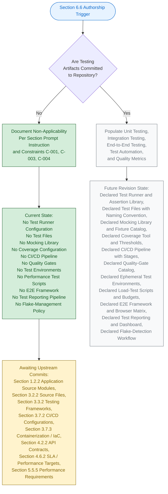

#### 6.6.7.2 Visual-Grammar Conformance

The diagram in Section 6.6.7.1 conforms to the colour grammar established by this Specification, as documented in Section 5.6.1 and reproduced in Sections 6.1.5.2, 6.2.6.2, 6.3.5.2, 6.4.5.2, and 6.5.5.2.

| Colour | Hex (Fill / Stroke) | Semantic Meaning |
|--------|----------------------|-------------------|
| Blue | `#e7f3ff` / `#0066cc` | Section authorship entry point |
| Green | `#d4edda` / `#155724` | Verifiable, present state |
| Grey | `#f8f9fa` / `#6c757d` | Prospective future state |
| Yellow | `#fff3cd` / `#856404` | Pending upstream activity |

The green-shaded nodes represent the verifiable, present authorship path; the grey-shaded nodes represent the prospective path that will be taken in a future revision once testing artifacts are added to the codebase; the yellow-shaded node identifies the pending upstream activities required to unlock those subsequent revisions; and the blue-shaded node marks the Section authorship entry point.

---

### 6.6.8 Required Diagrams Status

The Section 6.6 prompt requests three architectural diagrams: Test Execution Flow, Test Environment Architecture, and Test Data Flow. Per Constraint C-004 (Section 2.7.2), each of these diagrams remains explicitly empty until upstream testing artifacts are committed.

#### 6.6.8.1 Diagram-Exclusion Justification

Producing any of the prompt-required testing diagrams in the absence of underlying test runners, test files, CI/CD pipelines, and test data fixtures would violate Constraint C-001 (no invention) and Constraint C-004 (diagrams remain empty until upstream artifacts are populated). Section 5.3.3 establishes the identical posture for Component Interaction, State Transition, and Sequence diagrams; Section 5.5.7 establishes the identical posture for Error-Handling Flow diagrams; Sections 6.1.6, 6.2.7, 6.3.6, 6.4.6, and 6.5.6 establish the identical posture for their respective prompt-required diagrams.

| Required Diagram (per Section 6.6 prompt) | Diagram Status | Governance Basis |
|---------------------------------------------|----------------|------------------|
| Test Execution Flow Diagram | Explicitly empty — TBD | Constraint C-001, C-004 |
| Test Environment Architecture Diagram | Explicitly empty — TBD | Constraint C-001, C-004 |
| Test Data Flow Diagram | Explicitly empty — TBD | Constraint C-001, C-004 |

#### 6.6.8.2 Diagram-Population Prerequisites

Each prompt-required diagram has a specific set of upstream artifacts that must be committed before it can be populated. The table below records these prerequisites for traceability with Section 5.7.1 and Section 6.6.10 below.

| Diagram | Required Upstream Artifact(s) |
|---------|--------------------------------|
| Test Execution Flow | Declared test runner configuration, declared test files / suites, declared CI/CD pipeline with explicit test stages, declared test-trigger event sources, declared test-result aggregation pipeline |
| Test Environment Architecture | Declared containerization / IaC manifests, declared test-environment topology (local / ephemeral PR / staging), declared service-virtualization or external-service mocks, declared environment-provisioning automation |
| Test Data Flow | Declared test data fixtures / factories, declared seeding mechanism, declared isolation policy, declared teardown / cleanup workflow, declared synthetic-data generation strategy |

#### 6.6.8.3 Test Requirements Documentation Status

The Section 6.6 prompt's output-format requirement to "use Markdown tables for test requirements" cannot be satisfied with declared requirements at the current repository lifecycle stage. Section 1.3.2 verifies that no test files, no quality gates, and no verification harnesses exist; Section 3.3.2 verifies the absence of every Testing Framework marker; Section 3.7.2 verifies the absence of every Test Runner / Config marker. With no requirement declared in any form, the test-requirement matrices in Sections 6.6.2.7, 6.6.3.6, 6.6.4.6, 6.6.5.7, and 6.6.6.6 are necessarily populated with `None declared — TBD` entries. This documentation completeness will be achieved in the revision triggered by the first test runner configuration, test file, or CI/CD pipeline commit (see Section 6.6.10.1).

#### 6.6.8.4 Test Strategy Matrix Documentation Status

The Section 6.6 prompt's output-format requirement to "include test strategy matrices" cannot be satisfied with declared strategies at the current repository lifecycle stage. Sections 6.6.2 through 6.6.6 each contain a four-column strategy matrix populated with `None declared — TBD` entries, accompanied by forward-looking requirement-form descriptors. This format preserves the prompt-required structure while complying with Constraint C-001 (no invention).

#### 6.6.8.5 Example Test Pattern Documentation Status

The Section 6.6 prompt requires that "example test patterns" be provided. Per Constraint C-001, concrete example test patterns cannot be authored against a non-existent system-under-test. Instead, the forward-looking catalog of standard testing patterns (Section 6.6.9) records the canonical industry-standard test patterns — Arrange-Act-Assert, Given-When-Then BDD, Page Object Model, Test Pyramid, Test Diamond, contract-driven integration testing — as references that will become applicable as upstream artifacts are committed. This is the same forward-looking-reference treatment applied in Sections 6.4.7 and 6.5.7.

---

### 6.6.9 Standard Testing Practices Reference

The Section 6.6 prompt's explicit instruction requires that this section "document only the basic unit testing approach that will be used" once the non-applicability declaration is established. The standard testing practices enumerated below are referenced as the framework that **will** govern Section 6.6 once the corresponding artifacts are committed to the repository. Per Constraint C-001 (Section 2.7.2), this enumeration is not a declaration of adopted practices for the current repository state; it is a forward-looking reference catalog tied to specific upstream-section TBD entries that, when resolved, will activate each practice. This mirrors the forward-looking catalog pattern established in Section 6.4.7 and Section 6.5.7.

#### 6.6.9.1 Unit-Testing Standard Practices

| Standard Practice (Forward-Looking) | Activating Upstream Artifact |
|---------------------------------------|--------------------------------|
| xUnit-family test runner (pytest for Python / Jest or Vitest for JS/TS / JUnit for Java / `go test` / RSpec / Cargo test) | First test runner configuration committed (Section 3.3.2; Section 3.7.2) |
| Arrange-Act-Assert (AAA) test structure with descriptive `test_<behavior>_<expected_outcome>` or BDD `describe/it` naming | First test file committed (Section 1.3.2; Section 3.2.2) |
| Mocking via canonical library (`unittest.mock` / `pytest-mock` / Jest mocks / Sinon / Mockito / Moq / gomock) | First mocking library / fixture committed (Section 1.3.2; Section 3.4) |
| Code coverage measurement via `coverage.py` / Istanbul / nyc / JaCoCo / gocover with declared quantitative threshold | First coverage configuration committed (Section 1.2.3; Section 3.3.2) |
| Test data factories (Factory Boy / Faker / FactoryBot / Bogus) with deterministic seeding | First fixture / factory module committed (Section 3.6; Section 4.4.1) |

#### 6.6.9.2 Integration-Testing Standard Practices

| Standard Practice (Forward-Looking) | Activating Upstream Artifact |
|---------------------------------------|--------------------------------|
| Containerized test dependencies via Testcontainers or docker-compose for ephemeral databases, queues, and stubs | First Testcontainers / docker-compose.test.yml committed (Section 3.6; Section 3.7.3) |
| API contract testing via Pact / Spring Cloud Contract / Schemathesis with consumer-driven contracts | First API contract artifact committed (Section 4.2.2; Section 6.3) |
| Database integration testing with transactional rollback or dedicated test schemas | First database integration test committed (Section 3.6; Section 6.2) |
| External service mocking via WireMock / MockServer / VCR / Nock / Mountebank with record-replay or contract-driven stubs | First external-service mock committed (Section 3.5.2; Section 6.3) |
| Ephemeral test environments per pull request with automated provisioning and teardown | First ephemeral-environment automation committed (Section 3.7.3; Section 1.3.2) |

#### 6.6.9.3 End-to-End-Testing Standard Practices

| Standard Practice (Forward-Looking) | Activating Upstream Artifact |
|---------------------------------------|--------------------------------|
| Browser automation via Playwright / Cypress / Selenium WebDriver / Puppeteer with Page Object Model design pattern | First E2E test framework committed (Section 1.2.2; Section 3.2.2) |
| Test data setup/teardown via API-driven seeding with per-test isolation namespaces | First E2E data-management artifact committed (Section 3.6; Section 4.4.1) |
| Performance testing via k6 / JMeter / Locust / Gatling / Artillery with smoke, baseline, stress, and soak scenarios | First performance-test script committed (Section 4.6.2; Section 5.5.5) |
| Cross-browser matrix execution via BrowserStack / Sauce Labs / LambdaTest with desktop and mobile viewports | First cross-browser configuration committed (Section 1.2.2; Section 3.2.2) |
| Visual regression testing via Percy / Applitools / Chromatic for UI snapshot stability | First visual-regression configuration committed (Section 1.2.2) |

#### 6.6.9.4 Test-Automation Standard Practices

| Standard Practice (Forward-Looking) | Activating Upstream Artifact |
|---------------------------------------|--------------------------------|
| CI/CD pipeline integration via GitHub Actions / GitLab CI / CircleCI / Jenkins / Azure Pipelines with pipeline-as-code | First CI/CD pipeline manifest committed (Section 3.7.2) |
| Pre-commit hook enforcement via `pre-commit` framework or Husky for fast-feedback gates | First pre-commit hook configuration committed (Section 3.7.2) |
| Parallel test execution via `pytest-xdist` / `jest --maxWorkers` / JUnit fork-mode with time-balanced sharding | First parallel-execution configuration committed (Section 3.7.2; Section 1.3.2) |
| Test reporting via JUnit XML / Allure / HTML with CI artifact publication and trend dashboards | First test-reporting configuration committed (Section 5.5.1; Section 1.2.3) |
| Flaky test management via quarantine queues, automated detection through re-run history, and remediation SLAs | First flake-management policy committed (Section 1.3.2; Section 5.5.6) |

#### 6.6.9.5 Quality-Metrics Standard Practices

| Standard Practice (Forward-Looking) | Activating Upstream Artifact |
|---------------------------------------|--------------------------------|
| Coverage thresholds enforced via `coverage.py` / Istanbul or nyc / JaCoCo with PR-level diff-coverage gates | First coverage-threshold configuration committed (Section 1.2.3; Section 3.3.2) |
| Mutation testing via Stryker / mutmut / PIT for assertion-quality measurement | First mutation-test configuration committed (Section 1.2.3) |
| SonarQube / Codacy / Code Climate quality gates integrated with CI pipeline | First quality-gate configuration committed (Section 1.3.2; Section 3.7.2) |
| Performance regression detection via budget-comparison against baseline runs | First performance baseline committed (Section 4.6.2; Section 5.5.5) |
| Security testing integration (SAST via Semgrep / CodeQL; DAST via OWASP ZAP; dependency scanning via Dependabot / Snyk; secret scanning via gitleaks / TruffleHog) | First security-scan configuration committed (Section 5.5.4; Section 6.4) |

#### 6.6.9.6 Security Testing Requirements

The Section 6.6 prompt explicitly requires that security testing requirements be included. Consistent with Section 6.4 (Security Architecture) non-applicability, security testing requirements are recorded as forward-looking entries rather than adopted controls. The table below enumerates the canonical security-testing tiers and their activating upstream artifacts.

| Security-Testing Tier | Forward-Looking Practice | Activating Upstream Artifact |
|--------------------------|----------------------------|--------------------------------|
| Static Application Security Testing (SAST) | Source-code scanning via Semgrep / CodeQL / Bandit / ESLint security plugins | First SAST configuration committed (Section 6.4; Section 5.5.4) |
| Dynamic Application Security Testing (DAST) | Runtime scanning via OWASP ZAP / Burp Suite in CI pipelines | First DAST configuration committed (Section 6.4; Section 5.5.4) |
| Dependency / Software Composition Analysis | Vulnerability scanning via Dependabot / Snyk / OWASP Dependency-Check | First SCA configuration committed (Section 3.4; Section 6.4) |
| Secret Scanning | Pre-commit and CI scanning via gitleaks / TruffleHog / GitHub Secret Scanning | First secret-scanning configuration committed (Section 6.4; Section 3.7.2) |

These forward-looking practices are derived from the upstream artifact references that already exist in this Specification (Sections 1.2.3, 1.3.2, 3.3.2, 3.4, 3.6, 3.7.2, 3.7.3, 4.2.2, 4.6.2, 5.5.4, 5.5.5, 6.2, 6.3, 6.4) and reflect the canonical industry-standard testing controls associated with each declared TBD dimension. They become authoritative only upon the corresponding commit, per Assumption A-003 (Section 2.7.1).

#### 6.6.9.7 Test Resource Requirements

The Section 6.6 prompt requires that resource requirements for test execution be specified. Per Constraint C-001 (no invention), no resource requirements have been declared in the repository. The table below records the canonical resource-requirement dimensions against the authoritative upstream references that will govern them.

| Resource-Requirement Dimension | Forward-Looking Specification Form | Verifiable State | Authoritative Cross-Reference |
|----------------------------------|---------------------------------------|-------------------|--------------------------------|
| Compute (CPU cores per worker, GPU when applicable) | Declared compute allocation per test stage | None declared — TBD | Section 3.7.3; Section 5.5.5 |
| Memory (RAM per worker, swap policy) | Declared memory allocation per test stage | None declared — TBD | Section 3.7.3; Section 5.5.5 |
| Storage (artifact cache, test result retention, image cache) | Declared storage allocation and retention period | None declared — TBD | Section 3.7.3; Section 5.5.1 |
| Network (egress allowlist, internal-service connectivity) | Declared network policy and bandwidth budget | None declared — TBD | Section 3.7.3; Section 6.3 |

---

### 6.6.10 Future Revision Triggers

Consistent with Section 5.7.1 and Assumption A-004 (Section 2.7.1), a revision of Section 6.6 will be triggered when any of the events below occurs in the repository. Each trigger maps to the specific Section 6.6 subsections that will become authorable once the corresponding upstream artifact is committed. The triggers below refine the Section 5.7.1 trigger table, scoped specifically to the testing tier.

#### 6.6.10.1 Trigger-to-Subsection Mapping

| Trigger Event | Section 6.6 Subsection(s) Unblocked |
|---------------|---------------------------------------|
| First test runner configuration committed (`pytest.ini`, `jest.config.js`, `karma.conf.js`, `tox.ini`, `vitest.config.ts`) | 6.6.2.1 (Testing Frameworks and Tools) |
| First test file committed (`test_*.py`, `*.test.js`, `*.spec.ts`, `*Test.java`, `*_test.go`) | 6.6.2.2 (Test Organization Structure); 6.6.2.5 (Test Naming Conventions) |
| First mocking library / fixture committed (`unittest.mock`, `pytest-mock`, Jest mocks, Sinon, Mockito) | 6.6.2.3 (Mocking Strategy); 6.6.2.6 (Test Data Management) |
| First code-coverage configuration committed (`.coveragerc`, `nyc.config.js`, JaCoCo settings) | 6.6.2.4 (Code Coverage Requirements); 6.6.6.1 (Code Coverage Targets) |
| First integration-test artifact committed (Testcontainers config, contract test file) | 6.6.3.1 (Service Integration Test Approach) |
| First API contract test committed (Pact, Spring Cloud Contract, Schemathesis) | 6.6.3.2 (API Testing Strategy) |
| First database integration test committed (transactional fixtures, test schemas) | 6.6.3.3 (Database Integration Testing) |
| First external-service mock committed (WireMock, MockServer, VCR cassette, Nock) | 6.6.3.4 (External Service Mocking) |
| First test-environment manifest committed (docker-compose.test.yml, ephemeral PR environment IaC) | 6.6.3.5 (Test Environment Management); 6.6.8.2 (Test Environment Architecture Diagram) |
| First E2E test framework committed (Playwright, Cypress, Selenium, Puppeteer config) | 6.6.4.1 (E2E Test Scenarios); 6.6.4.2 (UI Automation Approach) |
| First E2E data-management artifact committed (API-driven seeding, fixture loader) | 6.6.4.3 (Test Data Setup/Teardown); 6.6.8.2 (Test Data Flow Diagram) |
| First performance-test script committed (k6, JMeter plan, Locust file, Gatling simulation) | 6.6.4.4 (Performance Testing Requirements); 6.6.6.3 (Performance Test Thresholds) |
| First cross-browser configuration committed (BrowserStack, Sauce Labs, LambdaTest config) | 6.6.4.5 (Cross-Browser Testing Strategy) |
| First CI/CD pipeline committed (`.github/workflows/*.yml`, `.gitlab-ci.yml`, `Jenkinsfile`, `.circleci/config.yml`) | 6.6.5.1 (CI/CD Integration); 6.6.5.2 (Automated Test Triggers); 6.6.8.2 (Test Execution Flow Diagram) |
| First parallel-execution configuration committed (`pytest-xdist`, `jest --maxWorkers`, JUnit fork-mode) | 6.6.5.3 (Parallel Test Execution) |
| First test-reporting configuration committed (JUnit XML output, Allure, HTML report) | 6.6.5.4 (Test Reporting Requirements) |
| First retry / failed-test handling policy committed (pytest-rerunfailures, jest.retryTimes) | 6.6.5.5 (Failed Test Handling) |
| First flaky-test management policy committed (quarantine list, re-run threshold) | 6.6.5.6 (Flaky Test Management) |
| First quality-gate configuration committed (SonarQube, Codacy, branch protection rules) | 6.6.6.4 (Quality Gates) |
| First test-documentation surface committed (`docs/testing/`, BDD scenario catalog) | 6.6.6.5 (Documentation Requirements) |
| First security-testing configuration committed (SAST/DAST/SCA/secret-scanning) | 6.6.9.6 (Security Testing Requirements) |

Until at least one of these triggers fires, Section 6.6 will continue to reflect the non-applicability posture documented herein, in compliance with Constraint C-001 and Assumption A-003 (Section 2.7.1).

#### 6.6.10.2 Cross-Section Coordination

When a Section 6.6 revision is triggered, the following companion sections must be revised in lockstep to preserve cross-reference consistency required by Constraint C-003. The table below records the coordination map.

| Section 6.6 Subsection | Companion Sections Requiring Co-Revision |
|--------------------------|---------------------------------------------|
| 6.6.2 (Unit Testing) | Section 1.2.2 (Application Source Modules); Section 3.2.2 (Programming Languages); Section 3.3.2 (Frameworks and Libraries); Section 3.4 (Open Source Dependencies) |
| 6.6.3 (Integration Testing) | Section 3.5.2 (Third-Party Services); Section 3.6 (Databases and Storage); Section 3.7.3 (Containerization / IaC); Section 4.2.2 (API Contracts); Section 6.3 (Integration Architecture) |
| 6.6.4 (End-to-End Testing) | Section 1.2.2 (Front-End Assets); Section 4.6.2 (Timing and SLA Considerations); Section 5.5.5 (Performance Requirements and SLAs) |
| 6.6.5 (Test Automation) | Section 3.7.2 (Build and CI/CD Configurations); Section 4.4.2 (Error Notification Flows); Section 5.5.1 (Monitoring and Observability Approach) |
| 6.6.6 (Quality Metrics) | Section 1.2.3 (Success Criteria / KPIs); Section 4.6.2 (Timing and SLA Considerations); Section 5.5.5 (Performance Requirements and SLAs); Section 6.4 (Security Architecture) |

---

### 6.6.11 Versioning Posture

Consistent with the versioning posture documented in Sections 2.7.3, 3.9.3, 4.7.1, 5.7.2, 6.1.7.2, 6.2.9.1, 6.3.8.1, 6.4.9.1, and 6.5.9.1, Section 6.6 carries the version status recorded below. The change log will begin with the first populated revision triggered by any of the events enumerated in Section 6.6.10.1.

#### 6.6.11.1 Section Version Tracking

| Versioning Element | Current State | Notes |
|----------------------|-----------------|-------|
| Section 6.6 Authorship Revision | v1.0 (TBD Posture) | First authoring pass under non-applicability declaration |
| Individual Unit-Testing Element Versions | v0.0 — Not Yet Authored | No unit-testing artifacts exist to version |
| Individual Integration-Testing Element Versions | v0.0 — Not Yet Authored | No integration-testing artifacts exist to version |
| Individual End-to-End-Testing Element Versions | v0.0 — Not Yet Authored | No E2E-testing artifacts exist to version |
| Individual Test-Automation Element Versions | v0.0 — Not Yet Authored | No CI/CD or test-automation artifacts exist to version |
| Individual Quality-Metrics Element Versions | v0.0 — Not Yet Authored | No quality-metrics artifacts exist to version |
| Change Log | Not yet initiated | Will begin with the first populated revision |

#### 6.6.11.2 Default Technology Stack Non-Adoption

Section 3.8 of this Specification enumerates a documentation-framework default technology stack reference that may list candidate Testing tools (pytest, Jest, Playwright, k6, JUnit, etc.) and candidate CI/CD platforms (GitHub Actions, GitLab CI). Per the precedent established in Section 6.4.9.2 and Section 6.5.9.2, and consistent with Constraint C-001 (no invention), Assumption A-003 (external artifacts non-authoritative until committed), and Assumption A-004 (defaults may be superseded), no default testing tool or CI/CD platform reference is **adopted** as the testing-strategy decision for `April17Sec_1`. No pytest configuration, no Jest configuration, no Playwright project file, no Cypress configuration, no k6 script, no JUnit configuration, no GitHub Actions workflow, no GitLab CI manifest, no Jenkinsfile, and no coverage configuration exists in the repository. Any default testing-tool or CI/CD-platform references contained in Section 3.8 remain candidate suggestions only; they do not constitute a test-runner, test-framework, CI/CD, or quality-gate decision for this system until and unless they are committed to the codebase. Section 6.6 therefore does not infer any test-tool selection, pipeline definition, coverage target, or quality gate from the default reference.

---

### 6.6.12 Summary of Posture

The combination of (a) the explicit instruction in the Section 6.6 prompt to declare non-applicability when the system "is a simple library, tool, or does not require comprehensive testing"; (b) the verified absence across every testing-related repository category established by Sections 1.2.2, 1.2.3, 1.3.2, 2.5.5, 3.2.2, 3.3.2, 3.4, 3.5.2, 3.6, 3.7.2, 3.7.3, 4.2.2, 4.4.2, 4.6.2, 5.5.1, 5.5.3, 5.5.5; (c) the governance constraints C-001, C-003, and C-004 (Section 2.7.2); and (d) the assumptions A-001, A-002, A-003, and A-004 (Section 2.7.1) yields a single, unambiguous posture for this section: **Detailed Testing Strategy is not applicable for this system at the current repository lifecycle stage**.

This posture will be reviewed and revised in accordance with the triggers enumerated in Section 6.6.10.1. The earliest trigger most likely to fire is the first test runner configuration commit (`pytest.ini`, `jest.config.js`, `vitest.config.ts`, `karma.conf.js`, `tox.ini`) accompanied by a first test file (`test_*.py`, `*.test.js`, `*.spec.ts`, `*Test.java`, `*_test.go`), which would unblock authorship of Section 6.6.2 (Unit Testing) and cascade through Sections 6.6.3 (Integration Testing), 6.6.4 (End-to-End Testing), 6.6.5 (Test Automation), and 6.6.6 (Quality Metrics) as additional testing-tier artifacts are committed. Until such triggers fire, Section 6.6 stands as a deliberate, evidence-backed statement of non-applicability — fully consistent with the precedents set by Sections 6.1 (Core Services Architecture), 6.2 (Database Design), 6.3 (Integration Architecture), 6.4 (Security Architecture), and 6.5 (Monitoring and Observability). The forward-looking catalog of standard testing practices enumerated in Section 6.6.9 represents the canonical industry-standard testing controls that will be activated dimension by dimension as each upstream artifact is committed.

---

### 6.6.13 References

#### 6.6.13.1 Files Examined

- `README.md` — Sole tracked file in the repository (14 bytes, single line `# April17Sec_1`); confirms the Repository Initialization lifecycle stage and the verified absence of all testing-strategy artifacts (no test runner configurations, no test files, no mocking libraries, no coverage configurations, no CI/CD pipelines, no quality gates, no test environments, no performance test scripts, no E2E test frameworks, no test data factories, no test reporting pipelines, no flake-management policies).
- Repository root (`/`) — Contains only `README.md` and the `.git/` metadata directory; verified zero application subfolders, zero source files, zero configuration files, zero dependency manifests, zero testing configurations, zero `pytest.ini` / `jest.config.js` / `karma.conf.js` / `tox.ini` / `vitest.config.ts`, zero `.github/workflows/`, zero `Jenkinsfile`, zero `.gitlab-ci.yml`, zero `.circleci/config.yml`, zero `.pre-commit-config.yaml`, zero `.husky/` directory, zero `tests/` directory, zero `__tests__/` directory, zero `test_*.py` / `*.test.js` / `*.spec.ts` files, zero coverage configuration files, zero `docs/testing/` directory.

#### 6.6.13.2 Search Operations Performed

- Semantic search for "test files unit testing integration testing pytest jest mocha" — returned empty results (`[]`), confirming no test source files exist in the repository.
- Semantic search for "code coverage quality gates ci pipeline workflow" — returned empty results (`[]`), confirming no quality-gate or CI source files exist in the repository.
- Semantic search for "mocking fixtures factories test data" — returned empty results (`[]`), confirming no test data substrate exists in the repository.
- Folder search for "tests testing test suites quality assurance" — returned empty results (`[]`), confirming no testing-related directories exist in the repository.
- Filesystem inspection for `pytest.ini`, `jest.config.*`, `karma.conf.*`, `tox.ini`, `vitest.config.*`, `.coveragerc`, `nyc.config.*`, `.github/workflows/`, `Jenkinsfile`, `.gitlab-ci.yml`, `.circleci/`, `.pre-commit-config.yaml`, `.husky/`, `tests/`, `__tests__/`, `e2e/`, `cypress/`, `playwright.config.*`, `k6/`, `*.test.*`, `*.spec.*` — zero matches within the repository.

#### 6.6.13.3 Technical Specification Sections Cross-Referenced

- **Section 1.1 EXECUTIVE SUMMARY** — Project identity, repository metadata, and Repository Initialization lifecycle stage
- **Section 1.2 SYSTEM OVERVIEW** — **CRITICAL** — Section 1.2.2 confirms zero Application Source Modules, zero Back-End Services, zero Front-End Assets, and zero Infrastructure-as-Code Definitions; Section 1.2.3 confirms no measurable objectives, no KPIs, no OKRs, no SLOs, no quantitative targets, and no acceptance criteria
- **Section 1.3 SCOPE** — **CRITICAL** — Section 1.3.2 records the authoritative out-of-scope declaration: *"All automated tests, quality gates, and verification harnesses (no test files exist)"*
- **Section 1.4 SCOPE DECLARATION SUMMARY** — Consolidated TBD posture across all in-scope and out-of-scope categories
- **Section 1.5 References** — Section 1.5.1 confirms that the only documentation artifact is the single-line `# April17Sec_1` heading in `README.md`
- **Section 2.1 SECTION OVERVIEW AND READINESS POSTURE** — TBD posture declaration framework
- **Section 2.2 FEATURE CATALOG** — Empty feature catalog confirming no features to test
- **Section 2.5 IMPLEMENTATION CONSIDERATIONS** — Section 2.5.5 records maintenance and observability requirements as TBD; Section 2.5.2 records performance requirements as TBD; Section 2.5.3 records scalability considerations as TBD
- **Section 2.7 ASSUMPTIONS, CONSTRAINTS, AND VERSIONING** — **CRITICAL** — Governance constraints C-001, C-003, C-004 (Section 2.7.2); assumptions A-001, A-002, A-003, A-004 (Section 2.7.1); versioning posture (Section 2.7.3)
- **Section 3.2 PROGRAMMING LANGUAGES** — Section 3.2.2 verifies zero source files across all language ecosystems
- **Section 3.3 FRAMEWORKS AND LIBRARIES** — **CRITICAL** — Section 3.3.2 directly confirms Testing Frameworks (`pytest.ini`, `jest.config.js`, `karma.conf.js`) as `No`
- **Section 3.4 OPEN SOURCE DEPENDENCIES** — Verified absence of all dependency manifests (no test libraries, no assertion libraries, no mocking libraries can be loaded)
- **Section 3.5 THIRD-PARTY SERVICES** — Section 3.5.2 verifies absence of all third-party services that would require mocking; Section 3.5.3 records every observability tool as TBD
- **Section 3.6 DATABASES AND STORAGE** — Verified absence of all persistence layers, eliminating the substrate for database integration testing
- **Section 3.7 DEVELOPMENT AND DEPLOYMENT** — **CRITICAL** — Section 3.7.2 directly confirms Test Runners / Config (`pytest.ini`, `jest.config.js`, `karma.conf.js`, `tox.ini`) as `No`; GitHub Actions, Jenkins, Pre-commit / Git Hooks all `No`; Section 3.7.3 confirms no containerization or IaC for test environments
- **Section 3.8 DEFAULT TECHNOLOGY STACK REFERENCE** — Default-stack testing-tool references explicitly not adopted (Section 6.6.11.2)
- **Section 3.9 TECHNOLOGY STACK LIFECYCLE** — Stack-adoption lifecycle diagram pattern
- **Section 4.2 SYSTEM WORKFLOWS** — Section 4.2.2 confirms no API contracts exist
- **Section 4.4 TECHNICAL IMPLEMENTATION** — Section 4.4.1 confirms no state management or transactional flows exist; Section 4.4.2 confirms no error-notification flows can be documented
- **Section 4.5 REQUIRED DIAGRAMS** — Diagram-empty pattern with authorship lifecycle as sole permitted form
- **Section 4.6 SWIM LANES, TIMING, AND SLA CONSIDERATIONS** — **CRITICAL** — Section 4.6.2 records every timing and SLA dimension (End-to-End Latency Budget, Per-Step Timing Constraint, Throughput / Concurrency Target, Availability SLO, Error-Budget Policy) as `None declared — TBD`
- **Section 5.2 HIGH-LEVEL ARCHITECTURE** — No components, no integration topology, no external integration points against which test harnesses would operate
- **Section 5.4 TECHNICAL DECISIONS** — All technical decisions TBD
- **Section 5.5 CROSS-CUTTING CONCERNS** — **CRITICAL** — Section 5.5.1 confirms no metrics, dashboards, or reporting substrate; Section 5.5.3 confirms no error-handling pattern; Section 5.5.4 confirms no security controls; Section 5.5.5 records every Performance / SLA dimension as TBD; Section 5.5.6 confirms no DR / improvement-tracking workflow
- **Section 5.6 ARCHITECTURE AUTHORSHIP LIFECYCLE** — **CRITICAL** — Visual-grammar template (Section 5.6.1) for the authorship lifecycle diagram
- **Section 5.7 FUTURE SECTION REVISION TRIGGERS** — Trigger event taxonomy that Section 6.6.10 refines for the testing tier
- **Section 6.1 CORE SERVICES ARCHITECTURE** — **CRITICAL TEMPLATE** — Non-applicability declaration structure originating template
- **Section 6.2 DATABASE DESIGN** — **CRITICAL TEMPLATE** — Refined non-applicability template with multi-subsection verified-absence pattern
- **Section 6.3 INTEGRATION ARCHITECTURE** — **CRITICAL TEMPLATE** — Verified-absence tables with prompt-required dimension mapping
- **Section 6.4 SECURITY ARCHITECTURE** — **CRITICAL TEMPLATE** — Standard Practices Reference forward-looking catalog (Section 6.4.7) pattern reproduced in Section 6.6.9
- **Section 6.5 MONITORING AND OBSERVABILITY** — **CRITICAL TEMPLATE** — Most recent precedent that Section 6.6 mirrors; multi-subsection verified-absence pattern, Standard Practices Reference (Section 6.5.7), and detailed trigger-to-subsection mapping (Section 6.5.8.1) directly inform Sections 6.6.2–6.6.6, 6.6.9, and 6.6.10

# 7. User Interface Design

> **Section Disposition: No user interface required.**

The `April17Sec_1` repository, in its present state, does not define, declare, scaffold, or imply any user interface. Per the explicit conditional rule of this section's authorship prompt — _"If the project doesn't define a user interface (UI), leave the section empty with the note 'No user interface required'"_ — Section 7 is intentionally minimal and records only the verifiable absence of UI artifacts. No synthetic screens, hypothetical user flows, speculative visual designs, or invented UI technologies appear in this section, in compliance with Constraint **C-001** (Section 2.7.2), which prohibits the introduction of unsupported, non-evidence-grounded content.

## 7.1 APPLICABILITY DECLARATION

### 7.1.1 Primary Determination

**No user interface is required, defined, scoped, or implemented in the `April17Sec_1` repository at this time.**

This determination is not provisional or speculative. It is grounded directly in the verifiable state of the codebase and in declarations made elsewhere in this Technical Specification. The repository's single tracked artifact is a 14-byte `README.md` file containing only the heading `# April17Sec_1`; no presentation-layer artifact of any kind has been committed.

### 7.1.2 Conditional Rule Invocation

The Section 7 authorship prompt provides an explicit conditional rule for projects lacking a UI: the section is to be left empty with the prescribed notation. The rule's preconditions are fully satisfied:

| Precondition for "No UI Required" Notation | Satisfied in This Repository? | Source of Evidence |
|---------------------------------------------|-------------------------------|--------------------|
| No UI assets present in source tree | Yes | Section 1.2.2, Section 3.2.2 |
| No UI frameworks declared in dependency manifests | Yes | Section 3.3.2 |
| No UI-related features or use cases declared | Yes | Section 2.2.1, Section 2.3.1 |
| No user personas or user groups declared | Yes | Section 1.3.1 |
| UI explicitly listed as out-of-scope of current repository | Yes | Section 1.3.2 |

Because every precondition is satisfied with affirmative, evidence-backed answers, Section 7 invokes the conditional rule and produces the prescribed minimal documentation.

### 7.1.3 Lifecycle Context

This determination reflects the **Repository Initialization (Scaffold)** lifecycle stage documented in Section 1.2.2's project-position diagram. The lifecycle position is depicted again below for sectional clarity:

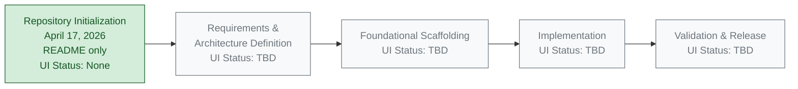

The green node represents the verifiable, present-day state of the repository at the time of this document's authorship. Grey nodes represent prospective stages whose contents are not yet defined within the codebase; the UI determination for each grey stage is correspondingly TBD and will be authored when artifacts that warrant such determination are committed.

## 7.2 EVIDENCE OF UI ABSENCE

The following subsections consolidate evidence — drawn exclusively from the repository contents and from cross-referenced sections of this Technical Specification — that supports the "No user interface required" determination. No new claims are introduced here; each statement is traceable to a prior section or to the verifiable file inventory of the repository.

### 7.2.1 Repository File Inventory

The `April17Sec_1` repository contains the file inventory shown below. The inventory is complete; no additional tracked files exist.

| Path | Type | Size | UI-Related Content? |
|------|------|------|---------------------|
| `README.md` | Markdown | 14 bytes (1 line) | No — contains only the heading `# April17Sec_1` |

There are no subfolders within the repository root. There is no `src/`, `app/`, `client/`, `frontend/`, `ui/`, `web/`, `pages/`, `components/`, `views/`, `screens/`, `templates/`, `static/`, `public/`, `assets/`, or `styles/` directory. The depth-zero file system is terminal.

### 7.2.2 Verified Absence of Front-End Source Artifacts

Per Section 3.2.2 (Verified Absence of Source-Code Artifacts), the repository has been inspected for every common UI-bearing file extension. None were found. The table below restates the relevant findings.

| File-Extension Family | Representative Extensions | Present in Repository? |
|-----------------------|---------------------------|------------------------|
| Web Markup | `.html`, `.htm`, `.xhtml` | No |
| Web Styling | `.css`, `.scss`, `.sass`, `.less`, `.styl` | No |
| Web Scripting | `.js`, `.mjs`, `.cjs`, `.jsx`, `.ts`, `.tsx` | No |
| Web Templating | `.ejs`, `.pug`, `.hbs`, `.mustache`, `.njk`, `.liquid`, `.twig` | No |
| Image Assets | `.png`, `.jpg`, `.jpeg`, `.gif`, `.svg`, `.webp`, `.ico` | No |
| Font Assets | `.ttf`, `.otf`, `.woff`, `.woff2`, `.eot` | No |
| Native Mobile (iOS) | `.swift`, `.m`, `.mm`, `.xib`, `.storyboard` | No |
| Native Mobile (Android) | `.kt`, `.java`, `.xml` layout resources | No |
| Cross-Platform Mobile | `.dart` (Flutter) | No |

Without any of the above artifacts, no UI surface — web, mobile, or desktop — exists to be designed, screen-mapped, or interaction-modeled.

### 7.2.3 Verified Absence of UI Framework Markers

Per Section 3.3.2 (Verified Absence of Framework Markers), the repository has been inspected for the project-marker files of every major UI framework ecosystem. None were found. The UI-relevant subset of that inspection is restated below.

| UI Framework Family | Representative Project Marker(s) | Found in Repository? |
|----------------------|-----------------------------------|----------------------|
| Single-Page Application Frameworks | `react`, `vue`, `angular`, `svelte`, `solid-js` declared in `package.json` | No (no manifest exists) |
| Frontend Meta-Frameworks / SSR | `next.config.js`, `nuxt.config.js`, `astro.config.mjs`, `remix.config.js`, `sveltekit` | No |
| Frontend Build Tooling | `vite.config.js`, `webpack.config.js`, `rollup.config.js`, `parcel` markers | No |
| CSS Frameworks / Utility Libraries | `tailwind.config.js`, `postcss.config.js`, Bootstrap imports, Bulma, Foundation | No |
| Component Libraries | Material UI, Ant Design, Chakra UI, Mantine declared in `package.json` | No (no manifest exists) |
| Cross-Platform Mobile | `react-native`, `expo`, `flutter pubspec.yaml`, `ionic` markers | No |
| Native iOS Project Markers | `Package.swift`, `Podfile`, `*.xcodeproj`, `*.xcworkspace` | No |
| Native Android Project Markers | `build.gradle`, `AndroidManifest.xml`, `settings.gradle` | No |
| Desktop UI Frameworks | Electron, Tauri, WPF, Qt, GTK markers | No |
| Game / Real-Time UI | Unity, Unreal, Godot project files | No |

With no framework declared in any ecosystem, no UI runtime exists to host components, no rendering engine exists to paint screens, and no event loop exists to receive user interactions.

### 7.2.4 Explicit Out-of-Scope Declaration

Section 1.3.2 (Out-of-Scope Elements) records the following statement among the explicitly-excluded capabilities of the current repository state:

> _"All user interfaces and user-facing experiences (no UI assets exist)"_

This declaration is the authoritative scope determination for UI within this Technical Specification. Section 7 honors that determination and does not contradict, soften, or extend it.

### 7.2.5 Architectural Boundary Evidence

Section 5.2.1 (System Boundaries and Major Interfaces) records that "with no internal components and no external interfaces declared, the system possesses no defined boundary surface." A user interface is, by definition, a boundary surface between human users and the rest of the system. With no boundary surface to populate, no UI can be situated within the architecture. Section 5.2.2 further records that the Core Components inventory is empty across all component categories, including the Front-End Assets (HTML/CSS) category.

## 7.3 SECTION SUB-ELEMENT STATUS MATRIX

The Section 7 authorship prompt enumerates seven sub-elements that would be documented if a UI were present, plus a directive to reference actual UI screens in the repository. Each sub-element is recorded below alongside its verifiable status.

### 7.3.1 Required Sub-Element Coverage

| # | Required Sub-Element (per Prompt) | Status | Authoritative Source |
|---|------------------------------------|--------|----------------------|
| 1 | Core UI technologies involved | None — no UI frameworks declared | Section 3.3.2 |
| 2 | UI use cases | None — no features declared in catalog | Section 2.2.1 |
| 3 | UI / backend interaction boundaries | None — no components or interfaces declared | Section 5.2.1, Section 5.2.2 |
| 4 | UI schemas | None — no schemas, data models, or ORM declarations | Section 3.6, Section 2.3.2 |
| 5 | Screens required | None — no UI assets, templates, or screen specifications | Section 1.2.2, Section 3.2.2 |
| 6 | User interactions | None — no user personas, roles, or workflows declared | Section 1.3.1, Section 2.2.1 |
| 7 | Visual design considerations | None — no design tokens, styles, themes, brand assets | Section 3.2.2, Section 3.3.2 |

### 7.3.2 Actual UI Screens in the Repository

The Section 7 prompt directs the author to _"Find and reference actual UI screens in the repository."_ A comprehensive depth-zero inspection of the repository (root only — no subfolders exist) confirms the following inventory:

| Screen / View Asset Found in Repository | Path | Description |
|------------------------------------------|------|-------------|
| _(none)_ | _n/a_ | No screen, view, page, template, layout, fragment, partial, dialog, modal, popover, or interactive component asset exists in the repository. |

The sole tracked file (`README.md`) is a documentation artifact, not a UI surface, and it does not embed, link to, or describe any UI screen.

## 7.4 CONSTRAINT COMPLIANCE STATEMENT

### 7.4.1 Adherence to Constraint C-001

Constraint **C-001** (Section 2.7.2) prohibits the introduction of synthetic, hypothetical, or speculative content that is not directly supported by repository evidence. Section 7 honors C-001 by:

- Not inventing UI technologies, frameworks, or libraries
- Not authoring placeholder screen designs, wireframes, or mockups
- Not fabricating user personas, journey maps, or interaction flows
- Not declaring color palettes, typography scales, or design systems
- Not synthesizing UI/backend contracts, request/response schemas, or state-management patterns
- Not constructing accessibility (WCAG), internationalization (i18n), or responsive-design specifications

Each of the above would constitute an unsupported claim under C-001 given the verified empty state of the repository.

### 7.4.2 Authorship Honesty Posture

Section 7 takes a posture of **verifiable absence rather than speculative presence**. Where authoring agents are tempted to fill an empty section with plausible-sounding but unsupported content, Section 7 instead documents the absence itself as the authoritative finding. This posture aligns with Section 5.3.1's stipulation that "Detailed specifications for non-existent components cannot be authored without violating Constraint C-001."

## 7.5 FUTURE REVISION TRIGGERS

### 7.5.1 Conditions That Reopen Section 7

Section 7 shall be revised when **any** of the following triggers occur within the repository:

| Trigger # | Condition | Expected Section 7 Outcome |
|-----------|-----------|----------------------------|
| T-UI-01 | A UI framework manifest is committed (e.g., `package.json` declaring `react`, `vue`, `angular`, `svelte`, etc.) | Document the framework selection in Section 7.1 (Core UI Technologies) |
| T-UI-02 | Any web markup, styling, or scripting source file (`.html`, `.css`, `.jsx`, `.tsx`, `.vue`, `.svelte`, etc.) is committed | Document affected screens and component hierarchy |
| T-UI-03 | A native mobile project marker (`Package.swift`, `*.xcodeproj`, `AndroidManifest.xml`, `pubspec.yaml`, etc.) is committed | Document the mobile UI stack and screen inventory |
| T-UI-04 | A desktop UI framework marker (Electron, Tauri, etc.) is committed | Document the desktop UI surface |
| T-UI-05 | A design-system artifact (Figma export, design tokens JSON, Storybook configuration) is committed | Document visual design considerations |
| T-UI-06 | A user persona, role, or workflow is declared in Section 1.3.1 or Section 2.2.1 | Document user interactions tied to the declared persona/role |
| T-UI-07 | A UI-bearing feature is added to the Feature Catalog (Section 2.2.1) | Document UI use cases tied to the feature |
| T-UI-08 | A UI/backend interface contract (REST, GraphQL, WebSocket, gRPC-Web) is declared in Section 4.2.2 | Document UI/backend interaction boundaries and schemas |

### 7.5.2 Expected Future Content Areas

When the triggers above are satisfied, Section 7 shall be expanded to include the conventional UI-design topics enumerated by the authorship prompt:

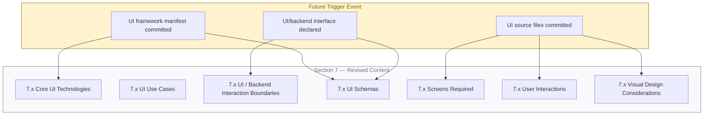

Until at least one trigger condition is satisfied, Section 7 remains in its current "No user interface required" posture.

## 7.6 SECTION DISPOSITION SUMMARY

| Disposition Attribute | Value |
|------------------------|-------|
| Section Status | Closed — No UI Required |
| Verifiable Evidence Sources | Sections 1.2.2, 1.3.2, 2.2.1, 2.3.1, 3.2.2, 3.3.2, 5.2.1, 5.2.2 |
| Applicable Constraint | C-001 (Section 2.7.2) — No synthetic content |
| Lifecycle Stage | Repository Initialization (Scaffold) |
| Reopening Triggers | T-UI-01 through T-UI-08 (Section 7.5.1) |
| Synthetic Content Introduced | None |

## 7.7 References

### 7.7.1 Files Examined

- `README.md` — The sole tracked file in the repository; confirmed to contain only the heading `# April17Sec_1` (14 bytes, 1 line); no UI/HTML/CSS/script content.

### 7.7.2 Folders Explored

- `/` (repository root, depth 0) — Confirmed to contain only `README.md`; no subfolders; no UI asset directories (`src/`, `app/`, `client/`, `frontend/`, `ui/`, `web/`, `pages/`, `components/`, `views/`, `screens/`, `templates/`, `static/`, `public/`, `assets/`, `styles/`) exist.

### 7.7.3 Technical Specification Sections Cross-Referenced

- **Section 1.2.1** (Project Context) — Confirms absence of configuration files, dependency manifests, and container definitions that could indicate a UI stack.
- **Section 1.2.2** (High-Level Description) — Confirms `Front-End Assets (HTML/CSS)` component category is not present.
- **Section 1.3.1** (In-Scope Elements) — Confirms no user groups, personas, or user workflows are declared.
- **Section 1.3.2** (Out-of-Scope Elements) — Explicitly lists "All user interfaces and user-facing experiences (no UI assets exist)" among the current out-of-scope items.
- **Section 2.2.1** (Feature Catalog) — Confirms empty feature catalog; no UI-bearing features declared.
- **Section 2.3.1** (Functional Requirements) — Confirms empty requirements catalog.
- **Section 2.7.2** (Constraints) — Establishes Constraint C-001 prohibiting synthetic content.
- **Section 3.2.2** (Verified Absence of Source-Code Artifacts) — Confirms absence of `.html`, `.css`, `.scss`, `.js`, `.jsx`, `.ts`, `.tsx`, `.swift`, `.kt`, and all other UI-bearing source extensions.
- **Section 3.3.2** (Verified Absence of Framework Markers) — Confirms absence of every UI framework marker family (SPA, SSR, CSS, mobile cross-platform, native iOS, native Android, desktop).
- **Section 3.6** (Databases and Storage) — Confirms absence of schema artifacts that would underlie UI data binding.
- **Section 5.2.1** (System Boundaries and Major Interfaces) — Confirms no boundary surface exists, and therefore no UI surface can be situated.
- **Section 5.2.2** (Core Components Inventory) — Confirms zero components across all component categories.
- **Section 5.3.1** (Component Inventory Status) — Establishes the principle that specifications for non-existent components cannot be authored without violating C-001.

# 8. Infrastructure

## 8.1 Applicability Declaration

**Detailed Infrastructure Architecture is not applicable for this system.**

The `April17Sec_1` repository is at the Repository Initialization (Scaffold) lifecycle stage as established in Section 1.1 and Section 1.2.2. The repository contains exactly one tracked file (`README.md`, 14 bytes) whose entire content is the single Markdown heading `# April17Sec_1`. No deployment environment definition, no Infrastructure-as-Code (IaC) artifact, no cloud-service configuration, no container image definition, no orchestration manifest, no CI/CD pipeline configuration, no infrastructure-monitoring configuration, no environment-promotion workflow, no backup or disaster-recovery runbook, no network-topology declaration, and no compliance-control catalog exists anywhere in the codebase. There is, consequently, **no deployment substrate, no runtime platform, no operational pipeline, and no infrastructure surface against which an Infrastructure Architecture could be authored**.

This posture is the unambiguous and required response per the Section 8 prompt's explicit instruction: *"If the system is a standalone application or library that does not require deployment infrastructure, clearly state 'Detailed Infrastructure Architecture is not applicable for this system' and explain why, then document only the minimal build and distribution requirements."* The minimal build and distribution posture and the forward-looking infrastructure-practice catalog are enumerated in Sections 8.10 and 8.11 below.

Section 1.3.2 records the authoritative out-of-scope declaration for the current repository state: *"All build, packaging, and deployment automation (no build scripts or CI/CD definitions exist)"* and *"All operational tooling, monitoring, and observability components (no configuration exists)."* Section 3.7.2 verifies the absence of every CI/CD platform (GitHub Actions, GitLab CI, CircleCI, Jenkins, Azure Pipelines), every build tool (Makefile, Rakefile, Justfile, build.sh, JS bundlers, Python build tools), and every quality-gate scaffold (linters, formatters, pre-commit hooks, test runners). Section 3.7.3 verifies the absence of every containerization and IaC artifact (Dockerfile, docker-compose, Kubernetes manifests, Helm charts, Terraform modules, CloudFormation templates, Pulumi programs, Ansible playbooks). Section 3.5.3 records every cloud-service concern (Cloud Platform Selection, Managed Compute, Managed Database, Object Storage, CDN / Edge, DNS / Domain Management) as `No — TBD`.

### 8.1.1 Categorical Justification

The non-applicability of Detailed Infrastructure Architecture is grounded in four independently sufficient categorical reasons, each derived from verifiable repository evidence and from upstream sections of this Specification.

| # | Categorical Reason | Authoritative Cross-Reference |
|---|---------------------|--------------------------------|
| (a) | No deployable workload, runtime entry point, or executable artifact exists in the repository | Section 1.2.2; Section 1.3.2; Section 5.2.2 |
| (b) | No build automation, CI/CD pipeline, or quality-gate configuration exists | Section 1.3.2; Section 3.7.2 |
| (c) | No containerization, orchestration, or Infrastructure-as-Code artifact exists | Section 1.3.2; Section 3.7.3 |
| (d) | No cloud-service selection, deployment-environment declaration, or operational monitoring substrate exists | Section 3.5.3; Section 5.5.1; Section 5.5.6 |

**Reason (a) — No deployable workload, runtime entry point, or executable artifact exists.** Section 1.2.2 records zero Application Source Modules, zero Back-End Services, zero Front-End Bundles, and zero Infrastructure-as-Code Definitions. Section 1.3.2 lists *"All software functionality (no source code exists)"* as out of scope of the current repository state. Section 5.2.2 confirms that no components of any kind exist. Without a deployable workload of any form, the dimensions of deployment topology, runtime platform selection, compute / memory / storage / network sizing, and high-availability design cannot be evidence-grounded.

**Reason (b) — No build automation, CI/CD pipeline, or quality-gate configuration exists.** Section 3.7.2 verifies, dimension by dimension, the absence of all build scripts (`Makefile`, `Rakefile`, `Justfile`, `build.sh`), all JavaScript bundlers (`webpack.config.js`, `rollup.config.js`, `vite.config.js`, `esbuild.config.js`), all Python build tools (`setup.py`, `setup.cfg`, `pyproject.toml`), all linter and formatter configurations (`.eslintrc*`, `.prettierrc*`, `.flake8`, `pylintrc`, `.editorconfig`, `tsconfig.json`), all CI/CD platform configurations (`.github/workflows/*.yml`, `.gitlab-ci.yml`, `.circleci/config.yml`, `Jenkinsfile`, `azure-pipelines.yml`), all pre-commit and Git-hook scaffolds (`.pre-commit-config.yaml`, `.husky/`), and all test-runner configurations (`pytest.ini`, `jest.config.js`, `karma.conf.js`, `tox.ini`). Section 1.3.2 reaffirms *"All build, packaging, and deployment automation (no build scripts or CI/CD definitions exist)"* as out of scope of the current repository state.

**Reason (c) — No containerization, orchestration, or Infrastructure-as-Code artifact exists.** Section 3.7.3 verifies, dimension by dimension, the absence of `Dockerfile`, `docker-compose.yml`, `.dockerignore`, Kubernetes manifests (`*.yaml` under `k8s/`, `manifests/`), Helm charts (`Chart.yaml`, `values.yaml`), Terraform modules (`*.tf`, `*.tfvars`), AWS CloudFormation templates, Pulumi programs, and Ansible playbooks. Without an IaC, container, or orchestration substrate, the dimensions of container platform selection, base-image strategy, orchestration cluster architecture, auto-scaling policy, resource allocation, and IaC approach cannot be evidence-grounded.

**Reason (d) — No cloud-service selection, deployment-environment declaration, or operational monitoring substrate exists.** Section 3.5.3 records every cloud-service concern (Cloud Platform Selection, Managed Compute Service, Managed Database Service, Object Storage Service, CDN / Edge Configuration, DNS / Domain Management) as `No — TBD`. Section 5.5.1 records every monitoring concern (Metrics Collection, Distributed Tracing, Log Aggregation Backend, Alerting / On-Call Integration, Error-Reporting Service, Uptime / Synthetic Monitoring) as TBD. Section 5.5.6 records every disaster-recovery dimension (RPO / RTO Targets, Backup / Snapshot Cadence, Restore Verification Procedure, Cross-Region / Cross-AZ Failover Plan, Post-Incident Review Process) as TBD. Without these substrates, cloud-provider justification, high-availability design, cost-optimization strategy, infrastructure monitoring, and backup / disaster-recovery planning cannot be evidence-grounded.

### 8.1.2 Governance Basis for the Non-Applicability Declaration

Authorship of this section is governed by the constraints recorded in Section 2.7.2. The constraints listed below directly justify the non-applicability declaration and the format used to document it.

| Constraint ID | Constraint Statement | Applicability to Section 8 |
|---------------|------------------------|------------------------------|
| C-001 | No features, requirements, or relationships may be invented; all entries must be grounded in verifiable repository content | Forbids fabrication of cloud providers, container platforms, orchestration manifests, CI/CD pipelines, monitoring configurations, deployment topologies, or any infrastructure-architecture element |
| C-003 | Cross-references to companion sections must remain consistent with the TBD posture established in Section 1 | Mandates that Section 8 mirror the TBD posture declared in Sections 1.3.2, 3.5.3, 3.7.2, 3.7.3, 3.8.2, 5.5.1, 5.5.5, and 5.5.6 |
| C-004 | Diagrams remain empty until upstream artifacts are populated | Forbids producing infrastructure-architecture diagrams, deployment-workflow diagrams, environment-promotion flows, or network-architecture diagrams |

Assumption A-001 (Section 2.7.1) further establishes that the repository's verifiable state as of the initial commit is the authoritative input for every architectural claim. Assumption A-002 (Section 2.7.1) establishes that the absence of infrastructure artifacts reflects the project's actual lifecycle stage (Repository Initialization), not an omission by this Specification. Assumption A-003 (Section 2.7.1) establishes that no external requirements artifacts (cloud-account configurations, IaC modules stored elsewhere, CI/CD platform settings stored in third-party systems) are authoritative until committed to the codebase. Assumption A-004 (Section 2.7.1) confirms that subsequent revisions of this Specification will replace TBD markers with evidence-backed declarations once corresponding infrastructure artifacts are committed.

---

## 8.2 Deployment Environment — Verified Absence

This subsection records, dimension by dimension, the verified absence of every Deployment Environment attribute required by the Section 8 prompt — Target Environment Assessment (Environment type, Geographic distribution, Resource requirements, Compliance and regulatory) and Environment Management (Infrastructure as Code, Configuration management, Environment promotion, Backup and disaster recovery). Each row pairs a prompt-required dimension with its authoritative upstream cross-reference. Per Constraint C-001 (no invention), no synthetic deployment environments, geographic-distribution patterns, resource sizings, compliance regimes, IaC modules, configuration-management platforms, promotion workflows, or DR runbooks have been introduced.

### 8.2.1 Target Environment Assessment Dimensions

Target Environment Assessment requires (a) a declared environment type (on-premises, cloud, hybrid, multi-cloud), (b) a declared geographic-distribution strategy (single-region, multi-region, multi-AZ, edge), (c) declared resource baselines (compute, memory, storage, network), and (d) a declared compliance-regime catalog (SOC 2, ISO 27001, HIPAA, PCI DSS, GDPR, FedRAMP). Section 1.2.2 confirms zero Infrastructure-as-Code Definitions; Section 3.5.3 records every Cloud Service concern as TBD; Section 5.5.5 records every Performance and SLA dimension as TBD.

#### 8.2.1.1 Environment Type Dimensions

| Environment-Type Element | Verifiable State | Authoritative Cross-Reference |
|---------------------------|-------------------|--------------------------------|
| Environment Classification (On-Premises / Cloud / Hybrid / Multi-Cloud) | None declared — TBD | Section 1.2.2; Section 3.5.3 |
| Target Cloud Provider Selection (AWS / Azure / GCP / Other) | None declared — TBD | Section 3.5.3; Section 3.8.2 |
| Runtime Compute Model (VM / Container / Serverless / PaaS) | None declared — TBD | Section 3.5.3; Section 3.7.3 |
| Network Architecture Pattern (VPC / Hub-Spoke / Mesh / Flat) | None declared — TBD | Section 5.5.4; Section 3.5.3 |

#### 8.2.1.2 Geographic Distribution Dimensions

| Geographic-Distribution Element | Verifiable State | Authoritative Cross-Reference |
|----------------------------------|-------------------|--------------------------------|
| Region Selection (Single-Region / Multi-Region / Global) | None declared — TBD | Section 1.3.1; Section 3.5.3 |
| Availability Zone Topology (Single-AZ / Multi-AZ) | None declared — TBD | Section 5.5.5; Section 5.5.6 |
| Edge / CDN Distribution Strategy | None declared — TBD | Section 3.5.3 |
| Data-Residency / Sovereignty Requirements | None declared — TBD | Section 1.3.1; Section 6.2.4 |

#### 8.2.1.3 Resource Requirement Dimensions

| Resource-Requirement Element | Verifiable State | Authoritative Cross-Reference |
|--------------------------------|-------------------|--------------------------------|
| Compute Sizing (CPU / vCPU Count and Class) | None declared — TBD | Section 2.5.3; Section 5.5.5 |
| Memory Sizing (RAM Allocation per Workload) | None declared — TBD | Section 2.5.3; Section 5.5.5 |
| Storage Sizing (Persistent Volume / Object Storage Capacity) | None declared — TBD | Section 3.6; Section 5.5.5 |
| Network Bandwidth and Throughput Targets | None declared — TBD | Section 4.6.2; Section 5.5.5 |

#### 8.2.1.4 Compliance and Regulatory Dimensions

| Compliance-Regulatory Element | Verifiable State | Authoritative Cross-Reference |
|--------------------------------|-------------------|--------------------------------|
| Applicable Compliance Regime (SOC 2 / HIPAA / PCI DSS / GDPR / FedRAMP) | None declared — TBD | Section 6.2.4; Section 6.4.4.5 |
| Control Catalog Mapped to Compliance Regime | None declared — TBD | Section 5.5.4; Section 6.4.4.5 |
| Audit-Evidence Collection Mechanism | None declared — TBD | Section 5.5.2; Section 6.4.3.5 |
| Data-Residency and Cross-Border Transfer Policy | None declared — TBD | Section 6.2.4; Section 6.4.4.5 |

### 8.2.2 Environment Management Dimensions

Environment Management requires (a) a declared Infrastructure-as-Code (IaC) framework, (b) a declared configuration-management strategy, (c) a declared environment-promotion model (dev / staging / prod), and (d) a declared backup and disaster-recovery plan. Section 3.7.3 verifies the absence of all IaC artifacts; Section 5.5.6 records every disaster-recovery dimension as TBD.

#### 8.2.2.1 Infrastructure-as-Code Approach Dimensions

| IaC-Approach Element | Verifiable State | Authoritative Cross-Reference |
|------------------------|-------------------|--------------------------------|
| IaC Framework (Terraform / CloudFormation / Pulumi / Ansible / Crossplane) | None declared — TBD | Section 3.7.3; Section 3.8.2 |
| IaC Module / State Backend (S3, Terraform Cloud, GCS, Azure Storage) | None declared — TBD | Section 3.7.3 |
| IaC Code-Review and Plan-Apply Workflow | None declared — TBD | Section 3.7.3 |
| IaC Drift Detection and Policy-as-Code Integration | None declared — TBD | Section 3.7.3 |

#### 8.2.2.2 Configuration Management Strategy Dimensions

| Configuration-Management Element | Verifiable State | Authoritative Cross-Reference |
|------------------------------------|-------------------|--------------------------------|
| Configuration Storage (Env-Vars / Config Server / Parameter Store / Vault) | None declared — TBD | Section 5.5.4; Section 6.4.4.2 |
| Secret-Management Directive (AWS Secrets Manager / Vault / Sealed-Secrets) | None declared — TBD | Section 5.5.4; Section 6.4.4.2 |
| Environment-Variable Schema and Validation | None declared — TBD | Section 5.5.4 |
| Configuration-Drift Detection Mechanism | None declared — TBD | Section 3.7.3 |

#### 8.2.2.3 Environment Promotion Strategy Dimensions

| Promotion-Strategy Element | Verifiable State | Authoritative Cross-Reference |
|------------------------------|-------------------|--------------------------------|
| Environment Tiers Defined (Dev / Test / Staging / Prod) | None declared — TBD | Section 1.3.1; Section 3.7 |
| Promotion Workflow (Manual Approval / GitOps / Continuous Promotion) | None declared — TBD | Section 3.7.2 |
| Environment-Specific Configuration Overlay Strategy | None declared — TBD | Section 3.7; Section 5.5.4 |
| Cross-Environment Data Migration / Seeding Policy | None declared — TBD | Section 3.6; Section 5.5.6 |

#### 8.2.2.4 Backup and Disaster Recovery Dimensions

| Backup-DR Element | Verifiable State | Authoritative Cross-Reference |
|---------------------|-------------------|--------------------------------|
| RPO / RTO Quantitative Targets | None declared — TBD | Section 4.4.2; Section 5.5.6 |
| Backup / Snapshot Cadence and Retention Policy | None declared — TBD | Section 4.4.2; Section 5.5.6 |
| Restore Verification Procedure | None declared — TBD | Section 5.5.6 |
| Cross-Region / Cross-AZ Failover Plan | None declared — TBD | Section 5.5.6 |

### 8.2.3 Resource Sizing Guidelines Table — Verified Absence

The Section 8 prompt requires that "resource sizing guidelines" be provided. Per Constraint C-001 (no invention), the table below records the four canonical resource categories — Compute, Memory, Storage, and Network — against the authoritative TBD references that govern them. Every cell is recorded as "None declared — TBD" pending the upstream artifact commit.

| Resource Category | Sizing Driver (Forward-Looking Only) | Verifiable State | Authoritative Cross-Reference |
|---------------------|------------------------------------------|-------------------|--------------------------------|
| Compute | Request throughput, concurrency, CPU-bound work characteristics | None declared — TBD | Section 2.5.3; Section 5.5.5 |
| Memory | Working-set size, cache footprint, in-memory data structures | None declared — TBD | Section 2.5.3; Section 5.5.5 |
| Storage | Data-volume forecast, IOPS pattern, retention policy | None declared — TBD | Section 3.6; Section 6.2.4 |
| Network | Egress bandwidth, ingress concurrency, inter-service traffic | None declared — TBD | Section 4.6.2; Section 5.5.5 |

### 8.2.4 Infrastructure Cost Estimates Table — Verified Absence

The Section 8 prompt requires that "infrastructure cost estimates" be included. Per Constraint C-001 (no invention), no cost-baseline declaration, budget envelope, or unit-economics model exists in the repository. The table below records the canonical cost categories against the authoritative TBD references that govern them. Every cell is recorded as "None declared — TBD" pending the upstream artifact commit.

| Cost Category | Cost Driver (Forward-Looking Only) | Verifiable State | Authoritative Cross-Reference |
|----------------|---------------------------------------|-------------------|--------------------------------|
| Compute | Hours of CPU / vCPU allocated; sustained-use vs. on-demand | None declared — TBD | Section 1.2.4; Section 3.5.3 |
| Storage | Persistent volume size; object-storage volume; backup retention | None declared — TBD | Section 3.6; Section 5.5.6 |
| Network Egress | Cross-region transfer, internet egress, CDN delivery volume | None declared — TBD | Section 3.5.3; Section 5.5.5 |
| Managed Services | Database service tier, monitoring SaaS subscriptions, identity-provider tiers | None declared — TBD | Section 3.5.3; Section 6.5.7 |

---

## 8.3 Cloud Services — Verified Absence

This subsection records the verified absence of every Cloud Services attribute required by the Section 8 prompt — Cloud provider selection and justification, Core services with versions, High availability design, Cost optimization strategy, and Security and compliance considerations. Each row pairs a prompt-required dimension with its authoritative upstream cross-reference.

Per the Section 8 prompt's explicit conditional clause — *"If the system does not use cloud services, clearly state why and skip this section"* — the present subsection records the verified absence per Section 3.5.3 and Section 3.8.2. The repository contains no cloud SDK references, no cloud-account configuration, no provider-specific resource declarations, and no IaC module that would target a cloud platform. Section 3.5.3 records every cloud-service concern as `No — TBD`. Section 3.8.2 records that the documentation-framework's suggested default cloud platform (AWS) has **not** been adopted; *"No cloud SDK references, no `aws/` configuration directory, no IaC"* exist in the repository.

### 8.3.1 Cloud Provider Selection Dimensions

| Cloud-Provider Element | Verifiable State | Authoritative Cross-Reference |
|--------------------------|-------------------|--------------------------------|
| Cloud Platform (AWS / Azure / GCP / IBM / Oracle / Multi-Cloud) | None declared — TBD | Section 3.5.3; Section 3.8.2 |
| Account / Subscription / Project Topology | None declared — TBD | Section 3.5.3 |
| Region and Availability-Zone Selection | None declared — TBD | Section 3.5.3; Section 5.5.5 |
| Provider Justification (Cost / Latency / Compliance / Familiarity) | None declared — TBD | Section 1.2.4; Section 3.5.3 |

### 8.3.2 Core Services Dimensions

Core cloud services require (a) declared managed-compute selection (Lambda / ECS / EKS / App Runner / Fargate / Cloud Run / App Service / GKE / AKS), (b) declared managed-data services (RDS / Aurora / DynamoDB / Cosmos DB / Cloud SQL / Spanner / Firestore), (c) declared object storage (S3 / GCS / Azure Blob), and (d) declared edge / DNS / CDN services (CloudFront / Cloud CDN / Azure Front Door / Route 53 / Cloud DNS).

| Core-Service Element | Verifiable State | Authoritative Cross-Reference |
|------------------------|-------------------|--------------------------------|
| Managed Compute Service (Lambda / ECS / EKS / Cloud Run / App Service) | None declared — TBD | Section 3.5.3 |
| Managed Database Service (RDS / DynamoDB / Cosmos DB / Cloud SQL) | None declared — TBD | Section 3.5.3; Section 3.6 |
| Object Storage Service (S3 / GCS / Azure Blob) | None declared — TBD | Section 3.5.3; Section 3.6 |
| CDN / Edge / DNS / Domain Management | None declared — TBD | Section 3.5.3 |

### 8.3.3 High Availability Design Dimensions

High-availability design requires (a) a declared multi-AZ or multi-region replication strategy, (b) declared load-balancing topology, (c) declared failover and traffic-shifting mechanisms, and (d) declared health-check and self-healing patterns. Section 5.5.5 records every availability dimension as TBD; Section 5.5.6 records every failover dimension as TBD.

| HA-Design Element | Verifiable State | Authoritative Cross-Reference |
|---------------------|-------------------|--------------------------------|
| Multi-AZ / Multi-Region Replication Strategy | None declared — TBD | Section 5.5.5; Section 5.5.6 |
| Load Balancer Topology (ALB / NLB / GLB / Cloud LB) | None declared — TBD | Section 5.5.5 |
| Failover and Traffic-Shifting Mechanism (DNS / Anycast / Weighted) | None declared — TBD | Section 5.5.6 |
| Self-Healing Pattern (Auto-Restart / Auto-Replace / Auto-Scale) | None declared — TBD | Section 5.5.5; Section 6.5.3.1 |

### 8.3.4 Cost Optimization Strategy Dimensions

Cost-optimization strategy requires (a) a declared cost-allocation taxonomy (tags, projects, billing accounts), (b) declared right-sizing policies (Spot / Reserved / Savings Plans / Committed Use), (c) declared autoscaling rules and idle-resource shutdown, and (d) declared cost-visibility and chargeback reporting.

| Cost-Optimization Element | Verifiable State | Authoritative Cross-Reference |
|-----------------------------|-------------------|--------------------------------|
| Cost Allocation Tag / Project Taxonomy | None declared — TBD | Section 3.5.3 |
| Capacity Purchasing Model (On-Demand / Reserved / Spot / Savings Plans) | None declared — TBD | Section 3.5.3 |
| Autoscaling and Idle-Resource Shutdown Policy | None declared — TBD | Section 5.3.2; Section 5.5.5 |
| Cost Visibility / Showback / Chargeback Reporting | None declared — TBD | Section 3.5.3; Section 6.5.3.3 |

### 8.3.5 Security and Compliance Considerations Dimensions

| Security-Compliance Element | Verifiable State | Authoritative Cross-Reference |
|-------------------------------|-------------------|--------------------------------|
| Cloud IAM Role and Policy Catalog | None declared — TBD | Section 5.5.4; Section 6.4.3 |
| VPC / Network Segmentation / Security Groups | None declared — TBD | Section 5.5.4; Section 6.4.4.4 |
| Encryption-at-Rest (KMS) and In-Transit (TLS) Configuration | None declared — TBD | Section 3.6.3; Section 6.4.4 |
| Compliance Posture Management (AWS Config / Azure Policy / GCP SCC) | None declared — TBD | Section 6.2.4; Section 6.4.4.5 |

---

## 8.4 Containerization — Verified Absence

This subsection records the verified absence of every Containerization attribute required by the Section 8 prompt — Container platform selection, Base image strategy, Image versioning approach, Build optimization techniques, and Security scanning requirements. Per the Section 8 prompt's explicit conditional clause — *"If the system does not use containers, clearly state why and skip this section"* — the present subsection records the verified absence per Section 3.7.3.

Section 3.7.3 verifies that the repository contains no `Dockerfile`, no `docker-compose.yml`, and no `.dockerignore`. Section 3.8.2 records that the documentation-framework's suggested default containerization platform (Docker) has **not** been adopted; *"No `Dockerfile`, no `docker-compose.yml`, no `.dockerignore`"* exist in the repository. Without a container image definition, no dimension of containerization can be evidence-grounded.

### 8.4.1 Container Platform Selection Dimensions

| Container-Platform Element | Verifiable State | Authoritative Cross-Reference |
|------------------------------|-------------------|--------------------------------|
| Container Runtime (Docker / containerd / CRI-O / Podman) | None declared — TBD | Section 3.7.3; Section 3.8.2 |
| Image Registry (ECR / GCR / ACR / Docker Hub / Harbor / Quay) | None declared — TBD | Section 3.7.3 |
| Container Build Tool (Docker / BuildKit / Buildah / Kaniko / Jib) | None declared — TBD | Section 3.7.3 |
| Multi-Container Composition (Docker Compose / Podman Compose) | None declared — TBD | Section 3.7.3 |

### 8.4.2 Base Image Strategy Dimensions

| Base-Image Element | Verifiable State | Authoritative Cross-Reference |
|----------------------|-------------------|--------------------------------|
| Base Image Family (Alpine / Debian-slim / Distroless / Ubuntu / scratch) | None declared — TBD | Section 3.7.3 |
| Language-Runtime Image Selection (Python / Node / Java / Go) | None declared — TBD | Section 3.2; Section 3.7.3 |
| Image Hardening Policy (CIS Benchmarks / DISA STIG) | None declared — TBD | Section 3.7.3; Section 6.4.4 |
| Base Image Update / Patching Cadence | None declared — TBD | Section 3.7.3 |

### 8.4.3 Image Versioning Approach Dimensions

| Image-Versioning Element | Verifiable State | Authoritative Cross-Reference |
|----------------------------|-------------------|--------------------------------|
| Tagging Scheme (SemVer / Git-SHA / Build-Number / Date) | None declared — TBD | Section 3.7.3 |
| Image Immutability and Digest-Pinning Policy | None declared — TBD | Section 3.7.3 |
| Image Promotion Across Environments | None declared — TBD | Section 3.7.3 |
| Retention and Garbage-Collection Policy | None declared — TBD | Section 3.7.3 |

### 8.4.4 Build Optimization Techniques Dimensions

| Build-Optimization Element | Verifiable State | Authoritative Cross-Reference |
|------------------------------|-------------------|--------------------------------|
| Multi-Stage Build Strategy | None declared — TBD | Section 3.7.3 |
| Layer Caching and Build-Cache Backend | None declared — TBD | Section 3.7.3 |
| Image Size Optimization (Minimal Base / Multi-Arch) | None declared — TBD | Section 3.7.3 |
| Reproducible / Hermetic Build Configuration | None declared — TBD | Section 3.7.3 |

### 8.4.5 Security Scanning Requirements Dimensions

| Security-Scanning Element | Verifiable State | Authoritative Cross-Reference |
|-----------------------------|-------------------|--------------------------------|
| Vulnerability Scanner (Trivy / Grype / Snyk / Clair / Anchore) | None declared — TBD | Section 3.7.3; Section 6.4.4 |
| SBOM Generation (Syft / CycloneDX / SPDX) | None declared — TBD | Section 3.7.3; Section 3.4 |
| Image Signing and Attestation (Cosign / Notary / Sigstore) | None declared — TBD | Section 3.7.3; Section 6.4.4 |
| Registry Admission Policy (Allow-Listed Registries / Signed Images Only) | None declared — TBD | Section 3.7.3; Section 6.4.4 |

---

## 8.5 Orchestration — Verified Absence

This subsection records the verified absence of every Orchestration attribute required by the Section 8 prompt — Orchestration platform selection, Cluster architecture, Service deployment strategy, Auto-scaling configuration, and Resource allocation policies. Per the Section 8 prompt's explicit conditional clause — *"If the system does not require orchestration, clearly state why and skip this section"* — the present subsection records the verified absence per Section 3.7.3.

Section 3.7.3 verifies that the repository contains no Kubernetes manifests (`*.yaml` under `k8s/`, `manifests/`), no Helm charts (`Chart.yaml`, `values.yaml`), and no other orchestration definitions. Section 5.3.2 (Component Scaling) records every scaling dimension as TBD. Without an orchestration substrate, no dimension of orchestration platform, cluster topology, deployment strategy, autoscaling, or resource allocation can be evidence-grounded.

### 8.5.1 Orchestration Platform Selection Dimensions

| Orchestration-Platform Element | Verifiable State | Authoritative Cross-Reference |
|----------------------------------|-------------------|--------------------------------|
| Orchestrator (Kubernetes / ECS / Nomad / Cloud Run / App Service) | None declared — TBD | Section 3.7.3 |
| Managed vs. Self-Hosted (EKS / GKE / AKS / kops / kubeadm) | None declared — TBD | Section 3.7.3; Section 3.5.3 |
| Package-Management Layer (Helm / Kustomize / Carvel / Argo CD) | None declared — TBD | Section 3.7.3 |
| Service Mesh (Istio / Linkerd / Consul / App Mesh / Cilium) | None declared — TBD | Section 3.7.3; Section 6.4.4.4 |

### 8.5.2 Cluster Architecture Dimensions

| Cluster-Architecture Element | Verifiable State | Authoritative Cross-Reference |
|--------------------------------|-------------------|--------------------------------|
| Cluster Topology (Single-Cluster / Multi-Cluster / Fleet) | None declared — TBD | Section 3.7.3; Section 5.5.5 |
| Node Pool Composition (System / Application / Spot / GPU) | None declared — TBD | Section 3.7.3 |
| Networking Model (CNI Plugin / Pod CIDR / Service CIDR) | None declared — TBD | Section 3.7.3; Section 6.4.4.4 |
| Ingress / Egress Topology (Ingress Controller / API Gateway) | None declared — TBD | Section 3.7.3 |

### 8.5.3 Service Deployment Strategy Dimensions

| Deployment-Strategy Element | Verifiable State | Authoritative Cross-Reference |
|-------------------------------|-------------------|--------------------------------|
| Deployment Pattern (Rolling / Blue-Green / Canary / Shadow / A-B) | None declared — TBD | Section 3.7.2; Section 5.2.2 |
| Progressive Delivery Tool (Argo Rollouts / Flagger / Spinnaker) | None declared — TBD | Section 3.7.2 |
| Pre-Deployment Validation (Smoke Tests / Synthetic Probes) | None declared — TBD | Section 5.5.1; Section 6.6 |
| Rollback Trigger (Manual / Health-Check / SLO-Breach) | None declared — TBD | Section 4.4.2; Section 5.5.6 |

### 8.5.4 Auto-Scaling Configuration Dimensions

| Auto-Scaling Element | Verifiable State | Authoritative Cross-Reference |
|------------------------|-------------------|--------------------------------|
| Horizontal Pod Autoscaler (HPA) Configuration | None declared — TBD | Section 5.3.2; Section 5.5.5 |
| Vertical Pod Autoscaler (VPA) Configuration | None declared — TBD | Section 5.3.2; Section 5.5.5 |
| Cluster Autoscaler / Karpenter Configuration | None declared — TBD | Section 5.3.2; Section 5.5.5 |
| Custom-Metric-Based Scaling (KEDA / External Metrics) | None declared — TBD | Section 5.3.2; Section 6.5.2.1 |

### 8.5.5 Resource Allocation Policy Dimensions

| Resource-Allocation Element | Verifiable State | Authoritative Cross-Reference |
|-------------------------------|-------------------|--------------------------------|
| Pod Resource Requests / Limits (CPU / Memory) | None declared — TBD | Section 5.5.5 |
| Namespace Resource Quotas | None declared — TBD | Section 5.5.5 |
| Pod Disruption Budgets (PDBs) | None declared — TBD | Section 5.5.5; Section 5.5.6 |
| Pod Priority Classes and Scheduling Affinity | None declared — TBD | Section 5.5.5 |

---

## 8.6 CI/CD Pipeline — Verified Absence

This subsection records the verified absence of every CI/CD Pipeline attribute required by the Section 8 prompt — Build Pipeline (Source control triggers, Build environment, Dependency management, Artifact generation, Quality gates) and Deployment Pipeline (Deployment strategy, Environment promotion, Rollback procedures, Post-deployment validation, Release management). Section 3.7.2 verifies the absence of every CI/CD platform configuration (GitHub Actions, GitLab CI, CircleCI, Jenkins, Azure Pipelines), every build tool, and every quality-gate scaffold.

### 8.6.1 Build Pipeline Dimensions

The build-pipeline tier requires (a) declared source-control triggers (branch / tag / PR events), (b) a declared build-environment runtime (managed runner / self-hosted / container-based agent), (c) a declared dependency-management workflow (lockfile-aware install / cache / vendoring), (d) declared artifact-generation and storage targets (registry / artifact store / package index), and (e) declared quality gates (lint / test / coverage / SAST / SCA / secret-scan).

#### 8.6.1.1 Source Control Trigger Dimensions

| Source-Control-Trigger Element | Verifiable State | Authoritative Cross-Reference |
|----------------------------------|-------------------|--------------------------------|
| CI Platform (GitHub Actions / GitLab CI / CircleCI / Jenkins / Azure Pipelines) | None declared — TBD | Section 3.7.2; Section 3.8.2 |
| Trigger Events (Push / PR / Tag / Schedule / Manual Dispatch) | None declared — TBD | Section 3.7.2 |
| Branch Strategy (Trunk-Based / GitFlow / Release Branches) | None declared — TBD | Section 3.7.2 |
| Pull-Request Validation Workflow | None declared — TBD | Section 3.7.2 |

#### 8.6.1.2 Build Environment Dimensions

| Build-Environment Element | Verifiable State | Authoritative Cross-Reference |
|-----------------------------|-------------------|--------------------------------|
| Runner Type (Managed-Hosted / Self-Hosted / Ephemeral-Container) | None declared — TBD | Section 3.7.2 |
| Runtime / Toolchain (Node / Python / Java / Go / .NET version) | None declared — TBD | Section 3.2; Section 3.7.2 |
| Build Cache Backend (CI-Native / S3 / GCS / Artifactory) | None declared — TBD | Section 3.7.2 |
| Build Reproducibility / Hermeticity Posture | None declared — TBD | Section 3.7.2; Section 3.7.3 |

#### 8.6.1.3 Dependency Management Dimensions

| Dependency-Management Element | Verifiable State | Authoritative Cross-Reference |
|---------------------------------|-------------------|--------------------------------|
| Dependency Manifest (`package.json` / `requirements.txt` / `pom.xml` / `go.mod`) | None declared — TBD | Section 3.4 |
| Lockfile Adoption (`package-lock.json` / `Pipfile.lock` / `Cargo.lock`) | None declared — TBD | Section 3.4 |
| Dependency-Update Automation (Dependabot / Renovate) | None declared — TBD | Section 3.7.3 |
| Software Composition Analysis (SCA) Tool | None declared — TBD | Section 3.7.3; Section 6.4.4 |

#### 8.6.1.4 Artifact Generation and Storage Dimensions

| Artifact-Generation Element | Verifiable State | Authoritative Cross-Reference |
|-------------------------------|-------------------|--------------------------------|
| Build Output Type (Container Image / Binary / Package / Bundle) | None declared — TBD | Section 3.7.2; Section 3.7.3 |
| Artifact Registry (ECR / GCR / ACR / Artifactory / Nexus / npm / PyPI) | None declared — TBD | Section 3.7.2 |
| Artifact Versioning Convention (SemVer / Git-SHA / Build-Number) | None declared — TBD | Section 3.7.2 |
| Artifact Signing and Provenance Attestation (SLSA / in-toto) | None declared — TBD | Section 3.7.2; Section 6.4.4 |

#### 8.6.1.5 Quality Gate Dimensions

| Quality-Gate Element | Verifiable State | Authoritative Cross-Reference |
|------------------------|-------------------|--------------------------------|
| Lint / Format Enforcement (ESLint / Prettier / Black / Ruff / gofmt) | None declared — TBD | Section 3.7.2 |
| Unit / Integration / E2E Test Suite | None declared — TBD | Section 3.7.2; Section 6.6 |
| Code Coverage Threshold and Reporting | None declared — TBD | Section 3.7.2; Section 6.6 |
| SAST / SCA / Secret-Scanning Quality Gate | None declared — TBD | Section 3.7.3; Section 6.4.4 |

### 8.6.2 Deployment Pipeline Dimensions

The deployment-pipeline tier requires (a) a declared deployment strategy (blue-green, canary, rolling, recreate), (b) a declared environment-promotion workflow (manual approval, GitOps, continuous promotion), (c) declared rollback procedures (automatic / manual; SLO-triggered), (d) declared post-deployment validation (smoke tests, synthetic probes, health checks), and (e) a declared release-management process (release notes, change-management approval, communication cadence).

#### 8.6.2.1 Deployment Strategy Dimensions

| Deployment-Strategy Element | Verifiable State | Authoritative Cross-Reference |
|-------------------------------|-------------------|--------------------------------|
| Deployment Pattern (Blue-Green / Canary / Rolling / Recreate) | None declared — TBD | Section 3.7.2; Section 5.2.2 |
| Traffic-Shifting Mechanism (Weighted DNS / Service Mesh / LB-Native) | None declared — TBD | Section 3.7.2 |
| Progressive-Delivery Tool (Argo Rollouts / Flagger / Spinnaker) | None declared — TBD | Section 3.7.2 |
| Feature-Flag Integration (LaunchDarkly / Split / Unleash) | None declared — TBD | Section 3.5.2 |

#### 8.6.2.2 Environment Promotion Workflow Dimensions

| Promotion-Workflow Element | Verifiable State | Authoritative Cross-Reference |
|------------------------------|-------------------|--------------------------------|
| Promotion Trigger (Manual Approval / Auto-Promote on Green / GitOps Sync) | None declared — TBD | Section 3.7.2 |
| Promotion Gate (Test Pass / SLO Hold / Change-Advisory Board) | None declared — TBD | Section 3.7.2; Section 6.6 |
| GitOps Tool (Argo CD / Flux / Jenkins X) | None declared — TBD | Section 3.7.2 |
| Environment-Specific Configuration Overlay | None declared — TBD | Section 3.7; Section 5.5.4 |

#### 8.6.2.3 Rollback Procedure Dimensions

| Rollback-Procedure Element | Verifiable State | Authoritative Cross-Reference |
|------------------------------|-------------------|--------------------------------|
| Rollback Trigger (Manual / Auto-on-Health-Fail / SLO-Burn-Rate) | None declared — TBD | Section 4.4.2; Section 5.5.6 |
| Rollback Mechanism (Previous Image / Previous Manifest / Database Revert) | None declared — TBD | Section 5.5.6 |
| Database-Schema Rollback Policy | None declared — TBD | Section 3.6; Section 5.5.6 |
| Mean Time to Restore (MTTR) Objective | None declared — TBD | Section 4.6.2; Section 5.5.6 |

#### 8.6.2.4 Post-Deployment Validation Dimensions

| Post-Deployment-Validation Element | Verifiable State | Authoritative Cross-Reference |
|--------------------------------------|-------------------|--------------------------------|
| Smoke-Test Suite (Critical-Path Probes) | None declared — TBD | Section 5.5.1; Section 6.6 |
| Synthetic Monitoring (Uptime Probes / Workflow Probes) | None declared — TBD | Section 3.5.3; Section 6.5.2 |
| Health-Check Endpoint Validation | None declared — TBD | Section 5.5.1; Section 6.5.3.1 |
| Canary Analysis (Automated Decision Engine) | None declared — TBD | Section 3.7.2; Section 6.5.2 |

#### 8.6.2.5 Release Management Process Dimensions

| Release-Management Element | Verifiable State | Authoritative Cross-Reference |
|------------------------------|-------------------|--------------------------------|
| Release Cadence (Continuous / Weekly / Sprint-Aligned / Quarterly) | None declared — TBD | Section 3.7.2 |
| Release Notes / Changelog Convention | None declared — TBD | Section 2.7.3; Section 3.7.2 |
| Change-Management / Change-Advisory-Board Workflow | None declared — TBD | Section 3.7.2 |
| Communication Channels (Status Page / Internal Notifications) | None declared — TBD | Section 4.4.2; Section 6.5.4.1 |

---

## 8.7 Infrastructure Monitoring — Verified Absence

This subsection records the verified absence of every Infrastructure Monitoring attribute required by the Section 8 prompt — Resource monitoring, Performance metrics, Cost monitoring, Security monitoring, and Compliance auditing. Section 6.5 (Monitoring and Observability) provides the authoritative non-applicability declaration for the broader monitoring tier; this subsection focuses specifically on the infrastructure-monitoring overlay required by Section 8.

### 8.7.1 Resource Monitoring Approach Dimensions

| Resource-Monitoring Element | Verifiable State | Authoritative Cross-Reference |
|-------------------------------|-------------------|--------------------------------|
| Infrastructure Metrics Backend (CloudWatch / Azure Monitor / Stackdriver / Prometheus) | None declared — TBD | Section 3.5.3; Section 6.5.2.1 |
| Host / Node Agent (CloudWatch Agent / Datadog / Telegraf / node_exporter) | None declared — TBD | Section 6.5.2.1 |
| Resource Utilization Dashboard (CPU / Memory / Disk / Network) | None declared — TBD | Section 6.5.2.5; Section 6.5.3.5 |
| Capacity-Planning Threshold and Forecast Model | None declared — TBD | Section 5.5.5; Section 6.5.3.5 |

### 8.7.2 Performance Metrics Collection Dimensions

| Performance-Metrics Element | Verifiable State | Authoritative Cross-Reference |
|-------------------------------|-------------------|--------------------------------|
| Application Performance Monitoring (APM) Tool | None declared — TBD | Section 3.5.2; Section 6.5.2.1 |
| Four Golden Signals Emission (Latency / Traffic / Errors / Saturation) | None declared — TBD | Section 5.5.1; Section 6.5.3.2 |
| Distributed Tracing Backend (OpenTelemetry / Jaeger / X-Ray / Datadog APM) | None declared — TBD | Section 3.5.3; Section 6.5.2.3 |
| Latency-Percentile Targets (P50 / P95 / P99) | None declared — TBD | Section 4.6.2; Section 6.5.3.2 |

### 8.7.3 Cost Monitoring and Optimization Dimensions

| Cost-Monitoring Element | Verifiable State | Authoritative Cross-Reference |
|---------------------------|-------------------|--------------------------------|
| Cloud Cost Management Tool (AWS Cost Explorer / Azure Cost Mgmt / GCP Billing) | None declared — TBD | Section 3.5.3 |
| Tag-Based Cost Allocation Convention | None declared — TBD | Section 3.5.3 |
| Anomaly-Detection / Budget-Alert Configuration | None declared — TBD | Section 3.5.3; Section 6.5.2.4 |
| Showback / Chargeback Reporting Cadence | None declared — TBD | Section 6.5.3.3 |

### 8.7.4 Security Monitoring Dimensions

| Security-Monitoring Element | Verifiable State | Authoritative Cross-Reference |
|-------------------------------|-------------------|--------------------------------|
| Cloud-Native Security Service (GuardDuty / Azure Defender / Security Command Center) | None declared — TBD | Section 6.4.4.5 |
| SIEM Integration (Splunk / Sentinel / Chronicle / Sumo Logic) | None declared — TBD | Section 5.5.2; Section 6.4.3.5 |
| Vulnerability-Management Pipeline | None declared — TBD | Section 3.7.3; Section 6.4.4 |
| Audit-Log Forwarding to Immutable Sink | None declared — TBD | Section 5.5.2; Section 6.4.3.5 |

### 8.7.5 Compliance Auditing Dimensions

| Compliance-Auditing Element | Verifiable State | Authoritative Cross-Reference |
|-------------------------------|-------------------|--------------------------------|
| Compliance Posture Manager (AWS Config / Azure Policy / GCP SCC) | None declared — TBD | Section 6.2.4; Section 6.4.4.5 |
| Control-Catalog Mapping (SOC 2 / ISO 27001 / HIPAA / PCI DSS) | None declared — TBD | Section 5.5.4; Section 6.4.4.5 |
| Audit-Evidence Collection Workflow | None declared — TBD | Section 6.4.3.5; Section 6.4.4.5 |
| Continuous-Compliance Reporting Cadence | None declared — TBD | Section 6.4.4.5 |

---

## 8.8 Authorship Lifecycle Diagram

Per Constraint C-004 (Section 2.7.2) and consistent with the visual grammar established in Sections 1.2.2, 2.1.3, 3.9.1, 4.5.1, 5.6.1, 6.1.5.1, 6.2.6.1, 6.3.5.1, 6.4.5.1, and 6.5.5.1, the only diagram appropriate for the current TBD posture of Section 8 is an authorship-lifecycle diagram. This diagram depicts the gating activity that must precede a populated rewrite of this section and uses the colour grammar adopted throughout this Specification. The prompt-required diagrams (Infrastructure Architecture, Deployment Workflow, Environment Promotion Flow, Network Architecture) remain explicitly empty per Section 8.9 below.

### 8.8.1 Section 8 Authorship Lifecycle

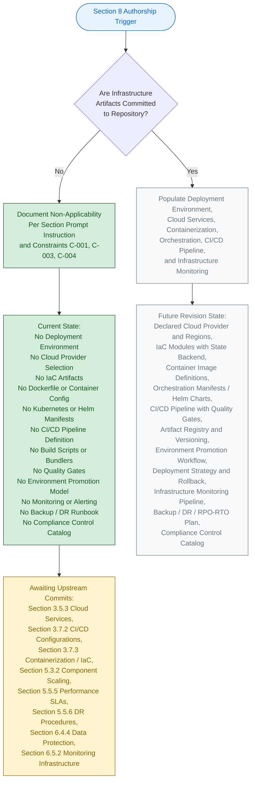

### 8.8.2 Visual-Grammar Conformance

The diagram in Section 8.8.1 conforms to the colour grammar established by this Specification, as documented in Section 5.6.1 and reproduced in Sections 6.1.5.2, 6.2.6.2, 6.3.5.2, 6.4.5.2, and 6.5.5.2.

| Colour | Hex (Fill / Stroke) | Semantic Meaning |
|--------|----------------------|-------------------|
| Blue | `#e7f3ff` / `#0066cc` | Section authorship entry point |
| Green | `#d4edda` / `#155724` | Verifiable, present state |
| Grey | `#f8f9fa` / `#6c757d` | Prospective future state |
| Yellow | `#fff3cd` / `#856404` | Pending upstream activity |

The green-shaded nodes represent the verifiable, present authorship path; the grey-shaded nodes represent the prospective path that will be taken in a future revision once infrastructure artifacts are added to the codebase; the yellow-shaded node identifies the pending upstream activities required to unlock those subsequent revisions; and the blue-shaded node marks the Section authorship entry point.

---

## 8.9 Required Diagrams Status

The Section 8 prompt requests four architectural diagrams: Infrastructure Architecture Diagram, Deployment Workflow Diagram, Environment Promotion Flow, and Network Architecture Diagram. Per Constraint C-004 (Section 2.7.2), each of these diagrams remains explicitly empty until upstream infrastructure artifacts are committed.

### 8.9.1 Diagram-Exclusion Justification

Producing any of the prompt-required infrastructure diagrams in the absence of underlying deployment, container, orchestration, and CI/CD artifacts would violate Constraint C-001 (no invention) and Constraint C-004 (diagrams remain empty until upstream artifacts are populated). Section 5.3.3 establishes the identical posture for Component Interaction, State Transition, and Sequence diagrams; Section 5.5.7 establishes the identical posture for Error-Handling Flow diagrams; Sections 6.1.6, 6.2.7, 6.3.6, 6.4.6, and 6.5.6 establish the identical posture for their respective prompt-required diagrams.

| Required Diagram (per Section 8 prompt) | Diagram Status | Governance Basis |
|-------------------------------------------|----------------|------------------|
| Infrastructure Architecture Diagram | Explicitly empty — TBD | Constraint C-001, C-004 |
| Deployment Workflow Diagram | Explicitly empty — TBD | Constraint C-001, C-004 |
| Environment Promotion Flow | Explicitly empty — TBD | Constraint C-001, C-004 |
| Network Architecture Diagram | Explicitly empty — TBD | Constraint C-001, C-004 |

### 8.9.2 Diagram-Population Prerequisites

Each prompt-required diagram has a specific set of upstream artifacts that must be committed before it can be populated. The table below records these prerequisites for traceability with Section 5.7.1 and Section 8.11 below.

| Diagram | Required Upstream Artifact(s) |
|---------|--------------------------------|
| Infrastructure Architecture | Declared cloud provider, declared IaC modules (Terraform / CloudFormation / Pulumi), declared compute / database / storage / network resources, declared regional and availability-zone topology |
| Deployment Workflow | Declared CI platform configuration (GitHub Actions / GitLab CI / Jenkins / Azure Pipelines), declared build job graph, declared artifact registry, declared deployment trigger and approval gate |
| Environment Promotion Flow | Declared environment tiers (dev / staging / prod), declared promotion gate criteria, declared GitOps or manual-approval workflow, declared environment-specific configuration overlays |
| Network Architecture | Declared VPC / subnet topology, declared security groups / NACLs / firewall rules, declared ingress / egress controllers, declared service-mesh or API-gateway topology |

### 8.9.3 Infrastructure Cost Estimates Documentation Status

The Section 8 prompt's output-format requirement to "include infrastructure cost estimates" cannot be satisfied with declared cost lines at the current repository lifecycle stage. Section 1.2.4 records that no business impact, no quantitative cost commitment, and no budget envelope is declared. Section 3.5.3 records every cloud-service category as TBD. With no cloud provider, no managed service tier, and no usage forecast declared, the infrastructure-cost-estimate table in Section 8.2.4 is populated with canonical cost-category scaffolding, but every quantitative figure is recorded as `None declared — TBD`. This documentation completeness will be achieved in the revision triggered by the first cloud-provider configuration, managed-service tier declaration, or capacity-planning commit (see Section 8.11.1).

### 8.9.4 Resource Sizing Guidelines Documentation Status

The Section 8 prompt's output-format requirement to "provide resource sizing guidelines" cannot be satisfied with declared baselines at the current repository lifecycle stage. Section 2.5.3 records scalability considerations as TBD; Section 5.5.5 records every performance dimension as TBD. With no declared workload, no declared SLO, and no declared traffic forecast, the resource-sizing-guidelines table in Section 8.2.3 is populated with canonical resource-category scaffolding, but every sizing figure is recorded as `None declared — TBD`. This documentation completeness will be achieved in the revision triggered by the first workload manifest, scaling configuration, or SLO declaration commit (see Section 8.11.1).

### 8.9.5 External Dependencies Documentation Status

The Section 8 prompt's output-format requirement to "document all external dependencies" cannot be satisfied at the current repository lifecycle stage. Section 3.4 (Open Source Dependencies) verifies the absence of all dependency manifests (no `package.json`, no `requirements.txt`, no `pom.xml`, no `go.mod`, no `Cargo.toml`, no `Gemfile`). Section 3.5.2 verifies the absence of all third-party service integrations. With no dependency manifest and no service configuration declared, the external-dependencies enumeration is necessarily empty. The sole verified external dependency is GitHub as a Git-remote host (`https://github.com/ShaliniTest-maker/April17Sec_1.git`) per Section 1.5.3.

---

## 8.10 Minimal Build and Distribution Posture

The Section 8 prompt's explicit instruction requires that this section document "only the minimal build and distribution requirements" when detailed infrastructure architecture is non-applicable. The minimal build and distribution posture for the current repository state is recorded below. Per Constraint C-001 (Section 2.7.2), this enumeration is not a prescriptive specification; it captures the **verified present state** and the **forward-looking trigger map** for the first activation of each capability.

### 8.10.1 Currently Verified Build and Distribution Artifacts

The repository's verified present state contains a single class of build-and-distribution artifact: source-control hosting on Git. No other build, packaging, signing, distribution, or release artifact exists.

| Artifact / Capability | Verified Present State | Authoritative Cross-Reference |
|-------------------------|--------------------------|--------------------------------|
| Source Control System | Git — single remote `origin` on GitHub | Section 1.5.3 |
| Remote Repository URL | `https://github.com/ShaliniTest-maker/April17Sec_1.git` | Section 1.5.3 |
| Default Branch | `main` (with `origin/main` tracking) | Section 1.5.3 |
| Initial Commit SHA | `333af4a8ff6474c0db8af5d41d694280e5d2ebe8` | Section 1.5.3 |
| Initial Commit Author | `ShaliniTest-maker <shaliniguptatest@gmail.com>` | Section 1.5.3 |
| Initial Commit Date | April 17, 2026 | Section 1.5.3 |
| Distribution Mechanism | None declared — TBD | Section 3.7.2; Section 3.7.3 |

### 8.10.2 Forward-Looking Standard Infrastructure Practices

The infrastructure-practice catalog enumerated below is referenced as the framework that **will** govern Section 8 once the corresponding artifacts are committed to the repository. Per Constraint C-001, this enumeration is not a declaration of adopted practices for the current repository state; it is a forward-looking reference catalog tied to specific upstream-section TBD entries that, when resolved, will activate each practice. This mirrors the forward-looking catalog pattern established in Sections 6.4.7 and 6.5.7.

#### 8.10.2.1 Deployment Environment Forward-Looking Practices

| Standard Practice (Forward-Looking) | Activating Upstream Artifact |
|---------------------------------------|--------------------------------|
| Cloud-native deployment on AWS / Azure / GCP with declared region and AZ topology | First cloud-account or cloud-SDK configuration committed (Section 3.5.3; Section 3.8.2) |
| Infrastructure-as-Code via Terraform / CloudFormation / Pulumi with remote state backend | First IaC module committed (Section 3.7.3) |
| Configuration management via centralized parameter store and secret manager | First configuration-management artifact committed (Section 5.5.4) |
| Environment promotion via Dev → Staging → Prod tiers with approval gates | First multi-environment configuration committed (Section 3.7.2) |
| Backup and DR strategy with declared RPO / RTO targets and cross-AZ failover | First backup / DR runbook committed (Section 5.5.6) |

#### 8.10.2.2 Cloud Services Forward-Looking Practices

| Standard Practice (Forward-Looking) | Activating Upstream Artifact |
|---------------------------------------|--------------------------------|
| Managed compute (Lambda / ECS / EKS / Cloud Run / App Service) with elastic scaling | First managed-compute configuration committed (Section 3.5.3) |
| Managed database (RDS / DynamoDB / Cosmos DB / Cloud SQL) with multi-AZ HA | First managed-database configuration committed (Section 3.5.3; Section 3.6) |
| Object storage (S3 / GCS / Azure Blob) with lifecycle policies and versioning | First object-storage configuration committed (Section 3.5.3; Section 3.6) |
| Edge / CDN delivery (CloudFront / Cloud CDN / Front Door) for low-latency content distribution | First CDN configuration committed (Section 3.5.3) |
| Cost optimization via Reserved Instances / Savings Plans / Committed Use discounts | First cost-management configuration committed (Section 3.5.3) |

#### 8.10.2.3 Containerization Forward-Looking Practices

| Standard Practice (Forward-Looking) | Activating Upstream Artifact |
|---------------------------------------|--------------------------------|
| Docker / OCI image builds via multi-stage Dockerfile with minimal base images | First Dockerfile committed (Section 3.7.3; Section 3.8.2) |
| Image versioning by immutable digest plus Git-SHA tag promotion | First image-build pipeline committed (Section 3.7.2; Section 3.7.3) |
| Vulnerability scanning via Trivy / Grype / Snyk integrated into the build pipeline | First container security-scanner integration committed (Section 3.7.3; Section 6.4.4) |
| SBOM generation and image signing via Cosign / Sigstore for supply-chain integrity | First image-signing configuration committed (Section 3.7.3; Section 6.4.4) |

#### 8.10.2.4 Orchestration Forward-Looking Practices

| Standard Practice (Forward-Looking) | Activating Upstream Artifact |
|---------------------------------------|--------------------------------|
| Kubernetes orchestration (EKS / GKE / AKS / self-hosted) with declarative manifests | First Kubernetes manifest or Helm chart committed (Section 3.7.3) |
| Horizontal Pod Autoscaling (HPA) and Cluster Autoscaler / Karpenter | First HPA / autoscaler configuration committed (Section 5.3.2) |
| Resource requests / limits and namespace ResourceQuotas for fair scheduling | First resource-allocation policy committed (Section 5.5.5) |
| Service mesh (Istio / Linkerd / Consul) for mTLS, traffic policies, and observability | First service-mesh manifest committed (Section 6.4.4.4) |

#### 8.10.2.5 CI/CD Pipeline Forward-Looking Practices

| Standard Practice (Forward-Looking) | Activating Upstream Artifact |
|---------------------------------------|--------------------------------|
| CI on every push and pull request via GitHub Actions / GitLab CI / CircleCI / Jenkins | First CI workflow committed (Section 3.7.2; Section 3.8.2) |
| Quality gates (lint, unit / integration tests, coverage, SAST, SCA, secret scanning) | First quality-gate configuration committed (Section 3.7.2; Section 6.4.4) |
| Artifact publication to versioned registry with immutability and signing | First artifact-registry integration committed (Section 3.7.2) |
| Progressive deployment (rolling / blue-green / canary) with automated rollback on SLO breach | First deployment-strategy configuration committed (Section 3.7.2; Section 5.5.6) |
| GitOps continuous delivery via Argo CD / Flux with environment-overlay promotion | First GitOps tool configuration committed (Section 3.7.2) |

#### 8.10.2.6 Infrastructure Monitoring Forward-Looking Practices

| Standard Practice (Forward-Looking) | Activating Upstream Artifact |
|---------------------------------------|--------------------------------|
| Resource monitoring via CloudWatch / Azure Monitor / Stackdriver / Prometheus + node_exporter | First metrics backend committed (Section 3.5.3; Section 6.5.2.1) |
| Performance monitoring via distributed tracing (OpenTelemetry / Jaeger / X-Ray) | First tracing configuration committed (Section 3.5.3; Section 6.5.2.3) |
| Cost monitoring with tag-based allocation and budget alerts | First cloud cost-management configuration committed (Section 3.5.3) |
| Security monitoring via GuardDuty / Azure Defender / Security Command Center plus SIEM | First security-monitoring integration committed (Section 6.4.3.5; Section 6.4.4.5) |
| Compliance auditing via AWS Config / Azure Policy / GCP SCC with control-catalog mapping | First compliance-posture-manager configuration committed (Section 6.2.4; Section 6.4.4.5) |

These forward-looking practices are derived from the upstream artifact references that already exist in this Specification (Sections 3.5.3, 3.6, 3.7.2, 3.7.3, 5.3.2, 5.5.4, 5.5.5, 5.5.6, 6.2.4, 6.4.4, 6.5.2) and reflect the canonical industry-standard infrastructure controls associated with each declared TBD dimension. They become authoritative only upon the corresponding commit, per Assumption A-003 (Section 2.7.1).

---

## 8.11 Future Revision Triggers

Consistent with Section 5.7.1 and Assumption A-004 (Section 2.7.1), a revision of Section 8 will be triggered when any of the events below occurs in the repository. Each trigger maps to the specific Section 8 subsections that will become authorable once the corresponding upstream artifact is committed. The triggers below refine the Section 5.7.1 trigger table, scoped specifically to the infrastructure tier.

### 8.11.1 Trigger-to-Subsection Mapping

| Trigger Event | Section 8 Subsection(s) Unblocked |
|---------------|---------------------------------------|
| First cloud-account / cloud-SDK / cloud-platform configuration committed (AWS, Azure, GCP) | 8.2.1 (Target Environment Assessment); 8.3 (Cloud Services) |
| First Infrastructure-as-Code module committed (Terraform, CloudFormation, Pulumi, Ansible) | 8.2.1 (Environment Type); 8.2.2.1 (IaC Approach); 8.9.2 (Infrastructure Architecture Diagram) |
| First configuration-management / secret-management artifact committed (Vault, Secrets Manager, Parameter Store) | 8.2.2.2 (Configuration Management Strategy) |
| First multi-environment configuration committed (dev / staging / prod overlay) | 8.2.2.3 (Environment Promotion); 8.6.2.2 (Promotion Workflow); 8.9.2 (Environment Promotion Flow) |
| First backup / RPO-RTO / DR runbook committed | 8.2.2.4 (Backup and Disaster Recovery); 8.6.2.3 (Rollback Procedures) |
| First geographic-distribution / multi-region / multi-AZ manifest committed | 8.2.1.2 (Geographic Distribution); 8.3.3 (High Availability Design) |
| First compliance-regime declaration / control-catalog commit (SOC 2 / HIPAA / GDPR / PCI DSS / FedRAMP) | 8.2.1.4 (Compliance and Regulatory); 8.7.5 (Compliance Auditing) |
| First `Dockerfile` / `docker-compose.yml` / container-image build configuration committed | 8.4 (Containerization in its entirety) |
| First Kubernetes manifest / Helm chart / Kustomize overlay committed | 8.5 (Orchestration in its entirety); 8.9.2 (Infrastructure Architecture Diagram) |
| First HPA / VPA / Cluster Autoscaler / Karpenter configuration committed | 8.5.4 (Auto-Scaling Configuration); 8.5.5 (Resource Allocation Policies) |
| First `.github/workflows/*.yml` / `.gitlab-ci.yml` / `Jenkinsfile` / `azure-pipelines.yml` committed | 8.6.1 (Build Pipeline in its entirety); 8.9.2 (Deployment Workflow Diagram) |
| First dependency manifest committed (`package.json`, `requirements.txt`, `pom.xml`, `go.mod`) | 8.6.1.3 (Dependency Management) |
| First artifact registry integration committed (ECR, GCR, ACR, Artifactory, npm, PyPI) | 8.6.1.4 (Artifact Generation and Storage) |
| First quality-gate configuration committed (lint, test, coverage, SAST, SCA) | 8.6.1.5 (Quality Gates) |
| First deployment-strategy configuration committed (blue-green / canary / rolling) | 8.6.2.1 (Deployment Strategy) |
| First metrics-collection / log-aggregation / distributed-tracing integration committed | 8.7.1 (Resource Monitoring); 8.7.2 (Performance Metrics) |
| First cloud-cost-management / FinOps configuration committed | 8.7.3 (Cost Monitoring and Optimization); 8.2.4 (Cost Estimates) |
| First security-monitoring / SIEM / vulnerability-management integration committed | 8.7.4 (Security Monitoring) |
| First network-segmentation / VPC / security-group / service-mesh artifact committed | 8.3.5 (Security and Compliance); 8.5.2 (Cluster Architecture); 8.9.2 (Network Architecture Diagram) |

Until at least one of these triggers fires, Section 8 will continue to reflect the non-applicability posture documented herein, in compliance with Constraint C-001 and Assumption A-003 (Section 2.7.1).

### 8.11.2 Cross-Section Coordination

When a Section 8 revision is triggered, the following companion sections must be revised in lockstep to preserve cross-reference consistency required by Constraint C-003. The table below records the coordination map.

| Section 8 Subsection | Companion Sections Requiring Co-Revision |
|------------------------|---------------------------------------------|
| 8.2 (Deployment Environment) | Section 1.2.2 (System Components); Section 3.7 (Development and Deployment); Section 5.3 (Component Details); Section 5.5.6 (Disaster Recovery) |
| 8.3 (Cloud Services) | Section 3.5.3 (Cloud Services); Section 6.1 (Core Services); Section 6.4 (Security Architecture) |
| 8.4 (Containerization) | Section 3.7.3 (Containerization and IaC); Section 5.3.2 (Component Scaling); Section 6.1.3 (Scalability) |
| 8.5 (Orchestration) | Section 3.7.3 (Containerization and IaC); Section 5.3.2 (Component Scaling); Section 6.1.4 (Resilience) |
| 8.6 (CI/CD Pipeline) | Section 3.7.2 (CI/CD Configurations); Section 6.6 (Testing Strategy); Section 5.5.3 (Error Handling Patterns) |
| 8.7 (Infrastructure Monitoring) | Section 6.5 (Monitoring and Observability); Section 5.5.1 (Monitoring Approach); Section 5.5.2 (Logging and Tracing) |

---

## 8.12 Versioning Posture

Consistent with the versioning posture documented in Sections 2.7.3, 3.9.3, 4.7.1, 5.7.2, 6.1.7.2, 6.2.9.1, 6.3.8.1, 6.4.9.1, and 6.5.9.1, Section 8 carries the version status recorded below. The change log will begin with the first populated revision triggered by any of the events enumerated in Section 8.11.1.

### 8.12.1 Section Version Tracking

| Versioning Element | Current State | Notes |
|----------------------|-----------------|-------|
| Section 8 Authorship Revision | v1.0 (TBD Posture) | First authoring pass under non-applicability declaration |
| Individual Deployment-Environment Element Versions | v0.0 — Not Yet Authored | No deployment-environment artifacts exist to version |
| Individual Cloud-Services Element Versions | v0.0 — Not Yet Authored | No cloud-services artifacts exist to version |
| Individual Containerization Element Versions | v0.0 — Not Yet Authored | No containerization artifacts exist to version |
| Individual Orchestration Element Versions | v0.0 — Not Yet Authored | No orchestration artifacts exist to version |
| Individual CI/CD Pipeline Element Versions | v0.0 — Not Yet Authored | No CI/CD pipeline artifacts exist to version |
| Individual Infrastructure-Monitoring Element Versions | v0.0 — Not Yet Authored | No infrastructure-monitoring artifacts exist to version |
| Change Log | Not yet initiated | Will begin with the first populated revision |

### 8.12.2 Default Technology Stack Non-Adoption

Section 3.8.1 of this Specification enumerates a documentation-framework default technology stack reference that lists **AWS** as a candidate Cloud Platform default, **Docker** as a candidate Containerization default, **Terraform** as a candidate Infrastructure-as-Code default, and **GitHub Actions** as a candidate CI/CD default. Per Section 3.8.3, Section 5.4.6, Section 6.4.9.2, and Section 6.5.9.2, and consistent with Constraint C-001 (no invention), Assumption A-003 (external artifacts non-authoritative until committed), and Assumption A-004 (defaults may be superseded), no default infrastructure-tool reference is **adopted** as the infrastructure-architecture decision for `April17Sec_1`. 

Section 3.8.2 records the verified non-adoption with explicit evidence: *"No cloud SDK references, no `aws/` configuration directory, no IaC"* (AWS); *"No `Dockerfile`, no `docker-compose.yml`, no `.dockerignore`"* (Docker); *"No `*.tf` files, no Terraform workspace metadata"* (Terraform); *"No `.github/workflows/` directory"* (GitHub Actions). 

The default AWS, Docker, Terraform, and GitHub Actions references remain candidate suggestions only; they do not constitute a cloud-platform, container-runtime, IaC-framework, or CI/CD-platform decision for this system until and unless they are committed to the codebase. Section 8 therefore does not infer any cloud-provider selection, container-runtime selection, IaC-framework selection, CI/CD-platform selection, orchestrator selection, deployment-strategy selection, monitoring-tool selection, or compliance-regime selection from the default reference.

---

## 8.13 Summary of Posture

The combination of (a) the explicit instruction in the Section 8 prompt to declare non-applicability when the system is a standalone application or library that does not require deployment infrastructure; (b) the verified absence across every infrastructure-related repository category established by Sections 1.2.2, 1.3.2, 3.4, 3.5.3, 3.7.2, 3.7.3, 3.8.2, 5.2.2, 5.3.2, 5.5.1, 5.5.5, and 5.5.6; (c) the governance constraints C-001, C-003, and C-004 (Section 2.7.2); and (d) the assumptions A-001, A-002, A-003, and A-004 (Section 2.7.1) yields a single, unambiguous posture for this section: **Detailed Infrastructure Architecture is not applicable for this system at the current repository lifecycle stage**.

The minimal build and distribution posture comprises a single verified artifact — the Git source-control system hosted at `https://github.com/ShaliniTest-maker/April17Sec_1.git`, with a single initial commit (`333af4a8ff6474c0db8af5d41d694280e5d2ebe8`) on the `main` branch dated April 17, 2026 (Section 1.5.3). No other build, packaging, signing, distribution, or release artifact exists.

This posture will be reviewed and revised in accordance with the triggers enumerated in Section 8.11.1. The earliest trigger most likely to fire is the first dependency-manifest commit (which would establish the build runtime) or the first CI workflow commit (which would establish the build pipeline). Either trigger would unblock authorship of Section 8.6 (CI/CD Pipeline) and would cascade into Sections 8.2 (Deployment Environment), 8.4 (Containerization), 8.5 (Orchestration), and 8.7 (Infrastructure Monitoring) as additional infrastructure-tier artifacts are committed. Until such triggers fire, Section 8 stands as a deliberate, evidence-backed statement of non-applicability — fully consistent with the precedents set by Sections 6.1 (Core Services Architecture), 6.2 (Database Design), 6.3 (Integration Architecture), 6.4 (Security Architecture), and 6.5 (Monitoring and Observability). The forward-looking catalog of standard infrastructure practices enumerated in Section 8.10.2 represents the canonical industry-standard infrastructure controls that will be activated dimension by dimension as each upstream artifact is committed.

---

## 8.14 References

### 8.14.1 Files Examined

- `README.md` — Sole tracked file in the repository (14 bytes, single line `# April17Sec_1`); confirms the Repository Initialization lifecycle stage and the verified absence of all infrastructure-architecture artifacts (no Dockerfile, no docker-compose, no Kubernetes manifests, no Helm charts, no Terraform / CloudFormation / Pulumi / Ansible modules, no CI/CD workflow files, no build scripts, no quality-gate configurations, no monitoring or observability configurations, no backup or DR runbooks, no cloud-account or cloud-SDK configurations, no environment-promotion overlays, and no compliance-control catalogs).
- Repository root (`/`) — Contains only `README.md` and the `.git/` metadata directory; verified zero application subfolders, zero source files, zero configuration files, zero dependency manifests, zero `Dockerfile`, zero `docker-compose.yml`, zero `.dockerignore`, zero `k8s/` or `manifests/` directory, zero `helm/` directory, zero `terraform/` or `*.tf` files, zero `.github/workflows/`, zero `.gitlab-ci.yml`, zero `.circleci/config.yml`, zero `Jenkinsfile`, zero `azure-pipelines.yml`, zero `Makefile`, zero `Rakefile`, zero `Justfile`, zero `build.sh`, zero `pyproject.toml`, zero `package.json`, and zero infrastructure source files.

### 8.14.2 Search Operations Performed

- Folder retrieval at repository root (depth 0) — confirmed zero subfolders; the entire repository surface area has been exhausted.
- Filesystem inspection for `Dockerfile`, `docker-compose.yml`, `.dockerignore`, `*.tf`, `*.tfvars`, `Chart.yaml`, `values.yaml`, `*.yaml` under `k8s/` or `manifests/`, `Jenkinsfile`, `azure-pipelines.yml`, `.gitlab-ci.yml`, `.circleci/config.yml`, `.github/workflows/*.yml`, `Makefile`, `Rakefile`, `Justfile`, `build.sh`, `webpack.config.js`, `rollup.config.js`, `vite.config.js`, `setup.py`, `setup.cfg`, `pyproject.toml`, `.eslintrc*`, `.prettierrc*`, `.flake8`, `pylintrc`, `.editorconfig`, `tsconfig.json`, `.pre-commit-config.yaml`, `.husky/`, `pytest.ini`, `jest.config.js`, `karma.conf.js`, `tox.ini`, `prometheus.yml`, `alertmanager.yml`, `grafana/`, `dashboards/`, `runbooks/`, `*.crt`, `*.key`, `*.pem`, `.env` — zero matches within the repository.

### 8.14.3 Technical Specification Sections Cross-Referenced

- **Section 1.1 EXECUTIVE SUMMARY** — Project identity, repository metadata, and Repository Initialization lifecycle stage
- **Section 1.2 SYSTEM OVERVIEW** — Section 1.2.1 records absence of integration points and third-party services; Section 1.2.2 records zero Application Source Modules, Back-End Services, and Infrastructure-as-Code Definitions; Section 1.2.3 records absence of telemetry, monitoring, and KPIs; Section 1.2.4 records absence of business-impact, cost, or budget declaration
- **Section 1.3 SCOPE** — **CRITICAL** — Section 1.3.2 records the authoritative out-of-scope declarations: *"All build, packaging, and deployment automation (no build scripts or CI/CD definitions exist)"*; *"All operational tooling, monitoring, and observability components (no configuration exists)"*; *"All third-party integrations (no dependency manifests or service configurations exist)"*
- **Section 1.4 SCOPE DECLARATION SUMMARY** — Consolidated TBD posture across all in-scope and out-of-scope categories
- **Section 1.5 References** — File examination evidence and Git metadata (single commit `333af4a8ff6474c0db8af5d41d694280e5d2ebe8` on `main` branch, remote `origin` at `https://github.com/ShaliniTest-maker/April17Sec_1.git`)
- **Section 2.5 IMPLEMENTATION CONSIDERATIONS** — Section 2.5.3 records scalability considerations as TBD; Section 2.5.4 records security implications as TBD; Section 2.5.5 records maintenance and observability requirements as TBD
- **Section 2.7 ASSUMPTIONS, CONSTRAINTS, AND VERSIONING** — **CRITICAL** — Governance constraints C-001, C-003, C-004 (Section 2.7.2); assumptions A-001, A-002, A-003, A-004 (Section 2.7.1); versioning posture (Section 2.7.3)
- **Section 3.4 OPEN SOURCE DEPENDENCIES** — Verified absence of all dependency manifests (no `package.json`, no `requirements.txt`, no `pom.xml`, no `go.mod`, no `Cargo.toml`, no `Gemfile`)
- **Section 3.5 THIRD-PARTY SERVICES** — **CRITICAL** — Section 3.5.3 records every Cloud Service concern (Cloud Platform Selection, Managed Compute Service, Managed Database Service, Object Storage Service, CDN / Edge Configuration, DNS / Domain Management) as `No — TBD`; every Monitoring tool concern as `No — TBD`; every Authentication service concern as `No — TBD`
- **Section 3.6 DATABASES AND STORAGE** — Verified absence of all schema artifacts, persistence layers, encryption-at-rest configurations
- **Section 3.7 DEVELOPMENT AND DEPLOYMENT** — **CRITICAL DIRECT EVIDENCE** — Section 3.7.2 verifies the absence of every build script, JS bundler, Python build tool, linter / formatter, CI/CD platform configuration, pre-commit / Git-hook scaffold, and test-runner configuration; Section 3.7.3 verifies the absence of `Dockerfile`, `docker-compose.yml`, `.dockerignore`, Kubernetes manifests, Helm charts, Terraform modules, CloudFormation templates, Pulumi programs, and Ansible playbooks
- **Section 3.8 DEFAULT TECHNOLOGY STACK REFERENCE** — **CRITICAL** — Section 3.8.1 enumerates the suggested defaults (AWS, Docker, Terraform, GitHub Actions); Section 3.8.2 records the explicit non-adoption of each; Section 3.8.3 records the Constraint Compliance Statement
- **Section 3.9 TECHNOLOGY STACK LIFECYCLE** — Stack-adoption lifecycle template and versioning posture
- **Section 4.4 TECHNICAL IMPLEMENTATION** — Section 4.4.2 records every error-notification, recovery, and DR element as TBD
- **Section 4.5 REQUIRED DIAGRAMS** — Diagram-empty pattern with authorship lifecycle as sole permitted form
- **Section 4.6 SWIM LANES, TIMING, AND SLA CONSIDERATIONS** — Section 4.6.2 records every timing, latency, throughput, availability, and error-budget dimension as TBD
- **Section 5.2 HIGH-LEVEL ARCHITECTURE** — No components, no integration topology, no deployment substrate
- **Section 5.3 COMPONENT DETAILS** — Section 5.3.2 records every component-scaling dimension as TBD
- **Section 5.5 CROSS-CUTTING CONCERNS** — **CRITICAL** — Section 5.5.1 records every observability concern as TBD; Section 5.5.2 records every logging and tracing dimension as TBD; Section 5.5.4 records every security control as absent; Section 5.5.5 records every performance and SLA dimension as TBD; Section 5.5.6 records every disaster-recovery dimension as TBD
- **Section 5.6 ARCHITECTURE AUTHORSHIP LIFECYCLE** — **CRITICAL** — Visual-grammar template (Section 5.6.1) for the authorship lifecycle diagram and architectural prerequisites (Section 5.6.2)
- **Section 5.7 FUTURE SECTION REVISION TRIGGERS** — **CRITICAL** — Trigger event taxonomy that Section 8.11 refines for the infrastructure tier
- **Section 6.1 Core Services Architecture** — **CRITICAL TEMPLATE** — Non-applicability declaration structure originating template
- **Section 6.2 Database Design** — **CRITICAL TEMPLATE** — Refined non-applicability template with multi-subsection verified-absence pattern; Section 6.2.4 (Compliance Considerations) directly informs Section 8.2.1.4 and Section 8.7.5
- **Section 6.3 Integration Architecture** — **CRITICAL TEMPLATE** — Verified-absence pattern with prompt-required dimension mapping
- **Section 6.4 Security Architecture** — **CRITICAL TEMPLATE** — Standard Practices Reference forward-looking catalog (Section 6.4.7); Section 6.4.4 (Data Protection) directly informs Section 8.3.5 (Security and Compliance)
- **Section 6.5 Monitoring and Observability** — **CRITICAL TEMPLATE** — Most recent precedent that Section 8 mirrors; Section 6.5.2 (Monitoring Infrastructure), Section 6.5.3 (Observability Patterns), and Section 6.5.4 (Incident Response) directly inform Section 8.7 (Infrastructure Monitoring)
- **Section 6.6 Testing Strategy** — Quality gates and post-deployment validation cross-reference
- **Section 7.1 APPLICABILITY DECLARATION** — UI non-applicability pattern (alternative simpler template)

# 9. Appendices

## 9.1 ADDITIONAL TECHNICAL INFORMATION

### 9.1.1 Purpose and Scope of the Appendices

This Appendices section consolidates supplementary technical reference material that has been referenced across the preceding eight sections of this Technical Specification but is best presented in a single, look-up–oriented location. Because the `April17Sec_1` repository is at the Repository Initialization (Scaffold) lifecycle stage — with a single tracked file (`README.md`, 14 bytes, one line) and zero application subfolders — the substantive contributions of this section are:

1. A consolidated cross-reference for the governance framework (assumptions, constraints, versioning) authored in Section 2.7.
2. A reusable visual grammar reference for the Mermaid diagrams employed throughout the Specification.
3. A consolidated catalog of verified-absent external service categories drawn from Sections 3.5.2, 5.2.4, 6.1.2.3, and 6.3.4.5.
4. A repository-wide verification search inventory and coverage statement.
5. A comprehensive Glossary (Section 9.2) and Acronyms register (Section 9.3) covering every domain term and abbreviation referenced in the Specification — including those that appear solely in non-applicability declarations and forward-looking catalogs.

All entries below remain in strict compliance with Constraint **C-001** ("No features, requirements, or relationships may be invented; all entries must be grounded in verifiable repository content") and Constraint **C-003** ("Cross-references to companion sections must remain consistent with the TBD posture established in Section 1").

### 9.1.2 Consolidated Governance Framework Reference

The four foundational assumptions and four governing constraints authored in Section 2.7 are reproduced below for ease of look-up. These statements govern every section of the Specification.

#### 9.1.2.1 Documented Assumptions Cross-Reference

| Assumption ID | Statement (Summary) | Primary Section |
|---------------|---------------------|-----------------|
| A-001 | Repository's verifiable state at initial commit is the authoritative input. | Section 2.7.1 |
| A-002 | Absence of artifacts reflects actual lifecycle stage, not omission. | Section 2.7.1 |
| A-003 | External (off-repository) artifacts are non-authoritative until committed. | Section 2.7.1 |
| A-004 | Subsequent revisions will replace TBD markers with evidence-backed declarations. | Section 2.7.1 |

#### 9.1.2.2 Constraints Cross-Reference

| Constraint ID | Statement (Summary) | Primary Section |
|---------------|---------------------|-----------------|
| C-001 | No features, requirements, or relationships may be invented; all entries must be grounded in verifiable repository content. | Section 2.7.2 |
| C-002 | Identifier formats (`F-XXX`, `F-XXX-RQ-YYY`) reserved for future use; MUST NOT be populated with placeholders. | Section 2.7.2 |
| C-003 | Cross-references must remain consistent with the TBD posture established in Section 1. | Section 2.7.2 |
| C-004 | Traceability matrix, integration-points map, and feature-relationship diagrams remain empty until upstream artifacts are populated. | Section 2.7.2 |

#### 9.1.2.3 Versioning Conventions

| Versioning Element | Current State | Format / Notes |
|--------------------|---------------|----------------|
| Section Authorship Revision | `v1.0 (TBD Posture)` | First authoring pass; follows `vMAJOR.MINOR`. |
| Individual Requirement Versions | `v0.0 — Not Yet Authored` | No requirements exist to version. |
| Change Log | Not yet initiated | Will begin with the first populated revision. |
| Revision Increment Convention | `v1.0` → `v1.1` (editorial) → `v2.0` (material) | Per Section 2.7.3. |

### 9.1.3 Visual Grammar Reference for Diagrams

A consistent four-colour palette is used in every Mermaid authorship-lifecycle diagram across the Specification (notably in Sections 1.2.2, 2.1.3, 3.9.1, 4.5.1, 5.6.1, 6.1.5.1, 6.2.6.1, 6.3.5.1, 6.4.5.1, 6.5.5.1, 6.6.7.1, 7.1.3, and 8.8). The palette is reproduced below for at-a-glance reference.

#### 9.1.3.1 Semantic Colour Palette

| Colour Role | Fill Hex | Stroke Hex | Semantic Meaning |
|-------------|----------|------------|------------------|
| Blue | `#e7f3ff` | `#0066cc` | Section authorship entry point. |
| Green | `#d4edda` | `#155724` | Verifiable, present state (the path actually traced in this revision). |
| Grey | `#f8f9fa` | `#6c757d` | Prospective future state (path traversed in subsequent revisions). |
| Yellow | `#fff3cd` | `#856404` | Pending upstream activity (unblocking precondition). |

#### 9.1.3.2 Canonical Visual Grammar Diagram

The diagram below is a minimal illustration of the four-colour grammar exactly as it appears throughout the Specification.

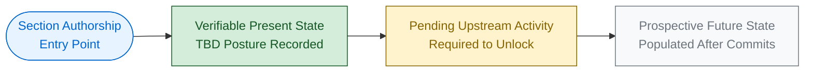

#### 9.1.3.3 Diagram Compliance Note

Per Constraint **C-004**, all matrix diagrams, integration topology diagrams, traceability matrices, and feature-relationship diagrams remain empty in this revision. The diagrams that *do* appear in this Specification are exclusively authorship-lifecycle, scope-declaration, and posture-summary diagrams. They depict the documentation lifecycle, not the system itself.

### 9.1.4 Default Technology Stack Reference — Non-Adoption Notice

Section 3.8.1 enumerates a documentation-framework default technology stack that is **explicitly not adopted** by the `April17Sec_1` repository. The list is reproduced here purely for traceability between the documentation framework's suggestions and the repository's verified state. Per Assumption **A-003** and Constraint **C-001**, none of these components is authoritative for the present Specification.

| Stack Layer | Suggested Default Component | Adoption Status |
|-------------|-----------------------------|-----------------|
| Cloud Platform | AWS | Not adopted — TBD |
| Containerization | Docker | Not adopted — TBD |
| Infrastructure as Code | Terraform | Not adopted — TBD |
| CI/CD | GitHub Actions | Not adopted — TBD |
| Backend Primary Language | Python | Not adopted — TBD |
| Backend Framework | Flask | Not adopted — TBD |
| Authentication | Auth0 | Not adopted — TBD |
| Database | MongoDB | Not adopted — TBD |
| AI Framework | LangChain | Not adopted — TBD |
| Web Frontend | React with TypeScript | Not adopted — TBD |
| CSS Framework | TailwindCSS | Not adopted — TBD |
| Mobile / Cross-Platform | React Native with TypeScript | Not adopted — TBD |
| Native iOS | Swift | Not adopted — TBD |
| Native Android | Kotlin | Not adopted — TBD |
| Native macOS | Objective-C | Not adopted — TBD |
| Desktop | ElectronJS | Not adopted — TBD |

The full adoption rationale and non-adoption evidence (e.g., absence of `Dockerfile`, `*.tf` files, `requirements.txt`, `package.json`, `.swift` files, etc.) is documented in Section 3.8.2 and remains the authoritative reference.

### 9.1.5 Consolidated Verified-Absent External Service Categories

The following ten categories of third-party / external services have been verified absent in the repository. This consolidated list aggregates the verification posture from Sections 3.5.2, 5.2.4 (External Integration Points), 6.1.2.3 (Service Discovery & Communication Absence), and 6.3.4.5 (Integration External Systems).

| # | Service Category | Representative Markers Searched |
|---|------------------|-------------------------------|
| 1 | Identity-Provider Integration | Auth0, Cognito, Okta, Azure AD, Firebase Auth configuration |
| 2 | Payment Processor | Stripe, Braintree, PayPal SDK references |
| 3 | Email / Messaging Provider | SendGrid, Twilio, AWS SES SDK references |
| 4 | Cloud Storage Provider | AWS S3, GCS, Azure Blob SDK references |
| 5 | Analytics / Telemetry | Segment, Mixpanel, Amplitude SDK references |
| 6 | Application Performance Monitoring | Datadog, New Relic, AppDynamics, Sentry configuration |
| 7 | Logging Aggregation | ELK, Splunk, Loggly, Logz.io configuration |
| 8 | Feature Flag Service | LaunchDarkly, Split.io configuration |
| 9 | Search Service | Algolia, Elasticsearch SaaS configuration |
| 10 | Message Broker / Queue | Kafka, RabbitMQ, AWS SQS, NATS configuration |

In all ten categories, the verification result is the same: **no representative markers detected**.

### 9.1.6 Verification Search Inventory

The following semantic and filesystem searches were executed (per Section 1.5.4 and re-executed throughout Sections 2 through 8). All returned zero matching artifacts, corroborating the TBD posture maintained across the Specification.

| # | Search Query (Topic) | Result |
|---|----------------------|--------|
| 1 | Application source code or configuration files | Zero matches |
| 2 | Source code implementation modules | Zero matches |
| 3 | API endpoints, REST controllers, GraphQL schemas, integration handlers | Zero matches |
| 4 | Message queue, event bus, broker, stream processing configuration | Zero matches |
| 5 | API gateway, external service integration, webhook handlers | Zero matches |
| 6 | Authentication tokens, OAuth configuration, rate limiting middleware | Zero matches |
| 7 | Authentication, authorization, security policies, access control | Zero matches |
| 8 | Monitoring, observability, metrics, logging (Prometheus, Grafana, etc.) | Zero matches |
| 9 | Test files (unit, integration, pytest, jest, mocha) | Zero matches |
| 10 | Database schema, model, ORM, persistence, storage | Zero matches |
| 11 | Filesystem search for `.blitzyignore` files | Zero matches |
| 12 | Filesystem enumeration for hidden or nested application files | Only `.git/` metadata present |

### 9.1.7 Repository-Wide Coverage Statement

The following coverage facts are restated for top-level reference, drawn from Section 1.5.5 and re-cited consistently in Sections 2.9, 3.10, 4.9, 5.8, and 8.14.

| Coverage Dimension | Result |
|--------------------|--------|
| Files examined | 1 of 1 tracked files (100%) |
| Folders explored | 1 of 1 application folders (100%) |
| Hierarchy depth | Depth 0 — no subfolders exist |
| `.blitzyignore` exclusions applied | None (no such file present) |
| Three-level folder-descent minimum | Inapplicable — coverage complete by exhaustion at depth 0 |

### 9.1.8 Project Identifier Token Analysis (Informational)

The project identifier `April17Sec_1` is the only definitive product descriptor present in the repository (see Section 1.1.1). The constituent tokens admit informal interpretation but are **not** treated as authoritative product descriptors, since no documentation within the codebase disambiguates them.

| Token | Informal Interpretation | Authoritative? |
|-------|--------------------------|----------------|
| `April17` | Corresponds to initial commit date (April 17, 2026). | No |
| `Sec` | Ambiguous (could imply "Section," "Security," etc.). | No |
| `_1` | Suggests an ordinal index. | No |

Resolution of these tokens awaits future commits per Assumption **A-004**.

---

## 9.2 GLOSSARY

The Glossary defines domain-specific terms referenced throughout the Specification. Terms are grouped by domain and include only those terms that meaningfully appear (or are reserved for use) in the document. Definitions reflect the meaning *as used in this Specification*; they are not intended as general industry dictionary entries.

### 9.2.1 Documentation and Governance Terms

| Term | Definition / Usage in this Specification |
|------|------------------------------------------|
| TBD (To Be Defined) | Marker used to indicate a verified-absent item pending future repository commits. The most pervasive marker in this Specification. |
| Repository Initialization (Scaffold) | The current lifecycle stage of the `April17Sec_1` project, verified by the single `README.md` commit. |
| Verifiable State | The condition of the repository as confirmed by direct inspection — never inferred or assumed. |
| Authorship Lifecycle Diagram | The recurring Mermaid diagram pattern used in every section to depict gating activities for future revisions. |
| Forward-Looking Catalog | A list of standard industry practices that *will* govern a section once upstream artifacts are committed (e.g., the standard practices reference in Section 6.4). |
| Non-Applicability Declaration | A formal statement (e.g., "Core Services Architecture is not applicable for this system") used in Sections 6.1 – 6.6, 7, and 8. |
| Verified Absence | A documented finding that an artifact has been searched for and confirmed not present in the repository. |
| Default Technology Stack Reference | The non-authoritative documentation-framework default stack enumerated in Section 3.8.1. |
| Constraint Compliance Statement | A formal statement (e.g., Section 3.8.3) explaining how a section complies with constraints C-001 through C-004. |
| Coverage Statement | The verification posture summary first published in Section 1.5.5 and re-cited across all section References. |

### 9.2.2 Architecture Terms

These terms appear in Sections 5.2 – 5.5 and the non-applicability declarations of Section 6.

| Term | Definition / Usage in this Specification |
|------|------------------------------------------|
| Architectural Style | The high-level structural pattern of a system (e.g., monolithic, modular monolith, microservices, service-oriented, event-driven, hexagonal, layered, pipe-and-filter, client-server, peer-to-peer, serverless). Status: TBD. |
| Architecture Decision Record (ADR) | Short, immutable record of an architecturally significant decision, typically following the Michael Nygard format (Context, Decision, Consequences). |
| Bulkhead | A resilience pattern that isolates faults to prevent total system failure. |
| Circuit Breaker | A resilience pattern that prevents cascading failures by short-circuiting calls to a failing dependency. |
| Saga | A distributed-transaction pattern for managing long-running business processes across services. |
| Service Mesh | An infrastructure layer for service-to-service communication (e.g., Istio, Linkerd, Consul). |
| Anti-Corruption Layer | A pattern for isolating bounded contexts from legacy or external systems. |
| Polyglot Persistence | The use of multiple data-storage technologies tailored to different data-access patterns. |
| Bounded Context | A logical boundary within which a particular domain model applies. |

### 9.2.3 Database and Persistence Terms

These terms appear in Sections 3.6, 5.4 (Storage Decisions), and 6.2 (Database Design — declared non-applicable).

| Term | Definition / Usage in this Specification |
|------|------------------------------------------|
| B-tree / Hash / GIN / GiST | Index structure types commonly offered by relational databases. |
| Cardinality Budget | A practical limit on the number of unique label combinations admissible for a metric. |
| CRUD | The four canonical persistence operations: Create, Read, Update, Delete. |
| Eventual Consistency | A consistency model in which replicas converge over time without synchronous coordination. |
| OLTP | Online Transaction Processing — workloads characterized by many short, write-heavy operations. |
| OLAP | Online Analytical Processing — workloads characterized by complex, read-heavy analytical queries. |
| Read-Replica | A database replica used to offload read-only queries from the primary. |
| Sharding | Horizontal partitioning of data across multiple nodes. |
| TSDB | Time-Series Database — optimized for append-only timestamped data. |
| Write-Through / Write-Around / Write-Back | Cache population strategies governing the relationship between cache and primary store on writes. |

### 9.2.4 Security Terms

These terms appear in Sections 5.5.4 and 6.4 (Security Architecture — declared non-applicable, but referenced via the forward-looking standard-practices catalog).

| Term | Definition / Usage in this Specification |
|------|------------------------------------------|
| Authentication | The process of verifying the identity of a principal. |
| Authorization | The process of determining what an authenticated principal is permitted to do. |
| Bearer Token | A token presented in an HTTP `Authorization` header to assert identity or capability. |
| Federated Identity | Authentication delegated to a trusted external identity provider. |
| Least Privilege | A security principle of granting the minimum necessary permissions. |
| Pseudonymization | Replacing identifying fields with artificial identifiers that can be reversed only with additional data. |
| Tokenization | Substituting sensitive data with non-sensitive equivalents (tokens) that retain referential utility. |
| Zero Trust | A security model that assumes no implicit trust based on network location. |

### 9.2.5 Observability Terms

These terms appear in Sections 5.5.1 – 5.5.2 and 6.5 (Monitoring and Observability — declared non-applicable).

| Term | Definition / Usage in this Specification |
|------|------------------------------------------|
| Error Budget | The allowable amount of unreliability before an SLO is breached. |
| Four Golden Signals | The Google SRE methodology covering Latency, Traffic, Errors, and Saturation. |
| Liveness Probe | A health check verifying that a service instance is still running. |
| Readiness Probe | A health check verifying that a service instance is ready to receive traffic. |
| Span | A single operation within a distributed trace. |
| Synthetic Monitoring | Active probing of services using simulated transactions. |
| Trace Context Propagation | The mechanism for passing trace identifiers across service boundaries. |
| RED Methodology | A monitoring approach focusing on Rate, Errors, and Duration. |
| USE Methodology | A monitoring approach focusing on Utilization, Saturation, and Errors. |

### 9.2.6 Process, DevOps, and Deployment Terms

These terms appear in Sections 3.7, 5.5, 6.6, and Section 8 (Infrastructure — declared non-applicable).

| Term | Definition / Usage in this Specification |
|------|------------------------------------------|
| Blue-Green Deployment | A deployment strategy that maintains two identical environments and switches traffic between them. |
| Canary Deployment | A gradual rollout strategy that exposes new versions to a small subset of users first. |
| Dead-Letter Queue (DLQ) | A queue for messages that have failed processing and require manual or asynchronous remediation. |
| GitOps | An operations model that uses Git as the single source of truth for declarative infrastructure and applications. |
| Idempotency | The property whereby a repeated operation produces the same result as a single execution. |
| Rolling Deployment | A deployment strategy that replaces instances gradually, in batches. |
| Runbook | A documented procedure for handling a recurring operational event. |
| Try-Confirm-Cancel (TCC) | A distributed-transaction pattern with explicit confirmation and compensation phases. |

---

## 9.3 ACRONYMS

The Acronyms register expands every abbreviation used in the Specification, including those that appear only in forward-looking catalogs (Section 6.4) and the documentation-framework default stack (Section 3.8.1). Acronyms are grouped by domain for readability; no acronym is repeated across groups.

### 9.3.1 Technologies, Languages, and Frameworks

| Acronym | Expansion |
|---------|-----------|
| AI | Artificial Intelligence |
| API | Application Programming Interface |
| CSS | Cascading Style Sheets |
| DDL | Data Definition Language |
| DSL | Domain-Specific Language |
| ELT | Extract, Load, Transform |
| ETL | Extract, Transform, Load |
| HTML | HyperText Markup Language |
| IDL | Interface Definition Language |
| JS | JavaScript |
| JSON | JavaScript Object Notation |
| JVM | Java Virtual Machine |
| LLM | Large Language Model |
| LTS | Long-Term Support |
| ORM | Object-Relational Mapping |
| SDK | Software Development Kit |
| SPA | Single-Page Application |
| SSR | Server-Side Rendering |
| TS | TypeScript |
| UI | User Interface |
| XML | eXtensible Markup Language |
| YAML | YAML Ain't Markup Language |

### 9.3.2 Architecture, Patterns, and Methodologies

| Acronym | Expansion |
|---------|-----------|
| ABAC | Attribute-Based Access Control |
| ACL | Access Control List |
| ADR | Architecture Decision Record |
| BDD | Behavior-Driven Development |
| CQRS | Command-Query Responsibility Segregation |
| DR | Disaster Recovery |
| ERD | Entity-Relationship Diagram |
| HA | High Availability |
| IaC | Infrastructure as Code |
| OOP | Object-Oriented Programming |
| PDP | Policy Decision Point |
| PEP | Policy Enforcement Point |
| RBAC | Role-Based Access Control |
| ReBAC | Relationship-Based Access Control |
| TBD | To Be Defined |
| TCC | Try-Confirm-Cancel |
| 2PC | Two-Phase Commit |

### 9.3.3 Protocols and Communication

| Acronym | Expansion |
|---------|-----------|
| AMQP | Advanced Message Queuing Protocol |
| GraphQL SDL | GraphQL Schema Definition Language |
| gRPC | gRPC Remote Procedure Call (originally "Google RPC") |
| HMAC | Hash-based Message Authentication Code |
| HTTP | HyperText Transfer Protocol |
| HTTPS | HTTP Secure |
| JDBC | Java Database Connectivity |
| JWT | JSON Web Token |
| MQTT | Message Queuing Telemetry Transport |
| mTLS | Mutual Transport Layer Security |
| OAuth | Open Authorization |
| ODBC | Open Database Connectivity |
| OIDC | OpenID Connect |
| OpenAPI | Open API Specification (formerly Swagger) |
| Protobuf | Protocol Buffers |
| REST | Representational State Transfer |
| SAML | Security Assertion Markup Language |
| SFTP | SSH File Transfer Protocol |
| SOAP | Simple Object Access Protocol |
| TLS | Transport Layer Security |
| WSDL | Web Services Description Language |

### 9.3.4 Operations, Monitoring, and Observability

| Acronym | Expansion |
|---------|-----------|
| APM | Application Performance Monitoring |
| CDN | Content Delivery Network |
| CI/CD | Continuous Integration / Continuous Delivery (or Deployment) |
| CPU | Central Processing Unit |
| DAG | Directed Acyclic Graph |
| DNS | Domain Name System |
| DSN | Data Source Name |
| ELK | Elasticsearch, Logstash, Kibana |
| HPA | Horizontal Pod Autoscaler |
| KPI | Key Performance Indicator |
| MTBF | Mean Time Between Failures |
| MTTA | Mean Time To Acknowledge |
| MTTR | Mean Time To Recovery (or Resolution) |
| OKR | Objectives and Key Results |
| RED | Rate, Errors, Duration |
| RPO | Recovery Point Objective |
| RPS | Requests Per Second |
| RTO | Recovery Time Objective |
| SEV | Severity (incident tier; e.g., SEV1 – SEV4) |
| SIEM | Security Information and Event Management |
| SLA | Service Level Agreement |
| SLI | Service Level Indicator |
| SLO | Service Level Objective |
| SRE | Site Reliability Engineering |
| TAP | Test Anything Protocol |
| TTL | Time To Live |
| USE | Utilization, Saturation, Errors |

### 9.3.5 Cloud and Infrastructure Services

| Acronym | Expansion |
|---------|-----------|
| AKS | Azure Kubernetes Service |
| AWS | Amazon Web Services |
| AZ | Availability Zone |
| Azure AD | Azure Active Directory |
| ECS | Elastic Container Service (AWS) |
| EKS | Elastic Kubernetes Service (AWS) |
| GCP | Google Cloud Platform |
| GCS | Google Cloud Storage |
| GKE | Google Kubernetes Engine |
| HSM | Hardware Security Module |
| IAM | Identity and Access Management |
| K8s | Kubernetes |
| KMS | Key Management Service |
| OCI | Open Container Initiative |
| RDS | Relational Database Service (AWS) |
| S3 | Simple Storage Service (AWS) |
| SCC | Security Command Center (GCP) |
| SES | Simple Email Service (AWS) |
| SQS | Simple Queue Service (AWS) |
| SSO | Single Sign-On |
| VPC | Virtual Private Cloud |

### 9.3.6 Security and Compliance

| Acronym | Expansion |
|---------|-----------|
| CCPA | California Consumer Privacy Act |
| DAST | Dynamic Application Security Testing |
| DMZ | Demilitarized Zone |
| FedRAMP | Federal Risk and Authorization Management Program |
| FIDO2 | Fast Identity Online (version 2) |
| GDPR | General Data Protection Regulation |
| HIPAA | Health Insurance Portability and Accountability Act |
| ISO 27001 | International Organization for Standardization Standard 27001 |
| MFA | Multi-Factor Authentication |
| OPA | Open Policy Agent |
| OTP | One-Time Password |
| OWASP | Open Worldwide Application Security Project |
| PASETO | Platform-Agnostic Security Tokens |
| PBKDF2 | Password-Based Key Derivation Function 2 |
| PCI DSS | Payment Card Industry Data Security Standard |
| PHI | Protected Health Information |
| PII | Personally Identifiable Information |
| SAST | Static Application Security Testing |
| SBOM | Software Bill of Materials |
| SCA | Software Composition Analysis |
| SOC 2 | Service Organization Control 2 |
| SPIFFE | Secure Production Identity Framework For Everyone |
| SPIRE | SPIFFE Runtime Environment |
| TOTP | Time-Based One-Time Password |
| ZAP | Zed Attack Proxy (OWASP tool) |

### 9.3.7 Testing

| Acronym | Expansion |
|---------|-----------|
| AAA | Arrange-Act-Assert |
| E2E | End-to-End |
| QA | Quality Assurance |
| TDD | Test-Driven Development |

### 9.3.8 Standards, Specifications, and Identifiers

| Acronym | Expansion |
|---------|-----------|
| GitOps | Git Operations |
| IST | India Standard Time (used in the initial commit timestamp) |
| ISO | International Organization for Standardization |
| RFC | Request for Comments |
| W3C | World Wide Web Consortium |

### 9.3.9 Reserved Identifier Formats (Per Constraint C-002)

The following identifier formats are reserved for future use and are intentionally not populated in this revision. They are listed here so that future readers can recognize the format conventions on first contact.

| Reserved Format | Intended Use | Current Status |
|-----------------|--------------|----------------|
| `F-XXX` | Feature identifier (Section 2.2 Feature Catalog) | Reserved — empty (per C-002) |
| `F-XXX-RQ-YYY` | Functional requirement identifier (Section 2.3) | Reserved — empty (per C-002) |
| `A-NNN` | Assumption identifier (Section 2.7.1) | Populated: A-001 – A-004 |
| `C-NNN` | Constraint identifier (Section 2.7.2) | Populated: C-001 – C-004 |
| `vMAJOR.MINOR` | Specification revision version | Current: `v1.0 (TBD Posture)` |

---

## 9.4 References

### 9.4.1 Files Examined

- `README.md` — The single tracked file in the repository (14 bytes, 1 line, containing only `# April17Sec_1`). Provided the sole authoritative project identifier and contributed the project-token analysis in Section 9.1.8.

### 9.4.2 Folders Explored

- Repository root (`/`) — Confirmed via folder-inventory inspection to contain only `README.md` and the `.git/` version-control metadata directory. Coverage exhausted at depth 0.

### 9.4.3 Technical Specification Sections Cross-Referenced

The following sections of this Technical Specification were re-consulted to ensure that the Glossary, Acronyms register, governance cross-reference, visual grammar reference, and verified-absence consolidations in this Appendix accurately reflect the terminology and posture established elsewhere in the document.

- Section 1.1 (Executive Summary) — Repository identity, project-identifier token analysis, lifecycle stage.
- Section 1.5 (References) — Files examined, folders explored, verification searches, coverage statement.
- Section 2.7 (Assumptions, Constraints, and Versioning) — Source for assumptions A-001 through A-004, constraints C-001 through C-004, and versioning conventions reproduced in Section 9.1.2.
- Section 3.5 (Third-Party Services) — Source for the verified-absent external service categories consolidated in Section 9.1.5.
- Section 3.8 (Default Technology Stack Reference) — Source for the non-adopted default stack reproduced in Section 9.1.4.
- Section 5.6 (Architecture Authorship Lifecycle) — Authoritative source for the four-colour visual grammar palette reproduced in Section 9.1.3.
- Sections 6.1 – 6.6 (Detailed System Design — Non-Applicability Declarations) — Sources for the architectural, database, integration, security, observability, and testing terminology defined in the Glossary (Section 9.2).
- Section 7 (User Interface Design) — Source for UI-absence determination terminology.
- Section 8 (Infrastructure) — Source for DevOps, deployment, and infrastructure terminology defined in Section 9.2.6.

### 9.4.4 Verification Activities Performed for This Appendix

| Activity | Result |
|----------|--------|
| Re-confirmation that no `.blitzyignore` files exist | Verified absent (consistent with Section 1.5.4) |
| Re-confirmation that the repository contains only `README.md` and `.git/` | Verified (consistent with Section 1.5.2) |
| Cross-reference of all governance identifiers (A-001 – A-004, C-001 – C-004) | Consistent across Sections 2.7, 3.8.3, and 9.1.2 |
| Cross-reference of the four-colour visual grammar | Consistent across Sections 1.2.2, 2.1.3, 3.9.1, 4.5.1, 5.6.1, 6.1.5.1, 6.2.6.1, 6.3.5.1, 6.4.5.1, 6.5.5.1, 6.6.7.1, 7.1.3, and 8.8 |
| Coverage assessment | 1 of 1 files (100%); 1 of 1 folders (100%); inapplicable folder-descent minimum confirmed at depth 0 |

### 9.4.5 Limitations of this Appendix

In compliance with Constraint **C-001**, every entry in this Appendices section is derived strictly from (a) the contents of the `April17Sec_1` repository's single tracked file, (b) Git metadata, or (c) cross-references to sister sections of this Technical Specification. No external industry references, no off-repository documentation, and no inferred technology choices have been introduced. The Glossary and Acronyms register cover only terms that appear elsewhere in this Specification; they are not exhaustive industry glossaries. Per Assumption **A-004**, subsequent revisions will augment these registers as new technical terminology enters the repository through future commits.